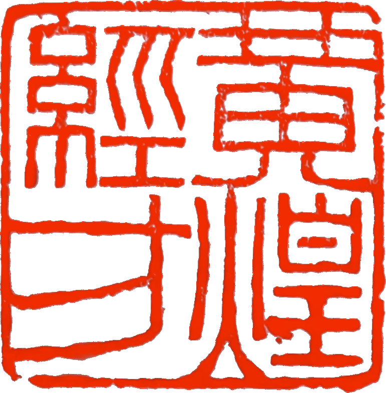

《 经方医案·临证投稿》第五期——“音乐耳综合征”，能消音的温胆汤！

公众号名称：经方医学工作室

作者名称：刘明翰/刘伊人

发布时间：2026\-09\-2912:51

__《 经方医案·临证投稿》__

__（第五期）__

Huang Huang Jing Fang:

Clinical Casebook

\(Issue 5\)

__“音乐耳综合征”，能消音的温胆汤！__

刘明翰 / 刘伊人

黄煌经方工作室

南京传统中医门诊部

Huang Huang JINGFANG Institute

Nanjing Traditional Chinese Medicine Clinic

Z女士,68岁，身高 158cm 体重57\.5kg

__【主诉】__脑中重复旋律声15天，感觉“脑子里不停的重复有旋律的音乐声，像80年代商场结束营业前播放的音乐”。

2024年开始听力下降，2025年配戴助听器，佩戴助听器后觉得不适，15天前取掉助听器后出现重复旋律的音乐声，影响睡眠，依赖思诺思，短暂睡眠4\-5小时，脑核磁无明显器质性改变，高血压服药中，胸闷烦躁气短，食欲减，犯恶心，大便一天一次正常

既往史：肺部结节，轻度抑郁，

__【体征】__神情焦虑，有神，舌苔满布，腹软，微脐跳。

处方：温胆汤\+半夏厚朴汤\+栀子厚朴汤

姜半夏15陈皮15茯苓30枳壳15竹茹15生甘草5生姜5红枣15厚朴15苏梗15栀子10，7剂

__复诊 2026/5/21__

Follow\-up Visit: 2026/05/21

2026/5/21

笑着反馈说“服药后心里没有压力了，不想自杀了”，旋律音乐声减半，不烦躁了，食欲好多了，口干减轻，胸闷好多了！

睡眠不好，烦躁时有恶心感，

原方改姜半夏20陈皮20枳壳20加百合20，

10剂，代煎

JINGFANGYIAN

2026/06/04

心里不难过了，音乐进一步减少达70%，能吃了，昨天闻到饭觉得香。

面部长痘痘，睡眠依赖安眠药，大便1天1次

原方去姜改百合50，10剂

JINGFANGYIAN

2026/06/18

脸上痘痘未作，音乐声进一步改善80%，没有像爆炸一样了，食欲好多了，体重增加1斤，心情也好很多，效果满意。

原方去厚朴苏梗，加生地黄15淮小麦30，10剂

__按语__

JING

FANG

经方

本案主症奇特——脑中反复回旋“80年代商场打烊音乐”，西医谓之音乐耳综合征（Musical Ear Syndrome, MES），属音乐性幻听之一亚类，常发生于听力下降、助听设备撤除、孤独高龄、焦虑抑郁背景之下，影像无器质性灶，实为“清窍自鸣、痰热扰神”。

临床面对患者时，主症奇特但不疑惑，因为“方从人出”。患者一入诊室，神情焦虑、语急不耐、苔满布而腹软，兼胸闷气短、恶心和寐差——非“温胆汤人”为何？《三因极一病证方论》明言温胆汤治“心胆虚怯，触事易惊……气郁生涎，涎与气搏，变生诸证”；《备急千金要方》亦载“大病后虚烦不得眠，此胆寒故也，宜服温胆汤”。古人所谓“胆寒”实指胆气不振、痰热内扰、神不归舍，恰可涵盖MES。

黄煌教授指出温胆汤适用人群为：体型中等偏胖或营养尚可，圆脸大眼、眼神飘忽，易惊恐、多疑、焦虑、失眠、噩梦，易胸闷心悸、恶心黏痰，苔多厚腻，脉滑，发病与惊恐、应激、高压相关；其主治疾病谱明确列入幻听、精神分裂症、高血压、冠心病、心脏神经官能症、失眠、眩晕等。本案Z女年近七旬，听力衰退、助听器不适而摘，是老年感官剥夺之应激。望其神、闻其语、问其症、切其腹——典型“温胆汤人”加“半夏厚朴汤人”（咽胸闷塞、恶心、语急如炙）再加栀子厚朴汤证（心烦、卧起不安），故首诊即投温胆汤合半夏厚朴汤加栀子厚朴汤，不另寻奇药。

__免责声明__

•本公众号所载医案，均为个人经验总结或文献摘录，旨在交流学习，分享中医知识，传播健康理念。不能替代执业医师的当面诊断和治疗建议。不构成医疗建议。请勿将内容作为自行诊断或用药的依据。

•请读者知晓并同意，如有任何健康问题，应及时前往正规医疗机构就诊，咨询专业医师意见，切勿依照本文自行诊断耽误病情。

•本公众号及运营者不对任何个人或团体因依赖本文内容而遭受的损失承担责任。

作者 | 刘明翰 刘伊人

图文编辑 | 蒋春潮

《经方医案·临证投稿》

黄煌经方工作室

2026/09/29
