《人民的名义》到底真不真实？ \- 瞎说周树人 的回答

对“胜天半子”这句话记忆犹新。

我认为《人民的名义》里称得上真实的角色只有一个半。

高育良算一个，祁同伟和李达康加起来算半个，侯亮平算后面那个句号。

高育良，祁同伟，李达康，侯亮平四个人，分别可以代表官场的四种定位。

正官，偏官，宦吏，厂卫。

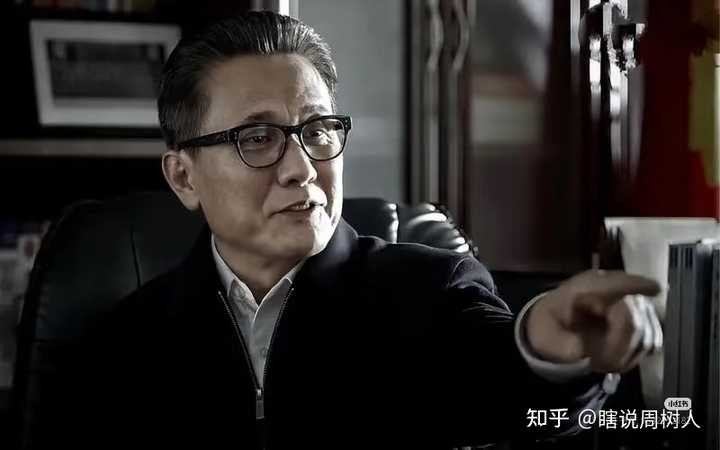

alt="Image">

先从高职务开始讲起吧，

我不认为他是一个完全的反派，这是我之后行文的基础。

高育良是典型的传统官僚，并且是手握实权，身居高位的“正官”。

儒雅斯文，身上一股极重的书生气，说话沉稳，眉眼温和，这些特点对于高育良这个角色的塑造极为重要。

这种“正官”，有个非常明显的特征，他们表现出来的“官味”是要大于“人味”的。

所以我才认为，在本剧中。

__高育良是唯一一个拥有高官气质的角色。__

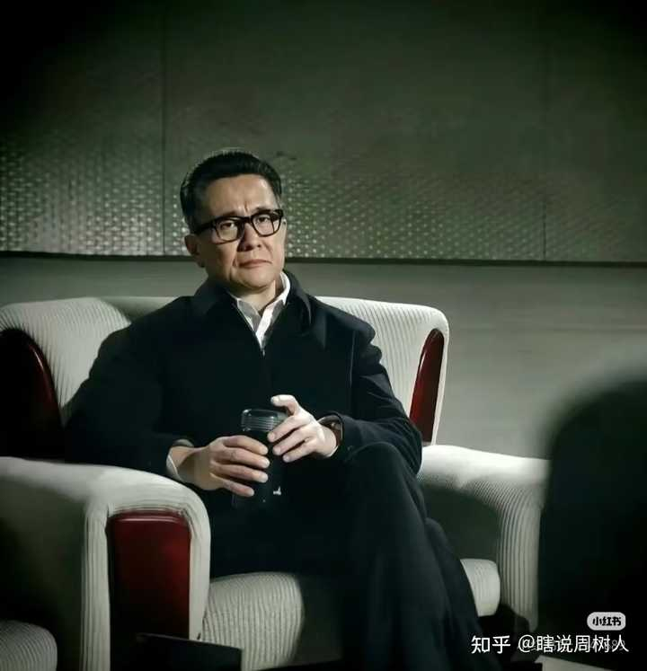

alt="Image">居高临下的谦和，永远维持体面与距离，从不失态，从不落下话柄。这类角色在大明王朝里非常多

__这种级别“大领导”是不会有明显的情绪的__，

千年道行的狐狸，不会因情绪而露出罩门。

深不可测，才能不怒自威。

高育良既然能做到这个位置，就注定了他是一个没有什么破绽的角色，一台稳定运行的政治机器。

__他的最后被捕，并不是因为有罪而失败，而是因为失败而有罪。__

高育良的风控其实做得相当到位，所有“黑”的东西，在祁同伟那一层就完全隔离开了。

哪怕是他最后的“罪名”，其实都挺牵强的。

这句话放人民的名义里，可能会被骂，但放大明王朝里，就很好理解了。

__我认为高育良是有救的，但他选择了忠诚。__

我们稍微避嫌一下，

用严嵩，胡宗宪，马宁远来解释吧。

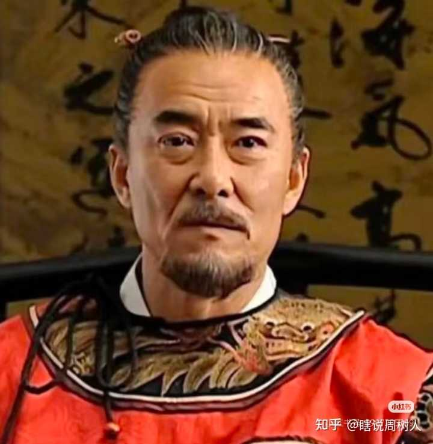

alt="Image">大明王朝是允许灰色角色存在的，仅在这一点上，人民的名义就和它有不小的差距

官做到胡宗宪这个高度，讨论善恶，好坏已经没有什么意义了。

他们都是灰色的，无非立场不同。

胡宗宪固然是重臣，是忠臣，

但同样的，他是严嵩的门生，是雷打不动的严党嫡系。

封疆大吏的结局，决定权绝对不会在地方。

只会在更高的朝堂。

其实胡宗宪完全可以继续当他的地方大员，只要他参与倒严，投靠清流。

他有大把谈判的资本。

地方官和当地是共生关系，你中有我，我中有你。要打倒这样的地方大员，必须要对整个系统连根拔起，付出的代价是极大的，会大大增加在当地的统治成本。

甚至稍不注意，就会影响后续的政治前途。

这很不划算，

所以派系斗争时，对于胡宗宪这样的实权大员，大多数时候都会选择拉拢与合作。

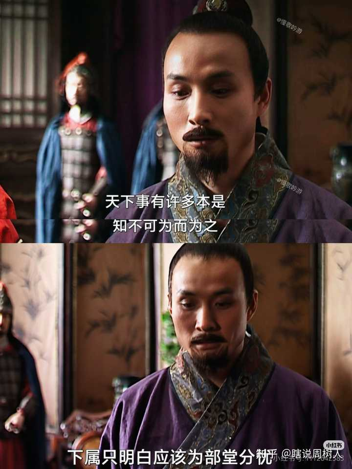

alt="Image">马宁远一案，胡宗宪其实就放弃了向清流靠拢。马宁远大可以作为胡宗宪献给清流的投名状，让浙江的风波直到最后都止步于马宁远。胡宗宪依然可以继续当他的大员，而不是在严党倒台后，被迫告病还乡

既然筹码足够，存在斡旋空间。

那胡宗宪为什么要这么做？

__明知不可为而为之的理由是什么？__

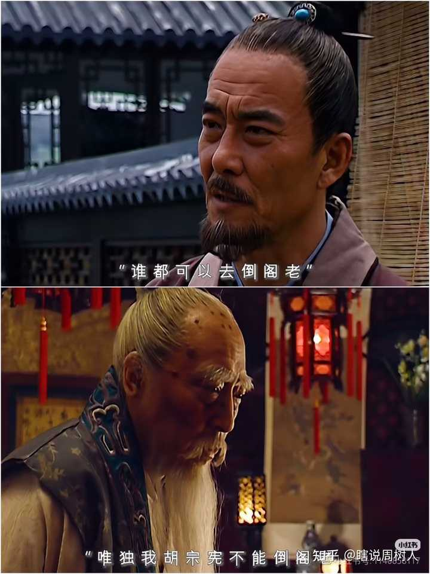

alt="Image">

__因为胡宗宪的“书生气”，因为体面。__

或者，用更加露骨的话讲。

__作为嫡系要有嫡系的觉悟。__

人不能忘记自己的来时路，既然享受了严党嫡系的待遇，就必须要履行嫡系的义务。

这不仅是一个读书人的体面与尊严，也是一个门徒的忠诚。

他是阁老的头马，严党的门面，天下皆知。

因此，在大厦崩塌之时，

他必须要坚持到最后一刻，直到尘埃落定。

__这是世道的规矩。__

所谓文人的风骨，这也是其中之一。

__可以不做名臣，但一定不做小人。__

愿赌服输，落子无悔。

我认为这也是官做到这个地步之人，应该有，也几乎必然有的觉悟。

高育良确实是个伪君子，

__但书生的风骨，他的确是守住了的。__

接着我们看李达康，

李达康的争议一直都不小，但我个人认为这个角色演得还不错，可圈可点。

只是我们需要换个角度，

才看得出这个角色的门道。

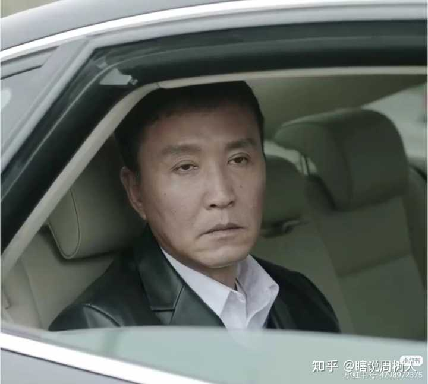

alt="Image">作为地方一把手，李达康杀气太重，太阴暗了

关于李达康的争议，

归根结底在于他的气质并不像一个“官”。

这种漠视规则，霸道跋扈，漠视感情，只谈产出的作风，作为一个“领导”，一个“官”很显然是有问题的。

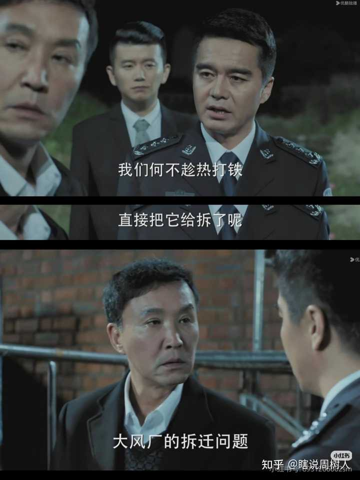

alt="Image">支持强拆大风厂，李达康绝对不是被当枪使

丁义珍案，大风厂案，

李达康的第一反应都是保项目，搞切割。

而后续哪怕是妻子被查，他也是第一时间撇清关系，默许侯亮平拦路抓走欧阳箐。

包括在整个汉东省的政治斗争中，

李达康一直都相当独立，没有和任何一个派系走得太近，只配合，不站队，专心于自己的一亩三分地。

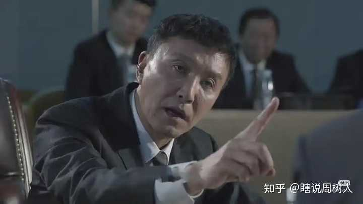

alt="Image">硬刚高育良，其实就是表忠心

按照“官”的思路，李达康的行为很不合理。

他有些过于爱惜自己的清白了，甚至为此到了有些自我阉割的程度。

没有派系，没有软肋，不搞人际关系，

这种只会做事的人是难以合作的。

李达康在官场上没有“朋党”，也几乎没有自己的队伍。

所谓的“秘书帮”，其实跟“汉大帮”区别极大，他们内部相当松散，更像是官场上互相帮点小忙的“熟人”，而不是高度绑定的队友。

按常规官员的思路，

李达康的影响力其实会相当有限。

但很显然，剧中的李达康是实权派，

这就解释不通了。

但如果按照“酷吏”和“宦官”的思路呢？

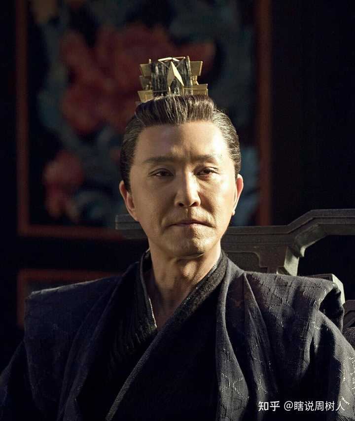

alt="Image">我绝对不是在骂李达康这个角色，他就是这个生态位

你会发现李达康的行为突然合理了。

媚上而欺下，独断专行，

甚至下命令经常有些霸道和蛮横。

这种操作往往是“宦官”和“吏官”才会干，才能干的，因为这类人只是命令的执行者，行动的反噬不是由他们自己直接承担的。

__权力只会对它直接的来源负责。__

__举个例子，__

高育良的力量，很大程度上是自下而上的。作为汉大帮的“头马”，派系中其他人要对他马首是瞻。

这种权力更稳定，因为官员间环环相扣，盘根错节，牵一发而动全身。

哪怕是沙瑞金代表的上级意识，权力进入汉东省也需要和高育良进行长时间的博弈，甚至要对他展示出“合作”态度。

这是李达康做不到的。

但与此同时，作为“领导”，这会让高育良做事瞻前顾后，很难做到“一言堂”。

因为他不能只考虑自己，还需要对自己的整个队伍负责。

__反观李达康，他是个裸官。__

从赵立春时代开始，就一直是上级直接赋予的权力，直接帮上级做事。

官场上别人的死活不在他的考虑范围内，

甚至家人都不在他的考虑范围内。

老婆离异，孩子断亲，

他的处境本质上跟宦官没有区别。

__无根之人，同时也就是无敌之人。__

李达康的违规行为不少，但相对可控。

他更多的是越权，而不是违法，至少没有超出上级的容忍界线。

把章程里的“讨论”，强行变成“一言堂”。

不要小看这简单的一步，

民主和独裁大部分也就差了这一步。

在大多数时候，

李达康的直接权力都要大于高育良。

对于剧中李达康的行为，

要追究，要上称，其实也完全说得通，至少组织纪律问题，作风问题就够他喝一壶了。

但由于他把事干得很漂亮，辖区的数据一直很好，“政绩斐然”很能拿出手。

清廉，能干，孤立，

他是一个很典型的“干吏”，权力没有根基，好用，好控制，并且非常能干。

所以上级没有去打击李达康，也完全没有必要去打击李达康。

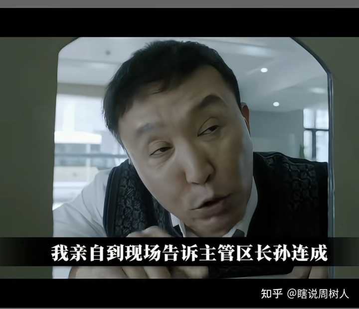

alt="Image">

加上李达康的谄媚态度，

以及后续公开站队沙瑞金，跟高育良翻脸。

更是几乎挑不出毛病来，完全是把自己当做一个可以交接的操作系统在做事。

在剧中汉东省的原系统几乎被一锅端了，

李达康最后能独善其身，就是靠的他这个独特的“宦吏”生态位。

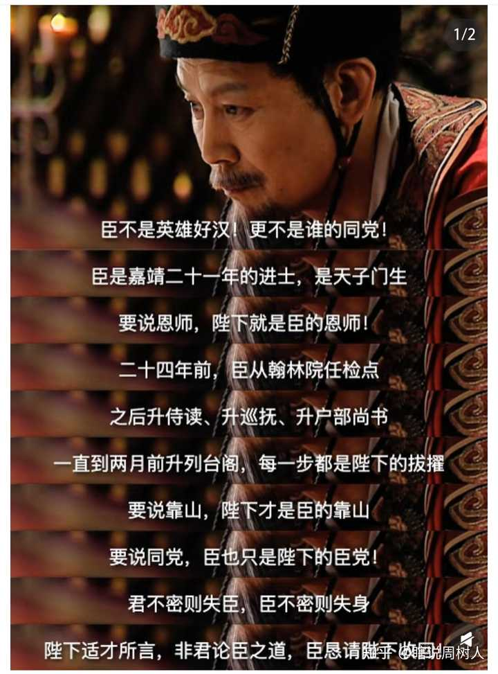

alt="Image">可以和赵贞吉类比一下，有一定的相似度

由于“吏”并不被主流官僚系统认可，所以清算也很难搞到他们头上。

既然安全，才能安权。

李达康看起来阴沉沉的，

其实反倒是剧里真正的实权派。

颇有些“流水的县长，铁打的老爷”的意思。

__接着我们来看祁厅长，__

我认为他属于“偏官”，这并不是说他的权力与编制，而是指他的定位。

他身上的“人味”还高于“官味”，还在做一些“快意恩仇”“一人做事一人当”的事情。

这确实增强了他的个人魅力，带来了全剧最高的人气。

但与此同时，这样的行为模式下，

__他的政治敏感度低得简直令人发指。__

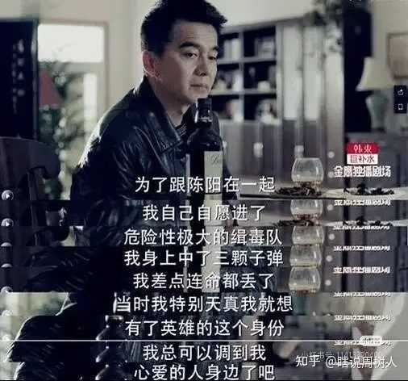

alt="Image">祁同伟的思维方式跟黑手党差不多

__祁同伟办事，有一股很强的“匪气”。__

不是土匪，更像是意大利的Mafia。

他确实是条汉子，很有血性。

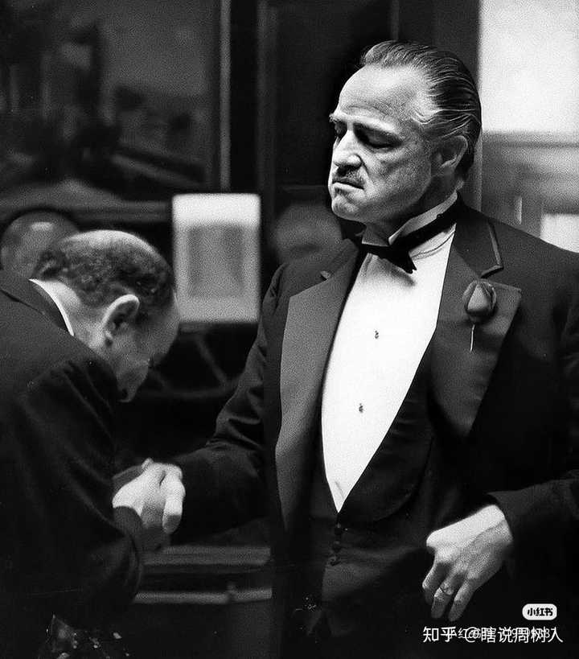

alt="Image">

和官僚系统不同，

“江湖人”是义字当头的，他们做事不是完全基于理性的。

包庇亲戚轮奸案，安插文盲亲戚进公安。

这些明显的“徇私枉法”行为，都不是一个正常官员能干出来的。

但祁同伟就是干了，

而且完全没意识到自己有问题。

只要信祁同伟，拜他的码头，他就会想尽办法地帮你。

这跟“教父”是如出一辙的，他卖的是人情。

如果我这么说，大伙还是觉得祁同伟只是单纯的徇私枉法的话。

那我们接着看祁同伟处理程度这段戏，

__这是最能体现他的江湖做派的。__

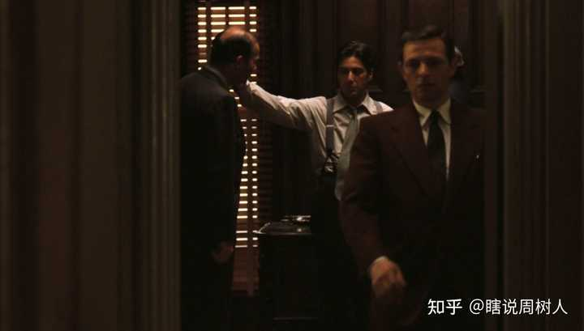

alt="Image">可参考二代教父收奈里

他完全是在用黑手党那套思路在收小弟。

先是试探，看看程度的诚意，同时摧毁程度的自尊心。

你这种害群之马，就该清理！

在程度直接交出底牌之后，祁同伟不仅感受到了价值，更重要的是信任。

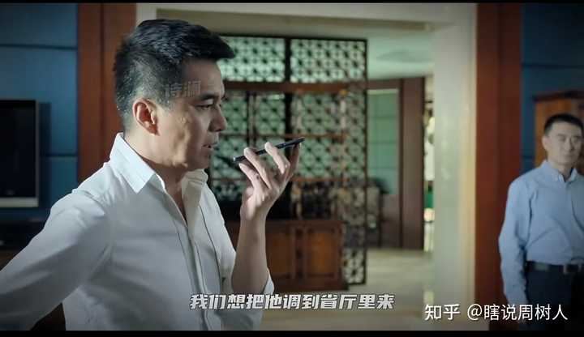

alt="Image">

于是他迅速给出了表态，立刻公开地，高调地收编程度。

这一做法风险很高，

祁同伟知道，程度也知道。

但要的就是这个效果，

祁同伟的风格就是你为我担风险，我也全力给你出头，信任是相互的。

不降反升，做到这一步。

祁同伟对程度已然做到了“再造”。

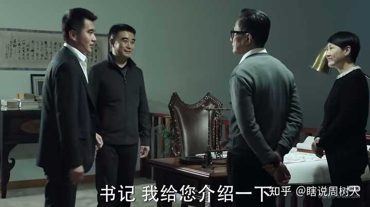

alt="Image">祁同伟升不上去很好理解，正厅已经是极限了，黑手套爬的太高会出事的

紧接着，超规格地引荐。

以程度的级别，

可能一辈子都很难见到省级的育良书记。

但祁同伟不仅带他见了，还是以一个极其亲密，极其私人的方式引荐的。

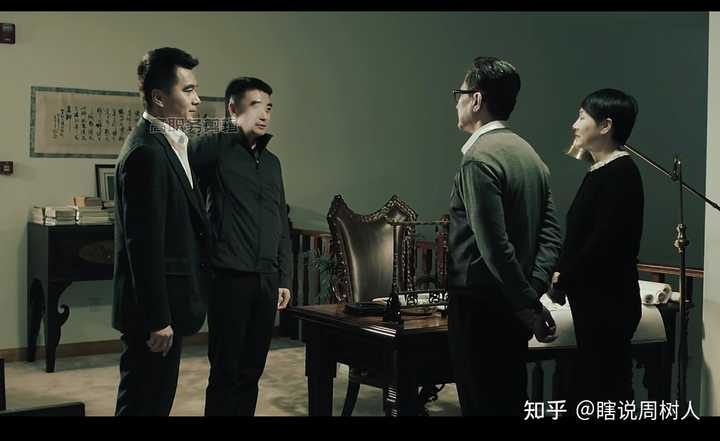

alt="Image">练习一个晚上的敬礼

甚至直接得到了高育良“自己人”的认可。

这是“嫡系”的待遇，

对程度来说是绝对的“知遇之恩”。

江湖人处事，

就是开出一个让人无法拒绝的条件，一次压上超规模的筹码。

讲究一个诚意对诚意，明牌对明牌。

把收益和代价都摆出来，

__祁同伟并不是要收买，他要的是征服。__

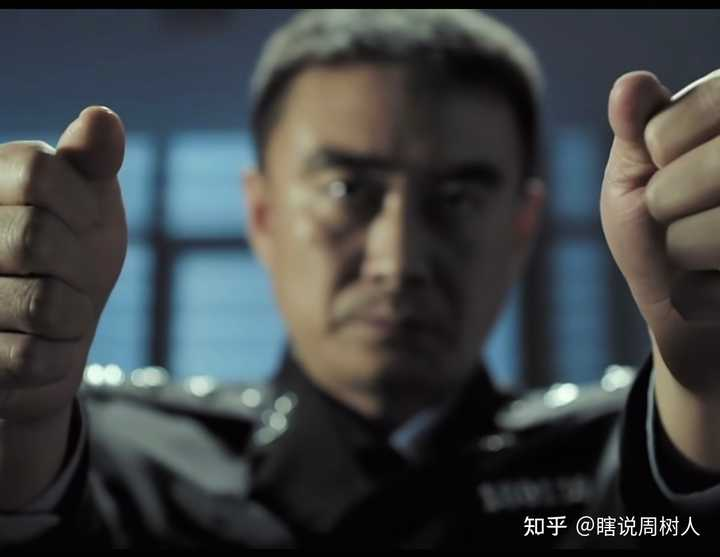

alt="Image">提携玉龙为君死

__金钱是换不来死士的，气概才行。__

程度直到最后都没有出卖祁厅长，也就是这种江湖仁义让这两个反派角色的风评一直下不去。

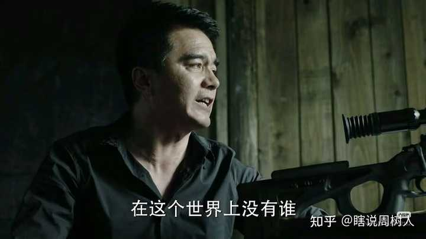

alt="Image">最后祁同伟一命换一命的做法也很江湖

__到这里，我敬祁同伟算条汉子，__

__但也就仅此而已了。__

以祁同伟在剧中展示出的情商，智商，以及风险管理意识。

__能干到这个位置，是TM非常匪夷所思的。__

他干的这些事情，

违规违法这点我都暂且不提。

哪怕就TM作为一个犯罪分子，而不是一个公安厅长，他做事也太TM离谱了。

处理程度，处理亲戚轮奸案，包括派人去撞陈海这一系列事情。

祁同伟的操作都极其的粗暴和生硬。

当个黑手套都当不明白，

他甚至都不尝试“演”一下，

连官场上最基本的互相给面子都懒得搞。

__极其纯粹地以权压人，只威逼不利诱。__

这是极其拙劣，极其危险的，

他其实已经成了汉大帮一颗巨大的雷了。

他升不上去就是这个原因，

高育良在剧中不止一次提醒，警告过祁同伟，甚至不止一次试图切割祁同伟。

汉大帮出于下风时，高育良能做的事情很少，他只能尽力维持派系不崩盘。

他此时不能“打倒”祁同伟，只是因为目前他顶不住祁同伟的反噬。

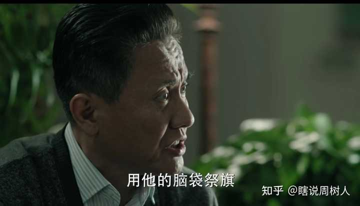

alt="Image">类似的情况不止一次

很多人在构想汉大帮如果赢了，祁同伟是不是就真的会“胜天一子”，更进一步了。

我认为这很扯淡，

汉大帮一旦要继续上升，祁同伟这颗随时会炸的地雷必然会被拆除。

高育良如果斗赢了沙瑞金，

他回过头第一件事一定是干掉祁同伟。

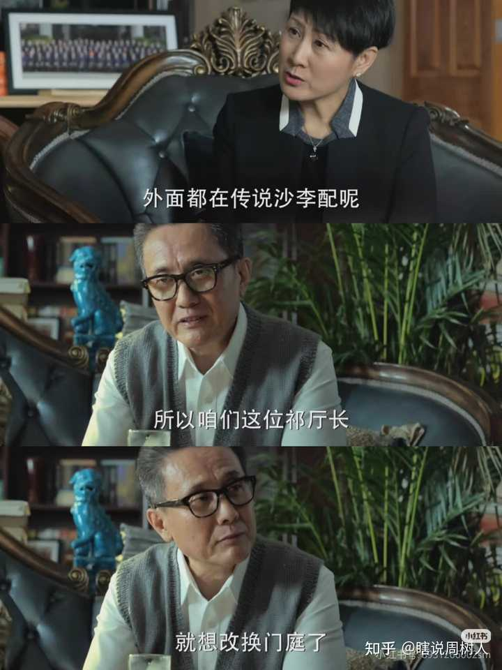

alt="Image">

这时候他有足够的实力去压死祁同伟，让他开不了口，咬不了人。

别说做到如今的“胜天半子”，

真让育良书记笑到最后，

我们这位祁厅长估计会死得相当不体面。
