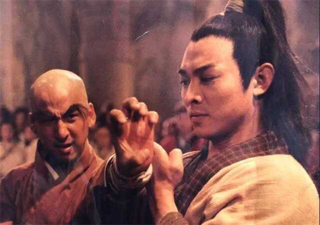
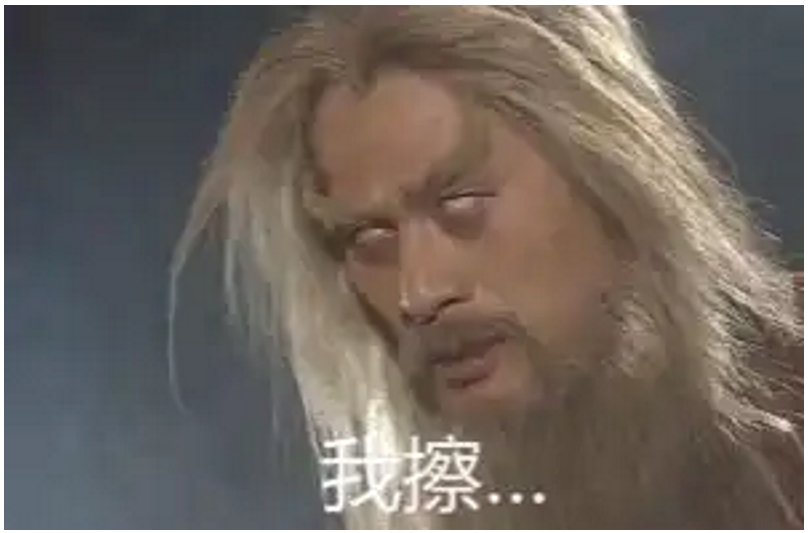

《倚天屠龙记》的结局是否过于仓促? \- 凌泉 的回答

__问题描述：__

总感觉张三丰一掌击毙宋青书，革去宋远桥职务与其一贯作风性格不符，，张无忌被朱元璋骗得太过容易，而且轻轻松松就辞去了教主职务，，这两点是不是太过仓促了

熟悉《倚天屠龙》结尾的就知道，张无忌退位之后，明教发生了一些不可思议的事。

整个光明顶的高层集团很快失势倒台，朱元璋等地方上的大区域老总上了位，掌控了明教。金庸有一句话是这样说的：杨逍“年老德薄”，万万不能再和朱元璋相争。

alt="Image">

不少读者问我，杨逍怎么就“年老德薄”了？堂堂光明左使，武功资历均高，又有偶像气质，怎么会不能和朱元璋等一帮人相争呢？

这话说来就长了，涉及到明教长期隐伏着的一个重大危机，或者说是一股暗中的潜流。

教主张无忌始终没能很好地处理这个危机。或许他注意到了，但没来得及处置，给明教埋下了致命的隐患。

话说当初，六大门派围攻光明顶之时。

少林峨眉等来势汹汹，倚天长剑飞寒芒，明教却几乎只有五行旗与之血战。

你仅从六大派之间的战报、谈话上就可知端倪，能看出五行旗抵抗之烈、奋战之勇：

“殷梨亭道：‘曾和魔教的木、火两旗交战三次……”

“江西鄱阳帮全军覆没，是给魔教巨水旗歼灭的。”

“敌方是锐金、洪水、烈火三旗……我方三派会斗敌方三旗。”

当时明教四分五裂，已如一盘散沙，只有五行旗保存了完整的建制，尚有较强战斗力。说是五行旗一个部门抵挡六大门派也不为过。

这一役，五行旗也是牺牲最惨重的，尤其锐金旗，几遭全歼，伤重残疾者无算。掌旗使庄铮壮烈战死，被倚天剑断首。副掌旗使吴劲草遭断臂。

如非张无忌挺身救人，锐金一旗的番号都可以撤销了。

这些弟兄们忠诚，甘愿护教牺牲，那倒也没什么好说的。可问题是，教中的那些更高层呢？

危难之际，光明二使、四大法王、五散人在干嘛？

光明顶之役，明教又是怎么输的？何以会一败涂地？

话说，就在五行旗于前线浴血之时，堂堂光明左使杨逍、法王韦一笑、五散人等几个，却在后方老营里内讧。

内讧什么呢？争教主！

前线每一分钟都在流血，结果这几个傻逼在后方争教主，还打了起来，你一记寒冰绵掌，我一招乾坤挪移，打得好不热闹，竟致被一个少林和尚圆真溜进来摸了炮楼，一股成擒，整个班子全部端掉。

“少林僧独指灭明教, 光明顶七魔归西天”，讽刺不讽刺？倘若你是前线五行旗将士，会作何感想？

除了内讧被擒的这七人外，高层里其余几位又是什么表现？

光明右使范遥鬼影不知。究其原因，居然是为女人情海生波，颓废了，毁容了，流窜到国外当武士了。后来他给出的解释是去“盯成昆”。可是你盯的成昆呢？成昆都来独指灭了你家老巢了，范右使你盯的人呢？

其余几个也好不到哪去。四法王排第一的龙王为了嫁人，叛教了，事发时来了光明顶，却畏敌避战，逡巡不前；排第二的殷天正闹分裂，虽然带队来援，却游而不击，坐视五行旗遭屠；排第三的谢逊失心疯了，到处杀人，又携屠龙刀漂流海外。

以上就是大伙儿眼中的光明顶高层的群相，纠缠于男女关系的，别有用心的，发疯发癫的，拉稀跑路的，尽皆不堪之极。

公允地说，殷天正父子后来倒是出力作战了，也拼到透支，但是能否赢回明教人心？有这样一幕：五行旗被六大派围攻，殷天正的天鹰教却在旁边观战，他们军容齐整，粮秣充足，却“始终按兵不动”。

为什么呢？书上说了：若把五行旗杀光，天鹰教反而会暗暗欢喜。事实上这一役锐金旗果然几乎被歼，掌旗使战死。

试问五行旗弟兄们又会作何感想？你若是参加了这一战的锐金旗兄弟，当灭绝师太的倚天剑肆虐屠戮之时，会否对苍天、对明尊血泪控诉：我们的光明使者在哪里？我们的法王在哪里？我们的散人在哪里？

有一个标志性的细节，不知你们注意到没有：当后来张无忌力战六大派，索要兵刃的时候，居然殷天正还摸出来一柄“白虹剑”，周颠还摸出来一把雕刻精美的宝刀，都是养护精良、完好无损。

这真正搞笑了，大伙儿之前都要引颈就戮了，“绝命歌”都唱过了，上层首脑包袱里居然还有完好无损的兵器藏品。怎么不早拿出来和倚天剑拼了呢？

这时候，每一把完好的宝刀宝剑都是耻辱。就好比李自成围北京了，朝廷已无军费，大官们却还有万贯家资。又好像国家已然战败，却还有完好的军舰从没出港，等着敌人来接收呢。讽刺吗？

明教的重大隐患，很大程度上就是这里埋下的。在战士们的眼里，光明顶高层自杨逍以下，可谓失行败德，几乎烂透。

幸而天不亡明教，张无忌出手击退六大派，成为教主。这时正是整肃乾坤、赏功罚过的关键时机。

左使玩忽职守，当严惩；右使、龙王、狮王应公开免官夺职；鹰王有功有过，考虑到天鹰教新归附，人心不稳，可以留职温慰；蝠王、周颠带头内讧，至少应警示训诫。五行旗血战不屈，牺牲巨大，居功至伟，锐金旗吴劲草等都应该大力奖掖，提拔重用，旗下众弟兄们都应论功行赏，厚加抚慰。

可是这件关键大事，明教却没有做。新教主一立，鞭炮一放，一片欢天喜地的气氛中，这事就再无人提了，被有意回避了。从此高层还是那些高层，使者还是那些使者，法王还是那些法王，一个人事变动都没有，勋旧们照样呼呼喝喝、耀武扬威。

甚至于，他们拥立张无忌有功，地位反而更稳固了。杨逍自命为岳父，殷天正成了教主外公，殷野王成了教主舅舅，狮王成了教主义父，龙王有了小昭这根通天热线，就连彭莹玉、说不得等也成了教主故人，你是皇亲我是国戚，气焰更加嚣张。

试问：五行旗的兄弟们又会怎么看呢？

其实，多年以来明教的人事制度就是对五行旗不公的。我以前发文说过，他们是“干活有份，提拔无望”，上面的法王许多都是空降的、外来的，不是从五行旗里出的。比如龙王就是波斯总部空降的，狮王是什么劳什子“混元门”的，乃是外人。

过去就欺负老实人，眼下立了新教主，还是继续欺负老实人。搞笑的是，位子轮不到五行旗，但后来明教要打硬仗、啃硬骨头的时候，还是只能依靠五行旗。

你看明教之后为“救谢逊”，到少林寺去耀武扬威，杨逍是靠那支队伍来现场演练、撑场面的？还是五行旗：

“杨逍……左手一挥，一个白衣童子双手奉上一个小小的木架，架上插满了十余面五色小旗。”

这是什么？五行旗。

五行旗现场演练的效果如何？是业务精良，震惊敌胆：

“这一来，明教五行旗大显神威，旁观群雄无不骇然失色。”

再后来，元兵围困少室山，靠谁打仗？果然又是五行旗：

张无忌道：“锐金、洪水两旗，先挡头阵。”

五行旗兄弟又不是没脑子，提拔没有我们份，怎么冲锋打仗拼命又靠我们了？

杨左使，请问你嫡系的“天地风雷”四门呢？怎么不派他们来？

要说这个所谓“天地风雷”四门，有着大量人员，占着大量编制，可从头到尾就没见发挥什么关键作用。杨逍的机关平日就靠几个童子跑来跑去，就这么几个小孩，每天值值班、打打电话，搞一点简报，维持日常运转。

也不知道这个“天地风雷”四门里的人都是些什么鬼？平时都在忙些啥？是否都是用来安插些领导们的大娘子、小娘子的，不然怎么毫无业务能力，没有半点作用？

最后再讲一个问题。这个问题怕是更加严峻。

六大门派为什么要来围攻光明顶？何以明教得罪了整个武林？归根结底还是名声不好，有人为非作歹，招致众怒。

那么究竟是谁在为非作歹？五散人中的“说不得”曾经讲过一段话，揭示了根本：

“本教教众之中……滥杀无辜者有之，奸淫掳掠者有之，于是本教声誉便如江河之日下了。”

那么请问是谁滥杀无辜？谁奸淫掳掠？

至少我们知道的，是杨逍奸淫，殷天正掳掠，韦一笑吸血，谢逊滥杀无辜。

这样解释应该是没有违背说不得的本意。事实上杨逍听了马上问：你是在讲我吗？说不得当场反诘：谁干的事，自己心里有数。

明教的恶名，不说全部，至少有相当大一部分恰恰是缘于这些高层胡作非为。你们胡搞瞎搞引来了外敌，却要包括五行旗在内的众兄弟们流血牺牲。换做是你，你服吗？你想得通吗？

光明顶潜流，一言以蔽之，就是高层不德、人浮于事、行止败坏，而一线五行旗等业务部门长期被压制，牺牲惨重却又晋升无路，愤懑而失望。

有张无忌在，凭着威望高、武功高，为人宽厚，矛盾暂时被压制了下来。但这样大的暗流早晚要爆发的。

张无忌自己意识到了这个隐患吗？我想大概也是有所察觉的。他也在着手调整，你看后期他就颇为重用锐金旗吴劲草。此人正是五行旗山头的代表。

后来少室山大战，群雄面前，张无忌调度全军，特意重用吴劲草，让他当总军法官、监督全军。这个职务即便不是法王担纲，按惯例说也是刑堂执法冷谦吧？但张无忌却破格点了吴劲草的将。

吴劲草也是非常振奋，寻思：“教主发令，第一个便差遣到我，实是我莫大荣幸。”

而且张无忌授予他的权柄极大，可以临阵执法，便宜行事，“哪一位英雄好汉不遵号令，锐金旗长矛短斧齐往他身上招呼。纵然是本教耆宿、武林长辈，俱无例外”，说杀谁就杀谁，使者、法王也不例外。冷谦这个刑堂执法反而尴尬了。

这本是极大抬升了吴劲草个人的威信，也是大大地给了五行旗面子。在明教高层里，吴劲草颇有冉冉升起之势。也恰好，上层当时空出来不少位子，四大法王空出三个，正是火线提拔人的机会。

可惜，张无忌有心用吴劲草，却没时间用吴劲草了。最佳的时间窗口已然错过，弟兄们没有再给他亡羊补牢的机会。

不久，惊天权变发生，张无忌被人算计，倒台退位，明教从此变天。随之而来的，必定是总坛上那一帮老旧勋臣失势，被架空、清洗。

新上台的一帮人是什么人呢？是朱元璋、徐达、常遇春一伙实力派。许多读者都没注意到的是，他们恰恰好是五行旗中人，朱元璋、徐达是洪水旗中弟子，常遇春则归巨木旗该管。

明教的变天，固然是地方实力派的胜利，但不也是五行旗压抑多年后的反扑吗？

这时候你就能理解为何说杨逍“年老德薄”了。弟兄们只要一句“光明顶之战，我们流血之时，你这个左使在干嘛？”便足以让杨逍哑口无言，这算不算“德薄”？

感慨之余，回首往事，昔日光明顶大战刚结束时，张无忌曾约法三章，什么和六大门派和好、什么迎回谢逊之类，好鸡毛蒜皮，好小哉相。

alt="Image">

真正的三章应该是：全面反思明教二十余年内乱；全面反思光明顶之战；全面奖掖功臣，严惩失职败类。说什么迎回谢逊？

一个失心疯滥杀无辜的法王，迎回他作甚呢？真正应该迎回的，不是兄弟们的心吗？

__文/六神磊磊__
