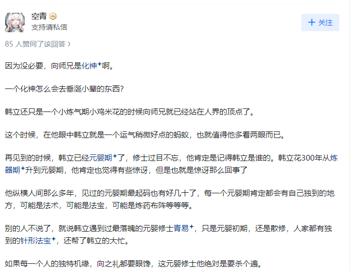
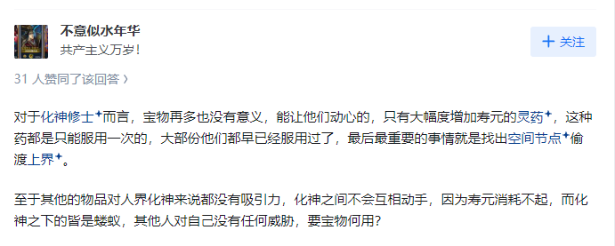

《凡人修仙传》中向之礼为什么不出手抢夺韩立的宝物？ \- 风在吹 的回答

__问题描述：__

我觉得是最主要因为韩立和玲珑妖妃（银月）相熟，并非因韩立神通之大，通天灵宝，灭仙珠等。 \[图片\]

很多回答根本没说到点子上，向之礼为什么不出手抢夺韩立的宝物？那是因为他不知道韩立所怀机缘有多大！

要知道，韩立最后可是成就了道祖之位。

如果没有逆天机缘，凭韩立四属性伪灵根的资质，根本不可能达到这样的高度，可能尚未修炼到筑基之前就坐化了。

而向之礼呢？

在韩立修真之前，就已经站在人界的顶点。资质、禀赋、心性，无一不是上上之选。如果他得到韩立的机缘，只会比韩立的进阶速度更快。

什么“韩立和玲珑妖妃（银月）相熟”，什么“一个化神怎么会去垂涎小辈的东西”，什么“对于化神修士而言，宝物再多也没有意义，能让他们动心的，只有大幅度增加寿元的灵药，这种药都是只能服用一次的，大部份他们都早已经服用过了，最后最重要的事情就是找出空间节点偷渡上界。”

都是扯淡！

在向之礼的眼里，韩立也许有机缘，但不可能有值得他出手的机缘。哪怕是元婴老怪打破狗脑子的机缘，在向之礼眼里，也不过尔尔，根本不值得他抢夺。

alt="Image">

alt="Image">

alt="Image">

下面看看韩立得到了哪些宝物：

掌天瓶：后因吸收韩立时间本源法则而破碎，瓶灵得以解放

飞剑符宝：韩立斩杀金光上人所得，在与陆师兄一战中耗尽威能

金竺符笔：韩立在太南谷交易会上换得，笔尖是二级妖兽金精猿的颈毛，笔杆材料为金精与乌铁，用文武火煅烧三天三夜所成

葫芦法器：韩立斩杀黑煞教众所得，堪比中品法器，可以喷吐出黑色的混元珠攻敌

金蚨子母刃：韩立从万宝楼中换得，一柄母刃，八把子刃，手持母刃就能操纵子刃

精钢环：被迫用筑基丹从叶师叔换得的上品法器，攻守兼备，全力施展可以变为茅屋大小，被青蛟旗所击毁

金光砖符宝：韩立从万宝楼换得，攻击力极强，可以无视大多数低阶修仙者的护身法器和护罩，但较为笨重，消耗法力也很大，在血色禁地中耗尽威能

青蛟旗：韩立击杀陆师兄所得的顶级法器，可释放出一条青色蛟龙攻敌

玄铁飞天盾：韩立在万宝楼中换来的法器，使用大块玄阴之地的玄铁精炼而成，一经催动就可围绕四周全方位防御

天雷子：修仙者截取天地雷电所炼制，韩立凭此击杀狂人封岳

法宝残片：隐形，可阻止灵气外泄，韩立用此隐藏掌天瓶

乌龙夺：用墨蛟爪子炼制成的顶级法器，后被六连殿古长老击毁

青火瘴：用墨蛟双目炼制而成，有强烈毒性，可以起到掩护作用

神风舟：用墨蛟蛟鳍和尾部炼制而成的飞行法器，小巧灵活，速度极快

白磷盾：墨蛟鳞片炼制成的防御法器，可以释放出白色光罩防御，防御力在玄铁飞天盾之上。后被御灵宗结丹修士的金背妖螂击毁

墨蛟雏角：用墨蛟独角炼制成的一次性法器，可以出其不意自爆伤敌

透明丝线：韩立在血色禁地中捡到，丝线近乎隐形，弹性十足又锋利无比

青凝镜：韩立斩杀多宝女所得，是古宝“凝光宝镜”的仿制品，可以发出青光定住他人法器，使之失灵，后被六连殿古长老击毁

银辉剑：剑中掺入法宝材料银精，锋利无比

聚魂钵：邪道法器，魂魄被其吸入会渐渐丧失灵性，变为孤魂野鬼，专供邪修驱使祭炼

踏云靴：击杀封岳所得，可以大幅提升移动速度，搭配罗烟步与御风诀，速度能快到脱离普通人肉眼追踪

符宝平天尺：击杀吕天蒙所得，注入灵力中出现一把青色小尺，眨眼间幻化出数百把相同的小尺

龟壳法器：击杀吕天蒙所得的顶阶防御法器，被六连殿古长老击毁

遮天钟：击杀宣乐所得的顶级法器，炼制时掺杂法宝材料铜精，十分坚硬，攻则为困敌，守则为御法

隐灵纱：击杀宣乐所得的顶级法器，披在身上可以隐形，连气息都会去除得一干二净

符宝金骷髅头：韩立从王蝉手中夺得，可以摄取法器

火焰连环飞叉：从矿洞中搜刮到的成套法器

大挪移令：古修士在使用超远距离传送阵时必备的法器，防止被空间压力挤压至死。此宝的炼制方法与古传送阵都在久远的修仙界动乱中失传

引魂钟：法器，筑基修士敲击此钟甚至会使结丹修士灵魂震荡

绿煌剑：夺舍曲魂的御灵宗修士的本命法宝，一柄寸许长的绿色小剑

红线遁光针：成套的飞针法器，共十三根，是偷袭的绝佳之物

混元钵：韩立斩杀六连殿古长老所得，可以释放出黄光护体，也能发出光刃

干天戈：韩立斩杀六连殿古长老所得的古宝，外形为一对斑驳的青铜长戈，古长老凭此宝压制住婴鲤兽

青竹蜂云剑：韩立本命法宝，以木属性成套炼制的飞剑法宝，十二口木属性飞剑为一套，理论上炼制三十六口一套或七十二口一套也是可行的，韩立则在乱星海天星城洞府里用六根万年金雷竹炼制了七十二口一套，韩立的青竹蜂云剑可以积蓄和后经过多次升级强化，最终成为三品仙器

花篮古宝：韩立斩杀怪人岛主所得，可以收摄法宝

红色画卷：韩立从古修洞府所得，封印着一缕脂阳鸟精魄，可幻化出无数火鸟，克制邪道鬼修，后被玄骨所毁

赤萤珠：原为石蝶仙子之宝，可以驱散鬼雾，石蝶死后归属于韩立

天禄印：原为金青之宝，外形为一方晶莹的乳白大印，可发出龙吟之声，起到防御与镇压作用。金青死后归属于韩立

寒渊刃：原为胡月之宝，用世间少有的玄晶与冰玉炼制而成，胡月死后归属于韩立，后被从虚天殿逃出的韩立贿赂给看守传送阵的星宫修士，借此逃到外海

破风叉：原为简姓修士之宝，可以击出凌厉风刃，其死后归属于韩立

辟火宝衣：韩立从虚天殿鬼雾中的玉真人遗骸处得来

玄阴环：极阴暂借韩立，内含精纯的玄阴魔气，实际上是玄骨送给极阴的古宝“阴阳环”中的阴环，会被极阴手中的阳环所克

婆罗珠手链：极阴暂借韩立，可以护住心神，帮助韩立闯过虚天殿第三关极妙幻境

白犀佩：极阴暂借韩立，用于驱散乾蓝冰焰散发出的寒气

符宝青冥针：青易居士赠予韩立，来源于其本命法宝。与温天仁一战中挡住了他的金线飞针

寒冰珠：蛮胡子赠予韩立的法宝，是其早年斩杀一只寒鲤，用其内丹炼制而成

皇鳞甲：蛮胡子赠予韩立的防御法宝，虚天鼎争奇夺战中挡住了星宫长老的全力一击

鸣魂珠：元瑶赠予韩立，可用来操纵啼魂兽

血色披风：虚天殿藏宝阁获得的残缺古宝，穿戴上无论使用何种遁术，对速度都有极大的提升

五行环：虚天殿藏宝阁获得的古宝，可以收摄法宝，钳制修士，配合花篮古宝夺得狼首玉如意，后被温天仁所毁

八门金光镜仿制品：击杀温天仁所得，正品乃当年乱星海第一人天镜散人持有，是曾灭过一代星宫之主的绝顶法宝，可释放金光神焰困敌灭敌

青火雷：韩立从元瑶处得来，共三枚，乃是魔道门派青阳门使用大量珍稀材料，用时良久炼制而成，威力可与元婴修士的元阳之火相媲美

虚天鼎：冰魄仙子炼制的通天灵宝，存放在虚天殿中，为乱星海第一至宝。内部有补天丹、古宝狼首玉如意，若想驱使此宝，除了修炼对应的通宝诀，还要炼化外部附着的乾蓝冰焰。通宝诀分三层，分别对应元婴中期、元婴后期和化神初期。虚天鼎不以攻击见长，而是具有强大的困敌和防御效果，韩立曾以此擒拿天澜圣兽和抵御空间裂缝。虚天鼎在灵界中不仅可以批量炼制，还有升级版虚灵鼎和虚皇鼎，血天大陆天鼎宫的钥匙就是虚天鼎

乾蓝冰焰：万年前冰魄仙子所创，附生于虚天鼎上，具有强大的寒气，就连元婴修士接触都会被毁去肉身

狼首玉如意：古宝，中有银月灵魂，既可释放出一个红黄两色的护罩，可以挡下元婴修士一击，又可释放出一红一黄两只小狼魂或一只大银狼魂攻敌，狼魂可用土遁术

乾蓝珠：韩立斩杀玄骨所得，玄骨用此珠将乾蓝冰焰、玄魂阴火与辟邪神雷融合成鬼道圣火修罗圣火

金雷竹小箭：韩立斩杀玄骨所得，后交予元婴后期傀儡，搭配雷火弓使用

噬魂戟：原是隐煞门孙门主的法宝，极阴将其灭杀后赐予乌丑，玄骨灭杀乌丑后又被韩立得到

四象蟠龙带：韩立斩杀温天仁所得，镶嵌了避风、避火、避水、避尘四种奇珠

紫罗极火：韩立用乾蓝冰焰与六翼霜蚣的寒气修炼出的紫色火焰，在加入血精珠与血魄丸后化为紫色火鸟

风雷翅：九级妖兽风希联合八级妖兽毒蛟、龟妖，以一只化形期雷鹏骨骸炼成，初始可使用雷遁。被韩立夺走后先后加入鲲鹏之羽与天凤之翎，赋予其风遁之能

蓝光盾：令狐老祖赠予韩立，对于火属性攻击有强大防御力

御风车：韩立斩杀慕兰穆姓法师所得的顶阶飞行异宝，乃慕兰一部落的镇族之宝，外形为一架四方兽车，左右各有一只七八丈长的暗红木翅，飞行速度极快

千重峰：韩立斩杀慕兰穆姓法所得的古宝，外形为一座漆黑的数丈小峰，拥有瞬移能力，可出其不意偷袭

竹筒法宝：韩立从苍坤上人洞府所得的古宝

紫铖兜：韩立从苍坤上人洞府所得的古宝，可以释放出玉阳真火防御或困敌

两仪环：玄黄老人所炼制的古宝，分阴阳两环，阴环在手可以不惧北极元光，阳环则可以操纵元光攻敌，阳环从苍坤上人洞府得到，阳环从南宫婉师姐处夺得

血魔剑：韩立从南宫婉师姐处得到，此剑通红妖异，威力巨大，可面对辟邪神雷不落下风，但会消耗使用者的精血，还有反噬的风险

天尸珠：尸王炫烨赠予韩立，是其修炼天尸诀后凝炼之物，修士吞服后可改善体质，在炼体方面突飞猛进

金刚罩：尸王炫烨赠予韩立，是斩杀某佛修后用其舍利炼制的半成品宝物。韩立将其收入体内培养，用其释放的佛光催动八灵尺

青蚕袍：韩立从坠魔谷得到，由上古青蚕吐丝编织而成，可以抵挡修士的神识探查，内藏坠魔谷地图

圣鼎：突兀人仿制虚天鼎炼制，可释放青沙困敌，也能召唤圣兽分身下界

元明灯：慕兰族传承宝物，可召唤圣禽影像攻敌

天绝魔尸：韩立从阴罗宗四长老处得到炼制之法，用自行通灵的元婴期尸魈为材料，抹除神智后炼制而成，凶焰更胜三分

鬼罗幡：大晋阴罗宗至宝，炼制需要大量修士生魂。共十八杆，每杆都由一位长老掌握，组合起来威能无穷

雷火弓：韩立用八级妖兽赤火蛟筋炼制而成，交予元婴后期傀儡，搭配金雷竹小箭使用

魔髓飞刀：韩立用魔髓钻炼制而成，锋利无比，可视魔气防御为无物，交予元婴后期傀儡使用

元婴后期傀儡：大衍神君耗费一生心血所研，韩立用五光木、铁角犀灵角、火锡木、雷灵晶、眩光晶、五行玉等珍稀材料炼制，武器为雷火弓、金雷竹小箭和魔髓飞刀

铸灵宝鼎：韩立从昆吾山炼器殿所得，吸收了大量地火之精，可幻化出无数至阳火鸦

五子同心魔：阴罗宗大长老乾老魔的法宝，炼制需要用到五具怨气缠身的元婴修士尸体，深埋于阴气郁结之地，每月浇灌一名修炼阴属性功法修士的血肉精魂，如此百年，方能使其诞生灵智。一般的魔头只有结丹后期实力，但乾老魔用秘术将五魔实力提升到元婴初期，联手有元婴后期实力，另外五魔内部自成空间，还具有化魔无形、秽阴魔气等强大神通，韩立在昆吾山中斩杀乾老魔所得，并融入了从小极宫得来的五种寒焰，后在灵界将其炼入五根手指之中化为骨戒

破灭法目：韩立用拥有呲咧兽血脉的三目异兽眉心的第三目炼制而成，不仅可以直接攻敌，而且还能看穿大部分幻术遁术，就算是瞬移之术也逃不过此目的锁定，此外还可以减弱隔界之力，是飞升灵界的重要功臣

红色书卷：昆吾三老中儒道修士的法宝

降魔杖：昆吾三老中佛道修士的法宝，奇重无比，有克制邪祟的奇效，韩立斩杀乾老魔所得

乾蓝鼎：韩立斩杀寒骊上人所得，后将其炼入虚天鼎

雷震子：又名灭仙珠，化神期修士面对此宝都无法全身而退。韩立在小极宫摩鸠大师处得到一颗黑色雷震子，又从阴罗宗得到一颗红色雷震子

三焰扇：通天灵宝七焰扇的仿制品，由三十一种火属性灵料炼制而成，可释放出三色火焰，韩立凭此宝元婴中期便能重创元婴后期的银翅夜叉

血刃：通天灵宝魔龙刃的仿制品，原为万妖谷副谷主万年尸熊的宝物，此宝可以通过吞噬修士血肉提升威力，但具有时效性，也有一个转化的过程

八灵尺：昆吾山镇压元刹圣祖分魂的通天灵宝，因为灌注了八种灵兽灵气，可释放出八灵兽虚影攻敌。此外还可以定住他人法宝，如阴罗宗房宗主的灭仙珠。而且因为是佛门之宝，使用时会发出佛音梵语，对魔道鬼修有克制作用。在韩立飞升灵界时因空间裂缝被毁

三神白骨幡：韩立斩杀六道极圣所得，为灵界七大邪器之一，炼制时需要血祭修士，血腥异常。此幡通体由人骨组成，表面有白色符文若隐若现，顶部是三颗大小不一的骷髅头，有扰乱心智的神通

化界珠：与逆星盘齐名的破界三宝之一，用吸灵材料炼制而成，既可减弱隔界之力，也能破除空间禁制

木生珠：韩立用合欢老魔赠予的木灵珠、养魂木与灵眼之树炼制而成，此宝可以施展一次不灭之体，韩立飞升灵界时以此修补肉身

赤魂幡：灵界七大邪器之一，内含芥子空间，炼制需要大量生魂祭炼。韩立用阴罗宗的鬼罗幡与黑风旗残片炼制而成，并以此收走元磁神山。后在飞升灵界时被空间风暴所毁

元磁神山：韩立从星宫凌玉灵处取得，既可以释放出灰色的克制天下五行的元磁神光，也可以辅助修炼《元磁神光》功法

雷纹之珠、雷帕、雷袍：韩立用天雷木炼制成的雷属性宝物，上面铭刻了仙界符文银蝌文，可以提升辟邪神雷威力

乾坤幡：防御类通天灵宝，可释放出太极圆盘抵挡攻击，地渊四大妖王交给韩立使其吸引冥雷兽

万珑珠：韩立参悟金阙玉书中的九宫天乾符所炼制，铭刻着仙界符文银蝌文，没有任何攻击防御效果，但每颗可以监视方圆数十里的范围

炼虚期傀儡“娃娃”：天云十三族傀儡师甲天木所赠，外形为一条白蛇，可化为女子，有自我进化能力与灵智，还能使用宝物

金色万剑图、金色葫芦：韩立从广寒界得到，可以用来淬炼飞剑

太乙青山：韩立从广寒界得到，可以释放出太乙青光，此光犀利异常，堪比无形剑气，有“虚刃”之称，只能靠天地造化之力形成，无法后天修炼

三角魔镜：韩立斩杀五泣所得，可将多人法力合为一体，也能让人在虚空中遁走

玄光刃：韩立斩杀戎族大汉所得，是混沌万灵榜上排名靠后的通天灵宝，黑域交换会上以此换得冰凤与孽云

玄天如意残刃：韩立在魔金山脉斩杀圣阶魔猿所得，原为宝花始祖之物，后物归原主

天外魔甲：韩立从晶族人纤纤处购得的残破魔甲，并用圣阶魔猿魔核修补，可以自行吸收魔气修复自身

璃水珠：韩立在魔金山脉斩杀巨蜍所得，炼化此珠可将修士体质转变为璃水之身，无论修炼何种水属性功法都事半功倍，还可能领悟到某种水之领域的天地法则

混元尺：韩立斩杀角蚩族金角青年所得的通天灵宝，有破解幻术的能力

晶鳞盾：韩立用不知名怪蛾鳞片炼制而成，可以扭曲大半法术剑光

齐天锣：韩立从黑域拍卖会拍得，搭配配套的震天槌使用不弱于玄天之宝。聆听锣声会使化神修士增加三十年苦修之功，炼虚修士增加十年。修炼了配套功法的炼体士才能敲响此锣，但也会丧失自身精血寿元

金色布袋：韩立从黑域拍卖会得到，是一件天地所生的半成品宝物

紫言鼎：韩立从血光圣祖分身处夺得，从车骑恭处得到驱使之法，后在魔界洗灵池被元魇始祖所毁

镇魔锁：内含阴阳二气未演化完全的玄天之宝，内部自成空间，附带十三层上古禁制，封印魔界圣祖车骑恭

阴罗盘：韩立帮助白家的报酬，可以起到指路功能

金鲸珠：韩立帮助白家的报酬，可以辅助修炼《梵圣真魔功》

山海珠：空鱼族圣器，被埋在寒潭之中，内含洞天

阴阳大五行极山：韩立用从魔界异魔金矿脉取得的磁光兽魔核和阴阳大五行真光炼制而成，此光号称可以融入任何功法神通之中，使威能大增，在魔界有“万法之母”的说法

墨灵圣舟：原为天泣圣祖所有，乃魔界遁速前三的飞行宝物

金罡灭魔雷：韩立在青元子指点下用金雷竹叶子炼制而成，一共七枚，用于度过大乘的心魔劫

烈煞金罡沙：韩立从魔界得到，可化作晶莹沙海，能压制住真灵阳鹿释放的黄色沙海

噬灵天火：韩立先在昆吾山炼器殿得到一缕具有灵性的太阴真火，将其与紫罗极火融合并在小极宫玄玉洞中吸收了大量寒气；而后在大晋的火狱中得到太阳精火，相融后形成了诡异的阴阳极火，可以吞噬其它火焰。在灵界落日之墓吞噬火属性修士噬炎后吞噬之力变得更加强大，原本的三色火焰变成银色，可以施展“心寒入体”神通。之后又吞噬了烈阳神丹、灵漩邪光、琉璃天火液、金乌神焰与阎都魔焰，在与真仙马良一战时可以压制真灵级别的火须子，被马良评价为不弱于仙界的精炎之火，可以化为火鸟或童子，在仙界又先后吞噬其他修士的焚天血焰、幽磷骨火等火焰，火属性至宝七彩火丹砂与九阳火胆以及仙器火焰铜牌和离火天珠，诞生了火之本源法则，可以化为一只百丈银色巨禽，头生高冠，身后九根火焰长翎，实力可以媲美大罗境修士

元魂灯：韩立用修罗蛛晶核换来的奇宝，既可以壮大滋润分魂，又可以防止反噬，甚至可以生成身外化身般的元魂化身

昊阴寒魄山：韩立用徒儿白果儿寻得的昊阴之石炼制而成，此山散发出的昊阴寒气奇寒无比，威能甚至强过乾蓝冰焰

北极元山：韩立用人界坠魔谷收集到的北极元晶炼制而成，释放出的北极元光为纤细的银白色光丝，在此光中一旦有灵力异动，就会被其洞穿

[元合五极山](https://link.zhihu.com/?target=https%3A//baike.baidu.com/item/%25E5%2585%2583%25E5%2590%2588%25E4%25BA%2594%25E6%259E%2581%25E5%25B1%25B1/24146616%3FfromModule%3Dlemma_inlink)：韩立用金阙玉书中的玄天炼器术，以元磁神山、北极元山、太乙青山、阴阳大五行极山与昊阴寒魄山炼制出的后天玄天之宝，极为沉重，常变身为山岳巨猿以此砸人，在仙界又融入冥寒仙宫金殿屋顶，强化其抵御丹劫之效

玄天斩灵剑：韩立从至阳上人处得到一节枯萎的玄天仙藤，用掌天瓶绿液与回阳真水浇灌数百年，结出的玄天仙果所化。此剑为混沌万灵榜上排行第三的玄天之宝，具有毁灭法则，可孕育出法则之线，破坏力极强，大乘期强者黄元子、凶司王，真灵阳鹿，甚至是真仙境的马良与螟虫之母都死于剑下。但同时消耗法力极大，只有在涅槃圣体状态下才能连续挥动。飞升时硬抗天劫破碎，后被玄天葫芦所吞噬并注入青竹蜂云剑中，化为七十二个翡翠童子剑灵

万灵血玺：真仙马良携带下界的玄天之宝，马良以此血祭了雷鸣、血天两大陆多个族群以及数十位大乘强者。此宝威能莫测，可释放出滔天血河、血灵、血丝以及具有血源之力的腐蚀血雨，在灭仙之战中大显神威瞬杀明尊化身、轩九灵、银罡子、乌灵夫人等多名顶尖大乘和四尊顶尖真灵黑猊兽

盗天瓶：九元观炼制的掌天瓶仿制品，由九元道祖赐予下界的马良，可以将其被九劫灭真大法毁坏的肉身与被禁元古灯禁锢的仙灵力瞬间恢复，韩立将其炼入掌天瓶，使掌天瓶神通大增

青沌伞：真仙马良携带下界的宝物，可以隔绝法阵压制，也可以分化出小伞给予他人

斩元仙剑：真仙马良携带下界的宝物，疑似是其本命法宝，被韩立用玄天斩灵剑斩断，断剑被韩立所得

神秘银笛：真仙马良携带下界的宝物，吹奏可以使修士堕入幻境，即便是修炼过炼神术的韩立也好一会儿动弹不得

仙灵宝鉴：真仙马良携带下界的宝物，外表为一张霞光万丈的金色书卷，可以同他人签下神魂契约，使其不受界面之力影响进入仙界

重水真轮：韩立参悟《无相真轮经》的打造伪真轮之法，用重水、水翳矿石等灵材炼成的黑蓝色圆盘，奇重无比，蕴含着精纯水之法则，后被恶尸自爆毁去

七曜星环：韩立击杀陶羽护卫所得，内蕴星辰之力，可以起到封禁效果

轮回殿面具：同时具备空间法则、隐匿法则与幻身法则，成员之间可以进行交易，还可以隐匿身形气息，甚至伪装成另一个人

玄天葫芦：韩立在冥寒仙境药园中从妖女渠灵手中夺来，与玄天斩灵剑一样，都是玄天仙藤上结出的先天玄天之宝。此宝既可以收摄仙器，精纯灵力，比如将青竹蜂云剑在其中温养并注入玄天斩灵剑的剑灵；也可以将他人攻击摄入，再原样释放出来，比如韩立在岁月塔中以此吸收了奇摩子的全力一击，释放出斩杀了大罗境界的鬼王

花枝洞天：大金源仙域百造山四大洞天福地类法宝“花鸟鱼虫”之首，被封印在一节巨鼠尾骨之中，打开需要炼化特殊的“八元解阵”。中有灵田灵泉，紫竹小楼，以及中枢紫金莲花池。与一般的空间法宝不同，洞天中的灵气可以自行运转，韩立通过钧天日晷与光阴天璇大阵可以使洞天中时间流速加快百倍甚至万倍

御峰镇魂符：八品仙器，韩立斩杀天庭仙使公输天所得。可在识海中化为一座白色山峰，抵御神识攻击

噬魂灯：五品神魂仙器，全靠神识催动，仙魔皆可使用。其上有四只异兽，头生独角的叫“贪摄”，喜好拘摄生魂；双目深陷的叫“封幽”，喜好收敛残魂；两耳紧闭的叫“不闻”，喜好幽禁神魂；满嘴獠牙的，则喜好吞噬神魂

通天剑阵图：韩立从太岁仙府中得到，外形是一块八角形的白玉盘，是剑之法则显化的玄天之宝，注入不同的法则之力，可以产生不同的阵法气象

岁月神灯：太岁的本命三品时间仙器，造型古朴，灯柱似莲枝，灯盏似莲瓣，灯芯似莲心，绽放着熠熠金光，可以释放出腐蚀万物的金光与金焰，韩立凭此在太乙巅峰就重创初入大罗的梼杌族少主。入手需要修炼《岁月真经》

阎罗之鼎：韩立从孙重山处夺得的五品仙器，内部自成空间，可收摄修士，将其吞噬吸收，再制造出与本体无二的傀儡，此外还可以起到指引幽冥界方向的作用

钧天日晷：真言门镇派三品时间仙器，搭配上古十大法阵之一的光阴天璇大阵，消耗须弥金山提供的海量仙元石与时间法则之力，使得真言玄妙界内部的时间流速加快，外部一天，内部就是一月甚至一年

雷夔之眼：从五光雷域得到，是上任雷电道祖被天道同化后遗留的至宝。韩立用此中的强大雷霆之力淬炼青竹蜂云剑，使飞剑成长为三品仙器

化界珠之前那些乱七八糟的宝物，在向之礼眼里，确实不值一顾。

但他不知道韩立手里有掌天瓶啊，要是知道，早就抢过来了，什么面子，根本不重要。

当然，化神期之后的宝物，向之礼眼红也没用，那时候的韩立修为已经超过他，而且法体双修，向之礼根本打不过。

掌天瓶是小说《凡人修仙传》中的神器，本体为墨绿色瓶状器物，源于天道初显时诞生的第一件玄天之物，蕴含时间法则之力，曾为仙界九元观镇派之宝。其由瓶身与瓶灵构成，瓶身可吸收月光产出催熟灵药的绿液，瓶灵具有独立意识，完整形态可凝聚时间晶粒穿越时空。此瓶最初被九元道祖李元究所得，助其成就金之本源道祖并创立九元观，后因九元观叛徒骷髅仙盗取而分裂为瓶身、瓶灵、瓶底三部分。瓶身流落至人界彩霞山后被韩立获得，成为其突破修炼瓶颈的辅助工具；瓶灵坠入魔界魔源海后被韩立收复；瓶底本源随骷髅仙坠至灵界。终战中韩立将道祖本源灌注瓶中导致其崩解，瓶灵最终脱离束缚化为独立个体游历混沌。

可以说，不管谁得到掌天瓶，都可以成为第二个韩立，更不用说向之礼这样的人界至尊了。

这玩意，就跟二战时候的原子弹一样，谁不想要？
