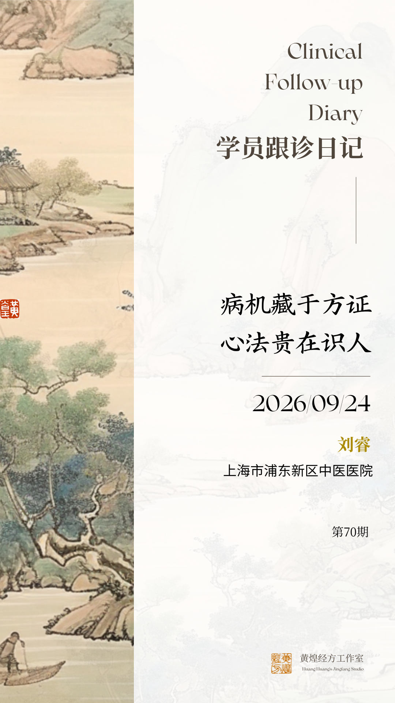

《学员跟诊日记》——病机藏于方证，心法贵在识人

公众号名称：经方医学工作室

作者名称：刘睿

发布时间：2026\-09\-2413:28

一次赴南京跟黄师抄方学习的机会，得来实属不易。临床医师日常门诊繁忙，需要协调排班、调整工作，方能走进诊室近距离观摩学习。故而每次前来，我都怀着无比激动的心情。黄老师诊室里疑难复杂病例层出不穷，纵然现场观摩，回到自己临床岗位，也很难遇见完全一模一样的病患。但黄师传授的核心不是固定方子，而是临证的思路方法。掌握基本大法之后，无论面对何种病人，都可以守其根本，万变不离其宗，万变不离其法。本次跟诊，体会最深者有三：

## 一、对病机认知的升华·

病机不仅仅是中医理论中指疾病发生、发展、变化及其结局的机理，看似抽象的概念，黄老师告诉我们病机还有另外一层含义，是“有是证，用是方”的精准对应。病机就藏在经方与体质、疾病的交汇处，抓住了这个时机，并且准确的把握对方证，方子自然开出来。黄师主张从张仲景的原文入手，通过“方\-病\-人”的诊疗模式来把握病机。简单说，就是看这个“人”是什么体质、得了什么“病”、出现了什么“证”，三者结合，病机就藏在其中。

## 首先、病机藏在“方证”里

黄老师认为，病机不是孤立的理论，而是体现在具体的方证中。对于《伤寒论》的学习，黄师并不主张死背硬记条文，而是灵活的融入到病例中，融入到方证中。诊室中一老年男性，糖尿病患者，已经在服用控糖药物，但血糖仍控制欠佳，视物模糊，平时怕热，出汗多，大便4\-5次每日，质稀，脉数，黄老师随即说出“太阳病，医反下之，利遂不止，脉促者，喘而汗出者\.\.\.\.\.\.”随即开出葛根芩连汤加大黄肉桂桂枝汤。所以病机最核心的反映就是“主症”，即身体发出的最强烈信号。比如“下利\+脉促\+喘而汗出”组合出现，就比单一症状更能说明病机的所在。

## 第二、病机离不开“人”

黄老师特别强调人的体质特征，他把经方对应到具体人群，形成了“方人”的概念。每首经方都有对应的适用人群，例如一个30岁，癫痫的小伙子，身高180cm，体重200斤，面宽，眼裂狭长，讲话不多，脾气急躁，舌红苔厚腻，两侧肋弓明显抵抗感，这就是一个大柴胡人特征，黄老师随即给予处方大柴胡原方。

另有一徐某阿姨，身高150cm，体重49公斤，看似身型并不壮大，家人反复强调来诊想看肾结石，肾囊肿，但是黄师详细问诊，发现患者高血压病史，胆结石病史，大便1\-2日一行，偏干，舌红，咽红，脉弦滑，腹部胀大，是一个热性体质，患者当下处正在大柴胡人的状态，黄师亦处方大柴胡汤原方。病机不是抽象的，而是落在具体的、当下的、人的体型、体貌、精神状态上。

## 第三、病机是“动态”的

黄煌老师主张灵活看待病机，尤其是面对复杂疾病时。一位77岁，直肠癌术后肝转移老爷爷，之前一直服用黄芩汤，病情保持稳定，但是本次就诊患者出现贫血貌，体虚乏力，消瘦的情况，黄老师敏锐的发现本次病人病情有变化，随即开两张方，黄芩汤与竹叶石膏汤交替服用。病机不是一沉不变的，随着人的特征，方证的变化，病机也发生相应的变化，所以经方医师要练就一双敏锐的动感观察力的眼睛。

## 二、重视经方与现代医学疾病谱的关联性·

黄老师说经方医师的临床诊疗单位是“方证”，重视总结经方与现代医学疾病谱的关联性可以让我们选方用药更加精准规范。那么究竟选择哪一首方，还是要抓人，抓方证。

一位食道癌的老爷爷，黄老师首先讲到，该疾病的患者我们可选用的方群有：黄连汤、半夏厚朴汤、旋覆代赭汤、大柴胡汤、麦门冬汤、炙甘草汤\.\.\.\.\.\.看着屏幕上的病史记录，黄老师说着：“体瘦、面黄，进食梗阻感，进食后胃反酸，晚饭后喉中痰多，夜尿3\-4次，睡眠差，腹部平软，凹陷、脐下按之软，脉弱，血糖偏高，肺部有结节，怎么办，我们该怎么选方？”，话音刚落，随即开出了黄连汤。《伤寒论》中记载“伤寒，胸中有热，胃中有邪气、腹中痛，欲呕吐者，黄连汤主之”。所以学习黄老师的“方\-病\-人”诊疗思维模式，会看人，会辨识方证，会关联疾病谱，处方随即可得。

## 三\. 言传身教，只为传递一把钥匙·

著名教育家叶圣陶先生说过一句话：教是为了不教。黄老师的言传身教的目的正在于此，授人以渔，而非授人以鱼，黄老师最终目的是让我们跟诊掌握独立临诊，运用自如的诊病方法，黄老师传授的是“方\-病\-人”诊疗思维模式，一种撬动中医临床诊疗能力的工具，而不是直接给予知识本身。

总结

“方证相应”是基础：即“有是证，用是方”。 方是钥匙，证是锁眼，一把钥匙开一把锁。“方病相应”管精准：每首经方都有它相对适用的现代医学疾病谱，让我们知道这个方子大概能用在哪些病上。“方人相应”管安全：黄师尤其强调要先识别患者的体质类型，从而确保用药安全。所以，医生看生病的人比看人的病更加重要。

上海市浦东新区中医医院

刘睿

黄煌经方工作室

2026/09/24
