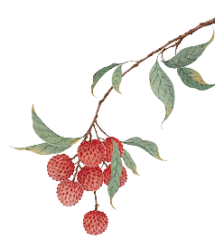

《学员跟诊日记》——肿瘤病人的经方管理

[源网页](https://mp.weixin.qq.com/s?__biz=MzUyMTAzNDE2Nw==&mid=2247506378&idx=1&sn=9019b048d8f5021639f267c9c5fbbb10&chksm=f8f0fb5552cdfb43a59b70624229f8f295ec5f41485747028cea1aa1b90e8a8c635d59c8a007&mpshare=1&scene=1&srcid=0905Fcncv6aBAgOZv59tRcX0&sharer_shareinfo=2c7cc9a485a2a9ee9b885d87be7a08c9&sharer_shareinfo_first=2c7cc9a485a2a9ee9b885d87be7a08c9#rd)

公众号名称：经方医学工作室

作者名称：王一安

发布时间：2026\-09\-0415:48

从事肿瘤内科临床工作多年，长期直面肿瘤患者的身心疾苦。无论是围手术期肿瘤患者的体质失调、放化疗后的毒副损伤，还是晚期肿瘤患者的各类躯体症状与情志困扰，都是肿瘤诊疗中亟待解决的重点问题。

临床诊疗越久，越深知自身学识的短板，迫切希望精进中医在肿瘤领域的临床应用技艺。本次有幸跟随经方大家黄煌老师跟诊学习，体悟 “肿瘤病人的经方管理” 理念，深受启发，对肿瘤中医经方诊疗有了全新且深刻的认知。

黄煌老师指出，经方承载千年临床实践智慧，是历代医家反复验证的诊疗规范。尊崇经方、善用原方、不轻率加减，是经方人传承中医、务实临床的科学态度。黄师在肿瘤诊疗过程中重人轻瘤，以人为本，立足患者整体状态，结合其年龄、体型体质、精神情志、躯体症状、行为特质等个体禀赋，践行 “方‑病‑人” 一体化诊疗思路，真正做到有是证、用是方，方证相应、因人施方。本次跟诊数例肿瘤病案，老师遣方纯粹、思路清晰、取舍有度，让我获益良多。

第一例为早期肺腺癌术后患者，行根治手术六月余，无复发转移征象。但术后周身不适，影响日常生活。

症见：胸闷气短、头晕乏力，口苦腹胀、大便干结、纳差食少，伴夜寐多梦、后背隐痛、动则汗出。

观其面容：眨眼频繁，眉头紧皱，表情严肃，腹诊按之上腹部充实。患者症状繁杂，虚实夹杂。黄师紧扣患者核心主证，予大柴胡汤原方施治。

服药后患者口苦消失、腹胀得解、大便调畅、夜寐安稳，诸症显著缓解。复诊续用原方巩固，同时结合时令与患者术后体质，嘱其日常服用百合绿豆莲子汤食疗调养，标本兼顾，固护体质，充分体现经方调治肿瘤术后失衡的独特优势。

第二例为右肺腺癌伴转移患者，经替雷利珠单抗联合 AP 方案抗肿瘤治疗 2 周期后，出现明显化疗毒副反应。

就诊时见：口腔黏膜溃疡、周身皮疹、纳差少食、手颤多汗、畏寒怕冷，伴入睡困难、多梦、夜尿频多，舌淡无苔、脉象虚弱。

黄师聚焦患者治疗后整体失衡状态，把握化疗后气阴耗伤、余热未清的核心症结，予竹叶石膏汤清解余热、益气养阴。诊疗中抓主证、舍次症，以方证对应为核心，有效缓解化疗不良反应，为患者后续抗肿瘤治疗打下良好的体质基础。

第三例为晚期无法手术舌癌患者。患者以舌体剧痛为主症，疼痛牵连左侧颊部，舌体活动受限、不能伸舌，伴头晕头重，劳累、洗头后症状明显加重。

黄师依据其躯体证候与体质状态，予葛根汤合麻黄附子细辛汤温阳散寒、通络止痛，服药后患者舌体疼痛明显缓解。此次复诊，仍诉舌头活动不灵活，头重脚轻，口干，黄师根据患者症状改善后的最新状态，调整方案，予葛根汤合麻黄附子细辛汤与麦门冬汤交替服用，温阳通络与养阴生津并举，循序渐进调理机体，有效改善晚期肿瘤患者的身心状态与生存质量。

黄师强调，生命是一种感觉，不是数字。肿瘤经方诊疗，不以肿瘤病灶大小、检验指标升降作为评判疗效的核心标准，患者的主观舒适感、饮食、睡眠、体力、精神状态，才是验证方证对应、评判临床疗效的关键依据。

针对晚期肿瘤患者，黄师确立 “留人治癌、人癌共存” 的治疗原则，摒弃 “重瘤轻人” 的固化思维，以保全患者生命、稳定机体状态、提升生存质量为首要目标。

同时提出肿瘤留人治病的 “三不目标”，为肿瘤全程经方管理指明方向：一为胃口不倒，遵《素问・平人气象论》“人无胃气曰逆，逆者死”，固护胃气为肿瘤诊疗第一要务；二为体重不减，守《素问・玉机真脏论》古训，杜绝肌肉耗损、正气亏虚，保全机体本源；三为精神不垮，循《素问・上古天真论》“恬淡虚无，真气从之，精神内守，病安从来”，安定情志、固护真气，稳固患者身心状态。

本次跟诊，我学习了黄煌老师完整诊疗流程，包括接诊问诊、望色察体、腹诊脉诊咽诊、选方定剂、饮食调护、医嘱指导等各个环节。通过复盘多例复杂病案，深刻领会老师在纷繁复杂的兼症中，精准梳理方‑病‑人诊疗脉络，抓主证、善取舍、懂留白的高超经方运用技艺，彻底更新了我既往肿瘤中医诊疗的固有思维。

“肿瘤病人的经方管理”，核心是以方载道、以人统病，恪守经方本源、立足患者整体。今后我将深耕黄煌老师经方体系，践行 “留人治癌、人癌共存” 的诊疗理念，精准方证对应，专注改善肿瘤患者各阶段身心不适、提升生存质量，在肿瘤病人经方诊疗的道路上务实深耕、精进不怠。

黄煌经方临床带教班第8期学员

青田县人民医院 王一安

黄煌经方工作室

2026/09/04

内容效果不满意？[点此反馈](https://feedback.notebooksyncer.com/feedback/68b54af8_1788605819921?u=https%3A%2F%2Fmp.weixin.qq.com%2Fs%3F__biz%3DMzUyMTAzNDE2Nw%3D%3D%26mid%3D2247506378%26idx%3D1%26sn%3D9019b048d8f5021639f267c9c5fbbb10%26chksm%3Df8f0fb5552cdfb43a59b70624229f8f295ec5f41485747028cea1aa1b90e8a8c635d59c8a007%26mpshare%3D1%26scene%3D1%26srcid%3D0905Fcncv6aBAgOZv59tRcX0%26sharer_shareinfo%3D2c7cc9a485a2a9ee9b885d87be7a08c9%26sharer_shareinfo_first%3D2c7cc9a485a2a9ee9b885d87be7a08c9%23rd&s=onenote)
