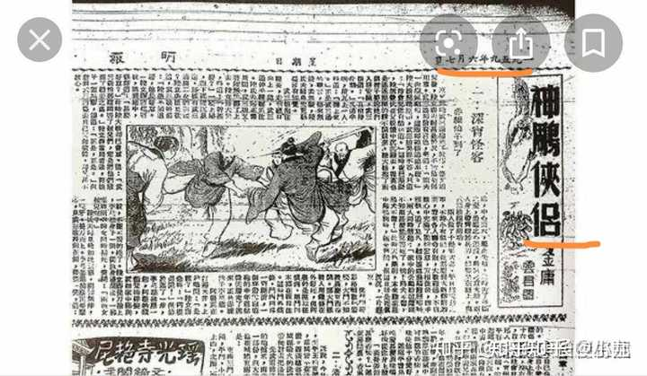

《神雕侠侣》中有哪些细思极恐的细节？ \- 小九 的回答

这是一本屠龙记

分析之前，先辟一下谣言

一、说神雕侠侣又名天残地缺，来，我们先看看天残地缺的汉语解释。

alt="Image">

天残指的是天生残疾，地缺指的是后天缺失。懂了吗？杨过断臂是后天缺失，叫地缺，小龙女后天失贞，也是叫地缺。没有天残！没有天残！没有天残！

怎么，不信？

没关系，我们来看看第一版连载的神雕侠侣。

alt="Image">

自认到这里关于天残地缺是谣言已经很清晰了，如果还不信，那请出示证据。

之死靡他

alt="Image">

alt="Image">

alt="Image">

之死靡它是形容爱情的不错，但它形容的是什么爱情？

是被母亲阻拦的爱情。

已知，小龙女和杨过都无父无母，那么这里的之死靡它，真的是形容小龙女的吗？

不要跟我说郭靖黄蓉在阻拦他们，郭靖很忙，黄蓉也不喜欢杨过，没有人拦他们。

__原著分析__

一、结构分析

众所周知，在文学里，小说结构分为起，承，转，合。

其中，起与合分别是故事的开头和结尾，是奠定全书基调的。

先看起，也就是神雕侠侣的开头。

alt="Image">

第一章主要讲了武三通对何沅君的不伦之恋，武三通虽然娶妻了，心里却还想着何沅君，何沅君死后，他疯疯癫癫地跑来挖坟。

注意，注意，注意！！！

任何一个小说开篇就是奠定全书总基调，这里武三通与何沅君的恋情以失败告终，最后一死一疯，这就是全书的总基调。

alt="Image">

看，武三通和小龙女说的话是不是很像？

武三通说江南人多狡诈，小龙女说以后谁来照顾你呢？

这便是全书的基调。

alt="Image">

这是杨过刚出场的时候，直接描写他幼时被毒蛇咬过，险些丧命。这到底是铺垫还是闲笔呢？接着看。

alt="Image">

这是第二遍在开头前几章描写毒蛇，且每次都和杨过有关。这会是巧合吗？

来看小龙女。

小龙指的是蛇，这点毋庸置疑，但是因为怕人杠，我给一个词条。

alt="Image">

小龙女的师姐李莫愁，是赤练仙子，来看赤练

alt="Image">

再看一下蛇居住在哪里

alt="Image">

看一下古墓：

![五 回 活 死 人
李 葜 愁 李 丑 是 你 师 对 ， 地 自 也 在
这 活 死 人 墓 中 仨 过 了 ， 怎 么 又 下 终 南
山 法 ？ " 小 龙 女 道 、 “ 地 不 听 我 师 父
的 话 ， 是 师 父 赶 地 出 法 的 · 扬 过
喜 ， 心 想 “ 唷 这 规 矩 就 好 办 ， 哪 一
天 我 想 出 法 了 ， 只 须 不 听 你 话 ， 让 你
赶 了 出 法 便 是 · " 但 想 这 番 打 可 不
能 露 了 口 凤 ， 、 否 则 就 不 灵 了 ·
两 人 谈 谈 说 说 ， 扬 过 一 时 之 间 倒 也 怠
了 身 上 的 寒 冷 ， 但 只 任 口 片 刻 ， 全
身 叉 玲 得 应 抖 ， 央 还 ． “ 姑 姑 ， 你
饶 了 我 罢 · 我 不 睡 这 · " 小 龙 安
0 “ 你 全 敖 的 师 父 打 ， 不 肯
讨 一 句 饶 ， 怎 么 见 下 这 般 不 长 进 ？ "
扬 过 笑 0 “ 谁 付 我 不 好 ， 他 就 是 打
我 ， 我 也 不 肯 有 一 句 口 · 谁 付 我 好
嵴 76 ／ 忄 乙 0 忄
手 @小 九 ](attachments/8f53b502ff859cf8.jpg)

alt="Image">

根据小龙女的名字，师门，以及居住环境，可以肯定，她就是那条蛇。金庸在前面铺垫了两回的毒蛇也都和她有关。

这上面都是起的部分，接下来要分析合的部分。因为起承转合最重要的是开始和结局。中间一系列的事情，都在为它们做铺垫。

alt="Image">

结尾部分有很多值得思索的地方，其中，结局是最重要的。

联系上下文，不难看出，杨过和小龙女走的时候，一群乌鸦飞过。

乌鸦在文学作品里一般指要死人。

防杠，我贴词条。

![22 ： 17 = 00
巢 谷 0 fill 龠 归 豇
乌 鸦 啊 啊 而 坞 在 文 学 里 的 象 征 0 @
傢 合
频 图 片 Ai+ 冒 ：
乌 鹈 在 文 学 中 的 象 征 意 义 具 唷 多 重 读 ， 不 同
文 化 背 和 作 品 主 题 下 呈 现 显 萧 差 异 、
砰 与 预 言
． 在 中 国 玄 典 文 学 中 ， 乌 鹈 曾 棱 为 玄 科 的 象
征 ， 例 如 睢 南 孑 ， 乙 载 乌 在 周 朝 兴 盛 时 叼
谷 种 预 示 科 瑞 ， 为 代 萌 多 棱 赋 于 预 言 功 能 ．
悲 怆 与 死 亡
在 为 方 文 学 中 ， 鸟 鹈 常 象 征 死 亡 与 悲 伧 ， 如 爱
伧 、 玻 的 诗 欷 乌 鸭 ” 通 过 主 角 与 乌 鸦 的 对 话 ，
展 现 失 法 爱 人 的 绝 壁 ， 乌 鸦 的 回 答 “ 永 不 再 会 “ 强
化 了 命 运 无 改 变 的 悲 痛 感 ，
3
反 叛 与 自 由
分 现 代 文 学 作 品 赋 予 乌 新 的 象 征 意 义 ， 如
鲁 迅 笔 下 的 乌 象 征 觉 醒 古 的 悲 壮 ， 或 民 间
说 中 将 其 为 垣 强 追 自 由 的 化 身 · ， 卜
都 主 意 不 同 作 品 对 乌 鸦 的 刻 画 差 并 较 火 ， 红
合 裂 体 文 本 分 折 其 象 征 指 向 ．
即 手 @小 九 ](attachments/e29d97fd571aa217.jpg)

alt="Image">

有三点，那么这里的乌鸦到底指什么，继续看，文中下面有首词，词里有寒鸦复栖惊

alt="Image">

诗词中比喻的是凄凉孤寂，也比喻聚散无常，透过这个意象，不难知道，上面的乌鸦真正的词条该是悲怆与死亡。

如果还不信，麻烦去看倚天屠龙记的开头，那里有一句诗词，叫瑶台归去。

结尾的基调与开头的基调一致，那便是被毒蛇缠上，开头杨过杀蛇，结尾也在暗示杨过杀蛇，这叫呼应。

二、写作手法分析

![小 说 中 总 是 后 矛 盾 的 写 法 叫 《 0 @
记 穗 频 图 片 Ai+ 冒 ：
小 说 中 通 过 萌 后 矛 盾 制 悬 念 的 写 怯 通 常 称 为
欲 扬 先 抑 · 这 种 手 怯 通 过 先 呈 现 矛 盾 冲 突 或 霓
面 婧 节 ， 为 后 续 婧 苹 的 哲 或 人 物 形 象 的 升 华
做 辅 垫 ， 增 强 故 事 张 力 · 《 2 ．
具 体 作 用
1 ， 辅 垫 哲 通 过 萌 期 矛 盾 冲 突 为 后 和 解
反 或 重 要 婧 苹 出 现 刽 条 钎 ， 使 故 扌 发 展 更
合 理 ．
2 ， 强 化 戏 剧 性 突 如 其 率 的 矛 盾 能 吸 引 读
意 力 ， 增 强 故 扌 悬 念 ， 避 免 平 辅 直 叙 ．
3 ， 突 出 人 物 袼 矛 盾 冲 突 常 揭 示 人 物 内 心 挣
北 或 命 运 困 境 ， 使 形 象 更 立 体 ． 《
型 孝 例
背 影 ， 冫 中 多 羽 写 父 孑 矛 盾 ， 终 法 感 人
场 景 收 尾 ， 形 成 婧 感 张 力 ．
· 金 龠 小 说 常 用 “ 忽 " 制 造 意 外 冲 突 （ 如 郭
靖 棱 围 攻 后 出 现 军 ） ， 推 动 婧 节 应 展 ， 3
收 起 ^
乎 0 丿 」 ． 九 ](attachments/da1cda5ecb0cf554.jpg)

alt="Image">

看，我都没有提到金庸，就出现了金庸。这是他常见的套路。不过在神雕侠侣中，他的手法明显更高明。

alt="Image">

alt="Image">

看见了吗？这叫矛盾。并不是旁白说他没有看朱子柳，他就真的没有看朱子柳的。同理，杨过说陆无双像姑姑，但实际像的是郭芙，也叫矛盾。但是就不一一分析了，感兴趣可以自己去看。

三、环境描写分析

众所周知，写作手法中以景结情，透过景色描写，来反应人物的心情，或者轨迹。

alt="Image">

这一段是小龙女当众宣布要和杨过成亲时杨过的心理描写。

人生已达臻美之境，用现代汉语说，心情太美好了，过去白活了，以后都不用过了。

这里有两种翻译，第一种，心情确实很美好，觉得没有任何事能超过现在了。

第二种，太痛苦了，人痛苦到极致，会出现反讽状态。

举个🌰：一个人长期倒霉，他崩溃之下说老天爷对我太好了，这就是反讽。

既然有两种解释，那么此时的环境描写就派上用场了。

alt="Image">

alt="Image">

垂杨树，又名柳树，已知全书中垂杨树只有一处，那么来看看柳树有多少处。

alt="Image">

哦！居然那么多。

为何金庸突然要用垂杨树来代替柳树？

那是因为垂杨树名字直译叫垂下来的杨柳

这里的环境描写叫暗指，用垂下来的杨柳指代心态崩了的杨过。

PS：这里如果有人觉得太牵强，可以自己去搜树名，其中，每次死人都有槐树，出现小龙女的时候是松树，而杨过和小龙女秀恩爱的时候多次有槐树。这里不多加分析，可以自己去求证，微信读书就有原著，不然内容太多。

四、内容设定

神雕侠侣中有一个设定非常有趣，身中情花毒的人动了男女之情就会感到疼痛。

来看小龙女跳崖后发疯的杨过。

alt="Image">

alt="Image">

alt="Image">

这是对身中情花剧毒的杨过的描写，十分深情。

但是，他此刻已经身中情花剧毒，他表现得那么难过，情花毒却并没有发作。

为了防止有人杠，来看一下小龙女对杨过起了怜惜之情，而发出的情花毒吧。

alt="Image">

同样的情花毒为何杨过在小龙女跳崖后完全不发作?

如果真的有心疼之意，那么他该很痛。

可他表现得十分痛苦，却没有发作情花毒。

五、暗示与隐喻

alt="Image">

alt="Image">

白羊指的是牵羊礼，这里骂得太脏了，百度没有词条。

甄志丙形容小龙女是媚兰，并特别指出是王母娘娘的女儿，明褒实贬，可以直接看词条。

![25 ： 500 也
艮 O b 仪 0 还 O 以
· 慵 减 录 ” 兰 储 孑 即 云 然 英 王
吏 人 ， 是 王 母 十 三 女 ， 受 为 云 孙 宫
英 夹 人 ， 但 串 中 称 其 “ 秽 思 不 豁 ， 鄱 吝 内
團 ， 淫 念 不 斩 ， 灵 地 木 澄 0 这 与 人 们 通
节 认 知 中 纯 高 尚 的 亻 山 女 形 象 火 相 径 庭 ，
是 其 与 众 不 同 之 处 ，
· 古 凤 小 说 苦 梦 缘 ” 、 兰 是 为 王 母 的 十
三 女 儿 ， 长 弄 簫 ， 能 与 其 他 硳 的 乐 器
演 奏 汇 成 一 曲 ， 她 参 与 了 “ 女 郎 擐 阉 事
亻 午 " ， 与 华 一 起 将 琉 璃 灯 内 所 用 流 丈 拉
成 蛀 ， 异 致 女 郎 擐 阉 失 · 为 此 ， 地 棱 眨
至 凡 间 呛 为 娼 ， 孤 独 一 生 ， 即 便 有 何 、 心
之 人 ， 也 ． 会 死 于 非 命 一 不 能 终 ， 其 经 历
在 为 王 母 锗 女 中 为 独 特 ·
· 淞 隐 录 ” ． 巫 兰 仙 孑 本 是 凡 间 女 孑 潘
五 ， 小 字 儿 ， 生 自 名 门 ， 自 幼 慧 ，
能 诗 识 字 、 作 竹 石 小 画 · 地 死 后 成 为 离
恨 天 上 悼 红 阉 中 的 司 花 储 尉 ． 地 曾 在 观 亭
壁 题 诗 ， 后 与 丈 失 管 君 重 逢 ， 还 邀 众 亻 山
安 与 管 君 相 聚 宴 饮 · 地 劝 管 君 续 娶 ， 并 用
亻 山 镜 让 管 君 到 木 率 凄 子 的 樘 砰 ， 还 贈 予
管 君 仙 家 秘 诀 方 孑 ， 这 些 经 历 都 充 满 奇 幻
色 ， 异 于 常 人 ·
洋 度 思 考
娟 兰 仙 孑
困 生 图
豆 包 卩 图
0
即 手 @小 九 ](attachments/e7363297cbc35ec6.jpg)

alt="Image">

此外。

里面有许多的典故，可以自己去搜。

如萧史乘龙，满床笏等等。有很多。

六、列举一些所谓的bug吧

alt="Image">

alt="Image">

请注意，这里是先看到幽谷无人，才又惊又喜。并不是看到茅屋，才又惊又喜。汉字中出现的顺序很重要，很重要，很重要。

![韦 三 十 九 回 六 战 裏 阳
时 曾 见 列 火 片 光 亮 ， 在 身 边 一 闪 而
过 ， 甚 非 奇 节 ， 其 中 当 唷 绕 ， 想 列
此 处 ， 一 妖 而 起 ·
他 火 声 说 适 、 “ 好 歹 也 要 奇 个 水 落 石
出 ， 不 见 地 的 尸 骨 ， 此 心 不 死 · " 纵
身 入 潭 ， 直 往 洋 处 潜 法 ， 开 底 越 洋
越 寒 ， 潜 了 一 会 ， 四 周 蓝 森 森 的 都 是
玄 冰 · 扬 过 内 功 浑 湛 ， 虽 不 畏 寒 ， 佴
并 处 殍 力 太 强 ， 闭 力 冲 了 数 次 ， 也 不
过 再 潜 下 数 丈 ， 总 无 法 到 底 · 气 息
促 ， 于 是 回 上 潭 边 ， 抱 了 一 块 石 ，
再 妖 入 潭 中 ·
这 一 次 却 总 沉 而 下 ， 猛 地 里 眼 前 一
亮 ， 他 心 念 一 动 ， 忙 放 下 大 石 ， 向 光
亮 处 游 法 ， 里 觉 一 股 《 流 卷 也 的 身
孑 冲 了 过 法 ， 乙 身 处 地 底 暗 潜 流 之
卟 902 ． ／ ' 是 伊 卜
手 @小 九 ](attachments/38129752f7de2f70.jpg)

alt="Image">

alt="Image">

杨过是抱着石头进水，增大压力后才到了小龙女住的地方，那么请问，小龙女是如何被水冲进来的？她的压力是不够的。

alt="Image">

叛师反教，为何杨过后悔叛师反教?叛师反教他遇到了谁那么让他后悔?

七、对比手法

alt="Image">

alt="Image">

夭矫空碧武功是让物体飞不走，过去杨过屡次下山，想要摆脱小龙女，但是并没有成功。同样，如今小龙女遇到了杨过，她也同样摆脱不了。

__PS:其实还有很多很多证据，但是整理太累了。可以按照我给的思路去看，会有很多不一样的地方。__
