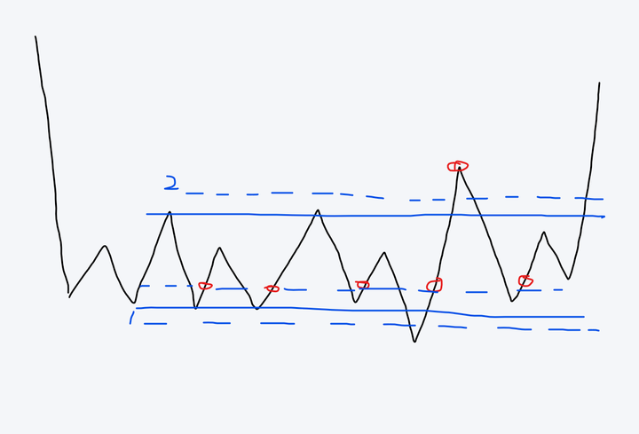
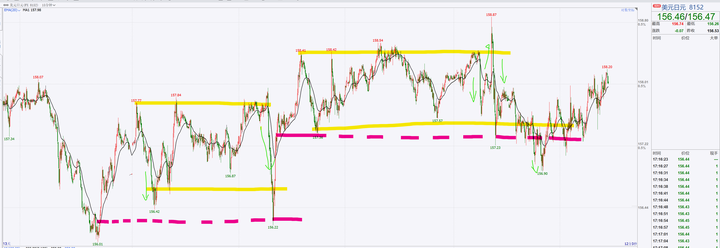
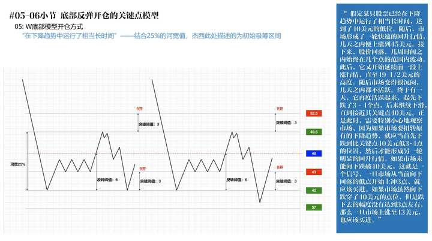

《股票大作手回忆录》你看懂了吗？ \- 已退乎 的回答

我看了很多次，每次我都以为我看懂了，当我做错了之后，再作对时，我发现我又看懂了？每次都是我以为我看懂了。其实我看懂个屁。

讲穿了，杰西其实就是很隐晦的讲了做市模型，以及跟市交易者面对做市的该怎么做。

庄家控制形成的交易区间研究透了，想输钱你都很难办到，除非你自己非要瞎折腾，而震荡区间过后就是趋势。一个因一个果，震荡是趋势的酝酿阶段，哪个重要些呢？

另外就是交易心态、交易时机这些非常主观无法量化的经验。

alt="Image">

红色买入，错了止损，关键是找准1和2这两个做市商的行为点。

alt="Image">

比如说上图的绿色部分的走势，恐怕是散户最头疼的，也是经常被操纵输钱的，其实你看懂了杰西的述说，就很容易避免，甚至，跟着做市商一起收割人头。

alt="Image">
