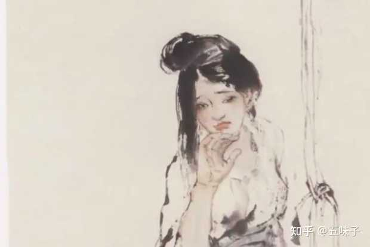

《金瓶梅》中来旺妻蕙莲为什么要自杀呢？来旺被打发走了她不是更好与西门庆在一起吗？ \- 五味子 的回答

[源网页](https://www.zhihu.com/question/25040125/answer/1989484112122234658?share_code=19k9jqshW9LWO&utm_psn=2080011407089727464)

宋惠莲刮剌上西门庆后养成了个习惯，就是夏天只穿两条裙子，里面却不穿裤子，这样不管在哪里遇见西门庆，掀开裙子就能探讨人生哲学。

这天，宋惠莲见西门庆打门前走过，便招呼老板进了自己的员工宿舍，一把就坐在老板腿上说话。原来啊，宋惠莲和丈夫来旺儿双双得罪了潘金莲，潘金莲在西门庆耳边吹风后，来旺儿被西门庆设计陷害，如今被关在牢里呢。现在她要为丈夫求情：

“亲达达，你看我面上吓唬他两天就好了，出来给他娶个老婆，随便打发他去哪里，我也长远是你的人了不是？”

西门庆是个耳根子软的，答应了：“宝贝，你能这样想就很好，明儿我就在对面街上买三间屋子给你，以后咱俩自在玩耍。”

宋惠莲得了信，越发卖力办事，完事后西门庆又掏出一二两银子给她买果子吃，又再三安抚：“明天我就写帖子给官府叫放他出来。”

宋惠莲得意啊，我在老板面前果然还是有点分量的，于是等不得一刻就跑到同事们跟前炫耀，“爹很快就把来旺儿放出来，给他再娶一个”、“爹说给我买三间屋子，外加丫鬟服侍”云云。

谁知这一炫耀，风声就吹到了潘金莲耳边。

alt="Image">

潘金莲愤懑满腔“我还真不信了，若放这奴才做了西门庆第七老婆，我潘字倒过来写。”

潘女士没有吹牛，果然她一出狠招，西门庆就把来旺儿往死里整，来旺不仅被打得皮开肉绽，血肉模糊，还被递解回乡，再也不能在清河县出现。

宋惠莲知道这个消息后，哭着就要上吊，被救了下来，沉郁了几天后，潘金莲临门一脚，在她和孙雪娥两人之间挑拨，某日孙雪娥过来吵架，宋惠莲气不过，一根裹脚布自缢死了。

宋惠莲自杀，我一度很是困惑，因为当初是她自愿、甚至主动要献身西门庆的，成为西门庆姘头后又到处卖弄炫耀。来旺儿死了，不正好顺顺利利做西门庆外室吗，怎么还反抗上了？直到细读四五遍后，我才看明白了。

宋惠莲之所以这样做，主要有几个原因：

第一、”忍气不过“

这是书中直接点出来的，宋惠莲在和孙雪娥吵架后，“忍气不过……自缢身亡”。宋惠莲这忍的是什么气呢？自然是斗败给了潘金莲。

西门庆的这么多女人中，宋惠莲是最轻浮最孟浪的一个，这点从她愿意和西门庆钻山洞，夏日只穿两条裙子就能看出来。同时她也是最争强好胜的一个，因为她和西门庆刮剌，不是像其他女人一样只贪图到自己想要的东西就好，她还要处处显摆自己的魅力。为此还特意挑了西门庆女人中姿色最出众、最受宠的潘金莲来挑衅。

她和西门庆在钻山洞时笑话潘金莲的脚缠得不够小和周正，嘲讽潘女士是“再醮货”，和西门庆是露水夫妻。把山洞外头偷听的潘金莲气得胳膊都软了。

而后发现潘女士和小女婿陈敬济有一腿，她也要去刮剌陈敬济以证明自己魅力比潘女士强，元宵节当着众人的面用自己的鞋套着潘女士的鞋子穿……

这就招来了潘金莲的杀心。而设计陷害来旺儿，就是潘金莲和她斗法的关键，潘金莲要先解决掉来旺儿，宋惠莲要救来旺儿，关键人在西门庆，两人都在西门庆耳边吹风。

宋惠莲眼看胜利在握，连风声都放出去了，炫耀都炫耀过了，谁知道人家背地里早把来旺儿整得人不人鬼不鬼，她还是最后知道的。这意味着她彻彻底底输给了潘金莲，同时也成了整个西门大院的笑话，自然是“忍气不过”了。

第二、羞惭

前面说过两次，宋惠莲自缢两次，第二次没人发现才死的。而第二次是因为“忍气不过”，第一次却是因为“羞”，这点作者已经在章回明确点出“宋惠莲含羞自缢”。

那宋惠莲在“羞”什么呢？自然不是羞自己曾经的轻浮浪荡，而是因为：和西门庆好了一场，本以为自己多有分量，谁知什么也不是。

之前刮剌上西门庆时，宋惠莲虽然行动上都在招摇自己的“特殊”，但是嘴上却不敢露出半句，因为主子私通下人在当时是不能摆在明面上的。

可在来旺儿被抓时，宋惠莲也不再顾忌这个了，求西门庆道：“不看僧面看佛面……你依依我罢”这几乎等同于把自己和西门庆的私情揭开来了，有要挟的性质。但同时也给自己断了后路，若是西门庆真答应便罢了，可不答应，那她只有颜面扫地。

所以刚听到来旺儿被递解时，她第一反应是“羞”，要自缢，几天后想来想去还是愤懑在怀，“忍气不过”才又自缢了。

自然，也不能因此否定宋惠莲内心深处，确实是有那么一抹道德感在的。她本可以像潘金莲一样，等旺儿一死正好安心做西门庆的姘头，可她虽然坏，却坏得不够彻底。她虽然对来旺儿没有感情，也想攀上西门庆过锦衣玉食的生活，但却接受不了用牺牲别人的性命为代价。潘金莲也正是看中了她这个“软肋”，才死死揪住来旺儿，若真放来旺儿走，宋惠莲没有了道德感上的压力，肯定是要全心全意成为西门庆的第七个老婆的。而那也是潘女士接受不了的。

只能说，宋惠莲输给潘金莲，不仅输在头脑肤浅，也输在了内心深处还有一丝道德感。大约也是这样，作者才会对她予以同情，写下了“彩云易散琉璃脆，世间好物不坚牢”的感叹吧。

内容效果不满意？[点此反馈](https://feedback.notebooksyncer.com/feedback/bc0da5dc_1788695421970?u=https%3A%2F%2Fwww.zhihu.com%2Fquestion%2F25040125%2Fanswer%2F1989484112122234658%3Fshare_code%3D19k9jqshW9LWO%26utm_psn%3D2080011407089727464&s=onenote)
