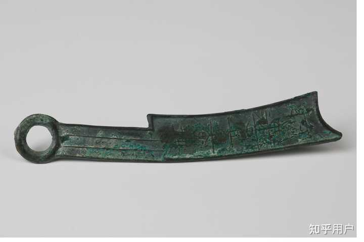
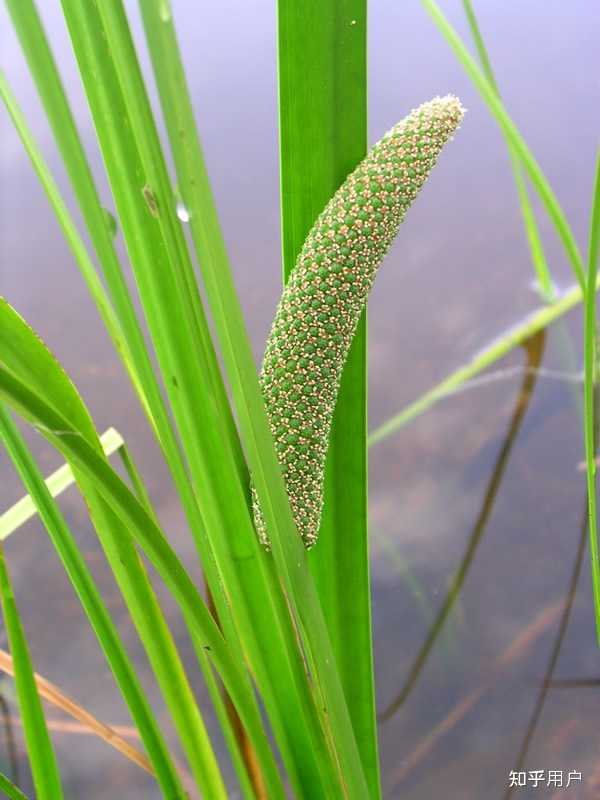

__问题描述：__

据说这句话号称《金瓶梅》一书的隐语之最

这句是伯爵与几位妓女在席间互相调笑、挖苦之语。妓女本趋炎附势，伯爵作为帮闲，同样靠“白嚼”西门好大哥为生，看起来人模狗样，其实和妓女们完全属于一个生态位。伯爵看不起妓女，张嘴闭嘴“小淫妇”，妓女看他也格外寒碜，一口一个“应花子”。

西门好大哥看他们插科打诨、互飚粗鄙之语，只觉得好笑，一会儿骂妓女过分，一会儿嗔花子嘴贱，闹太厉害了还得劝劝架，给双方一个台阶下。好大哥干这个事儿的时候，心里美极了，人家花这些个小钱儿，不就为图一乐吗？

伯爵又来蹭吃蹭喝，见了正在表演音乐节目的妓女，心中很不耐烦，建议别唱了，有这功夫还不如递酒。伯爵之所以如此急切，有两个原因：其一，蹭吃蹭喝次数太多了，妓女们的曲目听过无数遍，早已审美疲劳；其二，歌曲演奏太“素”，伯爵虽包养不起妓女，蹭一下陪酒服务揩揩油也是好的。

妓女们很烦这厮，说了个歇后语：“应花子，你门背后放花儿，等不到晚了！”放花放炮，要趁夜色才好，可总有心急的人，等不到天黑，以致“门背后放”。伯爵一听就急了，骂一句：“什么晚不晚？你娘那𣬼！”相当粗鄙。

伯爵之所以急，是因为这句歇后语同时也是一句双关隐语，面上说放花，底子说放炮。所隐者，性事也。和妓女同席，话题围着下三路走，可谓直奔主题，倒也不算突兀。隐语是妓女开的头，下三路是妓女带的路，当着好大哥的面，应花子必然要找回场子。

由于嫌妓女们磨叽，伯爵一手一个，直接拉到席上递酒：

郑爱香儿道：「怪行货子！拉的人手脚儿不着地。」伯爵道：「我实和你说，小淫妇儿！时光有限了，不久青刀马过。递了酒罢，我等不的了。」

很明显，伯爵的攻击点，主要是“青刀马”一语，但是这个包袱没有响，因为同席之人表示根本没有get到。作为狐朋狗友，谢希大知道，应哥哥讲话必爆梗，而且必往下三路走，自己没听懂绝对是因为水平低。为了不错过这个精彩的段子，他虚心请教：

谢希大便问：「怎么是青刀马？」伯爵道：「寒鸦儿过了，就是青刀马。」众人都笑了。

伯爵没有解释“青刀马”是啥，只补充了“寒鸦儿”一语，包袱登时便响了，“众人都笑了”。由众人反映推测，这“寒鸦儿”当时必是一句直给级别的常见梗，要理解这个梗，方向很明确：往简单、粗暴上想，越直接，越接近真相。

于是，很多人想到了谐音梗，所谐之音不但直奔下盘，更极其俚俗——“寒鸦儿过了”谐音“含鸭儿过了”。“含鸭”即“含鸟”，无需过多解释。《水浒传》中，郓哥儿被骂了三次“含鸟猢狲”，两次来自王婆，一次来自武大，属于腹背受敌了简直。

需要略作解释的是“过”字，正如谐音双关的“寒鸦”一样，“过”字亦是双关语，既是寒鸦飞过之“过”，也是《金瓶梅》里两次提到的“精还不过”之“过”。

第五十一回：

两个足缠了一个更次，西门庆精还不__过__。

寒鸦归巢，总在黄昏，所谓“叶随流水归何处，牛带寒鸦过晚村”是也。妓女说伯爵急，伯爵解释说“时光有限”，时候不早了，“寒鸦儿”要“过”了。

“寒鸦儿过了，就是青刀马”这句话的句尾省了个“过”字，按照逻辑补充完全，应该是“寒鸦儿过了，就是青刀马过”。按上下文逻辑，“寒鸦儿”是动物和某器官的谐音双关，那么“青刀马”应该也是动物和某器官的谐音双关。

《金瓶梅》第五十回：

把胡僧与他的粉红膏子薬儿，盛在个小银盒儿内，捏了有一厘半儿来，安放在__马眼__内。登时薬性发作，那话暴怒起来……

姜亮夫《昭通方言疏证》：

走马，谓入倡家戏妓也（又民间谓，壮男夜遗亦曰__走马__、或曰__跑马__……）

以理推之，则“马眼”之所生长，必在马上——所谓“青刀马”者，原来也是那话儿。

综上，伯爵这句话的表面意思是：赶快递酒吧，青刀马一会儿就要过，等不及了。那么青刀马啥时候过呢？寒鸦儿过了，下一步就是青刀马过。至于所隐之男女亵事，想必无需赘言。

至此，这句隐语的大意已很明显，对于理解上下文已不构成障碍。如果再深究，唯一的难题便是“青刀马”中的“青刀”二字，诸家之说，看上去都不靠谱，如有称“青刀”是“青龙偃月刀”之缩写、“马”为“赤兔马”者，关公听完都得脸红。

查文献，古人语境中，“青刀”连用，所指非一：

其一，青色的刀。诗曰：“荷翻紫盖摇波面，蒲莹__青刀__插水湄。”又曰：“蒲生岸脚__青刀__利，柳拂波心绿带长。”还曰：“朝会则率其属被青质鍪、甲、铠，执青弓箭、__青刀__……”不知其形制，盲猜长得像菖蒲，细、窄而长者。

其二，刀币。春秋战国时之铜币也，其色青绿，形如小刀。

若非要解释的话，第二种含义“青刀马”为__“刀币般的那话儿”__，在语境上是强行可通的。至于那话儿长得像刀币，到底有什么优越性，那就见仁见智了。（我只是按照逻辑推理到这了，不代表我觉得这个狂野的解释靠谱……）

刀币长这样↓

alt="Image">刀币一种

考虑到这玩意儿硬度颇高，确实有个“眼”，而《金瓶梅》中对那话儿“裂瓜头凹眼圆睁，落腮胡挺身直竖”“横筋皆见，色若紫肝”等语，此物愈发不可直视（刀币多有纹理，与“横筋”可参）……

当然，亦有断句如“青/刀马”者，宋人称脚为“刀马”，脚又影射那话儿，如《金瓶梅》：““那怕蛮奴才，到明日把一家子都收拾了，管人吊脚儿事！”这里，吊与脚是一个意思，即今日之“关我吊事”也。只是太绕，且“青”字无着落，难以服人。

又有释“寒鸦儿过”为大话西游中达叔之“打了一个寒战”、释“青刀马”为“精”者，逻辑模糊，思路抽象，让人殊难接受，还不如刀币呢。（一笑）

__————以上为正文———__

__*3月5日补充：*__

*前文提到，古人笔下“青刀”，一是刀币，一是菖蒲，本以为“青刀马”之语，显然不可能与菖蒲以任何形式扯上任何关系，直到……我看见了 *[*@犬君拌汪酱*](https://www.zhihu.com/people/6462ce8ae398535fc80b621b87cd7413)* 科普菖蒲的回答中的配图↓*

*alt="Image">图源：https://www\.fs\.usda\.gov/wildflowers/plant\-of\-the\-week/acorus\_americanus\.shtml*

*关键这玩意儿又叫*__*“水烛”*__*，让人很难不想到《金瓶梅》中的那招*__*“倒浇烛”……*__

*游戏文字，博君一笑，幸甚矣。以上。*
