中国为何把大豆订单全交给南美？ \- 沙里拾金 的回答

基本上都给了巴西，我估计就是两个原因，一是关税问题，二是老美的大豆品质不咋地。

你以为你每天吃的大米、面条只是普通的粮食？

Nonono，在大宗商品交易员的眼里，__你其实每天都在把一勺一勺的“化石能源”送进嘴里。__

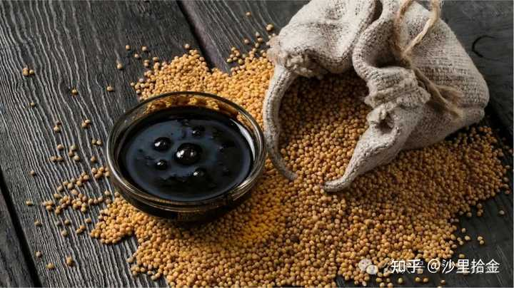

alt="Image">

先别急着反驳，这四张图，是决定人类 80 多亿人口生死存亡的关键信息：

- 这是养活了亚洲超 35 亿人的水稻版图；

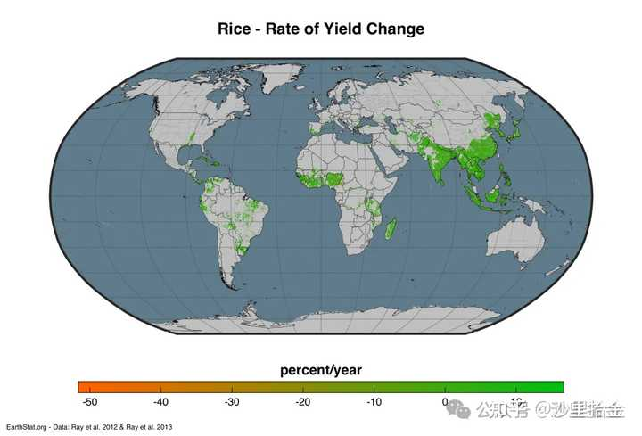

alt="Image">全球水稻种植版图（产量变化率）

- 这是横跨北半球、25 亿人赖以生存的小麦版图；

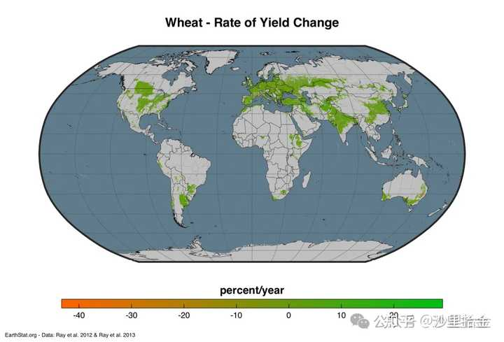

alt="Image">全球小麦种植版图（产量变化率）

- 这是支撑着全球现代畜牧业、决定你能不能吃上廉价肉类的玉米与大豆版图。

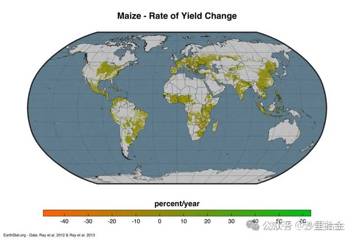

alt="Image">全球玉米种植版图（产量变化率）

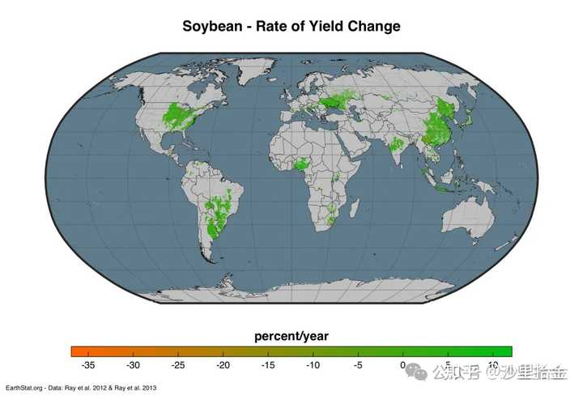

alt="Image">全球大豆种植版图（产量变化率）

原来我们认为，决定这些重要作物产量的，是气候和热量。也没错，但是，当极端的地缘政治博弈打断了全球能源供应链，当国际原油一路飙升势如破竹，这些农产品就已经不再是按老规矩来决定价值了——__更大的可能，是按照它们极其隐蔽的“含油量”来衡量的。__

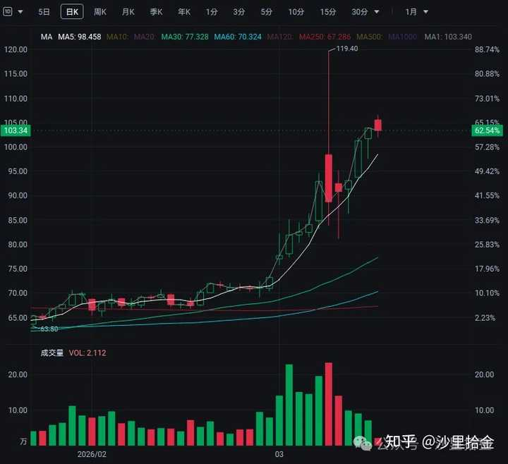

alt="Image">布伦特原油期货主连价格（北京时间2026\.3\.16）

今天我继续来画靶射箭了。假设在极端的情况下，国际原油的水位被顶在 150 美元上方甚至更高，并且在长期维持。那么我们人类餐桌上的“四大金刚”——玉米、小麦、水稻和大豆，分别可能会受到什么影响？

内容很干，老样子，点赞关注，现在开始。

### 1\. 核心标尺：农业账本里隐蔽的“能源含量”

要量化高能源价格对农作物的打击程度，我们必须引入一个核心的农业财务概念：__“直接能源运营成本占比”__。

在现代农场主的 Excel 账本里，随着国际油价和天然气成本剧烈波动的开销，主要就是三块：化肥、农药，以及统称为“综合能源成本”的农机柴油与灌溉烘干电力。

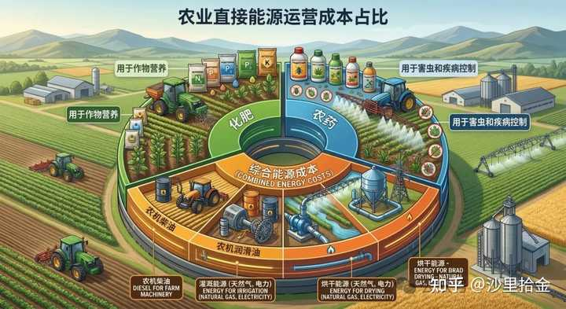

alt="Image">

在这三项里，占比最大、也是最复杂的，就是__化肥__。农作物想要高产，主要需要化肥里“三大金刚”元素的支撑：氮、磷、钾（NPK）。

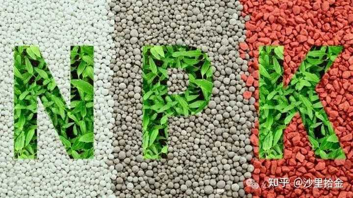

alt="Image">氮磷钾

先说钾肥（K）和磷肥（P）。

这俩兄弟，本质上是自然界里的矿产。钾肥主要产地在加拿大、俄罗斯和白俄罗斯；磷肥的全球绝对霸主是北非的摩洛哥。

它们的地理分布极度不均匀，但基本都完美避开了波斯湾和霍尔木兹海峡。中东确实也产一点磷肥，比如沙特，但沙特的磷矿石加工基地在红海边上，出口走的是红海，压根不经过波斯湾。

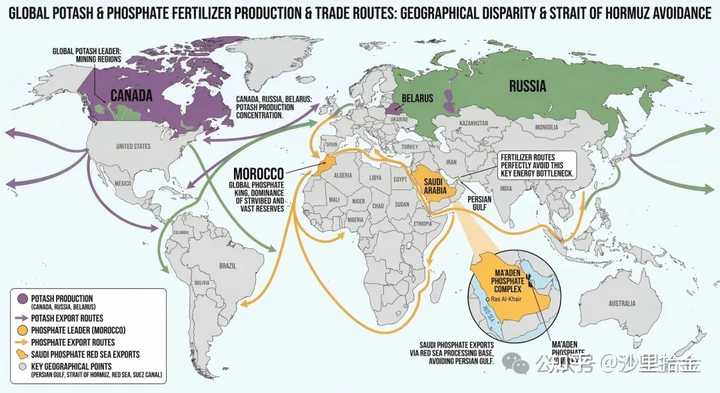

alt="Image">全球主要钾肥，磷肥生产国和贸易路线

更重要的是，磷肥和钾肥是“挖”出来的，不是用化石燃料“合成”的。所以，在高油价或者海峡被封锁的情况下，磷肥和钾肥在物理供应链上是相对安全的，它们受到的冲击非常间接，可能只是承担一些矿机燃料和海运燃油费的溢价。因此，在今天的内容里，我们暂时把磷和钾放到一边。

__这场风暴真正的风眼，是氮肥（N）。__

人类制造氮肥，必须在极其苛刻的高温高压环境下，把空气中的氮气和化石能源里（主要是天然气）提取的氢气强行结合在一起。也就是说，在现代化工体系里，__氮肥（主要是尿素），本质上可以理解为固体的天然气。__

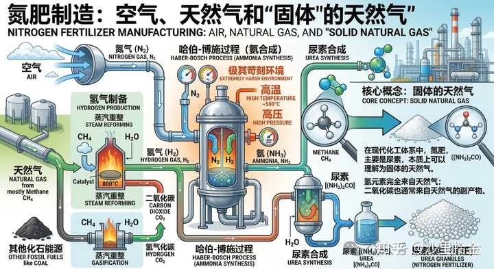

alt="Image">

如果海峡长期被阻断，全球氮肥将面临极其残酷的“双重绞杀”：

1. 全球约 20% 的液化天然气（LNG）贸易要从海峡运出，一旦受阻，海外化肥厂很有可能因为成本击穿底线而被迫涨价或停产。

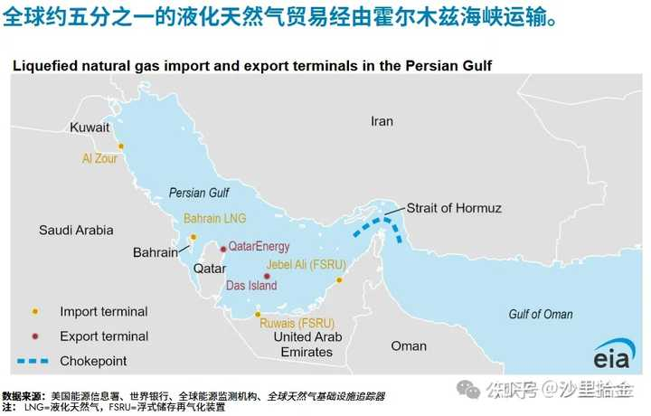

alt="Image">全球约五分之一的LNG贸易经由霍尔木兹海峡运输

1. 中东国家利用廉价天然气在波斯湾沿岸建了庞大的尿素厂。海峡一封，几千万吨的尿素现货被物理锁死，一粒都运不出来。

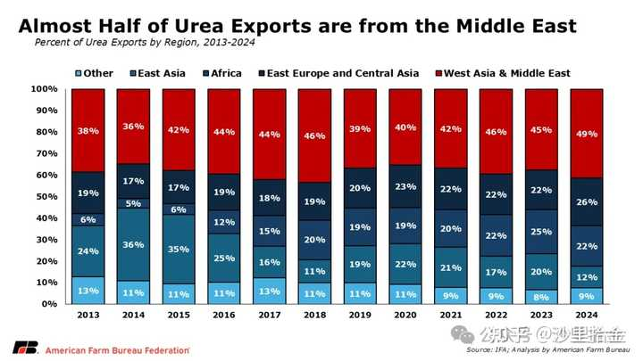

alt="Image">全球每年近乎一半的尿素出口量都来自中东地区

除了化肥，除草剂与杀虫剂等__农药__本质上也是“喷洒在农田里的液体石油”，其有效成分几乎全部来源于原油炼化过程中的初级衍生品。

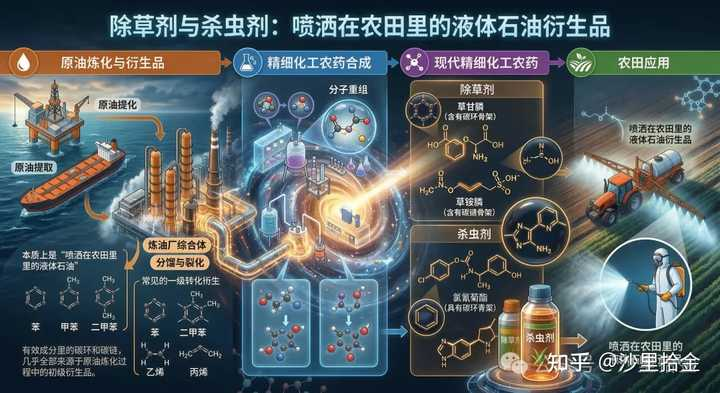

alt="Image">

理清了这个逻辑，我们就有了今天这把量度一切的“成本尺子”：__在四大主粮里，谁最贪吃“氮肥”、谁最依赖原油裂解的“农药”、谁的全流程耗能最大，谁就是这场宏观能源危机里承受压力最大的作物。__

### 2\. 玉米：吞噬天然气的“重型炼钢炉”

在四大作物里，玉米是当之无愧的“产量之王”。它不仅是全球畜牧业赖以生存的底层饲料基石，更广泛渗透进了全人类的食品加工、医药甚至现代化工体系。

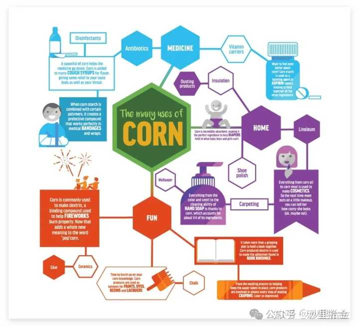

alt="Image">玉米被广泛应用在人类社会

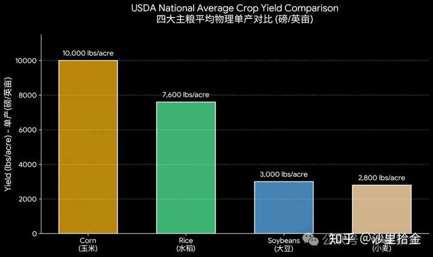

alt="Image">玉米，水稻，大豆，小麦平均每英亩产量对比

那如果把农作物比作工厂，玉米，绝对是一台全天候开机、疯狂吞噬燃料的“高耗能重型炼钢炉”。玉米之所以能够做到令人咋舌的单产奇迹，完全是因为它是一种极其依赖氮肥暴力堆砌的作物。

根据美国农业部（USDA）公布的基准账本，2021\-2024年间：

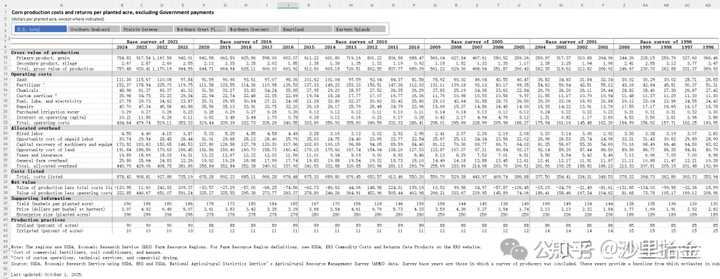

alt="Image">USDA美国每英亩玉米生产成本和收益明细表（无政府补贴）

- __化肥总成本__：占总运营成本近 38%。
- __天然气依赖度__：单单是买氮肥的开销占比，就达到了化肥预算的 53% 左右。粗略计算，氮肥占总运营成本约 20%。\(这里既要按常用几种氮肥的掺混比例和其中各自氮元素占比计算，过程略复杂跳过。想要具体源数据可DM我获取\)

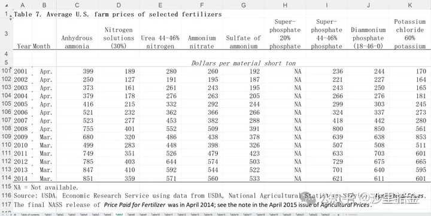

alt="Image">全美精选肥料平均价格

- __农药与机械能耗__：农药成本加权约占 12%；大型机械与烘干作业相关的综合能源成本加权平均约为 6\.5%。

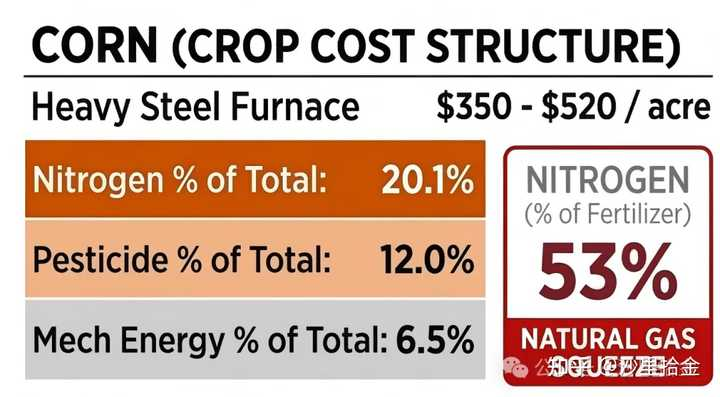

alt="Image">玉米每英亩总花费，氮肥，农药，燃料费用占比情况

三项“直接能源关联成本”，稳稳占据了玉米运营账单的 38% 以上。一旦国际天然气成本失控，玉米的底层账面将瞬间面临极大的膨胀压力。

但这还不是玉米最麻烦的地方。它还有一个独特的“燃油”属性。

很多人可能不知道，世界上有一种“用粮食造燃油”这种反常识的操作。美国环保署就曾规定，全美必须消耗 150 亿加仑的常规生物燃料（主要就是玉米乙醇）。表面上看是为了环保减排，但从宏观博弈的角度看，这是美国当年为了摆脱对海外原油的极度依赖、实现能源安全，同时为了补贴庞大的国内农场主利益集团。

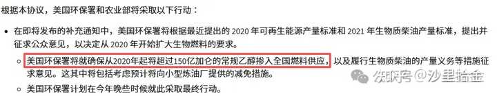

alt="Image">

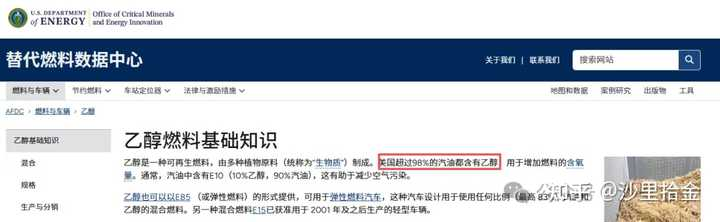

alt="Image">

这就导致，在美国每年生产的数亿吨玉米中，有超过 30% 根本没上人类的餐桌，而是被直接送进了巨大的工业提炼厂，做成燃料乙醇，然后掺在汽油里烧掉了。

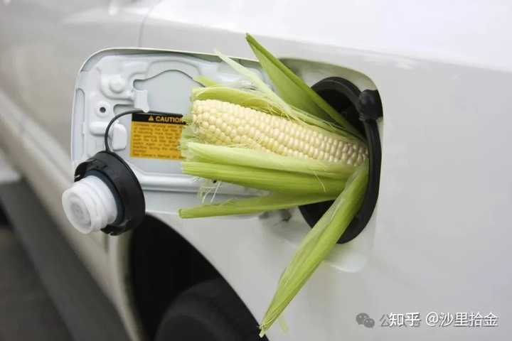

alt="Image">

原油越贵，汽油的替代需求就越旺盛；乙醇提炼厂的利润空间就越厚；他们就越有动力去大宗商品市场上，挥舞着钞票抢玉米。

__“成本含油量高”\+“终端能源替代需求井喷”__，双重挤压下，玉米是整个农产品板块中对能源反应最敏感的品种。

### 3\. 小麦：为保“面筋”死磕氮肥的两难困境

紧跟在玉米身后的，是养活了无数北方人、中东和欧美人的小麦。很多人觉得小麦耐旱、成本低，但它对“氮肥”的敏感度一点也不低。

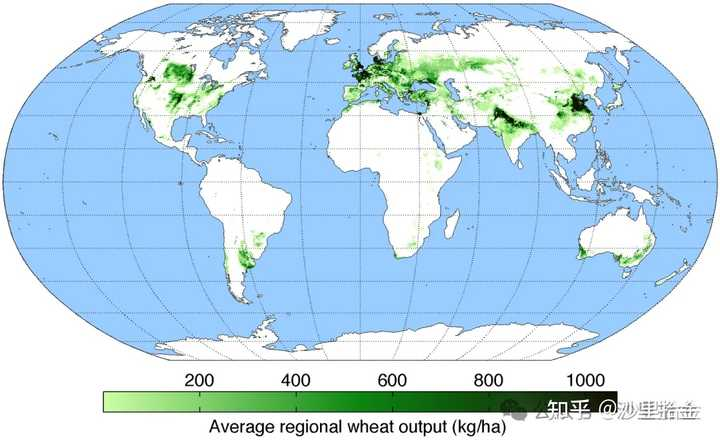

alt="Image">全球小麦种植版图

大家平时去面馆吃的面条劲不劲道，去烘焙店买的面包蓬不蓬松，很大程度上取决于小麦里的蛋白质含量，也就是大家俗称的“面筋”。而小麦在生长周期中想要合成这部分高质量的蛋白质，就必须拼命地吸收土壤里的氮元素。

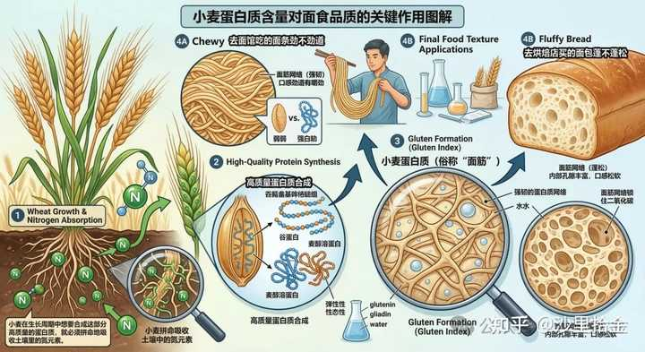

alt="Image">

同样参考 USDA 数据：

- 全美小麦平均每英亩的氮肥物理施用量，几乎是磷肥和钾肥总和的 1\.3 倍！
- __氮肥开销占比__接近化肥总预算的 59%，占总运营成本近 23%。
- 加上农药（11\.5%）和机械燃料能源（8\.5%），__总能源相关成本占比达 43%，甚至比玉米还要高一点。__

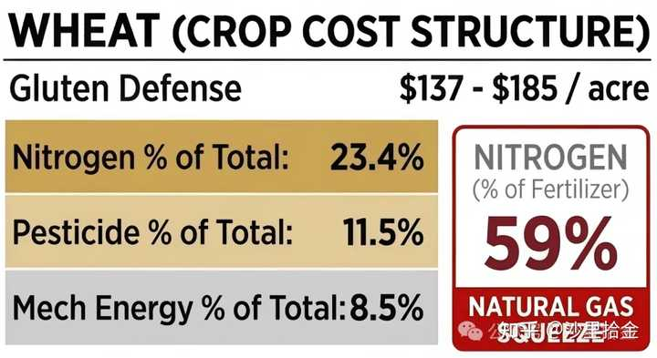

alt="Image">小麦每英亩总花费，氮肥，农药，燃料费用占比情况

如果化石能源成本大幅上涨，农场主就会被逼入一个非常痛苦的决策困境：

为了控制预算少撒点氮肥，小麦不仅单产面积会面临缩水，更致命的是，麦粒的蛋白质含量将无法达标。原本能送进加工厂做高级面包的硬红冬小麦，可能只能沦为等级极低的饲料麦，农场主辛苦一年直接白干。不过__这恰恰也说明了小麦在大宗商品市场里的“双重属性”——它既是高级口粮，但在品质降级或者玉米太贵时，也能随时退守畜牧业，充当“底层饲料”。__

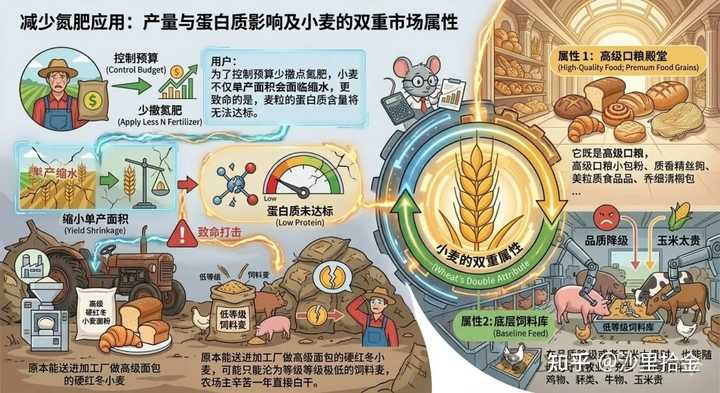

alt="Image">

如果咬咬牙顶着高昂的成本足量施肥呢？由于面粉是关乎国计民生最基础的物资，它的终端定价受各国的宏观调控较严。农场主很难将前端高昂的化石能源成本，百分之百地转移给下游的消费者。

这种两难的账面压力，大概率会直接逼迫部分土壤贫瘠的边缘土地放弃种植小麦，进而引发全球小麦供给端的结构性紧张。

### 4\. 水稻：高能耗灌溉与烘干，毫无退路的“纯口粮”

看完了玉米和小麦，我们再来看看养活了亚洲近半数人口、在水田里生长的水稻。

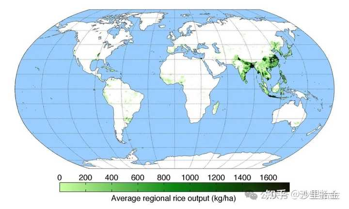

alt="Image">全球水稻种植版图

这里有一个反直觉的数据：在 2021\-2024 年间，水稻的单英亩总运营成本高达 622 到 863 美元区间波动，这数字甚至比我们刚才说的玉米还要高。为什么呢？

水稻的化肥账本非常特殊，它是一个“氮磷钾全面吞噬者”。它的化肥总支出加权平均后，占到了总运营成本的近 23\.9%。

为了维持长周期的水田生长，水稻每英亩需要狂吃 174 磅的氮肥！远超磷钾肥的总和。折算下来，化肥预算的 60% 都砸在了受天然气驱动的氮肥上。占到总运营成本的 14%。

不仅如此，水稻在水田高温高湿环境下，除草和防虫压力极大，其农药成本高达 103 到 158 美元之间，加权平均占比达 17\.4%。

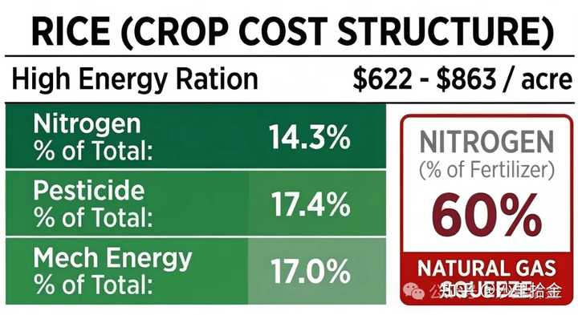

alt="Image">水稻每英亩总花费，氮肥，农药，燃料费用占比情况

除此之外，水稻还面临着一个比玉米和小麦更让人绝望的隐形支出——__水利灌溉与强制烘干。__

种水稻需要长期维持农田里的水层。必须动用大型水泵日夜不停地抽水；收割上来后，由于谷粒的含水量极高，必须在极短的几天内送进巨大的工业烘干塔，利用天然气、煤炭或者工业电力进行强制烘干，否则一仓的稻谷就会发霉变质。

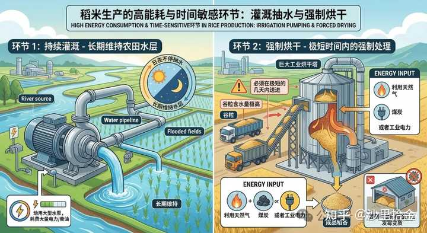

alt="Image">

在 USDA 账本里，水稻的“燃料与电力成本”加权平均占比达 17%！（对比玉米仅为 6\.5%）。

玉米是被昂贵的天然气化肥“单边承压”；__而水稻，是面临着“高气价化肥\+高能价灌溉与烘干”的双重考验。__

这里还必须补充一点：东亚和东南亚很多水稻产区的机械化程度其实没那么高。在亚洲传统的农业账本里，相当一部分本该由抽水机、收割机和烘干塔消耗的机械燃料成本，被极其廉价甚至免费的家庭人力劳动给强行替代、掩盖了。

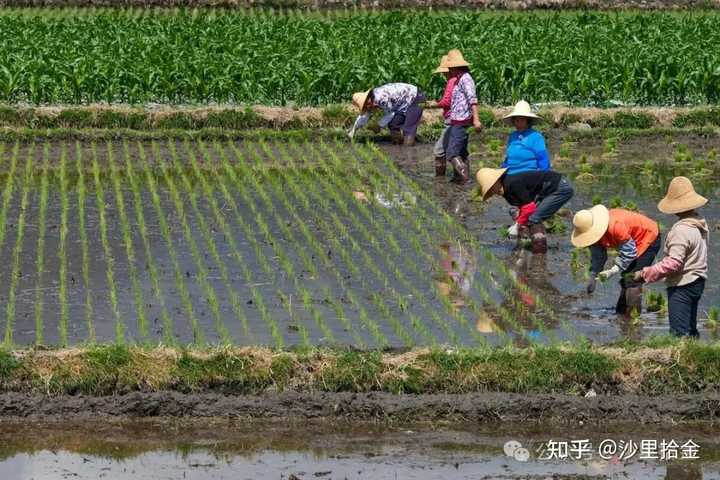

alt="Image">

那既然水稻的底层真实成本这么恐怖，为什么在国际市场里，除了一些特殊国家如日本，大米的价格很少像玉米那样出现较大的波动？

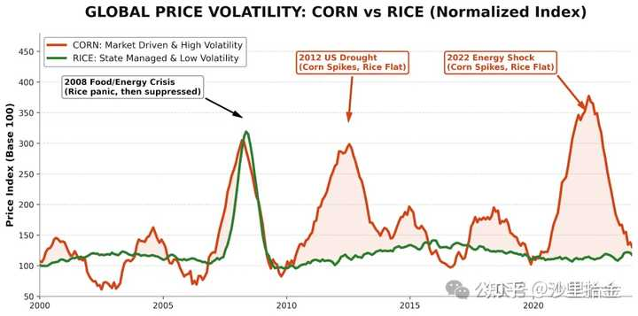

alt="Image">全球价格情况波动对比：玉米vs水稻（归一化指数）

这就涉及到一个关键的大宗商品产业属性差异。

玉米，在现代工业体系里，是绝佳的生物基原料，可以直接化身成“能源”的平替。即便是同为口粮的小麦，也有退守畜牧业去做“底层饲料”的后路。而水稻呢？水稻的终点只有一个，那就是老百姓的饭碗。

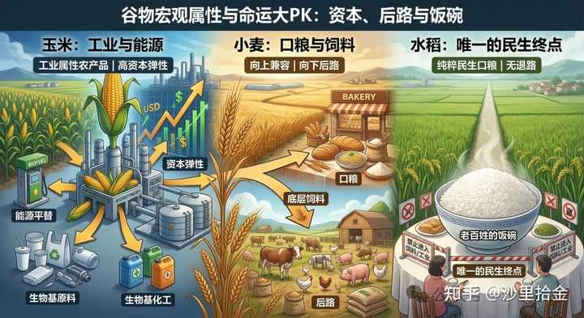

alt="Image">

这就注定了，玉米在宏观上是极具资本弹性的“工业属性农产品”，小麦具有充当饲料的向下兼容性，而水稻则是完全没有退路的纯粹“民生口粮”。

正因为它是纯口粮，是亚洲各国的“社会稳定器”，所以亚洲许多国家每年都在掏出巨额的财政资金，补贴尿素，提供廉价的农业用电，硬生生替农民对冲了化肥和能源的真实成本。目前国际市场上的大米估值相对稳定，很大程度上是靠各国的政策补贴硬扛出来的。

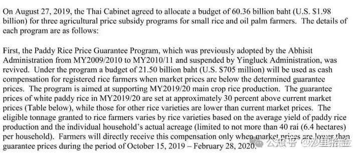

alt="Image">2019年8月泰国政府内阁同意拨款603\.6亿泰铢（约19\.8亿美元）用于三项针对小型水稻和油棕种植户的农业价格补贴计划

而我们今天看的这份美国农业部账本，展示的则是纯粹商业化、毫无“口粮补贴”兜底的裸奔成本。毕竟美国人平时不怎么吃大米，政府压根没动力去补贴它。

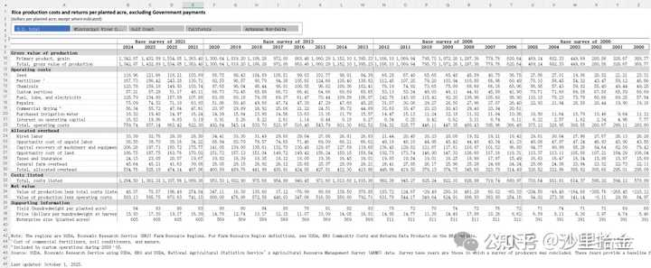

alt="Image">USDA美国每英亩水稻生产成本和收益明细表（无政府补贴）

但如果化石能源价格一直维持高位，一旦某些出口大国的财政补贴体系承压过重，或者为了力保本国供应安全，对大米出口进行管控。那些被掩盖多年的水稻真实生产成本，就可能会在脆弱的全球大米贸易体系中，引发不可忽视的影响。

### 5\. 大豆：自带“生物固氮”物理外挂的生存大师

在这场极其残酷的农业成本大逃杀中，大豆，可以说是大自然在这个星球上留下的一张终极“底牌”。

它不仅富含极高比例的植物油脂和优质蛋白质，更关键的是，它在基因里自带了一个对抗高油价的顶级“外挂”——生物固氮。

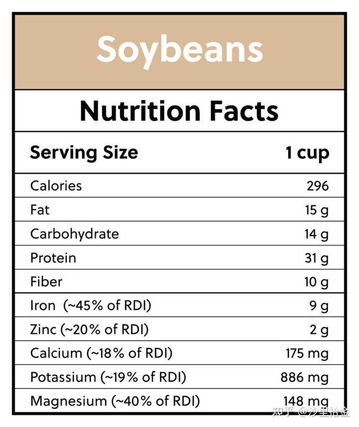

alt="Image">大豆营养成分表

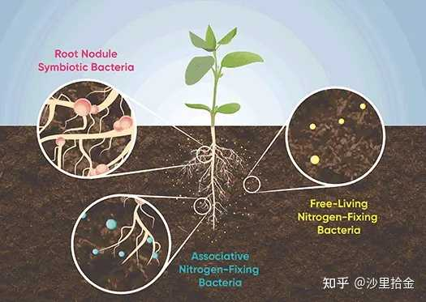

alt="Image">生物固氮

之前的视频讲过：大豆根须上长着一些密密麻麻的小瘤子，叫“根瘤菌”。它们能够直接把空气中游离的氮气抓取下来，在地下默默转化成大豆生长所需的氮元素。

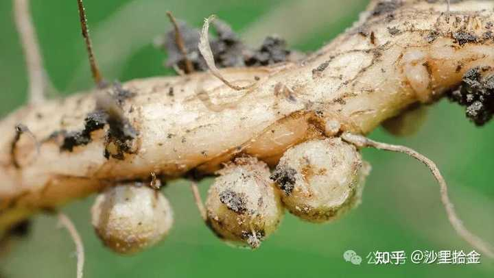

alt="Image">根瘤菌

因为有了这个大自然赋予的“外挂”，大豆在财务报表上，展现出了超强的抗压能力。

我们再次调取 USDA 官方数据进行横向对比：

- __种植一英亩大豆的运营成本__：193 到 268 美元
- __化肥总成本__：仅占总运营成本的 22%，四个作物里最低。
氮肥开销：占化肥总费用不到 8%，占总运营成本仅 1\.8%，几乎为零！

大豆在物理层面，几乎彻底剔除了“氮肥”这个随时可能失控的成本黑洞。虽然它比较依赖农药（20\.6%），但加上综合能源成本（8\.1%），三项总占比 30\.5%，依然是受能源价格变动直接影响最低的作物。

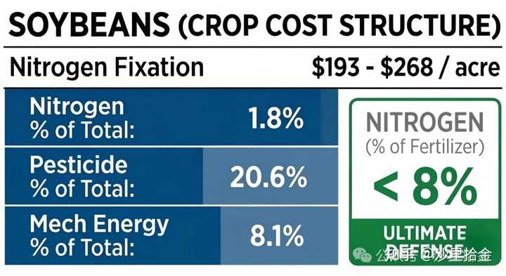

alt="Image">大豆每英亩总花费，氮肥，农药，燃料费用占比情况

在油价相对温和的年份，很多农场主觉得大豆单产绝对值偏低，种它不如种玉米的收入高。但如果油价真的一直维持在高位，大豆在底层的作物经济性上，就展现出了极强的防御属性。

### 6\. 终极博弈：全球出口版图与“国家能源底牌”的残酷对撞

高昂的能源账单不仅折磨农场主，更会在全球贸易版图上引发连锁反应。当核心出口国的“化肥对外依赖度”撞上“化石能源禀赋”，局势将变得无比残酷。

- __小麦的生死局__：俄罗斯作为全球最大小麦出口国，享有低廉的本土天然气和化肥内供价，形成了恐怖的壁垒；而欧洲农业区高度依赖进口天然气，其优质小麦产能可能被迫将市场份额让渡给掌握能源底牌的俄罗斯。

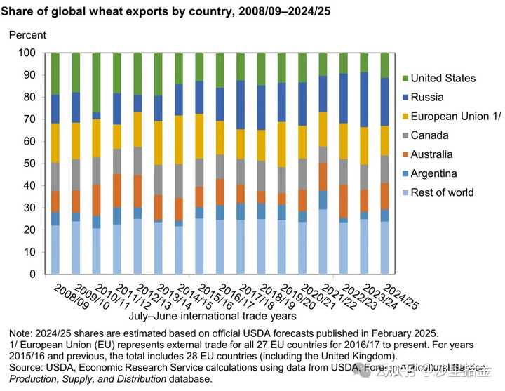

alt="Image">全球小麦出口国份额占比情况，俄罗斯排名第一

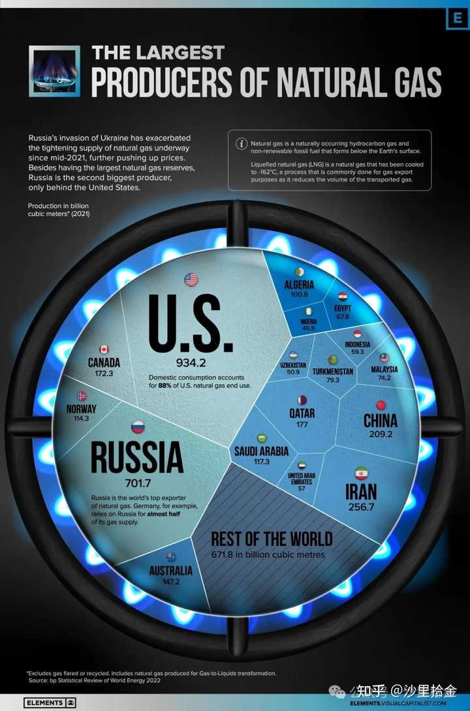

alt="Image">全球主要天然气生产国，俄罗斯排名第二

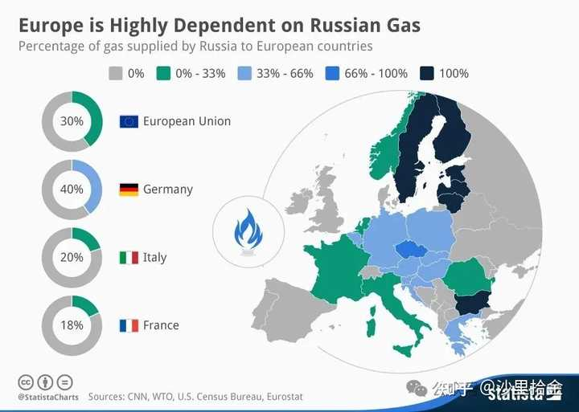

alt="Image">欧洲高度依赖进口俄罗斯天然气

- __美洲双雄的抉择__：

玉米和大豆这两大作物的出口命脉，高度集中在美国、巴西和阿根廷。作为全球农业出口霸主，美国依靠强大的页岩气革命，拥有极其强悍的本土氮肥制造能力，底盘相对稳固。但南美的农业巨头巴西，却存在一个致命的宏观软肋：巴西拥有广袤的耕地，但其所需的氮、磷、钾肥料，有高达 85% 的部分必须完全依赖跨洋进口。这意味着，南美的农业出口供应链，对全球能源和海运物流环境极其敏感。这就是典型的“第二重冲击”：一旦全球能源和化肥成本向上传导，不仅化肥的到岸成本会飙升，跨国海运的油费也会水涨船高。在这样的宏观压迫下，巴西国内极度消耗进口氮肥的“玉米”将承受极其沉重的成本挤压；而自带“生物固氮”物理外挂、几乎不需要氮肥的“大豆”，反而成为了巴西农场主在抵御输入性通胀时最坚实的避风港。这种国家级别的化肥依赖度，在特殊时期，可能会直接驱动南美大陆将更多的土地从玉米倒向大豆。__这种农作物面积的“结构性更替”趋势具有很强的前瞻价值。因为玉米是全球肉类养殖的底层饲料，当你观察到南美的化肥进口链条承压，导致农场主纷纷倒向大豆的时候，下游畜牧业会发生什么就不多说了。__

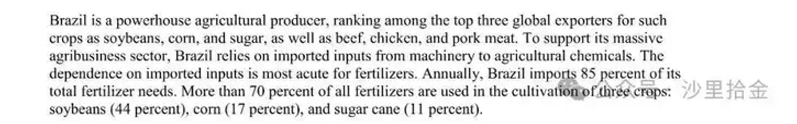

alt="Image">巴西每年化肥需求的85%来自进口

- __水稻的黑天鹅__：

大米的全球出口格局最为特殊，它高度集中在印度、泰国和越南等亚洲国家。这三个国家主导了全球绝大部分的大米流动性。结合资源禀赋来看，这三大核心出口国，全部都是典型的化石能源净进口国。我们前面算过，水稻是面临“高能耗化肥”与“高耗能灌溉烘干”双重考验的吞金兽。在能源平稳的周期里，亚洲各国可以通过庞大的财政支出，把昂贵的进口化肥和高昂的农业用电强行补贴掉，掩盖水稻真实的底层成本。但这也恰恰是最危险的第二重影响：一旦全球能源中枢长期维持在高位，这些能源进口国的农业财政就会面临被击穿的风险。为了优先保障本国上十亿人口的绝对口粮安全、防范物价失控，各大水稻出口国最理性的动作，就是通过关税、配额甚至直接叫停的方式，强行收紧大米的出口。到那时，国际大米市场的流动性就会面临极大的枯竭风险，其原有的价格体系也将不可避免地迎来剧烈的重塑。所以，水稻这类“纯口粮”的出口管制动作，很有可能就是能源危机后半段“黑天鹅”发生的征兆。

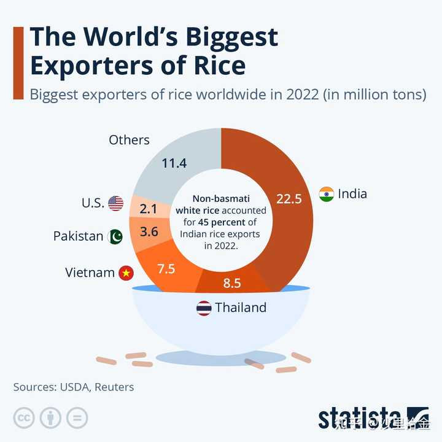

alt="Image">2022年全球最大的大米出口国

### 结语：农业的尽头，是化石能源的衍生品

穿透错综复杂的数据表格，剥开四大主粮的外衣，你会发现：__现代农业，本质上就是人类利用土地和植物，将“化石能源”转化为“碳水化合物”的工业生产过程。__

在未来，谁掌握了廉价的天然气和化肥，谁拥有更低能耗的农业基础设施，谁就能在四大碳水作物的全球竞争中，握有真正的主动权。

为了把农作物的逻辑盘透，这期视频我改了十几版文案，几乎把USDA的官方数据表翻了个底朝天。如果这期内容对你重新理解农作物有实质性的启发，还请点赞、关注，并分享给身边的朋友。你们的每一次互动，都是支持我持续输出的巨大动力。

更多行业深度分析，可以关注我的同名公众号：__沙里拾金__

\(免责声明提示：本文章所有内容均基于公开的农业产业链规律与宏观经济数据的逻辑拆解，旨在进行科普和个人研究分享，不构成任何具体的投资建议。\)
