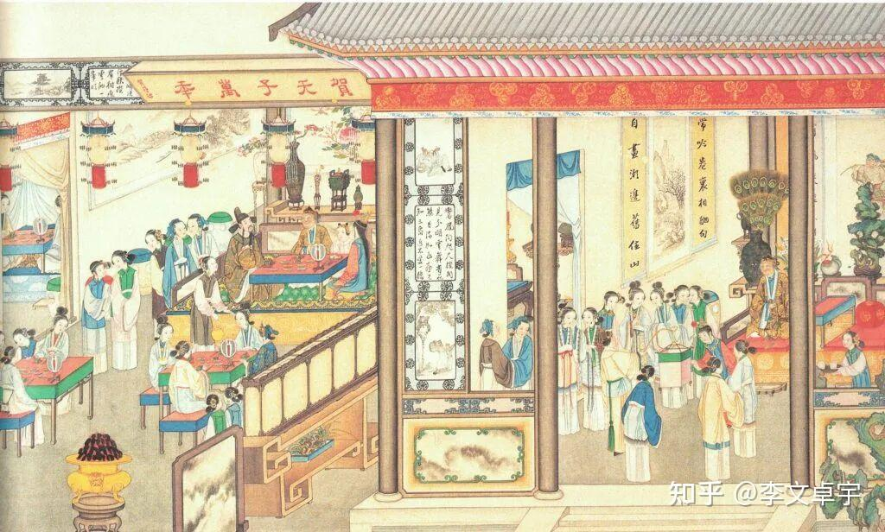
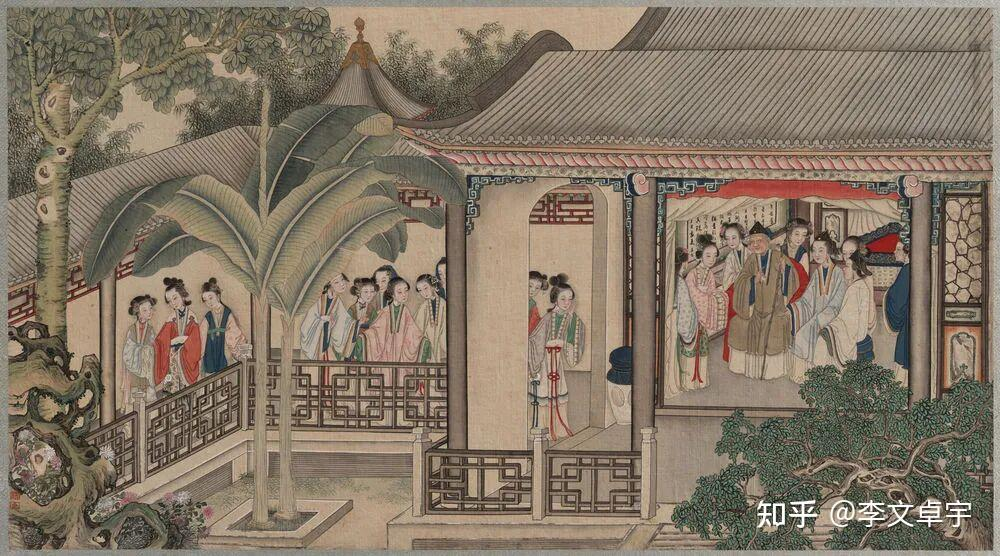
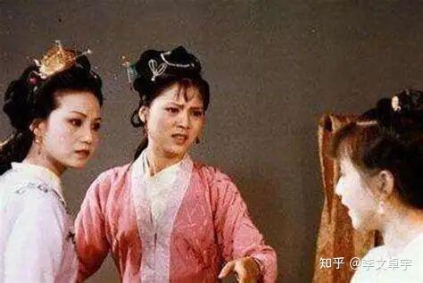
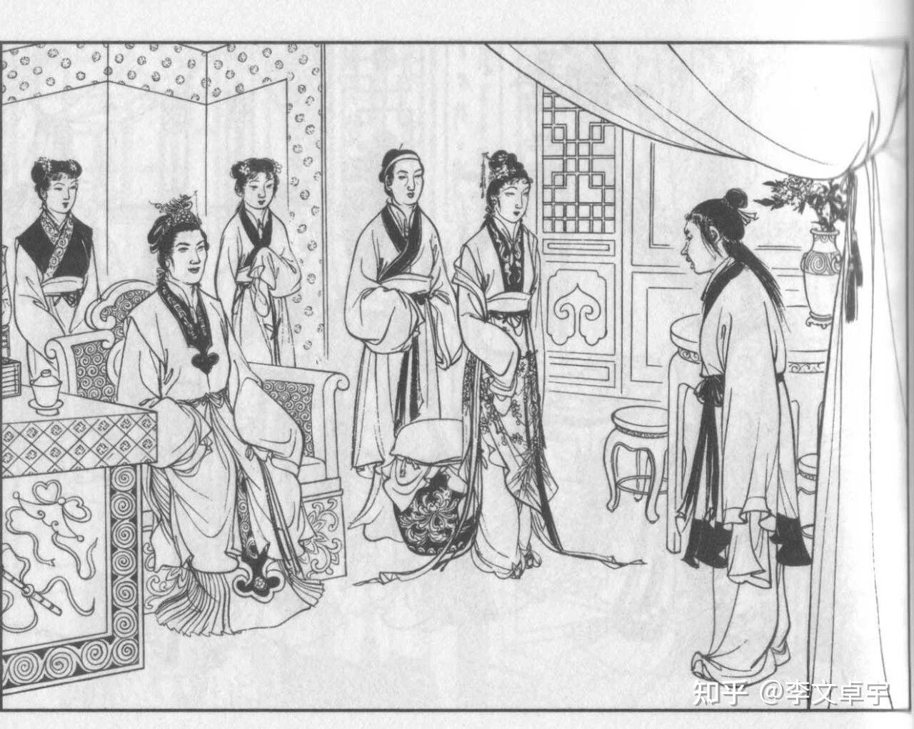
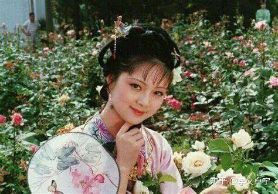
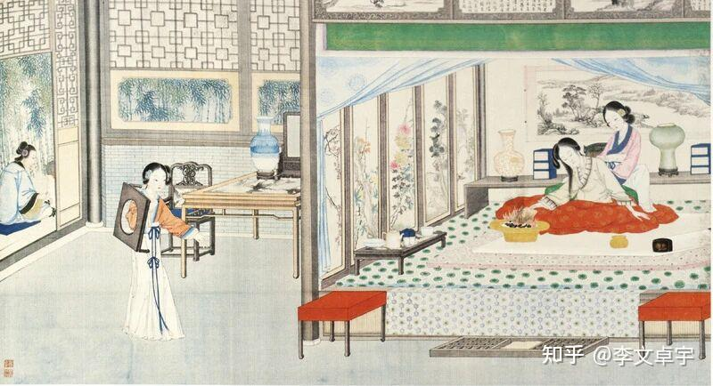
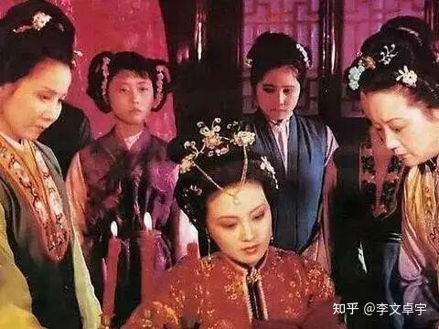
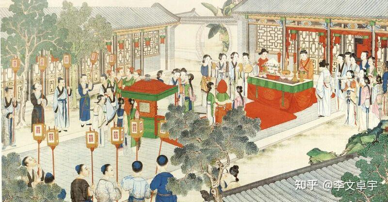

为什么《红楼梦》几乎没有宅斗，却比宫斗剧更残酷？

一顿平常的早饭。

老太太坐在上头，儿媳妇在旁边站着捧饭，孙媳妇连个座儿都没有，只能在一边端茶递水、布让菜肴。

底下伺候的丫鬟婆子站了一屋子，连咳嗽声都听不见一声。

大家都笑着，说着家常话。

空气里飘着胭脂和饭菜的香气，和和气气，其乐融融。

没有人在下毒，没有人在互相扇耳光，没有人在暗地里使绊子让人流产。

但在这一顿和气的早饭里，谁该站着，谁能坐着，谁吃什么，谁连看一眼的资格都没有，全在规矩里定得死死的。

真正的权力，从来不需要大声嘶吼。

它只让人乖乖低头。

今天我们打开各种屏幕，看满屏的“宫斗”、“宅斗”，看那些女人为了争夺一个男人的宠爱，或者为了家产，把打胎药下在燕窝里，把针藏在衣服里，互相算计，互相陷害。

最后主角靠着更狠毒的手段，把对手踩在脚下，观众大呼过瘾。

但如果你真的读懂了《红楼梦》，你会觉得现在的这些“斗”，简直像是小流氓在街头抢地盘。

那些靠投毒和陷害来运转的家族，早就被抄家灭族了。

真正庞大、古老、稳固的权力结构，是不屑于用这种下作手段的。

曹雪芹用最残酷的笔法，写了一部几乎没有正面“宅斗”的书。

他写的是，权力如何化作日常的呼吸。

在这个大家族里，权力不需要刀剑，它变成了一种叫“礼”的东西。

礼，就是秩序。

就是你在这个庞大机器里的位置。

你看赵姨娘。

她是书里唯一一个试图用现在那种“宅斗”手段来改变命运的人。

她找了个道婆，弄了几个纸人，写上生辰八字，扎上针，想把贾宝玉和王熙凤咒死。

结果呢？

书里对她这种行为，简直是当成笑话来写的。

在那个庞大而精密的权力系统里，赵姨娘的愤怒和反抗，显得那么滑稽，那么无力。

因为贾府的权力分配，不看你的手腕有多黑，看的是出身，是名分，是规矩。

赵姨娘是奴才出身的半个主子，她的儿子贾环是庶出。

就这一条，她这辈子就被钉死了。

她再怎么闹腾，老太太不待见她，王夫人拿捏她，连底下的丫鬟如芳官、芳官的干娘都能指着她的鼻子骂。

当权力结构彻底稳固的时候，底层的互相撕咬，在顶层看来只是一场闹剧。

这就引出了一个核心的问题：__如果不需要阴谋诡计，那这台机器是怎么杀人的？__

杀人不见血的，是“剥夺”。

在这个大宅门里，你的一切：你的吃穿、你的体面、你的社交圈，甚至你的生命权，都由这个系统发放。

金钏儿为什么跳井？

她没有犯什么大错。

只是在王夫人午睡的时候，跟宝玉说了两句轻浮的玩笑话。

王夫人醒来，反手一个巴掌，然后就说了一句话：“把你撵出去。”

金钏儿苦苦哀求，说自己在这个家里待了十几年，撵出去就没脸见人了。但王夫人还是把她赶走了。

几天后，金钏儿投了井。

没有人拿刀逼她。

但当系统宣布将你剥除，当你失去了在这个权力网络里的位置，你在那个时代，就等于失去了活着的合法性。

当你离开这张网，你就连呼吸的资格都没有了。

这就好比，你看着那个大观园，花团锦簇，姑娘们吟诗作对。

但那底下垫着的，是无数个被系统轻轻碾碎的生命。

晴雯被赶走，司棋被赶走，四儿被赶走……王夫人只是动了动嘴皮子。

所谓的“主子”，就是拥有随意支配他人命运的合法性。

而且，这种支配是以“道德”、“规矩”和“家风”的名义进行的。

这就非常有意思了。

当你把眼光放远一点，看看那些曾经辉煌后来崩塌的帝国，看看那些庞大的老旧组织，你会发现，它们到了晚期，都会出现同样一种症状。

当大盘不再增长的时候，内部的争夺就会变成对规矩的死磕。

贾府其实早就入不敷出了。

王熙凤要在外头放高利贷，要偷偷把老太太的东西拿去当铺换钱，才能发得出下人的月钱。

如果蛋糕还在变大，大家都有得吃，气氛总归是宽容的。

可是当钱越来越少，资源越来越紧张的时候，怎么办？

你不能承认是自己无能，不能承认是祖宗传下来的家业败了。

你只能开始“抓作风问题”。

于是有了著名的“抄检大观园”。

一个绣有春宫图的香囊被人捡到了。

这算多大的事？

在过去有钱有势的时候，这不过是主子们风流的谈资。

但现在不行了，王夫人觉得天塌了，必须彻查。

一群人浩浩荡荡地冲进那些十几岁女孩子的房间，翻箱倒柜。

名义上，是查伤风败俗的东西。实际上呢？

实际上，借着这次运动，王夫人清除了所有她看不顺眼的人。

更关键的是，紧接着这件事之后，贾府开始了大规模的“裁员”。

小戏子们被赶走，丫鬟被削减。

把经济上的破产，包装成道德上的整顿。

用清洗异己的方式，来完成削减开支的目的。

这种手法，你是不是觉得很熟悉？

当资源枯竭时，人们做的第一件事，往往是抢占道德制高点，然后把身边的人推下去。

这才是《红楼梦》最残酷的时代隐喻。

它没有写两军对垒的厮杀，也没有写朝堂之上的党伐。

它只写了一群亲戚，一群每天住在一个院子里，抬头不见低头见的人。

看他们吃螃蟹。

湘云张罗请客，但掏钱的是宝钗。

最好的螃蟹端上去，贾母吃两口，薛姨妈吃两口，剩下的给王夫人、凤姐。

少爷们坐在另一桌。

丫鬟们只能在底下吃主子赏下来的残羹冷炙。

表面上是诗意盎然的聚会，底下铺陈的全是等级、人情、资源的交换，和小心翼翼的逢迎。

在这个局里，没有人是自由的。

王熙凤大权在握，够风光了吧？

但她每天要算计几百口人的吃穿用度，要在婆婆和老祖宗之间走钢丝，生病了还要强撑着管事，最后活活把自己耗死。

贾政是名义上的当家人，但他只能端着封建大家长那副虚伪的架子，看着儿女受苦，看着家族烂掉，自己却毫无办法，只能一次次地去打宝玉，仿佛打儿子就能掩盖他面对整个时代崩塌时的无能为力。

在这个名为“规矩”的磨盘里，不论是底层的丫鬟，还是顶层的主子，全都被磨成了粉末。

为什么我们现在爱看那种爽文模式的“宅斗”？

因为那给了我们一种幻觉：__只要我足够聪明，只要我手段足够狠，我就能赢。__

我就能把属于我的东西夺回来，在这个世界里站稳脚跟。

那是一种对个人能力的极致迷信。

但曹雪芹不给你这种幻觉。

他摊开一本账簿告诉你：

__桌子是铁打的。__

__规则是写好的。__

权力系统一旦开始运转，所有的人都只是零件。

你不可能斗赢这个系统。

如果你觉得你赢了，那只是因为系统暂时还需要你。

事情为什么会走到那一步？

不是因为哪个人特别坏。

不是因为王夫人心狠手辣，也不是因为王熙凤贪得无厌。

是因为那个赖以生存的基础：__那个依靠土地收租、依靠世袭罔替、依靠压榨成百上千个奴仆来维持体面的系统，已经转不动了。__

它老了。

它在发烂。

但身在其中的人，不肯承认，也不能承认。

他们只能更加用力地维持表面的体面，更加苛刻地要求别人遵守规矩，用越来越残酷的内部倾轧，来掩盖对未来的巨大恐惧。

三百年前的大观园，早在一场大雪中化作了白茫茫一片。

但那些吃人的规矩，那些不见血的剥夺，那些在资源萎缩时互相挥舞的道德大棒，真的随着那个时代一起消失了吗？

这或许，就是为什么今天我们再翻开这本书，看到某个清晨那和和气气的一顿早饭时，依然会觉得后背发凉的原因。

故事先说到这里。

历史长河里的事情，本就不是一次能说得尽的。

有些线头，我们留着以后慢慢抽。
