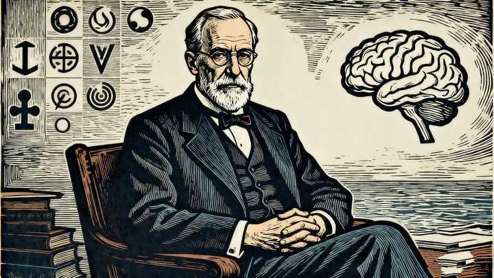

为什么世界三大饮料都是苦的？ \- 紫侠狼 的回答

可可、咖啡、茶。

这表面上是一个科学问题，但本质上是一个哲学问题。

因为：

凡是能让人爱上的东西，无一例外，都是让人受苦的东西。

因为人的快乐只有两种：

第一种是从零状态心情，上升更高；
第二种是从负状态心情，恢复正常。

我们可以称之为：“情绪落差效应”。

1. 落差为正，人就快乐；
2. 落差为负，人就痛苦；
3. 落差先负后正，人最快乐；
4. 落差先正后负，人最痛苦。

差别是什么呢？很简单。

第一种方式，情绪落差趋势是正向的，所以动物会很快适应，因为欲望会水涨船高，得陇望蜀，永远不会满足，所以不可持续。

这一现象在心理学中被称为享乐适应（hedonic adaptation），即个体对重复或持续的积极刺激逐渐产生耐受性，导致其主观幸福感回归基线水平 。

例如，在获得新财富、成就或物质奖励后，人们最初的愉悦感通常会在数周至数月内减弱，这种“幸福漂移”现象已被大量研究证实 。

神经科学研究进一步表明，多巴胺系统作为大脑奖赏回路的核心，主要响应的是奖励预测误差（reward prediction error），而非奖励本身。

当预期被超越时才会显著激活，而一旦事件变得可预测，多巴胺释放便迅速衰减 。因此，单纯追求正向刺激的行为注定难以持久。

第二种方式，情绪落差趋势是负向的，所以动物会一直享受，因为痛苦虽然随着积累也会有一定麻木度，但相对于快乐这种状态来说，是永远都能随时激活的，所以可以一直持续。

这一机制与行为强化理论中的“负强化”（negative reinforcement）密切相关。

什么意思呢？

当个体经历生理或心理上的不适（如戒断症状、焦虑、疼痛等），随后通过某种行为（如吸烟、饮酒、进食、运动）缓解该状态时，该行为便因“消除厌恶刺激”而被强化。

有研究表明，此类基于逃避痛苦的强化模式比单纯的正向奖励更能维持长期行为依从性。

也就是说，如果你想一辈子永远保持幸福感，追求快乐，是一条不可持续的窄路，因为情绪落差的趋势是“先正后负”；追求痛苦，反而是一条永远可持续的大路，因为情绪落差的趋势是“先负后正”。

你选哪一个？

其实，不只咖啡，可可和茶如此，任何事都如此。

吸烟，难道不是先让人痛苦，然后让人恢复正常吗？

喝酒，难道不是先让人痛苦，然后让人恢复正常吗？

钓鱼，难道不是先让人痛苦，然后让人恢复正常吗？

谈恋爱，难道不是先让人痛苦，然后让人恢复正常吗？

我们仔细想一想，能让人爱上的——事或物或人，哪一个不是先让你痛苦，然后让你恢复正常甚至上升到正面状态的？

跑步不是？

健身不是？

看书不是？

写作不是？

艺术创作不是？

徒步旅行不是？

出家和苦修不是？

通通都是，没有一个不是。

所有能让你爱上的东西，都总体上一直遵循“先负后正”的情绪落差趋势。

当然，让你痛苦的，你不一定会爱上。

因为还有个度的问题，和节奏问题。

但，你能爱上的，无论是人，是物，是事，一定是能持续带给你痛苦，然后在痛苦之后，不断地能让你恢复到正常状态，甚至上升到正面状态的东西。

你爱上的一切——或人或事或物，本质上都是一种斯德哥尔摩综合征的不同变形效应。

换而言之，你的爱，总体上一直遵循“先负后正，再负再正”的情绪落差趋势。

如果有一天，你之所爱，无法带给你痛苦的负面体验，只能带给你快乐的正面体验，那么，你就会变心。

你之所爱，无论是人，是物，是事，都如此。

这一点，在现代心理学中还有另一种概念支持。

例如，有一个概念叫心理韧性（resilience）。

说的是什么？

就是个体在面对逆境、创伤或重大压力后，如果能成功调适并恢复功能，反而可能实现“创伤后成长”（post\-traumatic growth） 。

但要注意，这个过程并非简单“回到原点”，而是通过克服挑战重建意义系统，获得更强的心理整合与生命满意度。

用塔勒布的话说，这叫反脆弱。

用尼采的话来说，这叫凡是杀不死我的，会使我更强大。

同样的道理，在动机心理学中，根据自我决定理论的研究，当一个人的基本心理需求（自主、胜任、归属）受到暂时挫折，但最终得以满足时，所引发的内在动机要远远强于无挑战情境下的被动参与。

所以说，这是一个哲学问题，快乐与痛苦，本是一体。

凡是能持续带给你痛苦的东西，一定也能持续地带给你快乐。

《道德经》说：万物负阴而抱阳，就是这个原理。

《周易》说：一阴一阳之谓道，也是这个原理。

所以，我们会发现，生活中最不幸的人，恰恰是那些一意孤行——执着于追求快乐的人。

心理学已经多项研究表明，过度追求即时愉悦（hedonic pursuit）与较低的生命意义感及更高的抑郁风险相关。

生活中最幸福的人，反而是那些能放下追逐，安静享受痛苦的人。

例如，正念训练（mindfulness）的核心理念之一便是，非评判地接纳当下体验，包括疼痛与不适。

研究发现，这类练习能显著增强个体对慢性疼痛的情绪调节能力，并改善整体主观幸福感。

最后，如果，你一辈子没有找到一件——能持续带给你痛苦，同时你又能“化忍受为享受”的——或人，或事，或物，那么，你将永远跟幸福绝缘。

alt="Image">

## 参考资料：

1\. Diener, E\. \(2000\)\. Subjective well\-being: The science of happiness and a proposal for a national index\. American Psychologist, 55\(1\), 34–43\. [https://doi\.org/10\.1037/0003\-066x\.55\.1\.34](https://link.zhihu.com/?target=https%3A//doi.org/10.1037/0003-066x.55.1.34)

2\. Bussière, C\., Sirven, N\., & Tessier, P\. \(2021\)\. Does ageing alter the contribution of health to subjective well\-being? Social Science & Medicine, 268, 113456\. [https://doi\.org/10\.1016/j\.socscimed\.2020\.113456](https://link.zhihu.com/?target=https%3A//doi.org/10.1016/j.socscimed.2020.113456)

3\. Martin\-Soelch, C\. \(2013\)\. Neuroadaptive Changes Associated with Smoking: Structural and Functional Neural Changes in Nicotine Dependence\. Brain Sciences, 3\(1\), 159–175\. [https://doi\.org/10\.3390/brainsci3010159](https://link.zhihu.com/?target=https%3A//doi.org/10.3390/brainsci3010159)

4\. Koob, G\. F\. \(2017\)\. Antireward, compulsivity, and addiction: seminal contributions of Dr\. Athina Markou to motivational dysregulation in addiction\. Psychopharmacology, 234\(3\), 401–414\. [https://doi\.org/10\.1007/s00213\-016\-4484\-6](https://link.zhihu.com/?target=https%3A//doi.org/10.1007/s00213-016-4484-6)

5\. Szabo, A\. \(2024\)\. Chasing a Phantom Dysfunction: A Position Paper on Current Methods in Exercise Addiction Research\. International Journal of Mental Health and Addiction\. Advance online publication\. [https://doi\.org/10\.1007/s11469\-024\-01372\-3](https://link.zhihu.com/?target=https%3A//doi.org/10.1007/s11469-024-01372-3)

6\. Goubert, L\., & Trompetter, H\. \(2017\)\. Towards a science and practice of resilience in the face of pain\. European Journal of Pain, 21\(7\), 1177–1187\. [https://doi\.org/10\.1002/ejp\.1062](https://link.zhihu.com/?target=https%3A//doi.org/10.1002/ejp.1062)

7\. Vaquero Solís, M\., Sánchez\-Miguel, P\. A\., Tapia Serrano, M\. Á\., Pulido, J\. J\., Iglesias Gallego, D\., & Pulido, J\. J\. \(2019\)\. Physical Activity as a Regulatory Variable between Adolescents’ Motivational Processes and Satisfaction with Life\. International Journal of Environmental Research and Public Health, 16\(15\), 2765\. [https://doi\.org/10\.3390/ijerph16152765](https://link.zhihu.com/?target=https%3A//doi.org/10.3390/ijerph16152765)

8\. Brown, K\. W\., & Ryan, R\. M\. \(2003\)\. The benefits of being present: Mindfulness and its role in psychological well\-being\. Journal of Personality and Social Psychology, 84\(4\), 822–848\. [https://doi\.org/10\.1037/0022\-3514\.84\.4\.822](https://link.zhihu.com/?target=https%3A//doi.org/10.1037/0022-3514.84.4.822)

9\. Cheng, C\., Lau, H\.\-P\. B\., & Chan, M\.\-P\. S\. \(2014\)\. Coping flexibility and psychological adjustment to stressful life changes: A meta\-analytic review\. Psychological Bulletin, 140\(6\), 1582–1607\. [https://doi\.org/10\.1037/a0037913](https://link.zhihu.com/?target=https%3A//doi.org/10.1037/a0037913)

10\. Deng, B\., Umoh, K\., Cao, Q\., Wang, X\., Fang, T\., Yang, Y\., Zhu, J\., & Liu, F\. \(2024\)\. The Role of Mindfulness Therapy in the Treatment of Chronic Pain\. Current Pain and Headache Reports, 28\(7\), 1284\-w\. [https://doi\.org/10\.1007/s11916\-024\-01284\-w](https://link.zhihu.com/?target=https%3A//doi.org/10.1007/s11916-024-01284-w)

11\. Zhang, M\., Lin, X\., Zhi, Y\., Mu, Y\., & Kong, Y\. \(2024\)\. The dual facilitatory and inhibitory effects of social pain on physical pain perception\. iScience, 27\(2\), 108951\. [https://doi\.org/10\.1016/j\.isci\.2024\.108951](https://link.zhihu.com/?target=https%3A//doi.org/10.1016/j.isci.2024.108951)

12\. Davidson, R\. J\., Jackson, D\. C\., & Kalin, N\. H\. \(2000\)\. Emotion, plasticity, context, and regulation: Perspectives from affective neuroscience\. Psychological Bulletin, 126\(6\), 890–909\. [https://doi\.org/10\.1037/0033\-2909\.126\.6\.890](https://link.zhihu.com/?target=https%3A//doi.org/10.1037/0033-2909.126.6.890)
