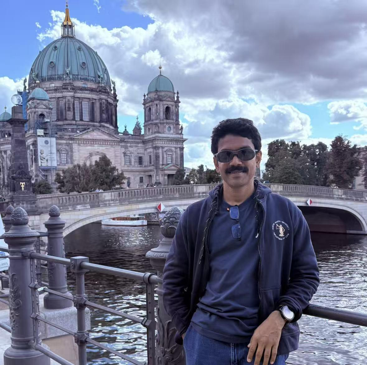

为什么世界名著大多是严肃文学？ \- 知乎用户 的回答

Prof\.Noman,ph\.D\.给儿子的一封信

亲爱的儿子：

也许有一天，你会疑惑：为什么你的父亲明明研究、教授的是食品法，却总把大量时间花在哲学、历史、心理学、物理学和文学上。

表面看来，这似乎毫无道理。

一个研究食品安全、消费者保护、监管制度、超加工食品以及农业体系的人，夜里却在读陀思妥耶夫斯基、叔本华、加缪、荣格、托尔斯泰，以及那些关于战争、文明、星辰与人类意识的书。

但也许，仅靠法律，从来不足以理解人。

因为我越是教授法律，越意识到：支配人类的，从来不只是法律。

还有恐惧、欲望、孤独、自尊、饥饿、爱情、群体认同、记忆与情绪。

一部法典，无法真正解释残忍。

一套规章，也无法真正解释贪婪。

而任何一种法律理论，都不足以说明：为什么聪明的人，依然会为了权力、意识形态，或他人的喝彩而彼此毁灭。

于是，我开始到别处寻找答案。

历史教会我：文明其实极其脆弱。

社会总是在换了衣服之后，重复同样的错误。

哲学教会我：智慧未必带来平静。有时，它只是让问题变得更深。

科学教会我谦卑。

宇宙浩瀚得超出人的理解，而人类所谓的“确定性”，往往渺小得可笑。

而文学——文学教会了我法律永远无法教会的东西：

一个人的心，是怎样悄无声息地碎掉的。

也许因此，我始终无法成为一个狭窄的学者。

即便我研究的是食品法，

我真正研究的，也从来不只是食物。

我研究的是人。

为什么有些家庭里，母亲总是最后一个吃饭；

为什么企业懂得操纵人的欲望；

为什么政府常常无法保护弱者；

为什么丰饶与饥饿能够同时存在。

每一条规章制度背后，

其实都藏着一个关于人性的故事。

后来，我渐渐明白了一件令人难受的事：

大多数人，并不是靠理性活着。

他们活在叙事里，活在情绪、身份认同、恐惧，以及那些看不见的伤口里。

而一旦明白这一点，你看世界的方式，也会改变。

你会变得不那么急于评判。

对“确定无疑”更加谨慎。

也会变得更安静一些。

有时，你甚至会与社会产生距离感——

因为你开始察觉：现代生活里，有太多东西只是表演。

人们表演成功。

表演道德。

表演愤怒。

表演自信。

可在所有这些喧闹之下，

大多数人真正拥有的，其实只是恐惧：

害怕自己微不足道，

害怕孤独，

害怕被遗忘。

你的父亲也是如此。

我生命中，也曾有一些时刻，对制度、对知识界，甚至对整个人类，都深感失望。

我看见浅薄的观点，因为时髦而流行；

看见喧哗的人变得有影响力，而真正深思的人，却悄无声息地消失。

我看见复杂的问题，输给了口号。

但即便如此，每天早晨，我仍旧走进教室。

不是因为我相信世界绝对理性、公正。

而是因为我知道：如果连真诚都彻底放弃，黑暗只会变得更深。

所以，我继续教书。

也许，真正的尊严，就是在看清世界并不完美之后，依然认真地完成自己的工作。

也因此，我希望你能够广泛地学习。

不要把自己困在单一学科里。

一个不懂历史的律师，会变得危险；

一个不懂哲学的科学家，会变得傲慢；

而一个不了解普通人痛苦的哲学家，则会脱离现实。

试着从更多窗口去理解这个世界。

还有一件事，你一定要记住：

知识本身，并不能拯救你。

名声不能。

甚至聪明，也不能。

但好奇心，也许能让你的灵魂保持活着。

而善良——那种安静、普通的善良——

也许能让你始终像一个“人”。

—— 爸爸

alt="Image">

英文原文如下：

My dearest son,

One day you may wonder why your father spent so much time reading philosophy, history, psychology, physics, literature—even though he taught and researched food law\.

On the surface, it probably made little sense\.

A man writes about food safety, consumer protection, regulation, ultra\-processed food, agricultural systems…

yet at night he reads Dostoevsky, Schopenhauer, Camus, Jung, Tolstoy, and books about wars, civilizations, stars, and human consciousness\.

But perhaps law alone was never enough to understand people\.

Because the more I taught law, the more I realized that human beings are not governed by law alone\.

They are governed by fear, ego, hunger, loneliness, pride, love, tribe, memory, and emotion\.

A statute cannot fully explain cruelty\.

A regulation cannot fully explain greed\.

And no legal theory alone can explain why intelligent people still destroy each other for power, ideology, or applause\.

So I kept searching elsewhere\.

History taught me how fragile civilizations are\.

How societies repeat the same mistakes wearing different clothes\.

Philosophy taught me that intelligence does not necessarily bring peace\.

Sometimes it only deepens the questions\.

Science taught me humility\.

The universe is vast beyond comprehension, and human certainty is often very small\.

And literature… literature taught me what law never could:

how a human heart breaks quietly\.

Perhaps that is why I could never become a narrow academic\.

Even when I researched food law, I was never only studying food\.

I was studying people\.

Why mothers eat last in some homes\.

Why corporations manipulate desire\.

Why governments fail to protect the weak\.

Why hunger exists beside abundance\.

Behind every regulation, there is a story about human nature\.

And slowly I understood something difficult:

Most people do not live entirely by reason\.

They live through narratives, emotions, identities, fears, and invisible wounds\.

That realization changes the way you see the world\.

You become slower to judge\.

More careful about certainty\.

A little quieter\.

Sometimes you even feel distant from society—

because you begin to notice how much of modern life is performance\.

People perform success\.

Perform morality\.

Perform outrage\.

Perform confidence\.

And yet, beneath all that noise, most people are simply afraid:

afraid of insignificance,

afraid of loneliness,

afraid of being forgotten\.

Including your father\.

There were times in my life when I felt deeply disappointed with institutions, with intellectual culture, even with humanity itself\.

I saw shallow ideas become popular because they were fashionable\.

I saw loud people become influential while thoughtful people disappeared quietly\.

I saw complexity lose to slogans\.

But still, every morning, I entered the classroom\.

Not because I believed the world was perfectly rational or fair\.

But because I believed abandoning sincerity completely would make the darkness worse\.

So I continued teaching\.

Perhaps that is what dignity really is:

continuing your work carefully, even after seeing the imperfections of the world\.

And maybe that is also why I wanted you to learn widely\.

Do not become trapped inside one discipline\.

A lawyer who never studies history becomes dangerous\.

A scientist who never studies philosophy becomes arrogant\.

A philosopher who never understands ordinary human suffering becomes detached from reality\.

Try to understand the world from many windows\.

And remember this carefully:

Knowledge alone will not save you\.

Fame will not save you\.

Even intelligence will not fully save you\.

But curiosity may keep your soul alive\.

And kindness—quiet, ordinary kindness—

may keep you human\.

— Dad\.

__在Substack上看到诺曼博士给儿子的一封信。__

__打动的我地方在于：一个人看过很多东西之后，依然努力保持诚恳。这种品质现在越来越稀缺了。__

__很多人文学者发展到最后，可能会滑向两个极端：__

__一、傲慢，用知识装备起一种优越感；__

__二、犬儒，对社会的一切发出冷笑。__

__他看到制度局限、知识界浮躁、社会性表演，人性软弱却依然对世界温柔以待。__

__他说“文学教会了我法律永远无法教会的东西：一个人的心，是怎样悄无声息地碎掉的。”__

__“如果连真诚都彻底放弃，黑暗只会变得更深。__
