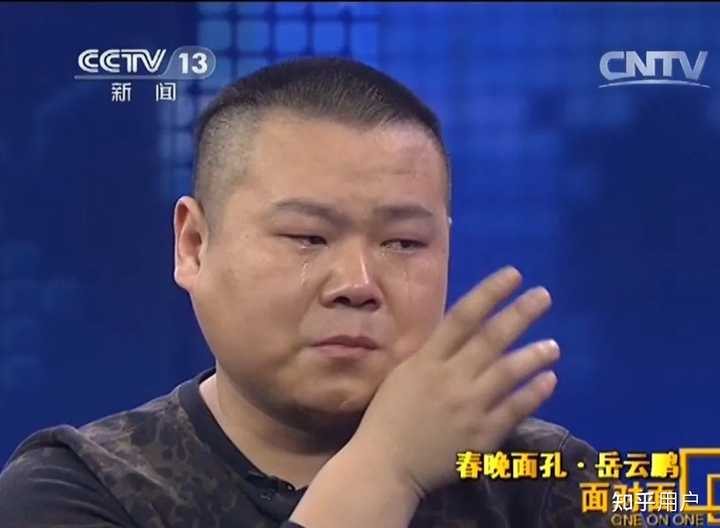

__问题描述：__

总觉得，我看到的网上的各种言论表现出了一种“在中国，说错了话做错了事，不论后果多小，都必须接受大家的批判”的感觉，不知道大家有什么头绪？难道真的是我一…

认识到中国的容错率极低，已经算是很不容易了

就在现在，隔壁还在开展人生是旷野的大庆祝活动

大谈什么人生的容错率极大

那么在他们那里，人生是什么样的旷野呢？为什么在他们的视角里面，人生的容错率极大呢？

哦，原来是部分人发现，在现今社会，很轻易的就能够保证自己饿不死，

这个认识让他们深深的感觉到如释重负，感到欢快，感到喜悦，感到自由

甚至想在大草原上，狂奔

人之有大患在不知足，知足常乐，我也替他们高兴

但是，从逻辑上讲，他们在认识到这个真理之前，显然是处在不努力就会饿死的这种死亡焦虑的认识之中

一个现代化的工业国家的正常年轻人，竟然有这样的焦虑

你说这个国家的容错率，得多么低？

说容错率，似乎也不太恰当

因为错，本身就是有消极评价的意思

我们首先得给错下一个定义，才能谈及容错率，

__所谓错就是客观上能够避免，但是因为主观上的松懈或者疏忽大意没能避免，以至于造成了一定恶果的行为__

故而，长得丑，不是错；衰老也不是错；先天或者后天的残疾不是错，性别不是错；民族不是错；出生的户籍更不是错；爱吃大蒜不是错；爱喝咖啡不是错；喜欢异域情调不是错；喜爱旅游不是错；要求八小时工作制不是错；考学没考好不是错（考不好的永远是大多数）；专业选择错误了不是错（你又不是先知）；被人感情欺骗也不是错；没有经验无法很好的处理工作仍旧不是错

由于情况复杂，在经过万般努力下，仍旧失败，不是错

虽然经过努力，但是客户就是不签单，不是错

客观条件变化，导致投资失败，还不是错

家贫失学，为了减轻家庭负担，自愿辍学，这不叫错，这叫孝子

游荡了十年，忽然想洗心革面，这不是错，在古代叫浪子回头

然而，就是面对这些不是错

中国社会，会宽容么？

他们绝不会宽容

甚至大谈什么人生是旷野的人自己都不宽容

比如说吧，我说中国社会的人生容错率极低，就有很多人说

“山东人确实是这么认为的”

“请注意IP”

“那边的人都这么样子”

“这是一种何等精神病的逻辑！也就那个地方的人能够想出来”

好极了，口口声声说中国是一个容错率极高的旷野的人，缘何非要揪住我住在山东这件事不撒手呢？

难道生在山东也是一种错么？

住在山东当然不是错

但是他们就能够在这个不是错的事情上建立谴责语气

仿佛这是不得了的错

很正常的事情，他们都容不了，不是错都容不了

那么你觉得，这些大谈人生是旷野的人，在你犯错的时候，会容得了你么

他们容不下你的

因为在他们那里，保证你饿不死就算是人生是旷野了

难道不是么？

我们中国的普通人，谈什么容错率，都有点奢侈了

事实上大多数的我们都处在，人为刀俎我为鱼肉的地步，是欲加之罪何患无辞的受害者

你越是一个普通人，就越有人要冤枉你，怪罪你

只要你处在被挑选的位置，处在渴求资源的位置，不要说什么错了

你只要不是符合优中选优的条件

那么你就完了

什么叫优中选优，就是可供挑拣的符合要求的对象很多，所以可以放心大胆的吹毛求疵了

什么叫吹毛求疵，就是预备要冤枉你了

怎么冤枉你？明明你也符合条件，但是他们会嫌弃你长的丑，老，是本地人（或者是外地人），本硕专业不一致，本科不是一流大学，延期毕业一年，论文写的不够好，哦，对了，还不愿意加班

上面这些事，你做错了什么？

你啥也没做错啊，但是不好意思，不要你

这不是容错率低，是被冤枉率高

甚至这都算是好的了，因为好歹也是一种符合社会主流的歧视

有的就是一个表演性质的面试，你来的唯一目的就是陪跑

他们为了拒绝你，甚至能够发出各种匪夷所思的评价

“太年轻了，不稳重”

“太漂亮了，不踏实”

“你的学历太好，和我们的匹配度不高”

反正人嘴两张皮咋说咋有理，把你的优点包装成缺点，然后用指责过错的口吻来批评，很难么？

一点不难

甚至于，很多人，很多认为人生是旷野的人，也把自己没考上好大学当成了人生的过错了

拜托，只要是考试，就是正态分布，大多数人都不会考好的

这不是错，因为这也是你努力的成果

说中国容错率低，并不确实，因为大多数人，连犯错的资格都没有

他们就算是没错，也会受到负面评价

什么，当一个普通人？

普通人无时无刻不在被冤枉的状况，你可曾见过，被压掉了手指头的工人，反而被老板索赔五千块钱

理由是他的受伤，妨碍了整个工程进度？

我见过

一个人，一旦混入了底层，那么就中国的这个社会氛围，所有自认为高他一等的人

都可以来冤枉他了

少拖一遍地，少洗一遍碗，没有笑脸，说话说错了话，甚至上错一道菜，记错两瓶啤酒

都是不得了的事情，是可以难为死你的

alt="Image">

难道岳云鹏，不就是因为把三号桌的两瓶啤酒记到五号桌上

被顾客辱骂了三个小时么？

alt="Image">

alt="Image">

岳云鹏说，我给你打五折，客人继续辱骂

岳云鹏说，我给你免单，客人才骂骂咧咧的离开

然后岳云鹏自掏腰包，三百五十八块，替客人结的账

然后最有趣的事情来了，当天晚上，替饭店掏了三百五十八的岳云鹏，被饭店开除了

你们所说的容错率在哪里呢？

岳云鹏没有伤害顾客，没有伤害饭店，甚至于可以说，顾客就靠着两瓶啤酒白吃了他一顿饭

顾客还赚了呢

你看他发疯，其实是撒酒疯，捏着岳云鹏的错，撒气

把岳云鹏当免费的情绪垃圾桶

然而呢？他在人格上被羞辱，在金钱上被掠夺，甚至于连在北京安身立命的工作都没有了

岳云鹏是什么人啊，是一个情商很高的人

但是就是这么一个情商很高的人，在他落魄的时候，在他是一个普通人的时候，社会给他什么容错率了么？

一点错都不许犯

六块钱的错误就能够毁了他

至于中国社会容错率为什么这么低

那可真就复杂了

描述一件事是很困难的，但是分析成因则更困难

但是我愿意试一试

中国社会为什么社会容错率低

从最浅表的程度分析

中国的社会容错率低，是因为僧多粥少，在人力市场上是买方市场

所以雇佣方也好，资源提供方也好，大可以随意压价

在高度发达的商品经济社会，人也是一种资源啊，叫人力资源

想当初，并没有什么人力资源之说，有的是人事部

后来，改良了，把人事部改成了人力资源部，一群傻乎乎的人还拍手叫好

说什么是对人的尊重

都从人，变物了

尊重何来呢？

不过人力资源四字，却是很诚恳的。

既然是资源，那就要讲经济规律

什么规律，就是供需平衡理论，人力资源既然供大于求，怎么可能会值钱？

不可能会值钱的

但是这种分析就流于浅表了

因为，如果是僧多粥少，那么佛法最深或者化缘水平最高的老和尚，经过努力，也能喝到粥

比如说下面这个人

alt="Image">

说起这位老先生，早年可真是倒霉透顶的人

年纪轻轻，就因为家庭贫困，辍学了

在工地上当小工，手指头都压断了

成了残疾人

在和中国一样的东亚文化圈里，追求绩优主义

压力很大

但是，这位老先生，通过努力，先是过了司法考试，成了佛法高深的和尚，后来又经过努力成了主持分粥的老和尚

努力是有用的，只要成为佛法高深的老和尚，就能够在众多僧人中脱颖而出

甚至能够成为分粥的主持和尚

可是这种情况，你在中国社会能够发现么？你发现不了

所有的成功人士都有三个字：幸运儿

不是幸运儿，那是不能成功的，这群幸运儿，不要说什么辍学，什么工伤残了

甚至连一年都没耽误过，每一步都卡在点上

这说明什么？说明中国根本就没有容错率

不存在什么浪子回头，也不存在什么发愤图强，更不存在什么大器晚成

你的不幸怎么样也成不了激励你前进的动力，只会成为绞死你的绳索

他们是在利用你的不幸在筛选你

李老先生这号人物，在中国可能连个实习的律师事务所都找不到

那么真实的原因是什么呢？

我认为真实的原因是这样的

__中国是一个极度的风险厌恶型社会，__

资源分配者，厌恶一切的风险

所以他们倾向于挑选幸运儿，因为在履历上幸运儿是断然没有过任何风险记录的

同时基于这种风险厌恶的立场，不幸，被污名化了

看看人力小姐对三十多岁还在求职的人的评价吧，这些可怜的求职者被认为不是合格的劳动者

因为有十年工龄的合格的劳动者，不需要投简历，一定会有人推荐他

而无人推荐只能证明这个三十多岁的求职者能力低下

你看，在整个推论当中，除了这个人三十五岁，还在找工作是真的，剩下的全是推论甚至是偏见

这就是不幸的污名化啊！

和不幸的污名化成硬币反面的是幸运光环

一个人，只要他足够幸运，中国人就能够给他这种幸运找到配得上的美德

在中国人的语境下，没走到穷途末路的西门庆

会是一个杀伐果断，具有人格魅力和经营头脑，体魄强健，充满了野性魅力的男人

然而事实上是什么呢？他其实就是一个恶棍，不过略微有人性罢了

不要觉得荒诞，只要你有钱，那么你的不务正业是松弛感，你的没溜儿是不与社会流俗同流合污，你乱搞男女关系是浪漫，你和你那些不着调的狐朋狗友吃吃喝喝是重感情

甚至实在是找不到夸你的地方，他们还会说

“人家祖宗积了阴德”

大家都是中国人，难道不是么？

而且，选择幸运儿，会给资源分配者一种心理暗示，让他感觉一切尽在掌握中

能够满足他的控制欲

你让李方丈这样的人当员工，老板是很害怕的

一来他家境贫寒，在我们国家，这是基因不好的象征，二来他受过工伤，这充分证明他干事情不专心，第三，他半路出家学了法律\.\.\.\.\.\.这证明他不安分，有野心；第四他年纪大了，有可能会猝死在岗位上

能在隔壁庙里当主持的老和尚，在咱们这里，可能连剃度出家的资格都没有

他们只会要什么人呢？那种清清爽爽，二十三岁，毕业那年拿到文凭，家境不错，谈吐得体

这辈子最困难的事情最好只限于中高考、司法考试还有驾照考试

他们爱这种人，因为这种人能够给他们提供安全感

然而，风险厌恶型的社会，是有代价的

最大的代价，就是全社会的活力不足

既然不幸总会被笼罩上对人格的的否定，索性大家都在轨道上运行，不敢越雷池一步

在这种情况下，社会怎么可能能够诞生新的技术？怎么可能培育出新的人才

无非是一个个向上管理的天才罢了

只要参与社会实践就有失败的风险，那么索性大家都当演员

管理人员是在表演管理，销售人员是在表演销售，生产人员是在表演生产，大家都表演

这样最没风险

有的企业别看大，其实就是一个没了脑袋只剩下腔子的青蛙

其运行不过是在生物电的刺激下抖动

然而，这样做的后果是被淘汰，缺乏创新能力，中国人总是在躲避风险的路上迎头撞上风险

这真是一种绝妙的讽刺啊！

第二个代价是人的彻底工具化

什么东西不允许犯错？

工具

你不可能不扔掉一个刻度不准的尺子

所以容错率越低，人的工具性就越高

人非工具，但是非得让他工具化也不是不可以，其代价就是不会爱自己，被外在的规训所控制

对了，说起来了，不知道大家上学这么多年，有没有被人教育过爱自己

反正我是没有，我是看书自学才知道的

原来自己爱自己，不仅不是可耻的，还是人类主体性的高贵显示

一个人只有高扬主体性，才能有所作为

一个自己都不爱自己的人，他也不会按照规训去爱别的人

但是很遗憾，由于中国社会的风险厌恶，所有能够获得资源的人都是工具性十足的人

我们称呼他们为精致的利己主义者

什么叫精致的利己主义者，就是没有人格，只有一个时刻准备按照社会要求去变化的躯壳

而这个没有人格的躯壳，不过是一个空壳罢了

他没有真是的爱恨情仇，只是一个可怜的伪人

欢呼于轻易饿不死，而大喊人生是旷野的，就是这种伪人

一个人得工具化到什么程度，才会以饿不死为最高追求？

工具必须要人来运用，当你自甘为工具的时候，你就把自己的所有前途寄托到他人身上了

你的大脑空空如也

所以我们可以看到，中国的年轻男子，要不是被老板骗，要不是被女朋友骗，要不是被老丈人骗

他们付出很多，但是得到的却很少

最后甚至要身败名裂

怎么办呢？

唯有个人的精神解放

百分之九十九的人，注定不是幸运儿

所以配合筛选幸运儿的话语体系，其实给不了你任何的好处

你已经被出局了，还在这里想出局的原因

不可笑么？

容错率高也好，低也罢，和你都没关系了

随着你年岁的增长，一扇扇大门对你关闭

到最后，他是给不了你任何出路的

既然给不了你任何的好处，那么你为什么要接受它的规训呢？

别人，那些幸运儿接受规训当工具，是能够获得高官厚禄的，你接受规训，什么也得不到啊

这个时候，你需要做的就是重建自己的话语体系

这个工作是非常复杂的

但是第一步却很明确，是什么呢？

爱自己

为什么是爱自己

别人对你的评头论足就是在否定你作为人的价值，而是在权衡你的工具属性

你如果对别人对你的评头论足认可，等于说是承认了自己的工具属性

并把自己彻底的物化成了他人的工具

一个人成为另一个人的工具，或者另一伙人的工具

那就是精神上的奴隶

故而，为了真正的自由，我们要爱自己

我们爱的自己是作为人的自己

不是爱自己的缺点，而是在认可自己的前提下概括的自我热爱

不是爱缺点，而是把缺点作为自己人格和社会规训的摩擦看待

直爽的人，必然冒失，冒失是社会层面的缺点，但是就人格上看，冒失是直爽的性格的必然

没必要憎恨必然的事情

你首先得爱自己，你的主体人格才会复苏

不需要你爱这个，爱那个，你先爱自己，自爱

你思考问题不要站在：别人会怎么样想这个角度

而是要站在：如此我会有何得失

故而，你不要被社会裹挟去干一些违心的事情，比如手头紧那就不给女朋友送礼，比如觉得房子要降价就顶住老丈人的压力不去买，女朋友要和你分，那就分，犯不上为了她高兴搭上自己这辈子

觉得这个工作干的不愉快那就暗地里准备换工作，觉得这个人讨厌，那就不来往

觉得什么事情大有前途，就去研究，研究好了就干，算好失败成本

只要承受的住，男儿落子无悔

承受不住了，就果断回撤

你也不要陷入内耗，人家是优中选优，就是奔着冤枉你来的

欲加之罪何患无辞

你就是天使，人家也能找你点不足，比如说你长的是白羽毛，他觉得黑的更帅

奋斗也不是为了实现什么社会价值，而是自己的人生价值

因为有了钱，就可以吃自己想吃的东西，穿自己想穿的衣服，开自己想开的车

有了社会地位，就可以不会为了六块钱啤酒挨欺负

至于容错率，社会的容错率永远是极低的

但是你可以给自己一个高的容错率啊！

只要你尝试的成本是可控的，只要你尝试的策略是正确的，你就有接近无限的容错率

在这种情况下，只要你坚持尝试，那么你一定会成功

就连电话营销这么荒诞的尝试，都总能瞎猫碰上死耗子

假冒秦始皇都能骗到钱

你合法经营，诚信谋生，又学了一大堆办法，为什么不自信

到这一步，你的人生才是旷野。

能够知道自己大概饿不死，不叫什么旷野

翻越社会规训的藩篱，才能见到真正的旷野

那么这样的人会是一个自私的人么？

绝不会，他是一个真实的人

他对别人的爱不是基于社会要求我爱他们

而是基于我认为我应该热爱他们

他的爱是建立在扬弃规训基础上的，是一种更高形式的热爱

所以这种热爱是人作为群居动物的本性的展开，是有根源的

而绝非是对社会规则的恐惧

是自然而然的

当然，这就扯得多少有点远

总之吧

先爱自己，吃一顿平时舍不得吃的好饭，再从长计议

毕竟最大的自驱力是热爱自己，你唯有在热爱自己的过程中才能成为自己

才能在自己的身上，克服这个时代

你唯有爱自己，才有勇气蔑视他们

而不是欢喜赞叹，自己哪怕被他们抛弃了也不会饿死。

这种话，就连二百年前的黑奴，都羞于启齿
