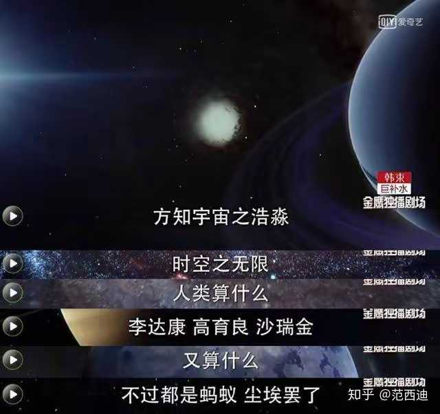

为什么人民的名义中孙连城的风评正逐渐变好了？ \- 范西迪 的回答

我在很小很小的时候看《封神演义》，就觉得一个事情蛮有趣。

纣王因为对着女娲娘娘的塑像YY，讲黄段子；惹怒了女娲。

女娲娘娘命妲己为首的三位狐妖，迷惑纣王；纣王最终惨败，商朝灭亡，自焚于鹿台。

狐妖向女娲复命。

女娲却让姜子牙把狐妖处置了。

狐妖不满，辩解道：“昔日是娘娘用招妖旛招小妖去朝歌，潜入宫禁，迷惑纣王，使他不行正道，断送他的天下。小畜奉命，百事逢迎，去其左右，令彼将天下断送。今已垂亡，正欲覆娘娘钧旨，不期被杨戬等追袭，路遇娘娘圣驾，尚望娘娘救护，娘娘反将小畜缚去，见姜子牙发落，不是娘娘‘出乎反乎’了？望娘娘上裁。”

女娲斥责：“__吾使你断送殷受天下，原是合上天气数；岂意你无端造业，残贼生灵，屠毒忠烈，惨恶异常，大拂上天好生之仁。今日你罪恶贯盈，理宜正法。__”

我觉得女娲很可耻。我让你“迷惑纣王”，没让你残害忠良啊！

合着说来说去都是你有理。

等被社会毒打后，才发现，原来这是一种管理智慧， 一种格局观。

alt="Image">

套到李达康和丁义珍、孙连城这儿就更明显了。

李达康说，要发展GDP。

李达康特点过于鲜明：只下任务，不想方法，永不背锅。

丁义珍用心搞了，也发展了GDP。当然了，因为种种原因，他不得不违规干点啥事，这是时代决定的；此外无利不起早，他自己捞了很多好处。

等到丁义珍事发了，李达康堂而皇之说，丁义珍搞的事情，我不知道，我爱惜羽毛。

只是丁义珍带来的GDP，就是李达康的功劳了。

李达康像女娲娘娘一样：我只是让你发展GDP，没让你违规，没让你贪污啊。丁义珍就成了“妲己”了。

alt="Image">

奈何孙连城太清楚李达康尿性了，他没有贪污，所以抓他小辫子找不着。

但李达康同志向孙连城PUA，你要“一地两卖”，丁义珍签的合同全部不认（当时丁义珍的案子可还没有定案）；你要向大风厂提供工业用地；你要改造信访窗口。

至于用钱？这不是我该想的事情，你孙连城是干什么的。

说白了，要你违规，而我李达康什么都不知道。

奈何孙连城看清了李达康的“格局”，不做妲己，让李达康当不成女娲娘娘。

最终换来了李达康公报私仇，但孙连城却平安落地。

当人民群众被太多“李达康”毒打后，孙连城的名声自然好了。

alt="Image">
