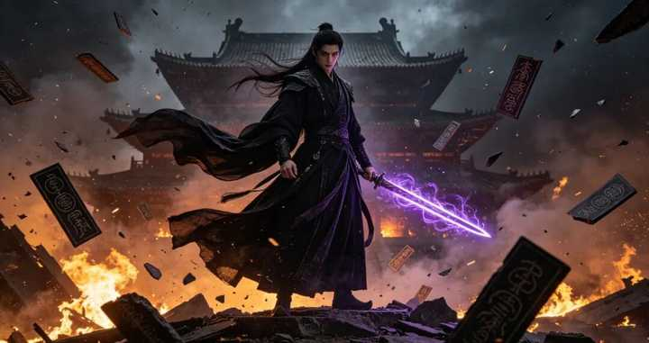

为什么修仙取代了武侠? \- 青简说史 的回答

如果是说修仙高武、武侠低武所以修仙流行，那像风云这样的玄幻武侠就不是高武？

alt="Image">

在文化圈，有一个显著的演变趋势：武侠已死，修仙赢了。

回想一下，这几年市面上，还有几部能打的武侠剧、武侠小说？

金庸古龙的翻拍剧播一部扑一部，大家连骂的兴致都没了。

相反，那些动辄几百万字，主角一路杀伐果断的修仙网文，以及改编的动漫影视剧。

却赚得盆满钵满，成了无数年轻人的精神毒药，和多巴胺提取机。

为什么？

如果你去问一个普通的读者，他大概率会告诉你：

“因为修仙的战斗力设定更高，武侠再牛也就降龙十八掌打碎一块大石头，修仙动不动就御剑飞行、捉星拿月、打爆星球，看起来更爽、更刺激嘛！”

但这个答案，连修仙和武侠的皮毛都没摸到。

武侠没落、修仙崛起的真正本质，根本不是什么“力量体系的高低”。

修仙之所以能干掉武侠，是因为修仙把“江湖”这个东西，给彻底杀了。

武侠，是一群人的戏，而修仙，是一个人的单机游戏。

修仙取代武侠这件事，无意中扒开了现代人心理，最深处的一条遮羞布。

现在的年轻人，越来越不想要“江湖”了。

大家不想要师门传承，不想要帮派义气，不想要恩怨情仇，甚至连儿女情长都不想要了。

大家潜意识里唯一的渴望，就是一个人安安静静地，疯狂变强，然后离开这个狗日的世界。

一、一张你武功再高，也挣脱不开的“人情罗网”

要弄明白，我们为什么抛弃武侠。

首先得搞清楚：到底什么是“江湖”？

很多人以为，有剑、有酒、有客栈的地方就是江湖。

错，有人的地方才是江湖。

所谓“江湖”，本质上是一张由人情、恩怨、规矩、道德编织而成的，紧密的“社会关系网”。

在武侠的世界里，“人和人的关系”才是故事的绝对核心，武功只是推动关系的工具。

在这个罗网里，你作为一个武侠主角，一出生就被赋予无数的社会标签，和人情羁绊。

你是某某门派的弟子，你就有义务尊师重道、替门派争光。

你认了某人为大哥，你就有义务两肋插刀、同生共死。

你遇到一个红颜知己，你就有义务保护她一辈子。

武侠的悲剧内核在于，你的武功再高，你也跑不出这张网，你的力量越强，这张网赋予你的道德责任，和人情枷锁就越沉重。

我们来看看金庸笔下，武功最高、最让人意难平的悲剧英雄，乔峰（萧峰）。

乔峰的武功高不高？降龙十八掌天下无敌，聚贤庄大战群雄，少室山一挑三。

按理说，这种战力在武侠世界里，应该活得极其潇洒。

但乔峰活得好吗？他活得简直生不如死。

为什么？因为他被“江湖”这张网，死死勒住了脖子。

他是契丹人（血统网），却被汉人抚养长大（养育网），他是丐帮帮主（门派网），却被天下英雄误解（舆论网）。

他深爱阿朱（情网），却亲手打死了她，他不想打仗，却被辽国皇帝逼着南下（国家君臣网）。

当这些互相冲突的人情、恩怨、规矩像巨浪一样拍过来的时候，乔峰那天下无敌的降龙十八掌，竟然打不碎任何一个枷锁。

最后，这位顶天立地的大侠，只能选择将断箭插进自己的胸膛，用毁灭肉体的方式，来求解脱。

还有郭靖，武功绝顶，却只能把自己困在襄阳城，最后一家人战死沙场（侠之大者，为国为民）。

哪怕是号称最向往自由的令狐冲，武功大成后，依然要面对师娘的自刎、师父的背叛、小师妹的惨死，依然要在正邪两派的夹缝中痛不欲生。

看懂了吗？武侠的底层逻辑，就是“妥协”与“牵绊”。

在武侠的世界里，没有绝对的爽文。

因为只要你还身处江湖，只要你还讲究“恩义”二字，你就永远是一个，被无数根丝线提着走的木偶。

你的一生，注定要在无穷无尽的世故人情中，消耗殆尽。

二、为了成道，必须“杀掉”江湖

理解了武侠的重，我们再来看看修仙的轻。

很多人看修仙小说，以为就是加上法术和法宝的武侠，这是严重的误判。

修仙与武侠，在哲学内核上，是完全对立的两种价值观。

修仙的底层逻辑，是极致的“个人主义”与“社达（社会达尔文主义）生存论”。

在纯正的修仙体系（以《凡人修仙传》等为代表）中，故事的核心不再是“人与人的关系”，而是“人与资源（天地灵气）的关系”。

在修仙世界里，没有所谓的“江湖规矩”，更没有武侠里那种，温情脉脉的“恩怨情仇”。

取而代之的是一个，极其冷酷的词“因果（羁绊）”。

修仙的终极目标是什么？是“得道飞升”，是实现生命层次的跃迁，是获得永生。

但是，天地不仁，大道无情。

在修仙的哲学里，你要想飞升，身上就绝不能背负太多的“因果”。

如果你欠了别人的人情，如果你被俗世的爱情牵绊，如果你深陷门派的恩怨，你的道心就会蒙尘，你就会在渡劫的时候，被天雷劈得魂飞魄散。

所以，修仙取代武侠的核心手段，就是从制度上和心理上，“杀掉”了传统意义上的江湖。

在武侠里，门派是家，师傅是父亲，师兄弟是手足，比如武当七侠，那是真能为了兄弟去死的。

但在修仙小说里，宗门是什么？宗门就是一个等级森严、极度内卷的“跨国公司”。

修仙者加入宗门，不是为了找归属感，而是为了“刷KPI获取修炼资源（灵石、功法）”。

师傅收徒弟，往往是为了拿徒弟当炉鼎、当炮灰。

同门师兄弟为抢夺一颗筑基丹，可以毫不犹豫地，在秘境里互相捅刀子。

大家都是打工人，你跟我谈什么门派忠诚？一旦这个宗门被灭，主角拍拍屁股换个宗门继续打工，毫无心理负担。

而武侠里遇到仇人或者恩怨，往往纠结半天，因为涉及到亲戚的亲戚、门派的面子、江湖的规矩。

修仙世界怎么解决冲突？“杀人夺宝，毁尸灭迹，搜魂炼魄，挫骨扬灰”。

修仙主角遇到挡道的，绝不逼逼赖赖，绝不搞什么江湖调解。

只要我的境界比你高（哪怕只是高一个小境界），我就可以对你，进行全方位的降维打击。

既然你让我不爽，那我就连你带你的家族、你的宗门，从物理层面连根拔起。

只要把制造恩怨的人杀光，恩怨自然就没了。

在修仙主角（比如韩立）的眼里，一切靠近自己的人都值得怀疑，一切关系都是潜在的风险。

他不需要结拜兄弟，不需要红颜知己，他像一个理智、孤独的幽灵，在残酷的修仙界里苟延残喘，拼命向上爬。

武侠，是教你如何在这个世界，跟别人建立羁绊。

而修仙，是教你如何斩断所有羁绊，冷眼看世界。

三、我们为何如此厌恶“江湖”？

文化产品，永远是现实社会的心理投射。

当我们这代年轻人，狂热地追捧修仙、抛弃武侠的时候。

其实是在潜意识里，做了一次集体性的“心理逃亡”。

为什么我们不再向往武侠里的江湖？

因为现实里的“江湖”，已经把我们折磨得精疲力尽、生不如死了。

在过去的农耕社会，或者传统的熟人社会里，人们是需要“江湖规矩”和“人情世故”，来互帮互助的。

武侠的土壤，本质上就是那个重情重义的传统中国。

但是今天，我们生活在一个原子化、内卷的现代都市里。

你每天一睁眼，面对的就是一张，让你窒息的现实版“人情罗网”：

职场江湖：办公室政治、领导的PUA、同事的甩锅、无休止的996。

你要讲规矩，你要陪笑脸，你要为了那点可怜的年终奖，在酒桌上喝到胃出血。

家庭江湖：父母的催婚、亲戚的攀比、房贷车贷的重压、孩子的教育。

你只要敢稍微表现出一点“自我”，就会被扣上“不负责任”、“自私”的道德大帽子。

社会江湖：复杂的人际交往，需要经营的朋友圈，各种不得不随的份子钱，各种必须去维护的“人脉”。

我们在这个现实的江湖里，活得就像当年，被困在聚贤庄里的乔峰。

四面八方都是规矩，到处都是人情，我们为了满足领导、满足父母、满足伴侣、满足社会的期待，不断妥协、不断退让、不断透支自己。

我们太累了。

当我们在现实中，已经被“关系”剥削得体无完肤时。

我们怎么可能在下班后、在疲惫的深夜，再去读一本充斥着人情世故、道德绑架、为了别人牺牲自己的武侠小说？

修仙网文的爆火，恰恰是因为它为现代人，提供了一种罕见的“道德免责声明”。

修仙主角替我们，活成了我们最想成为，却又绝不敢成为的样子。

不讲人情：老子今天来上班（修仙），就是为了搞钱（灵石）。

给钱就干，不给钱老子马上跳槽（叛出宗门），绝不跟你谈什么企业文化（门派大义）。

拒绝内耗：遇到合不来的人，遇到傻逼领导（反派长老），我不去试图理解他，不跟他搞办公室政治。

等我哪天拿到大项目（突破境界），我直接把他开除（物理毁灭）。

封心锁爱：以前武侠主角，为了救女主要死要活。

现在修仙主角面对美女倒贴，第一反应是：“这娘们是不是来吸我阳气的？是不是图我的极品法宝？赶紧跑！”

这种看似无情的设定，实则击中了现代年轻人，对于恋爱高成本、婚姻高风险的恐惧与防御心理。

越来越多人不想要江湖了，因为我们终于认清一个残酷的现实。

在任何一个江湖里，只要你心软，只要你讲情义，你就是那个，注定被敲骨吸髓的牺牲品。

四、安静地变强，然后“飞升”离开

修仙网文有一个统一、也耐人寻味的最终大结局，飞升（换地图）。

当主角在这个世界（人界/灵界）无敌之后，他不会像武侠主角那样，找个山清水秀的地方，跟女主角隐居，或者留在武林，当个武林盟主维持秩序。

修仙主角的唯一选择是，打破虚空，飞升到更高纬度的仙界。

这意味着什么？

这意味着对当前世界、当前社会系统的彻底否定与逃离。

武侠的精神是“入世”的。

郭靖死守襄阳，是因为他觉得大宋的百姓值得救，乔峰自杀，是因为他觉得天下的和平，值得用命去换。

武侠主角相信这个世界虽然有恶人，但底层逻辑是好的，是可以通过“侠义”，去拯救和修补的。

但修仙的精神，是极度“出世”，甚至带点“厌世”的。

在修仙者看来，脚下这个充满算计、内卷、残酷掠夺的世界，根本不值得留恋，更不值得去拯救。

修仙者从来不想，去改变修仙界的残酷规则，他只想顺应规则，拼命把自己的等级练满，然后永远地离开这里。

这不就是当下，无数普通年轻人的精神写照吗？

我们不再幻想，自己能成为盖世大侠，去改变社会的不公，去拯救苍生。

我们也不再相信，什么“四海之内皆兄弟”，不想去混那个乌烟瘴气的，所谓“圈子”和“江湖”。

我们只想关上房门，带上耳机，屏蔽掉那些烦人的亲戚、PUA的领导、复杂的人际关系。

我们只想通过自己的努力，不管是考公、考研、攒钱，还是学一门手艺。

一个人，安安静静地，一点一点地攒经验、叠护甲、变强。

直到有一天，我们攒够足够的底气（金钱/能力），我们就可以潇洒地递上辞呈，切断所有不需要的社会关系。

逃离这座让人窒息的钢铁森林，实现我们普通人意义上的“拔宅飞升”。

所以，当我们哀叹武侠的消亡时，其实我们哀叹的，并不是一种文学体裁的没落。

而是哀叹那个，充满“侠骨柔肠、一诺千金”的古典田园时代，已经在现代工业化和城市化的碾压下，彻底灰飞烟灭了。

修仙取代武侠，不是年轻人变坏了、变自私了，而是年轻人变聪明了，也变疼了。

在一个资源有限、竞争惨烈、社会关系越来越功利化的时代。

要求一个天天挤地铁、背房贷的打工人，去拥有“侠之大者”的情怀，去拥抱那个全是算计的“江湖”，本身就是一种残忍的道德绑架。

我们抛弃了武侠，是因为我们再也“玩不起”江湖。

所以，别再去嘲笑那些，天天捧着爽文看修仙的打工人了。

那是他们在被现实的乱棍，打得遍体鳞伤之后，给自己找的最后一块精神自留地。

在那片名为“修仙”的文字荒野里，没有房贷，没有KPI，没有世故人情，没有催婚催育。

只有一个孤独的身影，提着一把属于自己的剑。

在漫天风雪中，一步一步，向着那个可以脱离一切苦海的“大道”，孤独而又决绝地走去。
