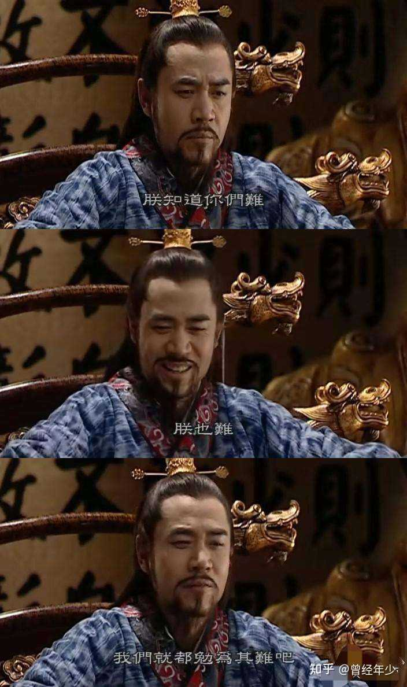
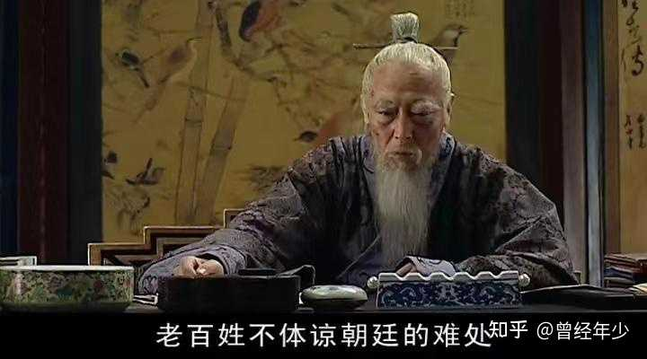
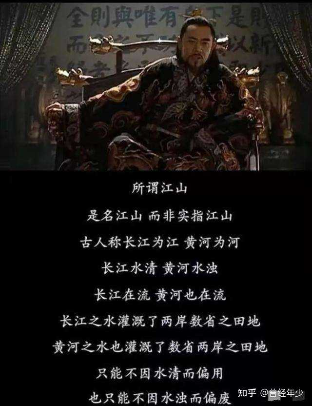
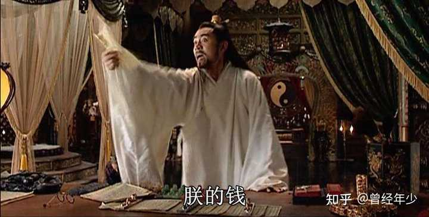

为什么我越看大明王朝1566 越恨嘉靖？ \- 曾经年少 的回答

不管他最后说的什么 黄河长江论什么的 我都觉得是他在给自己最后留点脸面～～恨死他了 上行下效 跟贵族 百官 把明朝百姓折腾成这个样子 他还觉得委屈了 …

不要总想着天上掉馅饼。

把嘉靖干掉，他修宫殿的钱，就会自动落到你这个老百姓嘴里了？怎么可能！

严阁老要养戏班子，徐阁老要买田，郑泌昌何茂才要贪墨，沈一石官商勾结要收刮，连淳安县的二老爷，都要喝鸡汤。

你就算把嘉靖当黄金卖了，能喂饱这么多张嘴么？

“朝廷，就是几座宫殿几座衙门，饭还是要分锅吃的。”

大明王朝1566非常伟大的一点，就在于它揭示了一个很多老百姓不愿意接受的道理:

__利益分配，从来都是靠博弈的，没有谁天然应该分得多，也没有谁天然应该分得少，一切纯靠博弈。__

皇帝和官僚分多分少，朝廷与百姓分多分少，严党与清流分多分少，全在博弈台上说话。

你皇帝仅凭“天子”的身份就想大小通吃？办不到！

“民为贵，社稷次之，君为轻”，“水能载舟、亦能覆舟”，“万方有罪，罪在朕躬”。

这些话就是专门道德绑架皇帝的，本质就是要皇帝把蛋糕让出来，不要多贪多占。

嘉靖说自己很难，并不是完全的无病呻吟，很多时候，他也必须把自己嘴里的食吐出来。

alt="Image">

你老百姓仅凭“生产者”的身份就想占大头?办不到！

“民可使由之，不可使知之”，“老百姓不体谅朝廷的难处”，“再苦一苦百姓”。

这些话就是专门用来限制老百姓的，本质也是让老百姓把蛋糕让出来，不要多贪多占。

干的多，拿的少，这才是良民；

干的少，拿得多，这就是刁民。

alt="Image">

你官僚集团仅凭“管理者”的身份就想占大头？办不到！

长江水清，黄河水浊，长江之水灌溉了两岸数省之田地，黄河之水也灌溉了数省两岸之田地。

只能不因水清而偏用，也只能不因水浊而偏废，自古皆然。

反腐、党争、派系、鸣冤告状，就是为了破坏官僚集团的团结而专门设置的，本质也是削弱官僚集团的力量，不要多贪多占。

alt="Image">

古代分蛋糕的基本就是这三家，现代又出现了一个新的巨头上桌:资本。

资本也要接受既有规则，也要一视同仁，不能搞一家通吃。

“反垄断”、“罢工”、缴税、国企、人民企业家，都是为了限制资本的力量而专设的，本质也是让资本把利益吐出来，不要多贪多占。

既然是利益博弈，那就不可能稳定，各方的力量强弱，就处于不停变化过程之中。

有些时候皇帝分的多，比如开国皇帝和强势皇帝；

有些时候官僚分的多，比如王朝稳定之后，官僚集团力量一定野蛮生长；

有些时候百姓分的多，比如王朝末世风起云涌的造反起义，其实也不是百姓分得多，而是他们把锅砸了；

有些时候资本分的多，比如现在的西方资本主义国家。

在电视剧中，大明王朝已经建立了200年，政权稳定，秩序平稳，作为主要管理者的官僚集团，力量已经急剧膨胀了。

在利益分配中，官僚集团分了大头，皇帝、百姓拿的都是小头。

最典型的例子就是盐税。

老百姓交了1000多万两，嘉靖拿了100多万两，很明显，那剩余的近千万两银子，就是被官僚集团分了。

哪怕是嘉靖大发雷霆以倒严相威胁，鄢懋卿领严嵩意旨南下拼命收割，交到朝廷和宫里的也只有330万两，大头还是被官僚集团分了。

从这个角度上来讲，嘉靖的咆哮是没有意义的。

大明王朝的钱从来不是你皇帝的，当你没能耐压倒其他利益分配者的时候，活该你分的少。

“九州万方归于一人”，这种话听听就好，可千万别当真了。

alt="Image">

利益争夺，从来都是你死我活的，你多吃一口、我就要少吃一口，谁敢抢我的食，我就和谁玩命。

都是成年人了，除了爹妈，你还见过任何一个人，愿意无偿为你争取利益么？

也别站在道德制高点讽刺这些大人物了，就算咱们自己，

和老板要待遇时，和同事争功劳时，和对手争机会时，你会一团和气吗？
