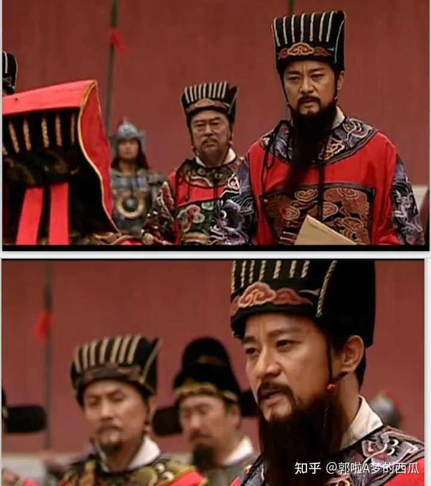
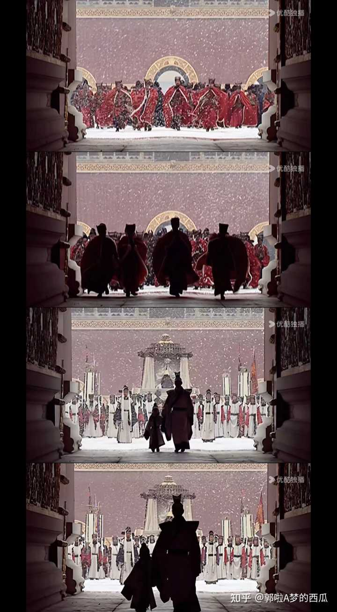

__问题描述：__

不管他最后说的什么 黄河长江论什么的 我都觉得是他在给自己最后留点脸面～～恨死他了 上行下效 跟贵族 百官 把明朝百姓折腾成这个样子 他还觉得委屈了 …

当你看大明王朝，你开始恨严嵩严世蕃，恨鄢懋卿罗龙文，讨厌郑泌昌何茂才，一帮官场腌臜，贪墨污国，上下其手，中饱私囊，弄得大明民不聊生，百姓怨声载道。他们怎么能这么坏！

这说明你看透了这部剧的第一层：奸党误国。

alt="Image">

当你看大明王朝，你开始讨厌吕芳，厌恶嘉靖，什么“一两个县么，淹了就淹了，主子心里装的是九州万方”，什么“朕把天下交给了你们”，简直是比不粘锅还不粘锅，以一人之心夺万民之心，以一人之力盘剥天下民力，海瑞骂他真是骂对了！

这说明你看透了这部剧的第二层：昏君误国。

alt="Image">

当你看大明王朝，你开始对徐阶感到不舒服，对高拱张居正汗毛直竖，对那句“干脆让浙江乱起来”耿耿于怀，对那句“就当我大明朝身上烂了一块肉”毛骨悚然，什么所谓清流，不也是高高在上、不也是视百姓如草芥吗？

这说明你看透了这部剧的第三层：党争误国。

alt="Image">

你又继续看大明王朝，看啊看啊，终于觉察到了不对劲了：严嵩严世蕃，反派无疑；嘉靖，自私自利；吕芳黄锦，愚忠不已；徐高张：争权顾名。就连近乎完人的海瑞，也多有亏欠自己的妻女，他又何尝不是海家的“严嵩”？

那这部剧还有好人吗？真正的反派到底是谁？

你慢慢理解了，看清了，想透了，只要这个制度还在，上至皇帝，下至百官，就无一人干净；只要皇权和家天下还在，百姓就会被剥削，压榨，永无宁日；只要皇权与士大夫共天下，这个国家就永远存在无休止的灾难和荒诞。

至此，你终于看透了这部剧的第四层：封建误国。

alt="Image">

历史洪流浩浩汤汤，封建制度存在，所有人就都身不由己。
