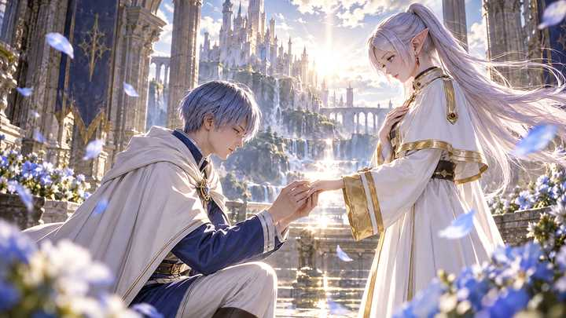

为什么日漫还是有人看有人捧，而反观国内网文却不待见？ \- 泡沫艺术家 的回答

__问题描述：__

日漫捧的非常火，依旧有人去看，而国内网文被人说不如日漫。有人说日漫是真一碗水端平，不会贬低外国文化。说是现在的网文…全是社达厕纸，到处屠日灭美，华夏全…

钢之炼金术师算日漫里世界观相当晦暗的了吧？

伊修瓦尔歼灭战，国家炼金术士们用炼成术把整座城市烧成焦土。瓶中小人操控整个国家几百年，要把整个亚美斯多利斯的灵魂炼成贤者之石，吞噬真理，成为完美的存在。

剧情细节上，妮娜变成了合成兽，喊着"大哥哥"，令无数人想起来就毛骨悚然。休斯在剧情后期也被人造人杀死了，留下了孤儿寡母。

整个故事从头到尾都在说一件事：等价交换是残酷的，你想得到什么就得付出什么，而有些东西失去了就再也回不来。

但结局是什么？

爱德华到了真理面前，他拥有了一切炼金术的力量，接触到了通向真理的大门。

可他却做了什么？

他把自己的真理之门当做代价等价交换，换回了弟弟阿尔的身体。

结尾回到家乡，不再会炼金术了，跟温莉结婚，生了孩子，用自己的双手干活，老老实实当一个普通人，甚至因为身体部分残疾还不如普通人了。

这是整个故事的答案。

也就是，你追了整部的终极炼金术力量，主角最后居然主动把真理之门作为等价交换的筹码交了出去。因为爱德华想明白了，比起成为什么了不起的存在，珍惜身边的人，大家能好好在一起，才是其一直所追求的。

力量不是答案，人才是。

而瓶中小人是钢炼里的最终 Boss，它想抛弃各种人性，不择手段成为完美存在，这不恰恰就是修仙小说主角的人生目标吗？

也就是网文小说主角的追求，居然跟大反派 Boss 是一样的！

假如你把爱德华放到修仙小说里试试。他修炼到大结局，发现成为天尊的代价是身边所有人都死了，然后他选择用全部修为，换回亲友，甚至是整个世界中与他不相关人的性命，回去当凡人？

估计得被骂圣母，骂上热搜。

修仙小说的结局一定是这样的：主角夺了天道，吞噬了跟瓶中小人一样的终极存在，成为唯一真神，永生不死，俯视众生。

而且钢炼把瓶中小人拿一个国家的人的灵魂炼贤者之石，当最恐怖的罪行来写，但修仙主角动不动就拿大量生魂炼法器，报复就灭人满门，甚至屠城灭国，一个亿万人的界面说毁就毁了，全是主角的经验包。

所以说个笑话，跟修仙主角比起来，瓶中小人其实都能算"善良阵营"的了。

__这就是核心区别，修仙小说从头到尾只问一个问题：怎么不断获得更强大的力量？__

__日漫的经典作品在问的问题是：你为什么要获得力量，获得力量后的选择是什么？ 故事的弧光不是从弱到强，是从强到明白什么比力量更重要。__

爱德华之所以会如此选择，如果你看了全篇的话，就会知道除了弟弟之外，开始时的"大哥哥"，变成了他对于炼金术终生的一根刺。

"你甘愿沦为不会用炼金术的普通人吗？"

"什么沦为？本来就是个普通人，连一个变成合成兽的女孩也救不了的\.\.\.\.\."

修仙小说反过来，主角的人格成长就是越来越狠，越来越冷酷，越来越不把人命当回事。

刚出场还会路见不平救个无辜小修士，修炼到后面一个星球炸了都眉头不皱。拿大量生魂炼法器，正常；灭了一个家族抢宝物，属于杀伐果断；别人挡路管你好人坏人，杀了再说，变得完全信奉丛林法则。

在修仙小说的世界里，善良是弱点，同情是病，只有强者配活着，弱者就是蝼蚁。

所以修仙小说的主角不敢做普通人，他们必须永远疯狂地卷升级，永远在抢资源，永远走在追杀别人与被别人追杀的路上。

但你会喜欢这样的世界吗？刚开始看挺爽的，看多了只会感到审美疲劳。

最后以芙莉莲作为结尾，一个活了千年的精灵法师，最强的魔法使，打败了魔王，长生不死，走遍了全世界，别人羡慕的一切她都已经拥有了。

但日漫告诉你的，还是同一件事：

她这辈子也解不开的魔法，并不是什么毁天灭地的禁咒，而是一个人类把戒指套上她手指时，那阵自己都说不清的悸动。

成为神，成为天尊，又如何？不如这一刻。

alt="Image">
