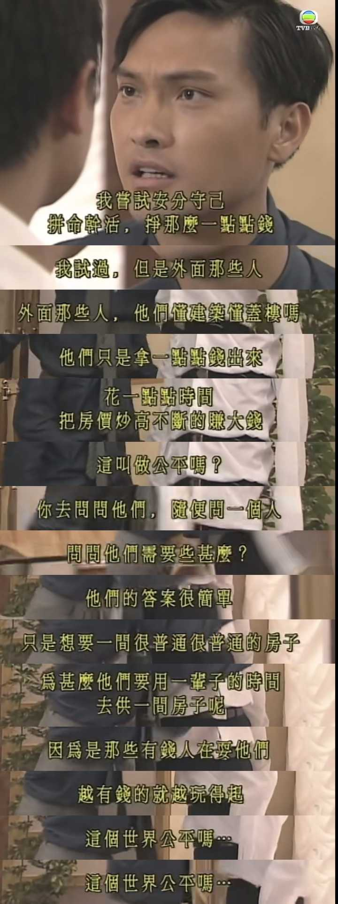
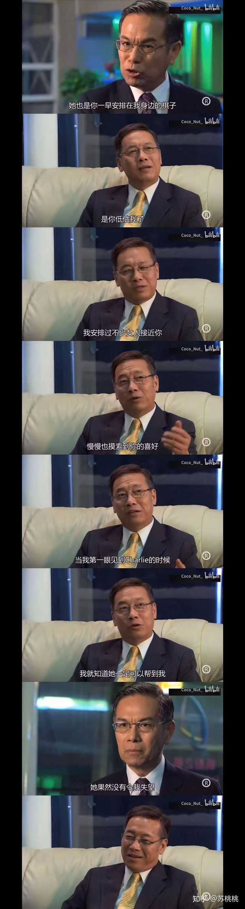
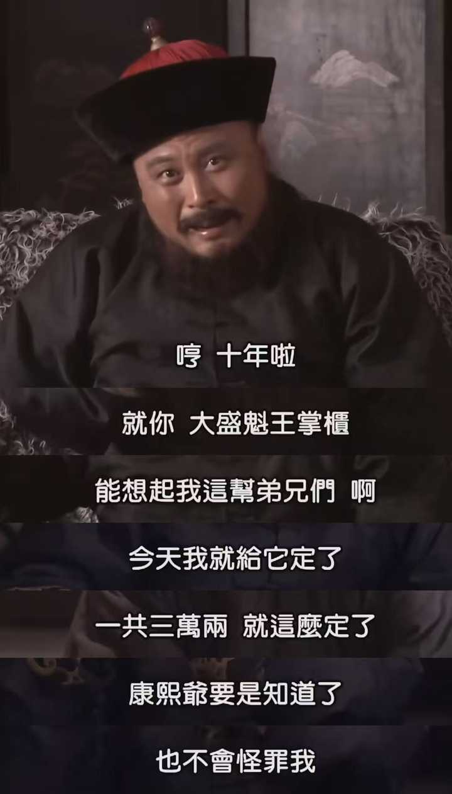
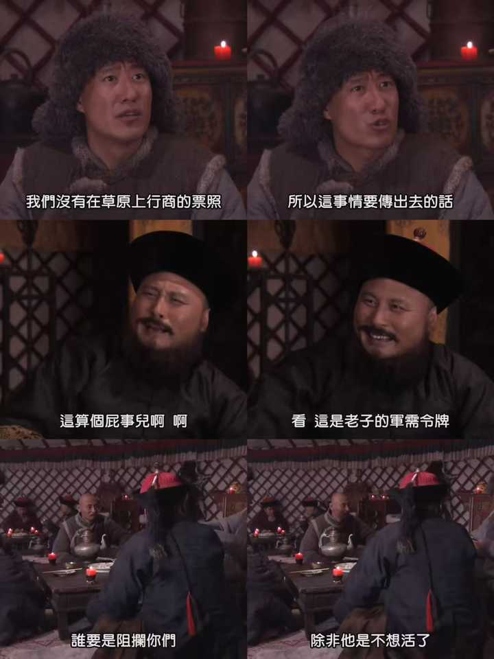

为什么港剧的豪门恩怨，如罗嘉良的创世纪、刘青云的大时代，很受观众的喜爱？而大陆剧的豪门恩怨却让人尴尬？ \- 苏桃桃 的回答

因为老TVB的豪门剧不是博人眼球，而是当时社会的百科全书。

这一点我很佩服老一辈的TVB编剧和演员。

豪门对他们来说，不是一个媚富的通道。

描写豪门对他们来说，也不是用来炫富的载体。

__相反，这是一个揭露时代背景，描摹香港各个阶层众生相的绝佳舞台。__

底层小民、中产阶级、知识精英、暴发男女、富贵豪门。

它几乎描绘了各个阶层的人，在遇到事情时所持有的态度与解决办法。

TVB的豪门剧，是言情剧、商战剧、时装剧、政律剧的融合。

有时还会加入谋杀、探案的惊险元素。

反观内地的豪门题材作品，说句真心话，内地这类剧不是低端，而是__太不老实__。

没把观众们当家人。

什么叫太不老实？

香港不少豪门剧，编剧没有什么顾虑，很多内容可以写得十分辛辣。

面对节节攀升的楼市，底层和中层的想法是什么？

愤怒。

他们只是拿一点点钱出来，花一点点时间，把房价炒高不断的赚大钱。
这叫做公平吗？
你去问问他们，随便问一个人，问问他们需要些甚么？
他们的答案很简单，只是想要一间很普通很普通的房子。
为甚么他们要用一辈子的时间，去供一间房子呢？
因为是那些有钱人在耍他们。
越有钱的就越玩得起。这个世界公平吗？

alt="Image">

1997 亚洲金融风暴爆发，香港楼市泡沫从 97 年下半年开始崩盘。

《创世纪》1999 年播出，剧中描绘的是1990年的香港社会，许文彪这段台词写的，就是风暴之前炒楼盛行、普通人被房价裹挟的状态，那时候内地还在懵懂起步，没有这种大规模炒房的局面。

1999 年《创世纪》播出，楼市已经经历过大跌，大量楼房变成负资产。

回头再看，这段内容就像一个预言，是前车之鉴。

而富豪聚在一起，开香槟吃西餐，他们的想法是什么？

轻描淡写地说，在香港做生意，就是要靠脑子。

外面那么多大厦，十栋有九栋都是骗回来的，关键看你是骗人的那个，还是被骗的那个。

没有大喊大叫，直接掀开商业光鲜外壳底下那层潜规则。

老 TVB 就敢把这种台面上不会讲的实话写进剧里。

所以你看TVB的这些豪门剧真的太好看了。豪门争产、私生子撕逼、股票大战、楼市博弈，各种元素全都揉在一起。就算是《珠光宝气》，已经算是偏言情向的作品了，但我之前写过它的影评，里面贺峰的美人计这条线写得相当到位。

贺峰为了扳倒对手宋世万，布这个局足足埋伏了十几年。

他不断物色、安排不同的女人安插到宋世万身边，持续摸透宋世万的喜好，还跟着宋世万年纪增长、心态变化不断调整方案。

等到宋世万步入晚年、心生倦怠的时候。

他才把最后的王牌——四姨太卓凝送到宋世万面前。

这个女人长得漂亮温顺，年轻大方，出身清白，，甚至还懂生意。

最绝的地方在于，四姨太拿给宋世万看的每一份商业报告，其实全都是贺峰写的。等于宋世万欣赏的，是小白花的外表、正房夫人一般的气度，再加贺峰本人的谋略心思。有这样一层伪装在，宋世万怎么可能不沦陷。

alt="Image">

而内地的豪门剧，商战剧。

__根本上存在一个很不好的问题：不敢说实话。__

内地其实没有TVB这种定义下的豪门剧，如果硬要说最接近的，那就是《大宅门》。

但仔细对比就能发现，它和TVB的剧有个根本差别。

《大宅门》的编剧兼导演是郭宝昌，他本身就是乐家（白家原型）的养子，写的就是自家家族的故事，所以叙事里难免带着自己的视角，会做美化和取舍。

就拿养母这个人物来说，真实情况争议很大。

剧播出之后，乐家后人和郭宝昌也产生了很大矛盾。

单当成电视剧来看，《大宅门》非常好看，我之前也写过不少它的影评，服化道、台词、人物塑造全都在线。

可要是往深处挖，想探究真实的家族内里，就很容易碰到问题。

说白了，自家人写自家旧事，难免会有所遮掩。

那么自《大宅门》之后，内地很多所谓的豪门剧、商战剧，就染上两个很不好的毛病。

一个是爱写自家传奇故事，很多剧集背后本身就有相关资本投资，这里面的分寸就不好说了。

这种自家人写自家旧事，就难免会有遮掩美化。

比如说杨九红这个角色，剧里面写她是妓女，一腔痴情跟着老七，看着就像是一对苦命鸳鸯。

可原型的说法有争议，不少乐家后人说这个原型角色其实是有黑道背景的。

这个原型在济南的人脉极强，有江湖势力背景，乐镜宇在济南开店离不开她这层关系，

老七娶她，一方面固然有美色、感情因素，但更关键的，是靠她稳住济南当地的黑道势力。剧里把这一层藏起来了，只留下痴情苦情的爱情线。

反观 TVB 的编剧，大多是站在外人的视角去观察豪门圈子，不用顾及家族情面，什么台面下的算计、十几年的长线布局，都敢实实在在写出来。

还有一个更要命的问题，写经商故事，不写真正的焚决就算了。

还硬要夹带点仁义礼智信的报应说教！

剧里塑造的商人，仿佛个个都是靠勤劳肯干、重情重义、结交好汉才起家，简直可以无痛穿越20世纪上颁奖台领大红花，反派都是愚蠢二代利欲熏心自取灭亡，这套叙事其实很失真。

这么一搞，故事就更容易崩掉。

举个例子，《大盛魁》这部剧，里面有个情节，男主三兄弟破产，夜宿破庙，半夜有老者送给他们三千两银子翻本，银子上面撒着红枣，老人随后消失不见。

三兄弟发财之后，在此地修建财神庙。

虽然剧后面补了设定，说其实是师傅托人送来的钱辣，但这个说法依然太经不起推敲了。

再比如说《大盛魁》里这个情节，男主他们囤羊肉囤多了，砸手里卖不出去，就想了个办法。

反正羊肉放着也是放着，干脆做成羊肉饺子劳军。连夜招呼人手包了几万斤饺子送到边军首领那里。边军首领一看特别感动，抹着眼泪说，说没想到驻扎这么久，只有王大掌柜还记挂着兄弟们。

大盛魁说饺子白送，大将军非要不但不白吃，还要一斤饺子一两银子，直接算三万两白银结账。

大盛魁说自己就像要点货去救灾，大将军感动地不行，直接把军需令牌给了大盛魁，做生意。

alt="Image">

十岁看这段，会觉得好人有好报。

可等到二十岁再琢磨，就会发现编剧这套写法，简直把观众当傻子。

春秋笔法加上刻意的叙事蒙太奇全都用上了。

真实情况根本不可能这么简单。

alt="Image">

明清两代，真正能把蒙古边贸做通的，全是顶级官商联姻、层层绑定的硬关系。

嘉靖年间的王崇古，是王瑶的三子，嘉靖二十年考中进士，一路做到宣大总督，手握边境军政大权。而朝堂重臣张四维，母亲正是王崇古的二姐，也就是说王崇古是张四维的亲舅舅，两家本来就是深度绑定的姻亲势力。而且他们的关系网是层层叠叠，王崇古大姐嫁给山西大盐商沈家，张四维家里更是全员联姻权贵富商，三个弟媳分别来自山西顶级王氏、李氏、范氏富商家族，儿媳是兵部尚书的孙女，女儿又嫁进内阁大臣马家，马家亲属还是知名陕商。

《大盛魁》的故事是康熙年间，征讨噶尔丹，在漠北乌里雅苏台驻军。

商人敢直接把大批饺子送进军营，必然早就和边军有往来、有关系。

清朝这种随军商号，本来就是靠着和当地驻军、理藩院打好交道才能做草原贸易。

结果剧里拍成，双方本来素不相识，全靠一份真情，几万斤饺子换来了大机缘。

这简直就是拿观众当外人糊弄。

你说这种剧情能不尴尬吗？
