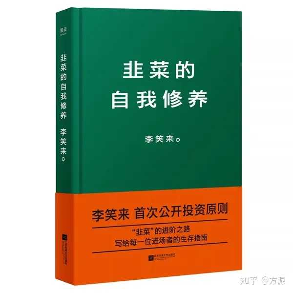

为什么认知高的人最终都会走向金融市场？ \- 方源 的回答

__问题描述：__

是不是金融市场比较公平一点？

建议去看看《韭菜的自我修养》这本书，我读了不止1遍，我至少读了3遍。可以说，没有读过这本书的人生并不完整。

投资最大的风险来源于自己的无知。

提到“韭菜”这个词，很多人的第一反应是它逃脱不了“被割”的命运。在金融市场中，一波又一波的“韭菜”前赴后继、换茬被割。

《韭菜的自我修养》作者李笑来是一位传奇人物，新东方原知名教师，天使投资人，2018年11月13日，入选《2018胡润区块链富豪榜》，以70亿元人民币财富排名第5，也传说是中国的“比特币首富”。在这本书中，他将自己对投资的认知和真相写出来，并主动将“韭菜”这个不讨喜的词语列入书名，旨在引发大家的思考和重视。

以下是原文精选内容：

__一、你是“韭菜”吗？__

所谓的“韭菜”，指的是在交易市场中没赚到钱甚至赔钱的势单力薄的散户。这么看来，作为一根“韭菜”，想要成为“非韭菜”（不一定是所谓的“大户”，或所谓的“庄”），任务很简单啊：赚到钱……

作者认为“韭菜”有以下典型特征:

1\.严重缺乏基本的阅读能力。他们是那种买一辈子东西都不读产品说明书的人，他们是那种无论拿到什么，都要问别人怎么用的人……
2\.一进场就开始“买买买”！一旦你需要用钱的时候，市场就会大跌！你一买，它就开始跌；
你一卖，它就开始涨……
3\.喜欢打探“小道消息”，盲目以为自己得到了“天机”，而从不独立思考……
4\.他们的标的一涨，就觉得永远会涨，不懂“止盈”；他们的标的一跌，就觉得接下来一定会涨回来，不懂“止损”……

如果你具有以上特征，恭喜你，“韭菜之王”非你莫属。

__二、你为什么会成为“韭菜”？__

__1\.忽视周期，认为市场是零和博弈__

许多“韭菜”都有一个共同的观点，那就是市场是一场零和博弈。所谓零和博弈，指的就是市场中的钱的总数是不变的，你赚到的钱一定来源于别人亏损的钱。同理，你亏损的钱一定被别人给赚走了。比如，麻将游戏就是一场零和博弈。持“市场就是一场零和博弈”的人往往对市场中一定有人“割韭菜”深信不疑。当然，他们恨的不是有人“割韭菜”，而是“割韭菜”的不是他们。

那么他们为什么错了呢？他们对于市场中一个最重要的规律视而不见——那就是周期规律。我们知道市场在绝望中重生，在犹豫中上涨，在疯狂时死亡。也就是说，市场既有牛市，也有熊市，它是两者交替的。从长期来看，市场并不是一个零和博弈，牛市中人赚到钱的总数要远远高于亏损掉的钱，熊市中亏损的钱的总数也要远远高于其他人赚到的钱。

__2\.忽视风险，在错误的时机买入__

那么如何解释他们成为了大家眼中的“韭菜”呢？原因就在于他们不仅买入的时机错了，对于风险也没有一个准确的认识！认为股市是零和博弈的人，往往会忽略周期的概念，并会因此在没有等到好时机时就匆忙入场。他们并不会站在一个很长的时间周期去观察此时的决定是否正确，他们会认为不冒险就不会有收获。他们认为这个市场就像赌场，饿死胆小的，撑死胆大的。凭着一腔热血和蛮劲儿，傻乎乎地冲杀进去，你不当“韭菜”，谁当？

__三、如何摆脱“韭菜”宿命？__

分析“韭菜”的特征，我们发现，所谓的“韭菜”其实常常并不是被别人割，在更多的情况下，他们是被自己割的！

想要摆脱“韭菜”的宿命，可以从以下几个方面改变:

__1\.把握周期规律__

韭菜通常喜欢谈趋势，而周期是不存在的。其实，真正的趋势常常需要多个周期才能展现。关注周期，以及多个周期背后显现出来的真正趋势，会给我们一个全新且更为可靠的世界和视界。

如何把握周期呢？有一个简单靠谱容易上手的方法：仔细观察体会绝大多数交易者的情绪。牛市里，FOMO（Fear of Missing Out，对丧失机会的极度恐惧）情绪达到顶峰，各种投资者开始ALL\-IN时，上升趋势到头了；

熊市里，大多数“韭菜”经过失望谩骂而后平静的时候，下跌趋势渐渐到底了。

有两个图表能帮助我们理解得更为深刻：“库伯勒\-罗丝改变曲线”和“新生事物的发展过程”。

库伯勒\-罗丝改变曲线

新生事物的发展过程

__2\.降低交易频次__

交易频次越高，交易越是接近“零和博弈”。越是短期的预测，越接近于抛硬币。华尔街教父格雷厄姆说过：“市场短期是一个投票机，长期是一个称重机。”也就是说，股市长期来看是经济的晴雨表，而短期来看，就是一个零和博弈游戏。

千万别不信：只要你在频繁交易，你就依然是一根“韭菜”而已。降低交易频次，说起来容易做起来难。很多高手都劝新手不要频繁交易，只不过他们拿出来的根据虽然极其有道理，但是新手并不在意：频繁交易的结果就是交易手续费累积，累积到吞噬你的所有利润和本金。

__3\.降低风险__

股市有风险，所有的交易机制都是为了降低自己的风险。一个成熟的交易者，对于风险应该有规避意识。这代表着：在能不冒险的时候就尽量不冒险。即便是必须冒险的时候，也要让傻瓜们冒险，自己在一旁通过观察获得经验。获得经验的最直接方法是通过自己的实践获得。然而，在风险这件事儿上，一定要尽早学会观察他人的冒险实践，而不是通过自己的实践。

此外，成功交易者的一个基本素质就是：控制仓位，在任何时候都持有一定比例（或者起码一定数量）的现金——这就好像潜海需要一个氧气罐一样，没得商量。

__4\.你必须要有工作、学习和生活__

在交易市场里，无论是现金、时间还是生活，都绝对不可以ALL\-IN。

盯盘，是“对丧失机会的极度恐惧”。我们必须记住，我们一定要有生活，并且生活最重要。你喜欢读书，就去买更多的书，安心读完；你喜欢弹琴，就找来更多的曲子去练；你喜欢看电影，就去买更好的影音设备，搜集更多的影音资源……一定要学会自娱自乐，善于自娱自乐，这是牛×交易员必需的最重要技能——它甚至比交易判断都要重要一百倍。

如果我们不善于自娱自乐，用大量的时间用于认真生活，我们真的没有办法降低交易频率。投资总是有风险的。成功的交易者知道，自己最需要的除了现金，就是自身的成长。而成长来自于哪里呢？就是工作经验和努力学习。

所以，我们不光要学会生活，还要有工作、学习，保障自己的赚钱能力，绝不能把交易和投资作为“拿薪水”打工的工具。

投资的本质是认知，收益是认知落差瀑布，你的现状就是你的认知，认知改变了，现状也会改变，这就是为什么知识就是财富的原因。终究我们只能赚认知范围内的钱。因此，加强学习，提高认知，才是投资成功的关键之道。

alt="Image">
