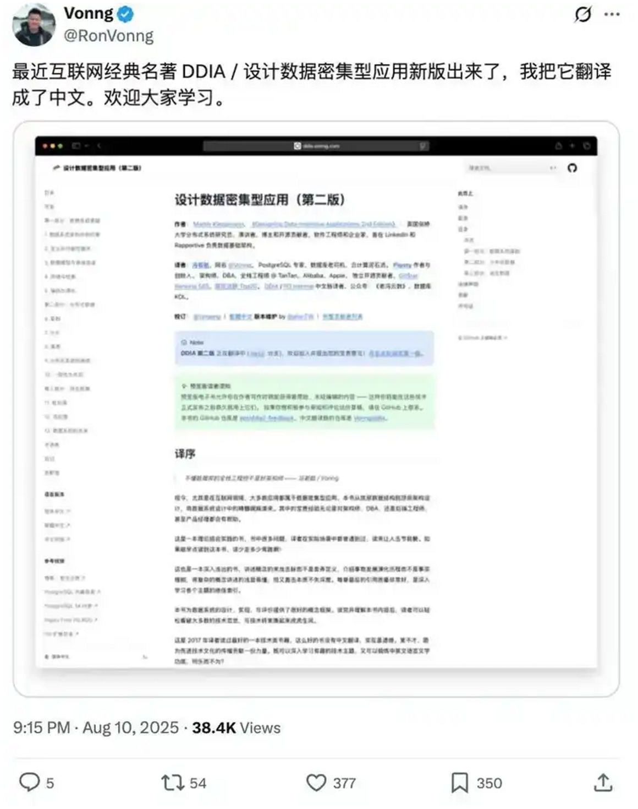

为什么说学术圈性价比在下降？ \- Cv大法代码酱 的回答

我了解到的读博士师兄师姐有的全组考公，有的全组考中学教资，大家读博都不想做科研了吗？

__学术圈性价比下降，本质上是因为技术生产关系的倒置。__

以前是学校搞出牛逼的理论，工业界拿过来落地变现。现在的情况变了，特别是在CS和AI领域，最前沿的东西、最硬核的算力、最完备的数据，全在工业界头部公司手里。

你读博，图的是什么？无非是两点：一是探索人类认知边界的成就感，二是毕业后那个高人一等的起薪和社会地位。

现在这两点都在动摇，是我在面试间和内推群里看到的血淋淋的现实。

__一、 算力即霸权，学校已经跟不上了__

到了2026年，大家心里都清楚，做AI研究，没有算力就是扯淡。

十年前，你哪怕只有一台服务器，也能跑个CNN，搞搞ImageNet，发篇CVPR。那时候学校和公司的差距没那么大，大家拼的是Idea，是数学推导，是巧妙的网络结构设计。

现在呢？大模型时代，参数量都是以千亿、万亿计的。

我在公司里，看着下面团队跑一次实验，调用的集群资源，光是电费可能就够一个普通高校实验室烧一年的。这不是夸张。现在做前沿研究，门槛就是几千张H100或者最新的B系列卡连起来的集群。

学校里有什么？大部分导师手里也就是几张、几十张卡。能有几百张卡的那是顶级大佬。

这就导致了一个非常尴尬的局面：__学术界的博士生，在研究“玩具”问题。__

因为没有足够的算力去复现、去改进SOTA（State Of The Art）模型，博士生们只能去研究一些边缘问题。比如做模型蒸馏、做微调、做一些不需要大算力的理论分析。不是说这些没价值，而是这些方向离工业界真正的主战场——也就是基座模型的预训练——越来越远。

你在学校里苦哈哈搞了三年，发了三篇顶会，觉得自己挺牛。结果来我这面试，我问你分布式训练的通信瓶颈怎么解决？你问你万亿参数下的显存优化怎么做？你没摸过千卡集群，你根本答不上来。

这时候你就会发现，你在学术圈积累的“经验”，在工业界看来，很多是过时的，甚至是错误的，因为那是在小算力约束下产生的“局部最优解”。

这就是性价比下降的第一个原因：__你花费了最宝贵的青春，学习了一套在工业界已经不适用的技能树。__

去关注各大头部科技公司的__Engineering Blog（技术博客）__，比如OpenAI、Anthropic、Google DeepMind，甚至包括国内的阿里、字节的技术团队博客。

- __为什么看这个？__ 论文为了发表，往往会包装得很漂亮，掩盖工程实现的细节。技术博客往往会讲真话，讲他们在落地过程中遇到的坑，讲系统架构的设计。这才是工业界真正想要的能力。
- __怎么看？__ 重点看关于Infrastructure（基础设施）、Training Dynamics（训练动态）、Inference Optimization（推理优化）这几块的内容。

__二、 论文通货膨胀、泛滥__

以前发一篇顶会，那就是硬通货，拿着offer随便挑。

现在呢？2025年的各大顶会，投稿量早就破纪录不知道多少次了。AI生成的论文、灌水的论文、为了发论文而发论文的论文，浩如烟海。

我在招人的时候，根本不看你发了几篇论文。我就看你的Code，看你的Github，看你的项目经历。

因为现在发论文太容易套路化了。找个开源模型，改个Loss function，加个Attention模块，跑几个数据集，比baseline高个0\.5个点，这就一篇。

这种研究，对工业界几乎没有价值。

工业界要的是什么？是__Robustness（鲁棒性）__，是__Efficiency（效率）__，是__Scalability（可扩展性）__。你的模型在特定数据集上高了0\.5%，但在真实业务场景里可能因为长尾数据直接崩掉。你的模块增加了30%的推理延迟，换来0\.5%的提升，上线直接被运维打回来。

博士生在学校里，为了毕业要求，不得不去卷这些“微创新”。大家心里都清楚，这就是在造垃圾，但为了拿学位没办法。

这种心理上的落差是很折磨人的。你本来抱着改变世界的梦想去读博，结果发现自己成了论文流水线上的一个熟练工。

这也是为什么很多师兄师姐去考公。既然在学术圈也是在做无意义的内卷，去考公至少稳定，不用担心35岁被裁员，不用担心发不出paper毕不了业。

__三、 工业界的门槛变了，不再迷信博士__

在2015年左右，算法工程师极其稀缺，那时候只要你是博士，甚至是硕士，懂点机器学习，都能拿高薪。

到了2026年，AI的基础设施已经非常完善了。Hugging Face上有现成的模型，LangChain有现成的框架，各种SaaS服务开箱即用。

对于绝大多数公司来说，他们不需要你会推导反向传播公式，不需要你会设计新的网络架构。他们只需要你会调API，会做Prompt Engineering，会做RAG（检索增强生成）。

推荐去看一下字节的RAG手册,[字节跳动6万字RAG 实践手册流出\.\.\.](https://link.zhihu.com/?target=https%3A//mp.weixin.qq.com/s/laW3iboW5fh0fj0gR9oBDw)

它不是只讲概念，还从工程实践的角度拆了整个流程：数据怎么准备、知识库怎么构建、检索和生成怎么配合、性能和延迟怎么优化。

这些工作，本科生能做，甚至在大模型的辅助下，非科班的人也能做。

那么，企业为什么要花三倍的价钱去招一个博士？

除非你是那个领域真正的顶尖专家，能解决别人解决不了的硬核问题。否则，普通的博士毕业生，在性价比上真的不如一个有三年实战经验的本科生。

我现在团队里，有些本科毕业就在大厂摸爬滚打三四年的小伙子，对业务的理解、对数据的敏感度、写代码的速度，完全吊打刚毕业的博士。

博士生刚毕业，往往带着一种“学术洁癖”，看不起脏活累活，觉得清洗数据、写工程代码是low behavior。但在工业界，数据质量决定了一切，工程稳定性决定了一切。

这种错位，导致博士在就业市场上变得“高不成低不就”。小公司养不起，大公司只要最好的。

去看__GitHub上的High\-Star项目源码。__
__不要只看Readme，要看Issues，看Pull Requests。__

- __具体操作：__ 找一个工业界常用的开源框架，比如vLLM（大模型推理加速框架）或者DeepSpeed。去读它的源码，看它是怎么做内存管理的，怎么做并行计算的。
- __价值：__ 如果你在面试时，能对着源码讲清楚大模型推理时的KV Cache管理机制，绝对比你讲你那篇改了Attention结构的论文要加分得多。

__四、 导师与学生的依附关系，跟现代职场观念格格不入__

现在的年轻人，00后，甚至05后，讲究的是平等，是价值交换。

但在学术圈，特别是国内的很多课题组，依然保留着一种类似“行会”甚至“家父长制”的师徒关系。

导师对学生拥有绝对的生杀大予夺之权。你的毕业、你的论文署名、你的杂活分配，全看导师心情。

如果是以前，忍个五年，换个锦绣前程，大家也就忍了。

但现在，忍了五年，出来发现工作不好找，薪资不如隔壁本科转码的同学，这时候心里的天平就崩了。

而且，很多导师自己脱离一线太久了。他们指导不了你大模型怎么训练，因为他们自己也没跑过。他们只能在方向上瞎指挥，或者在文字上挑挑刺。

这就导致博士生成了“学术孤儿”。你要自己找方向，自己找资源，还要应付导师的各种横向项目（就是帮企业做外包）。

这种体验，性价比极低。

相比之下，考公、考编，虽然也有层级，也有办公室政治，但至少规则相对透明，有法律保障，有明确的晋升路径（或者躺平路径）。

__五、 如果你还在读博，或者想读博__

说了这么多负面的，不是劝退，而是让你认清现实。如果你真的对科研有热情，或者已经上了贼船，该怎么办？

我有几条非常中肯的建议。

__1\. 别把自己当学生，把自己当合伙人__

不要等着导师给你派活。你要主动去寻找资源。

现在的算力虽然贵，但很多云厂商、很多大厂都有Research Grant（研究资助）。你要学会去申请这些资源。

你要学会Marketing（自我营销）。写了论文，别发完就算了。去Twitter（X），去知乎，去Hugging Face写博客，介绍你的工作。让工业界的人看到你的价值。

__2\. 拥抱系统，拥抱工程__

不要只做纯算法。在这个时代，算法、算力、数据、系统是分不开的。

去学CUDA编程，去学分布式系统，去了解编译器。这些是硬技能，是大模型时代的“挖掘机驾驶证”。算法可能会变，但底层的计算原理几十年没变。

如果你是一个懂System的AI博士，那你依然是抢手货。因为大厂太缺能把模型训练效率提升10%的人了，这直接对应着几千万的成本节省。

__3\. 寻找差异化竞争点：AI for Science__

既然纯AI模型卷不过大厂，那就去结合具体的领域。

生物、材料、物理、化学。这些领域的数据壁垒很高，大厂的手还没完全伸进去。

利用AI去解决蛋白质折叠，去寻找新材料，去预测天气。这些方向，学术界依然有很大的优势，因为你们有懂Domain Knowledge（领域知识）的专家。

去看__LeetCode \+ System Design Primer。__
__别笑，哪怕你是博士，面试第一关还是手撕代码。__

- __重点：__ 不要只刷Easy和Medium。去刷Hard，去刷那些涉及动态规划、图论的题。
- __系统设计：__ 去看《Designing Data\-Intensive Applications》（数据密集型应用系统设计）这本书。这书是神作。读通了它，你对分布式系统的理解能上一个台阶。

最近DDIA有了第二版，还有中文版了。

alt="Image">

不过说实话。可能很多人连第一版都还没读明白，但是这也不能怪他们。因为因为DDIA就是很难，对很多刚入门或者转行到分布式系统、数据库、大数据领域的朋友来说，可能只能理解 20%\-30% 的内容。要真正全部消化这本书，需要至少 1\-2 年在大厂参与大型分布式系统工作或者长期维护复杂系统的实战经验才能跟上作者的思路。

所以推荐一个配套的DDIA 逐章带读，作者基于英语原版，结合自己丰富的工作经验，做了大量扩展和细致说明。可读性起码提高80%。推荐新手搭配第二版和解读一起读。

[DDIA第二版更新，中文版以及配套逐章带读开放下载！](https://link.zhihu.com/?target=https%3A//mp.weixin.qq.com/s/3LfUU1xqs5NktOaZlCtP4A)

__4\. 实习，实习，还是实习__

只要有机会，一定要去大厂的AI Lab实习。

哪怕导师不放人，你也要想办法去。因为只有在工业界，你才能接触到真实的数据，真实的算力，真实的问题。

在公司实习半年，学到的东西可能比你在实验室闷三年都要多。而且，现在的校招，基本上就是实习转正。没有实习经历，简历很难过筛选。

__六、 关于考公和教资的看法__

回到问题本身，师兄师姐全组考公，是不是大家都不想做科研了？

我觉得这是一种__理性的回归__。

科研本身就是一项高风险、高投入、低成功率的事业。它本来就不应该成为大众的职业选择。

过去十几年，是因为互联网泡沫和AI热潮，把科研包装成了一个名利双收的捷径，吸引了大量并不真正热爱科研、或者天赋不够的人进入这个领域。

现在潮水退去，泡沫破裂。

那些真正热爱科研、坐得住冷板凳、且天赋异禀的人，依然会留在学术圈，去攻克那些最难的Hard Core问题。

而对于大多数只是想找份好工作、过上体面生活的人来说，读博的性价比确实不如考公。

考公不丢人，去中学教书也不丢人。深圳中学的老师，很多都是清北博士。他们在那里，把科学的思维教给下一代，可能比发几篇没人看的水论文，对社会的贡献更大。

我就认识一个男生，国内Top 3高校的CS博士。博三的时候，发了两篇顶会，但他很焦虑。因为他发现自己做的方向——图神经网络（GNN），在工业界落地的场景非常有限，而且已经被搞得差不多了。

他去大厂实习了一圈，发现自己引以为傲的理论，在实际推荐系统中，效果还不如简单的逻辑回归加几条人工规则。而且每天加班到半夜，身体也吃不消。

最后他选择了回老家的省会城市，考了选调生。

前段时间吃饭，他跟我说，现在虽然工资只有以前在大厂offer的三分之一，但他有时间陪老婆孩子，周末能去钓鱼。他在工作中负责数字化建设，把他在读博期间学到的逻辑思维、数据分析能力用在政府管理上，效率那是降维打击，领导非常器重。

你能说他书白读了吗？能说他没志气吗？

我觉得不能。他找到了自己人生的最优解。

所以别把学术圈性价比下降看成是一件坏事。这其实是一次清洗和筛选。它把那些投机者挤出去，让学术圈回归纯粹。同时它也提醒现在的年轻人：不要为了逃避就业去读博，不要为了虚荣去读博。

在2026年，如果你选择读博，请确保你是因为真的想搞清楚某个问题的答案，是因为你真的享受那个探索的过程。如果你只是为了找个好工作，那我劝你，现在就去投简历，或者去刷行测申论。路从来都不止一条。性价比是算出来的，但人生不是算出来的，是走出来的。希望这些话能给还在迷茫中的你一点参考。
