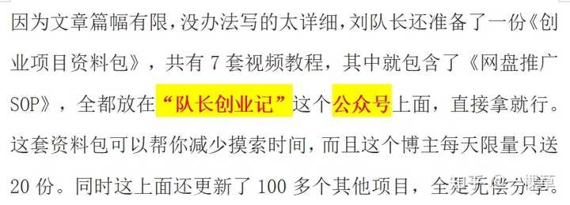

人最重要的能力是什么？ \- 一棵草 的回答

镜像问题： 人最不重要的能力是什么？

先说结论。

人这一辈子最重要的能力，不是聪明，不是情商高，也不是认识多少牛人。

而是当你连续很长一段时间都没有结果，事情乱七八糟，未来看不清，甚至开始怀疑自己的时候，你还能正常吃饭、正常睡觉、正常干活，不把自己先搞崩。

我越来越觉得，普通人很多时候不是输在能力上，而是输在一个字：

__急。__

这个急，不是做事快。

是心里慌。

做一个副业三天没收益，开始怀疑项目；发十篇内容没人看，开始怀疑自己；换一份工作一个月不顺，就觉得人生选错了。

我们从小特别习惯一件事情：

做一道题，答案就在后面。

考一场试，很快就有成绩。

努力了，就应该有反馈。

所以进入真实社会以后，很多人特别痛苦，因为社会根本没有标准答案，更不会告诉你还有多久才能熬出头。

你种下一颗种子，今天浇水，明天浇水，一个月过去，地面上可能什么都没有。

最折磨人的不是累。

而是你不知道地下到底有没有长根。

我接触过很多想做互联网副业的人，最常听到的一句话就是：

“这个到底多久能赚钱？”

其实我特别理解。

大家不是贪心，很多人只是太需要一个确定的答案了。

白天上班已经够累了，晚上再花两个小时研究一个东西，如果连续半个月都看不到结果，谁心里都会打鼓。

后来我看刘队长拆网盘推广的时候，有一个思路我特别认可。

他说普通人刚开始做这种项目，第一阶段别天天盯着今天挣了多少钱，先把整个流程跑通。

什么资料有人需要，资料怎么整理，流量从哪里来，用户为什么愿意保存，你做的内容到底有没有人看。

这些东西一天两天根本看不出来。

网盘推广最考验人的地方，恰恰不是操作有多复杂。

而是前面那段__没有掌声、没有收益、没有人告诉你做得对不对的垃圾时间。__

很多人就死在这里。

今天整理教育资料，没流量，明天改考公资料；后天看别人做电视剧资源，又跟着换；做了一星期，发现还是没有想象中那么快，于是下结论：

这个项目不行。

其实到底是项目不行，还是你根本没给它长出结果的时间？

alt="Image">

很多事情都是这样。

人在焦虑的时候特别喜欢瞎动作。

因为“做点什么”，会让自己暂时舒服一点。

所以有人工作不顺，马上裸辞；感情寂寞，赶紧找个人凑合；手里有点钱，看到别人说哪个东西赚钱就冲进去。

这些决定表面上是在解决问题。

实际上只是想赶紧消灭自己的焦虑。

真正厉害的人恰恰相反。

他们允许事情暂时没有答案。

允许今天的数据很差。

允许这个月挣得很少。

甚至允许自己做错。

但是他不会因为暂时的混乱，就把自己的节奏一起打烂。

这才是真正的“稳”。

现在这个时代尤其难做到。

短视频三秒钟就给你一个刺激，外卖半小时送到，打车几分钟就来。

我们已经被即时反馈惯坏了。

于是潜意识里觉得：

我今天努力，明天就应该有结果。

但赚钱、做内容、学一门真正有价值的能力，偏偏都不是这种东西。

它们经常是前面90%的时间都没有声音，最后10%的时间结果突然冒出来。

所以我现在判断一个人以后能不能把事情做起来，已经不太看他刚开始有多兴奋了。

我反而看：

__三个月以后没有想象中的结果，他还在不在。__

没有人夸他，他还做不做。

今天收益只有几块钱，他能不能继续把流程优化一点。

这才是真正把人拉开差距的地方。

成年人的成熟，也许就是逐渐接受一个事实：

人生里会长期存在很多“悬而未决”。

你不需要今天就把未来五年全部想清楚。

你只需要在暂时没有答案的时候，把今天该干的事情干完。

__允许事情慢一点，允许结果晚一点，但别允许自己的心先乱掉。__

真正的高手，不是永远顺风顺水。

而是在最没有结果的那段时间里，依然能把自己的生活过得像一个正常人。
