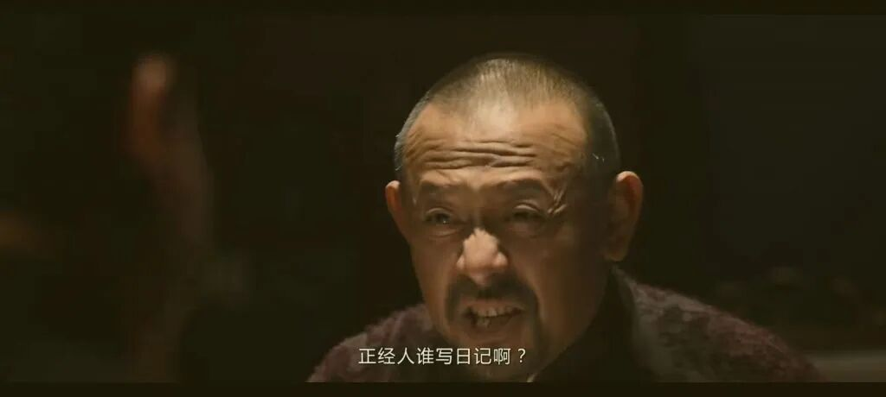
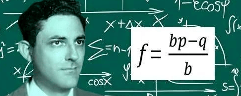

人的一辈子都受数学支配：凯利公式

[源网页](https://mp.weixin.qq.com/s?__biz=MzU0NzgxNTE0OA==&mid=2247487710&idx=1&sn=005d5afeb573ddacbf3e1c23045b43ec&chksm=fac73c933cabb50943b5276b7c14845b19c28fc427c6db806867ec7d537f0067f8e81460fe9c&mpshare=1&scene=1&srcid=0906ZJdr0cOkMtZP8LXC4L2k&sharer_shareinfo=4d1dd5f1f1613e95895b7ea85ca1f486&sharer_shareinfo_first=4d1dd5f1f1613e95895b7ea85ca1f486#rd)

公众号名称：卷毛笔记

作者名称：卷毛

发布时间：2026\-08\-2623:52

__这是卷毛胡扯的第314篇原创日记__

卷毛日记，胡扯一气；感兴趣的话随便看看

想到哪儿写到哪儿，不注意错别字及病句

仅个人观点，若你不认同，那你的观点肯定是对的

丙午七月十四，济南晴。

看到一个知识点，凯利公式，一种资金管理办法。

大概的要点是：核心是为了解决一个问题，当你面对长期重复，胜率和赔率相对明确的投资或者下注机会时，每次该投入多少比例的资金，才能让长期财富增长速度最大。这个公式并不预测涨跌，而是在已经判断出胜率和收益赔率的前提下，帮助投资者控制仓位。

公式很简单，f=（bp\-q）/b。f建议投入的资金比例；p获胜概率；q=1\-p，失败概率；b，净赔率，也就是赢一次能净赚多少倍。

一个最经典的模型是，假如你现在有100w，有这么一个投资机会，获胜概率是60%，失败概率是40%，投入100w，赢了净赚100w，输了损失100w。

如果没有这个公式去带入计算，这样子的投资机会，凭借自己的直觉应该投资多少？先别算，按照自己的经验想一个数字。

估计很多人的想法是，50w甚至更多。

然后按照公式带入发现，最优解是20w。比大多数人以为的经验值要少的多。

为什么不能把全部资金押进去？

虽然这个机会胜率有60%，而且期望收益为正（高中的数学知识，数学期望），但如果每次全仓，只要失败一次，资金就会归零。（赚的爽，亏得更惨。）

凯利公式考虑的不仅是“平均能赚多少钱”，还考虑了连续亏损和破产风险。它追求的是长期财富的复合增长，而不是某一次赚得最多。

假设你有100元，先涨50%，再跌50%，最后不是回到100元，而是只剩75元。这说明亏损对复利增长的伤害不对称。

比如跌50%以后的股票，需要涨100%才能回到初始水平。

然后可以设想这么一种情况，还是刚才的模型，但是胜率40%，赔率60%，这个游戏该不该玩？

直觉是：我有机会40%的概率让本金翻倍，但凡是有点儿赌徒心里的人，直接会梭哈。

但是公式计算结果是，f是\-0\.2\.也就是这个机会，根本不值得花时间精力和金钱。

突然想到一个电影中经常出现的桥段，一颗子弹，左轮手枪，赌命。

1个子弹，5个弹仓。

胜率80%，赔率20%；赢了赚一条命，输了丢一条命，b也就是可以按照1来计算。

然后f计算结果是60%。

按照概率论，结果是80%活着。

数据指向这个游戏可以玩，因为活着的概率很大。但是应该正常人都不会玩这个游戏，因为净赔率，也就是赢一次能净赚多少倍。

赢一次P都赚不到，只是没死，或者说只是赚了个心惊胆战还有一颗子弹。那么，其实净赔率是0\.

这么一算，f=\-0\.2

这游戏，没得玩。（其实是，也没枪。）

然后还在评论中看到了一句话，觉得挺有意思：富人遵守规则可以一直富，而穷人一直守规矩则会一直穷。

“守规则”这个点，挺有意思。

其实这个社会，规则制定的本身是为了维持秩序，但是在现实生活中，对于资源少的人却十分不利。

有些规则看似中立，实际上却因为执行成本，信息差或者资源差异，产生了“富者”更容易获益的结果。

比如，银行会给有优质资产的人更低息的贷款，合法理由是降低贷款风险，而事实结果是，没资产的普通人如果继续资金，只能接受高利率，甚至连借都借不到。

教育领域尤其明显，统一考试表面上最公平，大家都回答的是同一道题，但真正决定结果的，可能还包括安静的学习环境，稳定的家庭氛围，是否有补习和竞赛资源等等。

起点不同，中间的加油站不同，结果肯定不同。但是当然会有那种天赋异禀的才子能够从家庭藩篱和小镇题海中走出来，比如庞众望，背后付出的努力与汗水常人不能及。

这个世界十分复杂，社会运行机制也水很深。

我们一方面鼓励高考、受教育、找工作时的公平竞争，但是另外一方面又说：人家祖孙三代的努力，凭什么输给你的十年寒窗。

古往今来的社会里，人的抱团取暖，永远是作为个体的人生存的最优解。

……

今天在篮球馆看到一个场地里头十个人在半场训练，卷毛很好奇怎么这么激烈的对抗比赛怎么那么安静呢，只有拍球以及球鞋摩擦地板的声音。

后来听旁边人说起来才知道，这是聋哑人士的篮球训练。

往那边看了一眼，如果不说，根本看不出来这些人有什么异样。但是他们的确全程手语交流，进球以后表达“好球”的肢体语言非常有感染力，双手握紧拳头向上举着，胳膊肘呈90度。

如果是一个正常的场地，这个动作总感觉像在秀肌肉挑衅，但是在他们的篮球场上，这是互相鼓励的动作。

看着的时候，觉得他们真的好牛，命运给他们这么不好的一个结果，但是他们却仍然活的有滋有味。

给他们点个赞。

不过后来有个疑问，既然是聋哑人士，比赛的时候。。。裁判通过什么来判罚比赛？

总不能像足球一样全程在场地里头来回跟着跑吧。。。

__今天先写到这，分享点儿信息__

__若侵权，请联系删除__

内容效果不满意？[点此反馈](https://feedback.notebooksyncer.com/feedback/40a3edc0_1788664389529?u=https%3A%2F%2Fmp.weixin.qq.com%2Fs%3F__biz%3DMzU0NzgxNTE0OA%3D%3D%26mid%3D2247487710%26idx%3D1%26sn%3D005d5afeb573ddacbf3e1c23045b43ec%26chksm%3Dfac73c933cabb50943b5276b7c14845b19c28fc427c6db806867ec7d537f0067f8e81460fe9c%26mpshare%3D1%26scene%3D1%26srcid%3D0906ZJdr0cOkMtZP8LXC4L2k%26sharer_shareinfo%3D4d1dd5f1f1613e95895b7ea85ca1f486%26sharer_shareinfo_first%3D4d1dd5f1f1613e95895b7ea85ca1f486%23rd&s=onenote)
