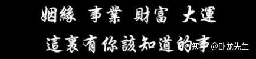

人真的能够靠玄学改变命运吗？ \- 卧龙先生 的回答

【1】

一个小提醒，国庆后，会有一波人起来，会面临很大的重大抉择和重大事情的安排，记住，做任何大事之前，前三天尽量不吃牛肉，海鲜类的食物，做大事之前尽量不跟任何人吵架，做大事之前不剪头发和指甲，做大事当天穿戴整齐，一定要精彩奕奕，祝你国庆后各种事都能成功。

【2】

但凡在闲鱼上卖卖闲置，就能知道，钱花出去买成物容易，物再换回钱有多难。 大多数钱花了就是花了，再也不会回来。 大家消费一定要谨慎，尤其是大额消费，多想想它到底能为你带来什么作用价值，以及日后好不好出手，还能不能换钱回来

【3】

从寿命上面来说。你跟小辈斗

你最终都会落败

小辈永远都是最后的赢家

善待。爱护晚辈

也是放自己中晚年一条生路

路才能走宽一点

【4】

今后的日子，一定要多做的事情:

多吃素，多孝顺父母，一定要发心戒除邪淫，多祭祖，喂小鸟，喂蚂蚁，不管你多有钱，一定要惜福惜物，节约水电，爱惜食物。

尽量坚持日行一善，不要拿任何不属于自己的东西，不要去贪小便宜，保护好自己的口业，学习传统的文化。

感恩这世间的万物，感恩天地，感恩祖国，感恩祖先，感恩我们的父母，感恩我们的历代宗亲，感恩我们所有的冤亲债主。

我们要常怀这颗感恩之心，感恩是宇宙之间最高频的能量。

【5】

你养的花、鱼、宠物，其实都和你命运相连，是彼此缘分的羁绊。

你能养好它们，说明你们磁场相合、频率相近。同一间办公室，同一盆花，同样的浇水晒太阳，有人养得枝繁叶茂，有人养得枯黄凋落。 那个养枯的人，生活状态多半也不如养旺的人，冥冥之中早有暗示。

【6】

你的收入，永远和自身福报适配。月薪六千，是当下福报的成果；若跳槽拿八千，意外开销会让你回到六千的“轨道”。

提升福报，读好书、行善利他，福报超过六千的承载，新财富通道自会开启。福报够了，财富不请自来，这是生活的“能量守恒”。

【7】

小朋友灵性强。

有啥犹豫不定的事，试着用尽量简洁的描述，问问小朋友的想法。

大道归真，简单纯粹的思维，往往最接近真实答案 ～

【8】

孝敬父母，可以给父母买米面油，可以发红包，尽量不送，鲍鱼海参，买各种高额的名牌衣服，尽量也不大摆宴席祝寿，这都是快速消耗对方的福气和福德，也可以帮父母做功德，做捐赠功德，写他们的名字，帮他们做祭老祖先，写他们名字，懂得帮他们积福，尽量不散福。听懂就好，祝天下所有父母长寿安康。

alt="Image">
