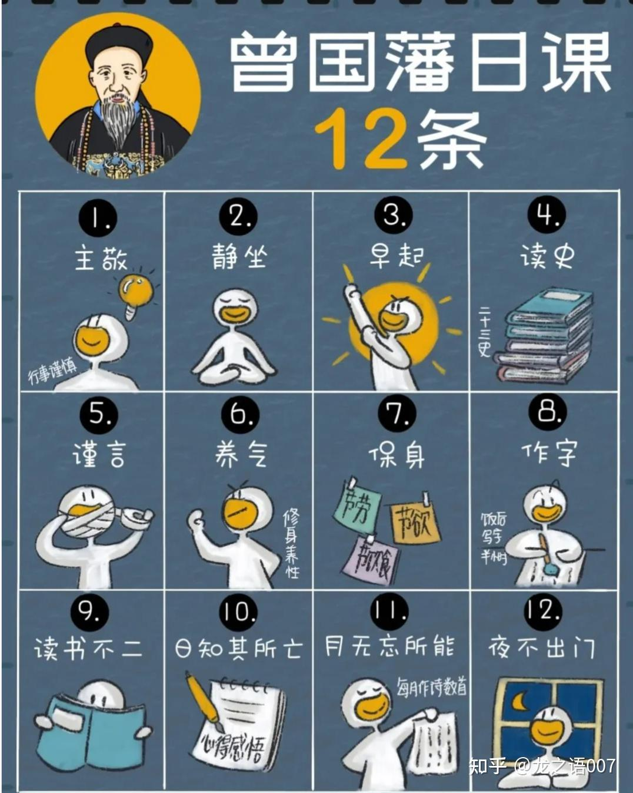

随着人生阅历的增加，我越来越觉得，__决定一个人能走多远多高的，不是他的智商，不是情商，而是他的心力。__

当一个人心力不强的时候，再有能力也发挥不出来。具备强心力的人，哪怕暂时能力不够，也是可以慢慢成长起来的。

我刚刚毕业的时候，总想着下班精进自己，给自己列了一大堆计划，但是下班后基本就是没什么学习心思，只顾着看点搞笑节目、玩电脑，然后睡觉。

后来，我才明白其实我的懒惰、心态差、容易放弃都是心力不足的表现，我慢慢学会了精神内守。

心力强的人，有四个特征：

1）面对长期的不确定，不焦虑、不逃避；
2）遇到挫折，不会自我否定，也不会轻易放弃；
3）有清晰的目标，能在情绪低谷时，仍保持基本行动力。
4）在压力下保持冷静，不被情绪左右。

一个人有强大的心力，就不会害怕困难，反而会在困难中不断挑战，不断成长。

你可以简单理解为：__心力__是三个要素的总体，包括__复原力、坚毅力、创伤后成长力。__

心力真不是打鸡血，而是一种非常稳定的内在力量，心理学上叫它“心理韧性”，也就是遇到事情的时候有多能扛。

古时候十几岁的孩子就能当顶梁柱，而现在有的人三四十岁了还是个巨婴，没有主见，没有目标，遇到事情就慌张，随便一点挫折就爬不起来。

普通人的崩溃往往是心力的崩溃，心力涣散时，勇敢的人也会变得胆怯，心力凝聚时，弱小的人也能激发出强大的能量。

现实生活中，我们经常会听到一些人总是抱怨，觉得自己的人生艰难。但他们遇到事情就退缩，定下的目标总是完不成，这些就是心力弱的表现。

__同理，很多人看似缺执行力，本质是心力亏空。__

比如，他们明明知道健身能让自己更健康，收藏了十几个自律视频，幻想自己精力充沛。可一旦他们拿起手机，一刷就是一下午，连床都不想下。

data\-caption="" data\-size="normal" data\-rawwidth="1077" data\-rawheight="973" data\-original\-token="v2\-3c04c82e4a8c95039903aef34d36ff71" width="1077" data\-original="https://pic2\.zhimg\.com/v2\-b1f6d76257a8c1b6b8a2ee243de441d3\_r\.jpg" alt="Image">

而心力强大的人，他们的内心有一股力量推着他们前进。所以，他们每天神采奕奕，能量十足，会干出一番事业。

能在社会混上去的人，都练就了钢铁般的心理素质，甚至不要脸的本事。

普通人必须明白，你想要翻身，不仅仅是靠能力，更需要的是内心的强大。

你必须具备不被外界干扰、不会轻易自我怀疑的能力，你才能在这个残酷的社会里，一步一步爬上去。

02

历史上那些卓越的圣贤，无一不是心力强大之人。

### 1、曾国藩

在漫长的中国历史中，留名的人浩如星辰。能被称为“千古第一完人”“半个圣人”的，却只曾国藩一人。

他家世普通，资质平平，7次才考中秀才，却凭借“笨办法”兴洋务、组湘军、平太平天国，成为晚清中兴第一名臣。

我们经常听到有人说：我没钱没资源没背景，怎么可能做成大事？

但曾国藩的经历却告诉我们：__普通人也能通过一件件小事的坚持，成为大人物。__

曾国藩恪守日课十二条，其内容涵盖治学修身、言行规范、养生律己等方面，形成完整的个人修养体系，被后世视为传统修身实践的典范。

__第一条，主敬__
__整齐严肃，无时不惧。无事时心在腔子里，应事时专一不杂，如日之升。__
__第二条，静坐__
__每日不拘何时静坐半小时，体验静极生阳来复之仁心，正位凝命，如鼎之镇。 __
__第三条，早起__
__黎明即起，醒后不沾恋。__
__第四条，读书不二__
__一书未点完，断不看他书，东看西阅，徒务外为人，每日以十页为率。__
__第五条，读史__
__廿三史每日十页，虽有事亦不间断。__
__第六条，日知其所亡__
__每日记茶余偶谈一则，分为德行门、学问门、经济门、艺术门，写日记，须端楷，凡日间过恶（身过、心过、口过）皆需一一记出。__
__第七条，月无忘所能__
__每月作诗文数首。__
__第八条，谨言__
__刻刻留心，是工夫第一。__
__第九条，养气__
__气藏丹田，无不可对人言之事。__
__第十条，保身__
__谨遵大人手谕，节欲、节劳、节饮食。__
__第十一条，作字__
__早饭后作字，凡笔墨应酬，皆当作功课，不可待明日，愈积愈难清。__
__第十二条，夜不出门__
__旷功疲神，切戒切戒。__

而在此之后的数十年，曾国藩凭着自己顽强的心力，刻苦学习，考上秀才，举人进士。后来，他更是凭着“有恒“的心力，“十年七迁，连跃十级” ，创造了道光朝的升职纪录。

data\-caption="" data\-size="normal" data\-rawwidth="1076" data\-rawheight="1346" data\-original\-token="v2\-682f7bddda216e1b502ef988507ec9cf" width="1076" data\-original="https://pic3\.zhimg\.com/v2\-aa3910acdf2a88aeec11396fe8d65540\_r\.jpg" alt="Image">

在他写给几位弟弟的信中可以看到，曾国藩一生最推崇的品质就是“有恒”：

凡人作一事，便须全副精神注在此一事，首尾不懈，不可见异思迁，做这样想那样，坐这山望那山。人而无恒，终身一无所成。

正是因为曾国藩有着顽强的心力，强大的意志力及“打掉门牙活血吞”的斗志，扫平太平天国，署里两江总督。

一个人的心力就是自己的底层竞争力，心力上限，真的可以决定能达到的人生高度。

### 2、王阳明

王阳明出身名门望族，十一岁时写的诗就获得当时文坛领袖的青睐，惊叹王阳明小小年纪便有如此才华，称他有“状元之姿”。
