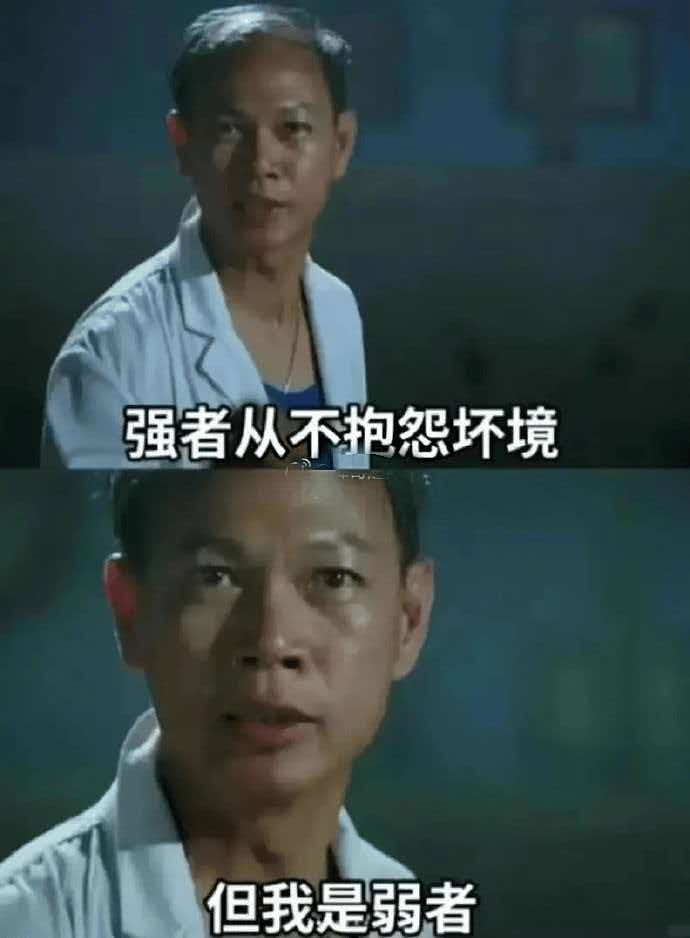
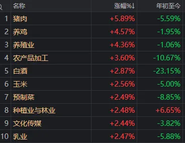
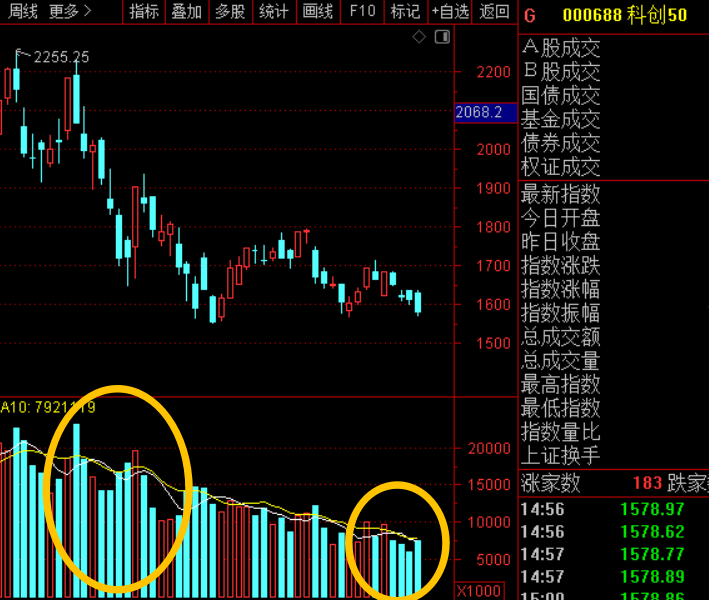
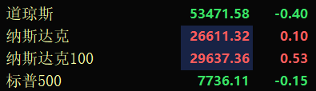
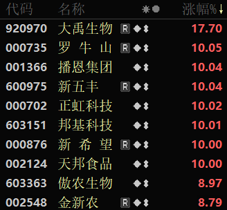

今晚，利空靴子落地了！

[源网页](https://zhuanlan.zhihu.com/p/2079359514638397968?share_code=aKtmSd65QWnn&utm_psn=2079521681253593936)

今天A股把全世界都看懵了，__隔壁日韩全涨了1%以上，港股更是涨超2%__。但我们三大指数全球独跌，这确实让人看不懂了。

如果硬要找原因，我认为是这几个：

1、今晚老美将公布8月非农就业数据，资金提前抢跑规避风险。

2、量化“负反馈”机制放大了市场的跌幅。

3、存量博弈下市场信心不足，流动性出问题了。

4、几个莫名其妙的小作文，比如浪潮信息的跌停，也打击了市场信心。

今天全球都在涨，大A独憔悴。__出现这种行情的本质就两个字：缺乏信心__！大家都不愿意买盘了，卖一点就加速跳水，市场就会造成恐慌。怎么让大家信心能起来，这是监管周末该好好考虑的。

盘面上，今天砸得最狠的还是科技股！也就2个月时间，科技已经从“人见人爱”变成了“人弃狗嫌”。这就是抱团带来的极端，涨的是很猛，机构撤退时也冷酷无情。

科技的问题是，AI、机器人、半导体这些都有长期逻辑；但短期资金没有信仰了，随时想着落袋为安！所以科技不是不好，是调整还没结束。

今天反弹的一些都是__老登股，白酒、猪肉、房地产、券商啥的，这些都是避险品种__！科技股吃瘪，老登再次崛起，说明资金又高低切去做了防御。

如果科技持续弱下去，老登股会不会接力？现在一些老登位置很低，包括消费、医药医疗、互联网、地产链，有一定的投资价值。但这些板块可以修复，想拉动指数\+市场人气还是比较难的。

现在A股还有一个问题，就是量化策略的高度趋同：

尤其__是科技板块，量化普遍锚定美股、韩股因子，但最近走势总跟外围反着来__！导致量化信号失灵，程序化止损盘蜂拥而出，形成“下跌→止损→再下跌”的恶性循环。

为什么量化策略会失灵？一是散户不怎么玩了，量化没有对手盘；二是成交量持续萎靡，以科创50为例，7月初一天能成交2000多亿，最近就只有600多亿了。

昨天央广财经又发文谈量化道德的问题，我觉得说得挺好的！量化对A股会带来“涨的时候能助涨，跌的时候助涨跌”的情况，但这个该怎么矫枉过正，要多久落地，现在还不知道。

今天唯一的好消息就是，周五了，又可以休息了！后明天市场也不用跌了，这也是一种幸福吧。

\.\.\.

__利空落地！美国8月非农就业人数增加16\.2万人 远超市场预期。__老美8月非农爆雷了，新增就业人数16\.2万人，预估为增加5\.5万人！这数据大跌眼镜啊。

另外，美国6月份非农新增从2万人上修至3\.1万人，7月份减少2\.3万人上修至增加2\.1万人。两个月合计新增5\.5万人！

消息一出，交易员加大了对美联储9月加息的押注。美债、美元指数都冲高，黄金白银跳水。但美股、欧股都没怎么跌，人家稳的一批。

老美硬科技还暴涨，费城半导体涨了3%。__存储的美光、SK海力士、闪迪都大涨超4%，英伟达涨超2%，马上就要历史新高了__！

今天A股白天大跌，就是主力预判了今晚非农大超预期，文峰真厉害啊。但外围人家根本没有一片腥风血雨！这凸显大A恐慌过度了，下周一应该可以涨了吧，尤其是科技股。

__上证报：外部扰动不改中国资本市场稳韧本色。__上证报援引多位市场资深人士表示，A股不管是基本面还是资金面，都是稳中向好。

现在就是情绪面受到外部干扰，这需要凝聚更大的合力，增强市场信心，引导投资者‘风物长宜放眼量’！

说的很有道理，但要增强市场信心，唯有上涨。

__央行：9月7日将开展5000亿元买断式逆回购操作。__在全球央行集体拧紧水龙头，美债收益率还在4\.75%高位，日本韩国都在加息的当口。

咱们央行反手放水5000亿，下周一落地。当然因为有5000亿到期，这次操作为等量续作，不算太大的惊喜，但表明了央妈的态度。

__今天猪肉板块大涨。__主要有两个利好，一是生猪价格从低位反弹超25%，最新均价11\.03元/公斤；二是能繁母猪存栏下降比较多，相当于生猪去产能，对后续猪价走势形成支撑！

今天猪肉的段子，短期缺猪心，长期缺猪肝，永远缺猪腰子！你要在猪里，但不能只站在猪里，更不能像猪一样站着。时间会证明猪模块。

__证监会开出2\.3884亿巨额罚单。__创业板上市公司元道通信，上市环节就开始造假，性质极其恶劣，被证监会重罚2\.38亿元！

其中，元道通信公司被处2\.3884亿元罚款，董事长李晋被处750万元罚款，副总经理兼财务总监曹亚蕾处以600万元罚款，董事吴志锋处以300万元罚款。

这个应该会威慑其它上市公司，更好的保护投资者。但有两大不足，一是应该有人蹲局子，二是应该赔偿投资者。

__特朗普喊话美联储降息。__今天老川的传闻闹得沸沸扬扬，结果又是一场乌龙。特朗普不但现身了，还呼吁美联储降低利率！这又是护盘美股了。

说真的，我还挺喜欢川老头的，他的两个任期，A股总体也算是牛市！只不过外围市场涨的更好，显得大A又是拖油瓶。

虽然美国8月就业数据爆表，但9月美联储99%不会加息。毕竟不仅特朗普喊话降息，万斯也表态希望降息。美联储胳膊拧不过大腿的。

今天周五就少说点，大家周末都嗨起来吧！

内容效果不满意？[点此反馈](https://feedback.notebooksyncer.com/feedback/76fa9529_1788576641700?u=https%3A%2F%2Fzhuanlan.zhihu.com%2Fp%2F2079359514638397968%3Fshare_code%3DaKtmSd65QWnn%26utm_psn%3D2079521681253593936&s=onenote)
