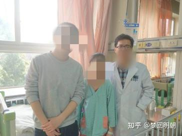

从小到大，父母和家人朋友都教育我要做一个善良有爱的人，我也一直是这么做的，与人为善，乐于助人是我的准则之一。然而从读研开始在医院的各种经历告诉我，做医生，做人要有实力，只有有实力和价值，才能真正做一个善良，有爱的人，不然的话我们对于病人的同情都是没有任何意义的，有可能在这个过程中反被人害，不能保护自己。

我自己总结，医生在医院对待患者及家属的态度分为三个层次和阶段，第一是刚上临床的时候，满腔热血，想要治病救人，全心全意为病人和家属着想，自己辛苦受累甚至偷偷违法规定都行，也没有任何怨言。第二，在临床时间久了，见到和打交道的三教九流的人多了，被患者和家属坑的次数也多了，人的自我防卫机制升起，这时候对待病人和家属，一般是冷漠，话少，按规则办事。这是大家在医院见到的医生最常见的表情和状态。第三，又变的温和，有爱，热情了，但是这时候已经有分辨各种类型人的能力，看得出那些人值得帮助，那些人有可能有纠纷倾向，那些人可能会比较坑。对于筛选出来值得帮助的，尽心尽力的去帮助，治病救人，或者想办法为其减免费用，找基金会支持等等，对于那些可能比较麻烦的，不得罪，按规矩办事。即使中间有可能被坑，也有各种人脉，资源，能力，能够自保。希望都能做到第三个层次啊。

我工作在儿童医院快四年时间，全心全意帮助了2个小朋友。第一个是我印象最深刻，投入最多最大的，也是命运最惨的一个小女孩。当知道小女孩完整的经历后，我脑子里浮现出一句话，地狱究竟有几重。

一天晚上指标，急诊电话说给收了一个病人，一个小女孩儿十二岁，前几天肚子疼去潞河医院，诊断的诊断是阑尾炎，用保守治疗输液了几天发现不管用，再次检查，发现是胃穿孔，他们哪里处理不了小孩的，就送到我们这儿了。收进来之后正常一整套流程先给小女孩安排好。弄完跟家长病情沟通，当时只有她妈妈和舅舅舅妈在，意思是先保守治疗，不行的话就要做手术，手术的话要准备5万块钱，建议他们先准备好，交上，多退少补。谈的时候就感觉她妈妈心神不宁，但是也没太在意，以为是小孩病情导致的。谈完之后她妈妈去给小女孩买住院用的日用品，

只有他舅舅在，她舅妈还怀孕了。

小女孩舅舅又进办公室问手术的概率，又跟他沟通了一下病情，说很有可能会手术，根据术中情况判断手术切除范围，术后相当长一段时间是不能吃饭的，不管怎么样都要花费不小，要他们做好心理准备。

这时候这个舅舅有点迟疑，说费用的问题能不能晚点交，现在没有钱，我说小女孩的父亲呢？父母有医保的话，回去可以报销一大部分。

这大哥犹豫了一下是，说他们没有医保，这孩子父母离婚了，我说怎么她父亲离婚就不管孩子了吗，再怎么样也是他孩子也得给救，得管呐。大哥说我跟你说真实情况，但是请保密。一听这个，看来这里面有事啊，就让他给我详细说一下到底是什么情况。这小女孩在1岁时候，父母离婚了，因为母亲没有工作，就判给了父亲，没过多久，孩子父亲就又找了个老婆，后妈怎么看这孩子怎么不顺眼，带着孩子父亲也看女孩不顺眼，觉得是拖油瓶，耽误人家一家人好事，俩人就各种虐待，后妈不给饭吃，亲爹各种打，甚至还用刀砍，女孩胳膊腿上的有很多刀砍伤的疤痕。这样过了几年，在小女孩七八岁的时候，再也受不了了，离家出走，说是离家出走，其实就是在家附件几个村晃荡，到处找吃的，更是饥一顿饱一顿，但是就是这样也不愿意回去。女孩亲爹和后妈根本也没想找孩子回来。一个小女孩天天在外面游荡，就被隔壁村一个不怀好意的老光棍盯上了，假意给小女孩各种吃的，骗的信任后，让小女孩住在他家了，后来就发生了禽兽不如的事情了。小女孩跑出去之后跟村里人说了，村里人找来了亲爹，女孩的亲爹听说之后第一反应不是报警，是要老光棍给一笔钱，这事算过去，唉这个亲爹也是禽兽不如的。村里人看不下去，打电话给女孩在北京打工的母亲，女孩母亲马上回去，报警，把老光棍抓进去了。

我说小姑娘母亲不知道她过的什么日子吗？女孩舅舅说，她母亲出来北京打工也再婚了，生了一个男孩后，又离婚了，也没工作，也没多少钱，就是时不时给小女孩父亲寄点钱让给小姑娘花，他们也没想到小姑娘过的这种日子。听村里人说了之后，女孩舅舅和母亲决定把抚养权要过来，再怎么样也比在这种亲爹那强，结果这亲爹不放，不给，找了村里，乡里的，甚至报警都解决不了，这亲爹本身就是那种流氓地痞样子，别人也怕报复，就没敢怎么样。我问，都这样了，他又不养，为什么不放抚养权呢。

女孩舅舅接下来的一段话让我明白，地狱究竟有几重啊，他说，亲爹的想法是农村女孩少，再过几年就可以吧小姑娘嫁出去了，这样可以收一大笔彩礼钱。唉，禽兽中的禽兽啊。

没办法，女孩舅舅和母亲只能偷偷的把小姑娘带出来，在北京郊区，跟他们住一起，刚开始她妈妈把她送进附近的农民工子弟小学读书，后来不知道怎么亲爹知道了，跑过来，强迫小姑娘辍学，理由是上这种学校，让他很没有面子。

她母亲怕小姑娘又被亲爹带走，就没让小姑娘上学了，跟着她一起做点零工，维持生计。日子刚上正轨，结果发生了这种事情，这么严重的病。说完，女孩舅舅也是一脸叹息。

我问他，那现在这1万的住院费是谁交的。大哥说是他交的，他也是打工的，还能再凑1万，但是再多也够呛了，自己老婆也怀孕了，也得养家糊口。

听完之后，我觉得，这个小女孩太悲惨了，基本上小孩儿能经历的所有悲惨的事情都全部经历过了。这时候发现，我搁这伤心，同情，对小姑娘没有任何意义啊，我如果不能帮她解决费用问题，帮她解决上学和抚养权的问题，那么我的同情，情绪表达没有任何价值。

当时下定决心，要尽全力实实在在的帮助小姑娘。第二天，我跟领导汇报了情况，也跟护士长说了，尽量的减免费用，申请医院里面的救助基金，结果因为疫情，国家没有下拨资金了，基金也就没有钱了。唉，疫情，一言难尽啊。

后来我一方面给宋庆龄基金会，当地的妇联，中国慈善总会等等基金会联系，只有妇联能出法律援助帮助解决抚养权的问题，当地教育局说会查义务教育阶段辍学问题。资金的问题是一点也没解决。没办法我把事情的经过隐去关键细节和信息后整理发到了校友群，北大的师兄师姐们还是很有爱心的。大家各种出谋献策。王师兄看到后跟我说，他可能能帮上忙，要了女孩的住院材料后，师兄找了民政部的部门，一方面申请民政部的救助基金，但是这个基金流程多时间久，另一方面找人给水滴筹的人打了招呼，第二天水滴筹的人就到医院找我们核实情况，给小姑娘开通绿色通道，快速发起筹款，想先把先期的费用先解决掉。

处理水滴筹事情的时候发现这一家人是真的比较老实的。那水滴筹的工作人员话本来想让他们筹个十来万，结果他们因为听我病情沟通时候说可能需要5万，就申请了5万。当时我听说之后已经晚了，水滴筹已经发出来了，但是我知道，大概率5万是不够的。水滴筹发出之后，我在校友群里一发，师兄师姐们半天就把钱捐齐了，大家都是很有爱心的，也都在用实际行动来表达自己的爱心。

我们继续治疗，小孩子的生命力是很顽强的，情况越来越好，就不用手术了，但是由于长期使用静脉营养等比较贵的药物，5万的费用很快快用完了，这时候我们也觉得病情控制差不多了，想给他们省点钱，让小女孩出院回去回当地附件医院再输输液治疗稳定一段时间就没问题了。

万万没想到，出院之后不到一个月，小女孩又被急诊送来了，一看，典型的电解质紊乱表现，一问发现是当地医生不懂小孩治疗，胡治乱治，病情又恶化了。我问家长费用咋办，小孩母亲说他们凑了1万多，我一看，这还是不行，就跟王师兄联系，师兄催问了民政部那边，那边答应一周之内核实之后把资金打到医院账户上。这次彻底解决了费用问题，我们就让小姑娘安心住下，治疗了一个月左右，反复检查确认没问题之后，才让她出院回家。

在这段时间里，我唯一一次看到小姑娘笑就是她妈妈来病房探视她，告诉她抚养权已经变更了，她以后就跟着妈妈了，小姑娘听完笑的非常开心。

在住院过程中，小女孩很喜欢看书，虽然被动辍学，但是对书，对知识的热爱的无法掩盖的，平时就在病床旁边看我们放在病房的各种书。我在数学系读博的哥们听说了小女孩的经历之后，一直想为她做点什么，我告诉他小女孩很爱看书之后，他跑到书店，买了一套儿童读物送过来。小朋友很开心，我们在病房合影，这也是我跟小女孩唯一一张合影。

小女孩出院之后，我嘱咐她妈妈，去找教育局的人解决小孩上学的问题，把详细步骤，联系方式给了她，一切正常的话小女孩会重新回到校园的。

最后想想，我兑现了自己当初的想法，用实实在在的行动来帮助她，让我的同情和爱心真真正正的对她有意义，也让我的善良落实到了实处，践行了阳明先生的知行合一。这个过程中跟各种部门，各种人打交道，也深深感受到了，人还是得有实力，做事是很不容易的，做成事更是难上加难，只有变的强大，才可能把自己的意愿变成现实，才有机会让自己帮助更多的人。
