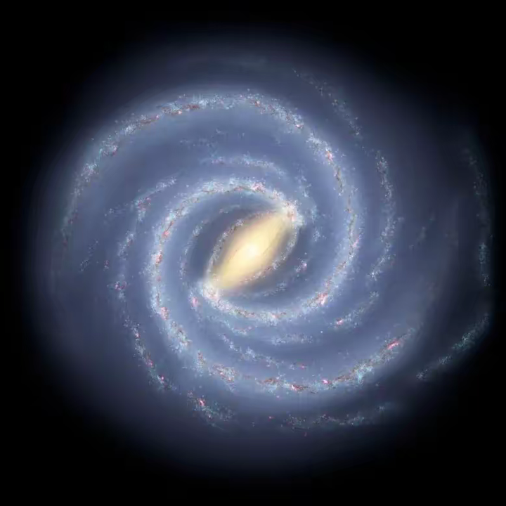
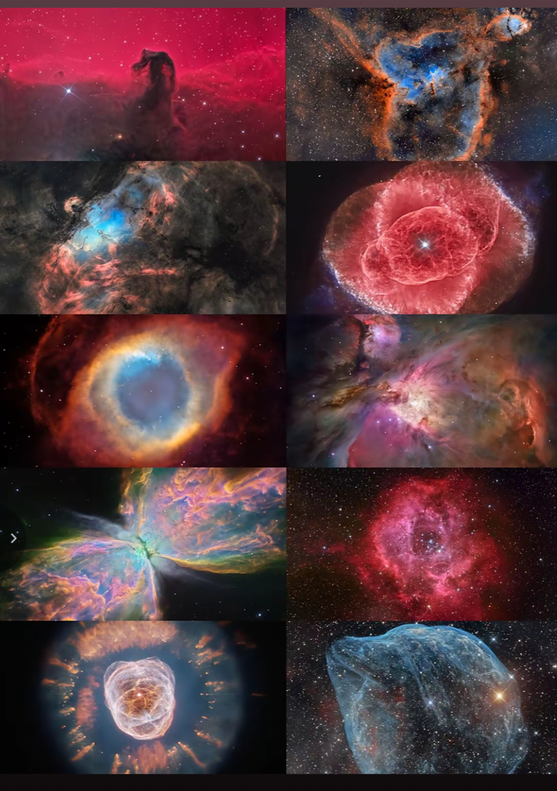
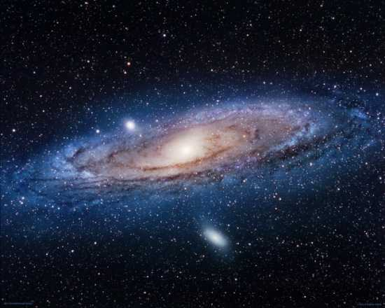
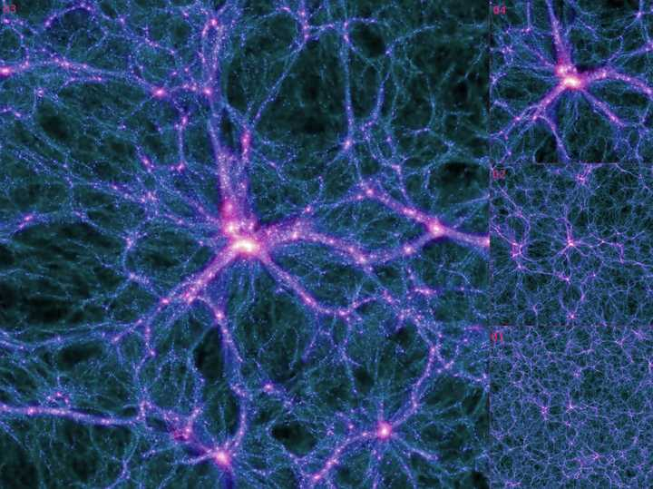
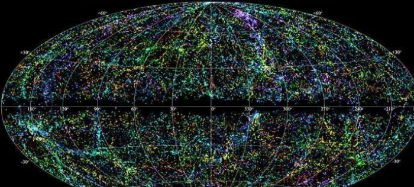

佛到底是一种境界，还是到底是一种唯一式的神？ \- 石昊 的回答

__问题描述：__

总是拜佛，有佛祖。有时又觉得它是一种境界，到底什么才是正确的呢？

这得看哪本书了，华严经，其中的诸佛诸菩萨，似乎是外星神级文明。

而且不是唯一，而是许多。

## 本文可以当脑洞科幻小说来看。

将它作为科幻小说，来看的话，它似乎揭示了费米悖论的一种反面情况：

__那就是外星文明并不稀缺，相反极多，有如微尘一般多。__

而在华严经中，如来佛和毗卢遮那十方化佛，全身似乎都是星云构成，是的没听错。

似乎是一种“星云意识”。

……

另一本佛经，起世经，它是佛经中，讲宇宙起源、结构、演化及毁灭过程的经书。

它第一章，刚好也有一句挺有意思的话：

它是这样说的：

__此千世界，犹如周罗，名小千世界。__

周罗，是隋朝时，翻译印度的佛经，对盘起来的发结的音译。

这段话，翻译一下，意思也就是说：

我们所在的这个小千世界，它的形状，就像盘起来的发结一样。

那么什么是小千世界？

起世经第一章，刚好也铺垫了设定：

一日月所行之处，照亮的四天下，就为一个世界（四天世界）；

千日月所照之处，就为一千世界，也就是小千世界；

一千个小千世界，周流旋转而成的集合，就是中千世界；

一千个中千世界集合，就是大千世界。

因为重复了三次“千”，三重千架构，所以这又叫：

## 三千大千世界。

我们经常听过的一个词。

也就是说，此千世界，犹如周罗，意思就是：

__我们生活所在的这无数的星星群（千日月），所组成的空间（此千世界），它的形状，就像盘起来的发髻（周罗）一样！__

然后释迦摩尼（或者是其他古人），把这个空间，叫做小千世界。

然后还有由无数小千世界组成的，更大的中千世界、大千世界。指数级翻倍。

注意，起世经这本书，主旨就是讲世界起源、演化的。

而这段话，刚好是《起世经》的第一章的内容，提到的。

一本讲世界起源、演化的古书，第一章就明白写了我们所在的“世界”，形状像盘起来的发髻，怎能不让人感到震撼呢？

而我们现在看到的《起世经》，是隋朝翻译的版本。

我们现在看到的《起世经》现存版本，主要为隋代译本。由天竺高僧阇那崛多（523\-600年）翻译。

也就是说，几乎可以保证，这段内容，是古人写下来的话。不是现代人添加进去的。

也许是释迦摩尼，或者是后面某位（隋朝以前的）古人，借释迦摩尼的名义，写下来的内容。

所以至少一千五百年前（算释迦摩尼的话，两千五百年前）的古人的脑洞，是怎么做到这么大的呢？

（注：各种佛经，则是释迦摩尼，他在地球上的古代弟子，在他灭度后，口口相传，再过了几百年后，才用贝叶等书写介质后面总结他的语录，编撰传下来的。而最早的口传版本已经不可考了。所以也许大概率掺杂了后面的弟子的一些自我认知的内容进去。）

他是怎么想出来的，我们所处的星星群，组成的空间（此千世界），外观像是盘起来的发髻呢？

alt="Image">

（银河系图片）。

我们看到的中文版起世经，成书在隋代，可以说和佛陀释迦摩尼在世的年代，隔了一千多年！

印流传的原始的梵本，可能没那么久，但即使梵文本，估计和佛陀所在年代也隔了几百年了。

所以也许释迦摩尼在世时，讲的内容，更偏向科学也说不定。只是弟子加了很多宗教认知的内容进去。

这个就像老子的道家，本来是朴素的辩证唯物哲学论，并没有什么宗教元素，然后慢慢演化，被许多后人附会，加入了许多本土方士等宗教元素内容，变成了道教一般。

道教和道家学说，差别挺大的。

也许释迦摩尼讲的是“科学”，被盛行宗教的印度的那些弟子，加了许多本土宗教内容进去。

或者是释迦摩尼为了让弟子更好接受，所以借了本土宗教的一部分内容，讲述自己的内容。

如果真的是一个普通地球人，脑洞大爆炸思考宇宙结构，他也怎么会往盘起来的发髻，这个方向想的呢？

你可能会说这只是凑巧，是在牵强附会文字，起世经第一章的这段话，原意，可能并不是那个意思。

那其实可以对照另一本佛家经书，华严经的内容。两本书交相印证。互为补充。

华严经，也是讲佛家宇宙观的一本书。

华严二字，是华藏庄严世界海的简称。

## 华藏庄严世界海

也就是这整本书，都是在讲：

__莲花（华）一样，含藏无数庄严的世界的海洋。__

（藏（zang），梵语原意是胚胎、花苞内部、宝库。）

所以简称华严经。

世界，前文也说了，按照起世经第一章的定义，就是“星星团”的组合。

一日月所行之处，构成的日地月系统，就是一个“世界”；

千日月所照之处，构成的系统，就是“小千世界”；

中千世界，是一千个小千世界集合，大千世界是一千个中千世界集合。

那么华严经，整本书描写的“华藏庄严世界海”，再用上述设定，翻译一下，是啥意思呢？

星星团，组成的海洋（千万亿日月所照之处），神圣庄严，像莲花一样漂亮。

华严经中，多处内容提到：

有世界，状如卍字/形如卍字/犹如卍字…

有世界，犹如水漩流；

有世界，旋绕之形；

有世界，状如莲华（花）；

alt="Image">

alt="Image">

alt="Image">

alt="Image">

随便摘一条原文“世界”描述：

此上过佛刹微尘数世界，有世界名妙梵音；形如卍字，依宝衣幢海住，一切华庄严帐云弥覆其上，九佛刹微尘数世界围绕，佛号广大目如空中净月。

此上过佛刹微尘数世界，有世界，名：宝色庄严；形如卍字，依帝释形宝王海住，日光明华云弥覆其上，十一佛刹微尘数世界围绕，佛号：迥照法界光明智。

你看，随手摘的这两个世界，形如卍字，而且华庄严帐云/日光明华云，覆盖在上面。听起来像不像卍字旋转的星云构成的“世界”？

结合前面，几种类型世界（小、中、大千世界），分别指的是指数倍增的星星团的设定。

很明显，这儿说的像卍、像水漩流的“世界”，指的就是天上星系的形状…

__佛教中大家经常见的卍字，其实在佛经中，经常指的就是，星系的旋臂形状！__

你参考星系图，你就说这个卍字，形不形象吧？！

所以你比如《华严经》，你以卍，为关键词搜索的话，你就会发现，出现非常多的就是：

有世界，状如卍字/犹如卍字/形如卍字之类的。

卍，这个字，发明出来，似乎是古人用来指代星系旋臂形状的！

你说，如果只是宗教人士无聊开脑洞，设想宇宙观，怎么会往水漩涡、卍字、盘绕的发髻、云、莲花、河流，这种形状来设想呢？

华严经很有意思的一本书。

里面经常出现的一种东西，是一系列特殊的“云”。

这些云的特点，原文描述特征是：遍布在虚空中，不会散开，而且发光，是无数的摩尼宝珠组成的。

什么宝焰光云、宝色光云、光明云、摩尼宝云啥的。

一本讲佛家宇宙观的书，讲“华藏庄严世界海”的书，为何讲各种云呢？

如果世界海，指的是我们所处的宇宙星海，那么这儿的“云”，又会指的什么呢？

原文中出现云的地方，比如说：

有世界，叫做某某云；

什么有的世界，叫香光云、有的世界叫宝焰云，有的世界，叫光明云啥的…

如果你以现代视角来看，结合上文层层解释的设定，有没有可能，宝色光云、宝焰云、光明云啥的，指的是图片中的东西呢？

alt="Image">

你看看这种“宝色光云”，“宝焰云”的描述，如果说是指代星云，这种描述，是不是非常精确直观形象，而且浪漫文艺范？

星云，不就是“宝焰光云”嘛？

又像珠宝，又像火焰，又发光，又像云。宝焰光云等描述，指代星云，真的是极其形象浪漫！凸显宇宙的美妙。

"宝焰光云"的梵语原文，应该为 ratnolkā\-meghā（रत्नोल्का\-मेघा），

ratna（रत्न）= 宝、珍宝；

ulkā（उल्का）= 火焰、光明（通常指流星、天光）

megha（मेघ）= 云。

所以按梵语意思，同样可以翻译成：

无数星火，组成的珍宝一样的云彩…

这样翻译，是不是显得更直观了？

一般描述这些特殊的云，都会提到它是由无数发光的奇特的摩尼宝珠构成的。

佛经《无量寿经》中有：

“__日月摩尼，珠光焰耀，皆悉隐蔽，犹如聚墨。 ”__

日月，在佛经中也指一种摩尼宝珠。

所以华严经中，摩尼珠，一般可指发光的星星。一种形象化的比喻义。

华严经中开篇第一章，先描述一种奇特的菩提树：

__其树周围咸放光明，于光明中雨摩尼宝，摩尼宝内，有诸菩萨，其众如云，俱时出现。__

这儿说，摩尼宝里，有云一样多的诸菩萨。

你用古代逻辑就很难理解这脑洞：

正常的菩提树，怎么会放光明，还会下雨一般，有许多发光摩尼宝珠漂浮四周，摩尼宝珠里，又怎么会有许许多多的菩萨，在里面呢？菩萨住在树里面的宝珠里？

但如果这些摩尼宝珠，是一种比喻，指的是星星呢？正如前文的日月摩尼。

__摩尼宝藏放光明，普发无边香焰云__。

这原文中的诗词偈颂，你用现代逻辑来理解：

不就是星星像宝藏一般放光明，组成了无边的“香焰星云”吗？！

摩尼宝里面如云的菩萨，不就是无穷星系里，如云一般的外星神级文明的高等生命吗？！

诸佛子！一一香水海，各有四天下微尘数香水河，右旋围绕，一切皆以金刚为岸，净光摩尼以为严饰，常现诸佛宝色光云，及诸众生所有言音；其河所有漩澓之处，一切诸佛所修因行种种形相皆从中出；摩尼为网，众宝铃铎，诸世界海所有庄严悉于中现；摩尼宝云以覆其上，其云普现华藏世界毗卢遮那十方化佛，及一切佛神通之事；复出妙音，称扬三世佛菩萨名；其香水中，常出一切宝焰光云，相续不绝。若广说者，一一河各有世界海微尘数庄严。”《第六章》

__四天下__

四天下，在佛教中，指的是一个完整的“世界”单位，你可以理解成一个有生命的“日月地”星系（类似太阳系的星系）。

__四天下微尘数香水河__

那么这个短语可以翻译成：有无数微尘一般多的生命“世界”（类太阳系），组成的香水一般漂亮的河流（香水星河）

古印度有非常发达的香水文化。

所以这儿的香水海，是一种比喻，将世界海，比做香水海。

而香水海，又是无数的微尘般的香水河组成。

而且这些香水河的特点是：

__右旋围绕。__

你看佛经中，又是在讲旋绕之形的“世界”观。

金刚，梵语意思，有钻石，也有闪电的意思。

摩尼，前文也说了，发光的星星；

宝色光云，前文也说了。

__其河所有漩澓之处，一切诸佛所修因行种种形相皆从中出：__

漩澓，意思就是水漩涡。

你用古人逻辑就很难理解，怎么诸佛诸菩萨，是从河中的漩涡中修炼出来的？

为什么河中，会出现发光的云？为什么河中有各种发光的摩尼宝珠？

但你很幸运是个现代人。你拥有现代人的知识和逻辑。

那么这段话的意思，科学翻译就是：

__世界海中（宇宙星海），有无数河流（星河），它们是旋绕之形，微尘一般多的河流，组成了世界海。__

__颜色很漂亮，就像古印度文化中，常见的香水，组成的河一般。所以叫香水海、香水河。__

__其中是仿佛闪亮的钻石/闪电（金刚）组成边岸；发光的宝珠作为装饰。__

__常常呈现宝色光云的样子。__

__众生一生的言音，都在里面。__

__而这一切漩涡流一般的河流，正是一切诸佛（一切神级外星文明）都从中“修行”出来。__

__摩尼宝珠（发光的星星）组成了树状网络（菩提树），形成了庄严的世界海。__

__而摩尼宝珠（发光的星星群）构建的宝云，其中形成的宇宙意识，就是毗卢遮那十方化佛（普现华藏世界毗卢遮那十方化佛，及一切佛神通之事；复出妙音，称扬三世佛菩萨）__

注：毗卢遮那，梵语意思是光明普照。

十方，意思是十个方位：东南西北、东南、西南、东北、西北、上下。

化：幻化、化现；

佛：觉者。

所以总结翻译一下，毗卢遮那十方化佛，就是：

全方位遍照的光明，化现出来的觉者。（这说的不就是某种意义上的，星系海洋组成的宇宙意识嘛）

所以佛经说人人都有佛性，本自具足。因为也许我们就是那个庞大的宇宙意识的组成部分啊。

这个就是漩涡流一般的微尘一般多的河流…

alt="Image">

\*把星系称之为河，我想大家也不会陌生，比如我们也把银河系叫银河、河汉；

（摩尼为网）

alt="Image">

alt="Image">

（华严经开篇的“菩提树”：宇宙星系树状图）

华严经中，还描写过，诸菩萨都是从各种发光的云中出来的。或者说是从摩尼宝珠中出来的。

而且这些菩萨，用遍布虚空，各种发光的云，来作礼物，供养如来佛陀。

这个脑洞，你如果是古人，按常规逻辑来看，就挺新鲜的，为何是用云，供养如来佛陀呢？佛陀吃云的？凡俗的脑洞，不应该是吃香火啥的吗？（后面还描述佛陀，全身是各种会卍字旋转的发光的云构成，且云是由无数发光的宝珠构成，且诸佛诸菩萨都在这些云中出现）

而且前文咱也说了，华严经中，还多次描述多种世界，“有世界，叫做某某云”呢。

## 如是等诸供养云，有佛世界微尘数。

（《华严经·第一章》。

你看，这原文还说了，供养云里，有微尘一般多的佛世界。

但你以现代视角来看，结合上文设定，以及原文中对“云”的各种描述（比如某世界叫某某云啥的）。

没错，这儿的佛陀，很明显是一种跨星系的超级神级文明，形成了宇宙意识/星系意识。诸菩萨们应该是次一等的神级文明。这些超级神级文明，是用无数星云，作为能源，来支撑整个文明的发展的。

微尘一般多的佛世界，说的是微尘一般多的外星文明世界…

诸佛，就是诸神级外星文明！

华严经中，关于如来佛的身体描述也很有意思。

华严经第三十五章，开始讲如来的身体，所有大人相（如来十身相海品）。

如来头顶，由一种网，和三十一种“云”构成。

头顶最大的那个是一种特殊的网，叫做：

光照一切方普放无量大光明网

alt="Image">

（像这个）

然后他头顶剩下的三十一种云，分别是：

佛眼光明云；

充满法界云；

放宝光明云；

示现如来遍法界大自在云；

如来普灯云；

普照诸佛广大云；

圆满光明云；

普照一切菩萨行藏光明云；

普光照耀云；

正觉云；

……

就不多摘抄下来了。

这是华严经中，构成如来的头顶的三十二种“云”。

然后华严经，讲完了头顶，接着，开始从如来佛的眉毛、眼睛、鼻子等部位讲起，一共讲了六十五种云。

和上述头顶三十二种加起来，总共九十七种云。

比如如来佛的眉毛，叫做：

法界光明云。

原文描述是：由许多发光的摩尼宝珠构成，里面还有许多诸佛在里面。

如来佛的眼睛，叫做：

自在普见云

也是许多发光的摩尼宝珠构成。

如来的鼻子，叫做：

一切神通智慧云

也是许多摩尼宝珠发光构成，而且里面同样有诸佛、菩萨、众生。

摘一段原文：

如来鼻有大人相，名：一切神通智慧云，清净妙宝以为庄严，众宝色光弥覆其上，于中出现无量化佛坐宝莲华，往诸世界为一切菩萨、一切众生演不思议诸佛法海，是为三十五。

如来的舌头叫做：

示现音声影像云

特点也是发“摩尼宝光”。里面也藏着过去、现在、未来诸佛，在里面显现。

如来的舌头又叫做：

法界云

特点和上面所说的一样，也是无数发光的摩尼宝珠构成，里面有诸佛…

舌端叫做：

照法界光明云、照耀法界云

口腔上颚，叫做：

示现不思议法界云

如来的口腔右辅下牙：

口右辅下牙有大人相，名：佛牙云，众宝摩尼卍字相轮以为庄严，放大光明普照法界，于中普现一切佛身，周流十方开悟群生，是为四十一。

看这原文，如来口腔右边辅下牙，原文描述也非常有意思，是由无数发光的摩尼宝珠，以卍字轮转运动，构成的，里面有诸佛在里面，还周边流动“十方开悟群生”（外星普通文明？）。

这点在后面描述其他牙齿及其他部位，也是如此：

如来齿有大人相，名：普现光明云，一一齿间相海庄严，若微笑时悉放光明，具众宝色尼宝焰 右旋宛转

流布法界靡不充满，演佛言音说普贤行，是为四十五。

你看特点依然是：

具众宝色， 摩尼宝焰， 右旋宛转。

再摘一下如来的左肩描述：

如来左肩复有大人相，名：光明遍照云，其相右旋，阎浮檀金色摩尼宝王以为庄严，放众宝华，香焰光明充遍法界，于中普现一切诸佛及以一切严净国土，是为五十一。如来左肩复有大人相，名：普照耀云，其相右旋，微密庄严，放佛灯焰云，清净光明充遍法界，于中显现一切菩萨种种庄严悉皆妙好，是为五十二。

看，同样是发光的云构成，且特点是：

其相右旋

由无数摩尼宝王构成，构成了众宝华（华通花），香焰形状。

且里面有诸佛、诸国土、诸菩萨，在里面。

所以这儿描述佛陀的身子，由各种发光的云构成，且这些云，是由无数的发光的摩尼宝珠构成，且动态效果，是卍字轮转/右旋宛转，且这些云里面，还藏了诸佛诸菩萨、以及“十方开悟群生”在里面。

那么华严经中，这儿的如来佛陀，身体指的是啥呢？

无数星云构成的宇宙意识？

诸佛诸菩萨，又指的啥呢？

无数神级外星文明？

十方开悟群生，指的就是无数外星普通文明？

难道这就是佛经为啥说：

凡所有相，皆是虚妄；若见诸相非相，即见如来？

因为真的“如来”，是那个庞大的星云群意识，古代人间的那位，只是祂的人间体，偶尔链接上了。

印度数学家，拉马努金，说自己的数学知识，是梦中吉祥天女传授的。

难道人的潜意识可以通过睡梦、打坐的形式，偶然链接上宇宙互联网吗？（脑洞）。

话说从更高维度来看，人类大脑神经网络和宇宙星系树状结构的确很相似。

起世经和华严经中，还有一些比较有意思的内容，比如：

《起世经》第一章：

如是大地。住于水上。水住风上。风依虚空。

感觉这和地球的结构，也有点不谋而合。大地上是海洋，海洋外是大气层、大气层外是真空宇宙。

这个描述在《华严经》中，同样有，刚好华严经同样是讲佛教宇宙哲学观的经书，而且华严经中，讲的更加直白形象：

__故说：地轮依水轮，水轮依风轮，风轮依虚空，虚空无所依。虽无所依，能令三千大千世界而得安住。__

咱们依照地球结构可以理解一下：

地轮外是水轮（地壳像一个圆轮，也就是地轮，而海洋构成水轮，地壳上面是海洋，也就是地轮依水轮），水轮外是风轮（也就是大气层这个圆轮），（风轮依虚空，大气层圆轮外是虚空，也就是外面的真空宇宙），真空无所凭依，但是虽然无所依靠，却仍能让三千大千世界（无数星星团）得到安住。

三千大千世界，上面也说了，这个设定，相当于无数个小千世界，也就是无数个银河系（千日月）。也就是无数的星球。也就是说无数个星球，安住在这无所凭依的虚空环境中。

另外，注：

梵语中，轮，也有“圆形的”的意思。

所以梵语中的地轮，重新用中文翻译，也可以翻译成另一种意思：

“圆形的大地”；

水轮，也可以翻译成圆形的水层；

风轮，也可以指圆形的大气层。

只是古人将这梵语，翻译成中文，不懂这些宏大的地球结构，所以按字面另一种意思，翻译成地轮、水轮、风轮…

其实梵语原意，也许是：

圆形的大地外，是圆形的水层，圆形的水层外，是圆形的大气层，大气层外，是虚空。虚空看起来没有凭依之处，但是无数星星团却能在其中得以安住！

这段话完全是从地球结构，讲到整个宇宙无数个星球啊。这还不够直白吗？

他都把地球的形状、层级，直白写出来了：地轮、水轮、风轮、虚空，然后外面是三千大千世界。

层层往上讲。

现代大家看到的《华严经》，主要是唐朝《八十华严》版本。

而其他佛经中（比如《俱舍论》），还有一个金轮的说法，金轮，在经中，说是我们这片大地的承载层。

这不就是说的，那个地球的金属内核的地核吗？

《华严经》

__诸佛子！彼一切世界种，或有作须弥山形，或作江河形，或作回转形，或作漩流形，或作轮辋形，或作坛墠形，或作树林形，或作楼阁形，或作山幢形，或作普方形，或作胎藏形，或作莲华形，或作佉勒迦形，或作众生身形，或作云形，或作诸佛相好形，或作圆满光明形，或作种种珠网形，或作一切门闼形，或作诸庄严具形……如是等，若广说者，有世界海微尘数。 __

这是华严经，对世界种形状的描述。

引用一下AI翻译：

各位佛子！所有这些“世界种”——也就是宇宙里大大小小的世界集合——它们的形状真是千奇百怪：有的像须弥山，有的像江河；有的像旋转的车轮，有的像打旋的水涡；有的像车轮外圈，有的像祭坛；有的像树林，有的像楼阁；有的像插旗的高山，有的像端正的方块；有的像子宫包胎儿，有的像莲花；有的像藤蔓编成的花环，有的干脆像众生的身体；有的像飘动的云，有的像佛的庄严相好；有的像圆满的光团，有的像珍珠缀成的网；有的像一排排门洞，有的像种种庄严饰品……如果真要细说，数量就像“世界海”里的微尘一样多，根本说不完。

前文我们提到佛经中，关于世界的定义，指的是一日月所照之处。差不多也就是一个太阳系了。

三千大千世界的定义，指的就是无数星星群。

所以华严经中，这儿对世界种形状描述，其实就是星系样子的描述，有的像“须弥山”、有的像“莲花”、有的像楼阁、有的像蛇、有的像云、有的像河流、有的像蛛网形……

星系什么形状的都有，有像花的，有像云的、有像蛇的、有像河流的、有像山的……而更大的高度来看，密密麻麻像蛛网一般。

如果只是个普通地球古人，设想无穷世界，他的脑洞，怎么会往这些形状上设想的？

华严经第二章（第一章是武则天题的序，所以第二章才是正文开篇）：

其菩提树高显殊特：金刚为身，琉璃为干；众杂妙宝以为枝条；宝叶扶疏，垂荫如云；宝华杂色，分枝布影，复以摩尼而为其果，含辉发焰，与华间列。其树周围咸放光明，于光明中雨摩尼宝，摩尼宝内，有诸菩萨，其众如云，俱时出现。

这段话的意思可以翻译一下。

高显殊特：

佛经中殊特，有非凡、独特、超绝无与伦比的意思，可见这不是寻常意义上的“菩提树”。

金刚，梵语原文，有钻石的意思，也有闪电的意思。

摩尼，刚才也说了，发光的珠子。

这段话还讲了，摩尼宝里有如云一般多的诸菩萨。

前文提到，比如无量寿经中，就把日月也叫摩尼。

可见摩尼就是天上发光的星星。

所以这段话中说摩尼宝中有云一样多的菩萨，没错，其实说的就是外星的文明。

这儿殊特的菩提树，是闪电（或指钻石）为身体，琉璃为枝干，结出无数发光的宝珠，发光的宝珠像雨一般多，宝珠里有无数的菩萨。

所以，你明白菩提树是啥了吗？

\*（宇宙全景图）

华严经，开篇先将宇宙全景图，比喻成一种殊特的菩提树，然后娓娓道来，这种特殊的菩提树，是由珍宝一样的花（华）和无数发光的“摩尼宝珠”装饰出来的。

且显现出无边的“海洋”，无数外星神级文明（诸佛诸菩萨）生活在其中。各种魔法一般的神通都从中显现出来（克拉克第三定律，一切先进技术，初看之下都与魔法无异）。里面有无数“佛土”（外星世界）。

然后讲了各种“菩萨”、“神”（外星神级文明），有如微尘数一般多。

附一些华严经有意思的偈颂，你可以转换成现代天文学视角，来看看这些古文字讲的啥：

遍满十方虚空界，所有一切诸国土，

如来神力之所加，处处现前皆可见。

或有种种诸国土，无非离垢宝所成，

清净摩尼最殊妙，炽然普现光明海。

或有清净光明刹，依止虚空界而住，

或在摩尼宝海中，复有安住光明藏。

如来处此众会海，演说法轮皆巧妙，

诸佛境界广无边，众生见者心欢喜。

有以摩尼作严饰，状如华灯广分布，

香焰光云色炽然，覆以妙宝光明网。

或有刹土无边际，安住莲华深大海，

广博清净与世殊，诸佛妙善庄严故。

或有刹海随轮转，以佛威神得安住，

诸菩萨众遍在中，常见无央广大宝。

或有住于金刚手，或复有住天主身，

毗卢遮那无上尊，常于此处转法轮。

《华严经·第五章》

须弥山城网，水旋轮圆形，

广大莲华开，彼彼互围绕。

山幢楼阁形，旋转金刚形，

如是不思议，广大诸刹种。

大海真珠焰，光网不思议，

如是诸刹种，悉在莲华住。

一一诸刹种，光网不可说，

光中现众刹，普遍十方海。

一切诸刹种，所有庄严具，

国土悉入中，普见无有尽。

刹种不思议，世界无边际，

种种妙严好，皆由大仙力。

一切刹种中，世界不思议，

或成或有坏，或有已坏灭。

譬如林中叶，有生亦有落，

如是刹种中，世界有成坏。

譬如依树林，种种果差别，

如是依刹种，种种众生住。

《华严经·第六章》

……

所以如果以华严经中的宇宙观来说，它展现的其实是费米悖论的反面情况：

外星文明并不稀少，相反有如尘埃一般极多。

甚至宇宙也不止一个，也是无数个（原文中，介绍了，华藏庄严世界海八个方向的其它世界海）。

无数星云构成了特殊的宇宙意识。

宇宙全景图被比喻成菩提树；

星星比喻成发光的摩尼宝珠；

星云有如珍宝云彩一样美丽。

我们所在的世界，被赞叹成莲花一样、宝藏一般的世界海洋（星云海洋）。

外星文明也是善意的存在，其实那些神级文明，就是无数诸佛诸菩萨。

当然也有普通文明：十方开悟群生。

所以佛法为何以莲花为尊？

因为星系就是这种形状。

为何佛法中经常见卍字？

同样，因为星系旋臂，就长这样。

为何诸佛诸菩萨的形象是坐莲台上？

因为说白了，诸佛诸菩萨，就是从莲花一样的无数星系中，涌现出来。

费米悖论展现的情况如何解释？为何总发现不了外星文明？

因为外星文明这个概念是工业革命以后才有。
