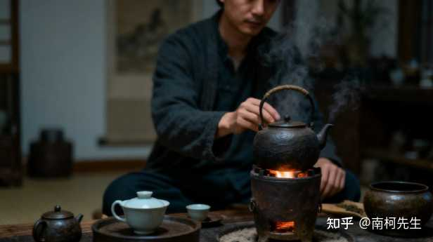

你最近悟出什么道理？ \- 南柯先生 的回答

__【1】 人不动的时间久了心气和灵气都容易被耗尽。__

多接触大自然，与有趣人和事交流，让她们给你转转运。

好运也是势利眼，它会跟着内心能量丰盈和身体健康的人周边转。

所以，在低谷期的时候不妨去打破现状，去做一些平时不敢，不会，或者没时间去做的事情。

这也叫不破不立，就会触底反弹。

__【2】 心力比能力更重要，能力是你会做，心力是你能坚持做，龟兔赛跑，胜利最终属于会坚持的乌龟。__

生活中许多人并非输在不会做，而是败在容易放弃。工作遇到瓶颈就想转行，感情出现矛盾就怀疑不合适，学习碰到难题就觉得自己“没天赋”。其实真正的门槛往往不是事情本身，而是你能否在疲惫时多撑一步，在焦虑时仍保持行动。

培养心力就像锻炼肌肉，从小事开始坚持。比如，每天读书二十分钟，定期整理房间；遇到挫折时别急着否定自己，而是拆解问题，一步步解决；学会给自己小奖励，让坚持有甜头。

记住，乌龟能赢不是因为它快，而是它从不看轻自己的速度，也从未停下脚步。

__【3】修行之中有肢体感觉，分别是身体感，气感和干扰感。__

这三种都会造成身体短时间的晕，震，麻，透。

这三种感，分别是脏腑气，先天气和阴邪气。

一般修行者，会区分不开这三种气的分别，误把病气当采气，误把阴气当阳气。

古代的修行人，其实很多都是医者出身，精通经络，药理，能更准确的分辨气的不同，给予不同的措施处理。

自己修，一旦踏入实证，很容易采错气，造成身体问题，轻则堵，重则精神错乱。

【4】 如果你是身&弱的，就要更需要靠近高能量的人，以印生身。

身&弱不担财，要多穿高品质的衣服主动破财，买房买车买贵重物品。

身&弱赚钱变强的第一步就是反内耗，不要当委屈求全的烂好人。其实身弱的人，事业心和野心都不小。

而且很多身弱之人比身强的人更容易成功，因为她们更有忍耐力，是属于闷声发大财的类型。

只要你内心强大，你就能超越百分之九十五以上的人，不管遇到任何事都是！去提升自己的内在能量吧！

__【5】 其实你这一生的孩子，不管你嫁给谁他都会是你的孩子，只不过换个样貌而已。并且孩子自带口粮__

\(生女儿是你的福气，生儿子是你的贵气。福气多的人容易生女儿，贵气强的人容易生儿子，每个孩子的到来都自带口粮，福报越大，口粮越多。

从一定程度上来讲，还会改善你的经济状况，所以不要和孩子生气，他们是你前世今生的缘因。孩子的存在，不仅是一个家庭的延续，更是一场轮回的缘分。）

【6】天道忌满，福报不仅仅只是金钱，福报在顺境中是锦上添花，在逆境中则是“暗夜灯塔”。

当你陷入绝境时，贵人相助、内心开悟都是福报的体现。真正的圆满，在于留白的智慧，福报终归于内心的丰盈与安宁，而不是外物的堆砌。

查&个字请报上你的日柱，个人简介可寻我

立业、成家、进阶、致富

成大事者，不争朝夕 但求命途清晰。

有这份觉悟的话，你只需丝❤我

放心，你现在的决定 明智且勇敢：

alt="Image">
