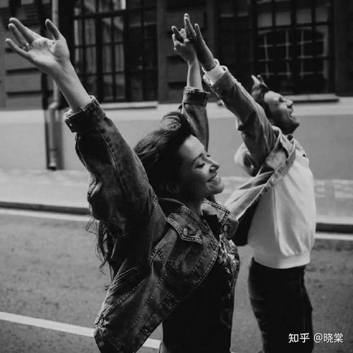
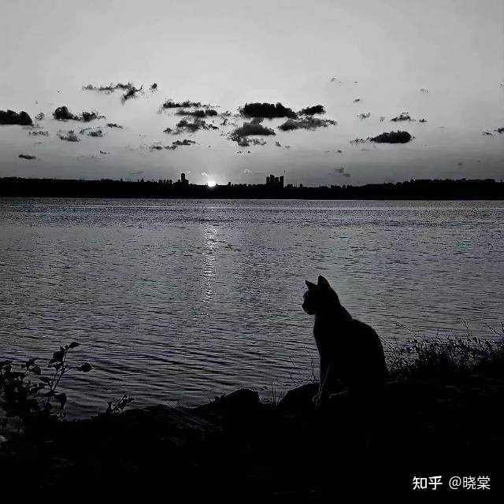
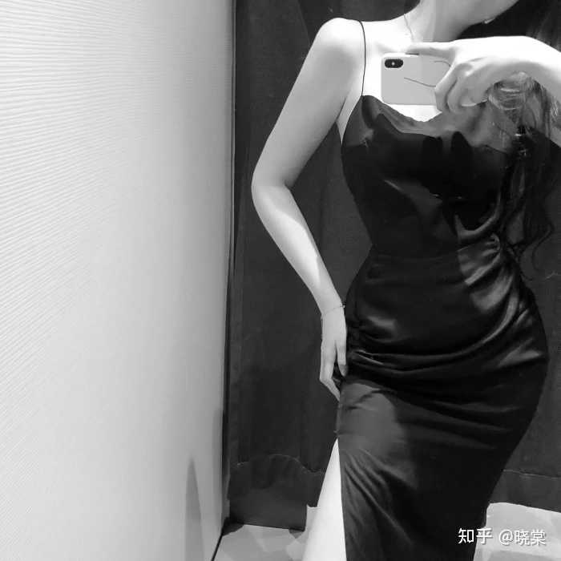
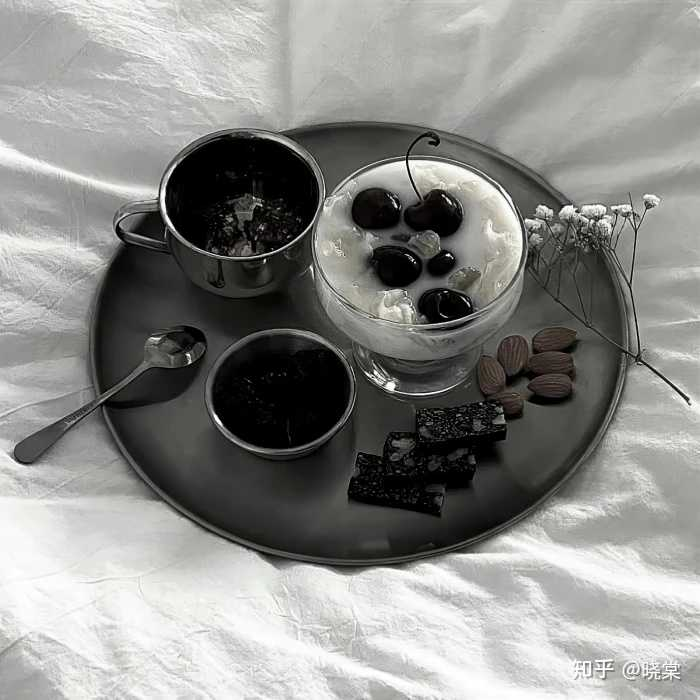
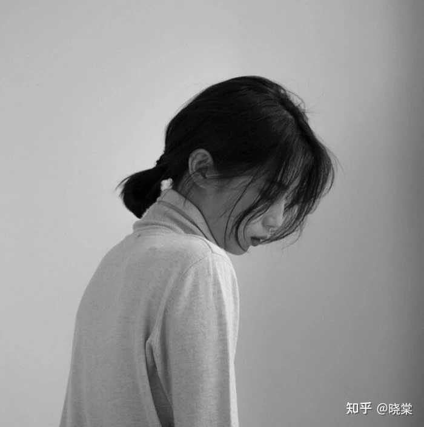
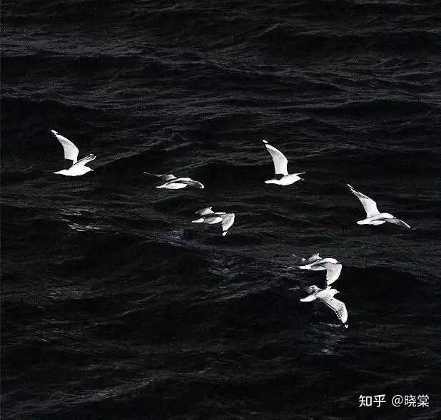

你相信玄学吗？说一说你的经历? \- 晓棠 的回答

1、疾风骤雨，不行房事。

2、药可借，不可还，实在要还的话，就还钱。

3、贪小便宜=漏大财。老天很公平，事事想赢小事，大事就一定输。真正能富贵的人，都懂得：吃小亏、攒大人情、积大福气。

4、玄学上讲，有人突然闯进你的生活，又突然消失，不是缘分浅，是债还清了。他就是来给你上一课的，你学完了，他自然就走了。别留，别问，也别回头。

5、上天不会让一个人什么都有，也不会让你什么都没有。比如，长的非常漂亮的，真的很多恋爱脑。比如，自己这一辈子很苦的话，儿孙大多都很省心，有出息。比如，一辈子很清闲的人，儿孙中总会出一个让他不省心的。比如，从小爹不疼妈不爱的人，找的老公很疼她。比如，有父母疼，老公爱的，孩子有一身反骨。这就是能量守恒定律。

__墨菲定律：大数据不会骗人，当你刷到这里，点赞留下一句“我很好，会越来越好！”，与过去和解，你未来将会越来越顺利！❤__

alt="Image">

6、从玄学角度，不建议追星，等于把你自己的运势无偿奉献给偶像，在无形中向对方长期输出愿力，和供神一个道理。

7、你们仔细去观察一下，在所有的富婆脸上都有这些特征。饱满，圆润，挺拔，端正。这样的女生，不但旺自己，也旺他人。

8、如果准备去办一件大事，但是屡屡被耽误，比如等车一直不来，忘记带证件又回去取，那就干脆别去了，外应告诉你，不合适。

9、如果你跟一个人在一起，你的颜值下降了，你的朋友说你的面相有点苦，说你有点疲惫，那么这个人有可能真的就不适合你了。反过来说，如果你跟一个人在一起，你变胖了，你的面相变得有福气了，你的颜值上升了，那么我告诉你，有可能这个人真的是你的良缘。

10、猫缘好，是灵魂干净、福报深厚的征兆。不知道你有没有留意生活里很奇妙的现象：总有一类人天生招猫咪喜欢。路边长椅一坐下，流浪猫主动凑过来蹭腿撒娇；出门散步，小猫悄悄跟在身后，把你当成依靠。这绝非偶然，在传统玄学与佛道文化里，猫是天然的灵魂试金石，愿意主动亲近猫咪的人，多半心性纯净、福运绵长。

alt="Image">

11、不要意淫。特别是在面对一些很重要的事情的时候（比如签合同或升职加薪等等），一定要控制住自己的想象力，否则很可能适得其反，无形中改变事情原有的走向结局，朝不好的方面发展。

12、不要乱发誓，不要说对自己不好的话，不要诋毁自己，不好的语言藏着不好的能量，这叫避称。

13、有个玄学，无论是你花出去的钱，还是被骗出去的钱，只要你心甘情愿的，无所谓了，事后不纠结，不后悔，这个钱很快会在别的方面给你补回来。

14、状态不佳的时候，切忌别在家里闷着，多晒太阳，多逛公园。多在儿童乐园走走，喂喂鱼喂喂鸟，都能很好的振作心念。

15、人生最大的捷径就是打扮。别不相信，人的运气，跟打扮是有直接的关系。所谓言语压君子，衣冠震小人，先敬衣冠再敬人，先看衣衫后看魂，这是一个两分钟看脸的时代，你的形象一定要走在能力的前面，否则你的能力很容易被低估。

__点赞是一个好习惯，给变美变富加一个buff吧❤️__

alt="Image">

16、断舍离，旧的衣服、破了的碗、旧了的鞋，该扔就扔。留着"万一能用"，就是留着"晦气占位"。旧的坏的出去了，新的好的才能进来。家里清爽，运气才有地方落脚。

17、一定要重视你的直觉，那是你的守护神。当你感觉到某人不真诚的时候，当你隐约觉得某一件事他不对劲的时候，一定要停下来，这都是直觉对你的保护。如果这种时候你还是不顾一切的选择违背直觉行事，那接下来你所做的决定都将变成对你的惩罚。

18、真正的高级是慢和少。人只要一贪，他的智慧、能量就下降了。少欲则心静，心静则事简。王阳明说，我等用功，不求日增，但求日减。减一分人欲，则增一分天理，这是何等简易！何等洒脱！

19、一个人要真正起大运的时候，心境绝对是越来越平静坦然，并且无所谓成败。恰恰是因为这份坦然和惬意，你反而能发挥出自己最完全的实力和运势，最终：无心生大用，无心取大功。

20、吸引力法则，你关注什么就吸引什么，刷到我说说明，你已经开始在转运了，每天在心里默念我是最好的，我有资格拥有世间一切美好，失去的东西，一定会以另外的方式回到我身边，一定要坚信用意念去吸引成功的力量。

alt="Image">

21、杯子、碗破碎、筷子断，第一时间说好话圆场，当天不要出门！

22、出行旅游，遇到有小动物挡在路中间，最好打道回府，或更换一下出行线路。

23、无论售卖什么，或者开店做生意，只要你是自由职业者，记住就放一小包米放口袋里，晚上回来后扔在花坛里就可以，越来越好。

24、人出生自带的心气，只够用到30\-35岁。每个人出生自带的心气，用到30～35岁，差不多就用光了。后半生的心气，要靠自我觉醒、自己打通、自我重塑。

25、人很玄学的，如果你幻想且隐隐约约觉得自己以后会过上好日子且很成功很优秀，那你大概率以后真的会这样。灵魂的欲望是你命运的先知，你对自己的未来不是瞎想的，这种隐隐的感觉，一般都蛮准的，你要不断认同它，把配得感刻在骨子里。

__经常锻炼你的手指，没事双击两下屏幕，你会有不一样的收获❤️__

alt="Image">

26、如果心爱或重要的随身物品（比如身份证），突然损坏或丢失，预示的运势变坏，最近可能有不好的事情发生，要提高警惕。

27、当有人突然从你的生命中消失，最好的朋友变成陌生人，最爱的人离去，不用问为什么，凡是能离开你的人都和你无缘。别耿耿于怀！如果一段关系突然结束，那证明你的命运开始发生改变。

28、减肥其实挺简单的，你们可以去做一做。只要保证充足的睡眠质量，不生闷气，不内耗，一般都不会胖。就算胖了，也是那种正常的胖，富态的胖，也胖的很好看，而不会胖的很丑。这就是减肥玄学。

29、一个玄学极冷的知识：如果你总是含胸驼背，明明你已经总是提示自己要站直，抬头挺胸，但是就是控制不住站不直，总之就是仪态一般，从玄学上说明你大概率和父亲关系一般，背代表父亲，你总是站不直表示你的父亲靠不住。

30、脑门凹陷的人，大多数都属于自力更生的命。在年轻的时候做什么事情都不是很顺利，想出人头地，要比周边的人付出很多倍的努力才可以。另外，在30岁之前不建议创业。因为30岁之前，你的运势是不利于事业发展的。越折腾，就越倒霉。可以先找个班稳稳定定的上着，一边上班一边去储蓄自己的能量。

alt="Image">

31、一定要有自己的道场。这个社会，但凡有点能量的人，都是不接触"凡人"的，都有自己专属道场。神仙都有自己的山，菩萨都有自己的庙，他们从来不以身示人，却观察这世界的一切。一定要明白一个道理，你想成为什么样的人，你就给自己定位，找到自己合适的城市，领域，沉浸式做自己。当一个人心神没有任何损耗的时候，他做事的效率，成事的运气，都会成倍增加，内心安定专一，使万物来依附。

32、命里自带贵气的人，并不是穿金戴银，出门豪车，这是很多人的错误认识。真正显贵的人，身上是充满松弛感的，没有一丝索取感，对身边任何人和事都无所求。不攀附，不谄媚，不显摆，不欺凌，不八卦。这是世间最顶级的气质，它与钱多钱少无关，当然，拥有这种气质的注定也不会差钱。

33、一个小提示，记住，家是代表整个家运的核心所在。不要随便带任何人来自己家，那种想要来你家住宿，或者养病，或者其他原因长待的一定要拒绝，还有不要在家频繁请人过来吃饭，尤其火运很多东西能量不好的杂气特别差，这种杂气会消耗家里的气场和整体运气，记住不往家里带人就好。

34、母亲积德，孩子就会有福气。成大器的孩子，绝对不是只靠成绩好的，而是靠妈妈和家族留给他的一些福报。有一位善良的母亲，就是一个孩子一生的福报。有的时候即使家里条件很一般，只要这个妈妈她行善积德，积善之家，必有余庆，相信你的孩子，一定会有大出息的。

35、假如你走了一步霉运，很倒霉，喝口凉水都塞牙，并且持续了好长时间，那你一定要注意，在这种情况下一定要保持身心健康，没事出去散散步，走走，约朋友吃个饭，千万不要每天自己一个人闷在家里。倒霉的人往往会先精神崩溃，然后才会越来越倒霉，只要你能挺住不崩溃，迟早时来运转。

alt="Image">

__感谢你在千千万万个回答中点开了我的，如果觉得不错，记得点赞收藏哦！__

__以后想看的时候，就不怕找不到啦～❤️__

__祝愿看到这的友友，万事顺利，早日暴富！__

__END__

Hi，我是 [@晓棠](https://www.zhihu.com/people/a9dbe4268b0d3cc60e69ecfba53fd870)，一名自由职业者，专注于分享成长干货和好用的数码家电。

热爱文字与一切美好的事物，努力用笔杆子书写人生。

__关注我 __[@晓棠](https://www.zhihu.com/people/a9dbe4268b0d3cc60e69ecfba53fd870)，一起成为更好的自己！

精彩推荐：

图文源网，侵删致歉
