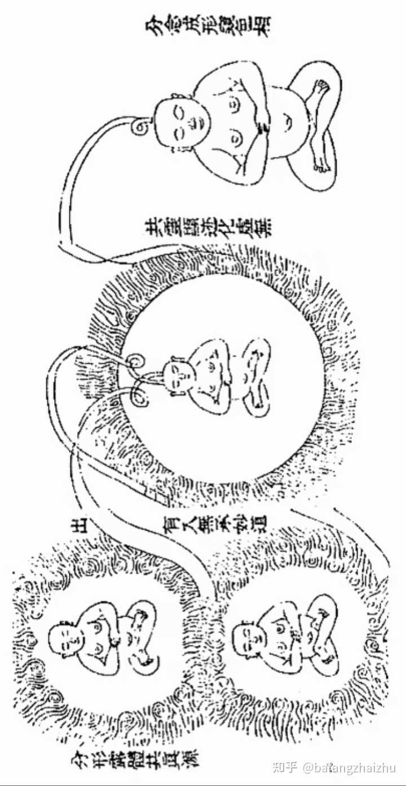
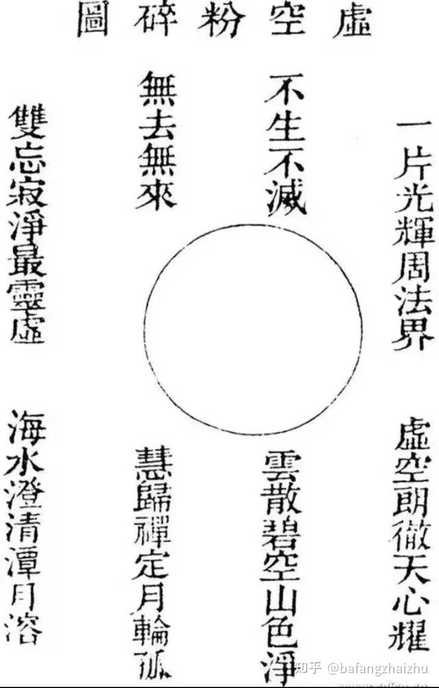

修仙有没有可能是真的？ \- bafangzhaizhu 的回答

虽然从现在科学角度来讲，内力灵力这些能够强化人的身体甚至能够使人飞行感觉有点天方夜谭。 但是有个问题，现在这么多修仙玄幻小说可以归咎于现代人思想的天马…

## 《慧命经》八图全解：一部完整的“修仙流程图”

《慧命经》后八图承接《金华宗旨》前半的“回光”功夫，构成从凡人到“金仙”的完整次第。先看总图：

alt="Image">

漏尽图 → 法轮六候图 → 任督二脉图 → 道胎图 → 出胎图 → 化身图 → 面壁图 → 虚空粉碎图

\(堵漏\) \(运转火候\) \(能量通路\) \(怀胎\) \(生产\) \(分身\) \(定境\) \(终极自由\)

① ② ③ ④ ⑤ ⑥ ⑦ ⑧

└────────── 命功阶段 ──────────┘└──────────── 性功阶段 ────────────┘

"炼精化炁·百日筑基" "炼炁化神·炼神还虚"

整个流程的隐喻是\*\*一条“重新怀孕—重新生产”的生命线\*\*：凡人出生时“性命分家”，修行就是逆着来一遍——重新受孕（怀胎）、重新生产（出胎），生出的不是肉体，而是精神体。

\#\# 第①图：漏尽图——先堵住漏水的桶

alt="Image">

\*\*原文偈\*\*：欲成漏尽金刚体，勤造烹蒸慧命根。定照莫离欢喜地，时将真我隐藏居。

\*\*核心概念：“漏尽”\*\*。漏，指生命能量从感官、欲望中不断流失（“神光外泄”）。桶底有洞，装多少水都白搭——所以第一步不是加水，是\*\*堵洞\*\*。

\- \*\*“窍”的提出\*\*：书中最关键的概念。父母未生之前，性命本来合一，藏于“窍”中；一声坠地，胎胞破裂，“犹如高山失足”，性命从此分为二。

\- 窍的名字极多：海底龙宫、雪山界地、元关、极乐国、无极之乡——\*\*“名虽众多，无非此一窍也”\*\*。它在虚空之中，无形无影，“炁发则成窍，机息则渺茫”。

\- \*\*三火之说\*\*：窍内有\*\*君火\*\*，门首有\*\*相火\*\*，周身为\*\*民火\*\*。三火顺行（向外）→成人；\*\*三火逆行（向内）→成道\*\*。这再次呼应总纲“顺则成人，逆则成道”。

\- \*\*警告\*\*：不识此窍的人，“千门万户，向外寻求，费尽心机，无所成”——别处找来的药方都是无源之水。

\*\*心理学对应（荣格视角）\*\*：漏尽 = 中止能量向外投注（中止“神秘参与”），把散在世界的心理能量收回来，才开始自性化。

\-\-\-

\#\# 第②图：法轮六候图——运转的火候学

alt="Image">

\*\*原文偈\*\*：分开佛祖源头路，现出西方极乐轮。法轮吸转朝天驾，消息呼来往地归。

堵了漏，能量开始积聚，下一步是让它在体内\*\*循环运转\*\*——“法轮常转”。

\- \*\*六候\*\*：运转一周分为六个时段（候），各有精确的操作节律——\*\*吸转朝天（沿督脉逆升），呼来往地（沿任脉顺降）\*\*，吸升呼降，构成一个完整循环。

\- \*\*“一息当一年”\*\*：一呼一吸即一周年运转，把宏观的宇宙节律压缩进呼吸。

\- \*\*道德前提（原典的硬性门槛）\*\*：\*\*“苟无其德，纵有所遇，天必不附其道……必须忠孝仁义，五戒全净，然后有所望焉。”\*\* 修行不是技术活，德行是鸟之双翼，缺一即废。

\- 迟速、起止皆有规则，全凭“真意”（凝神）调控。

\*\*对应关系\*\*：这就是《金华宗旨》“百日筑基”之后的进阶——小周天运转。火候是内丹最秘的部分，书中明言“非师传口诀难以了悟”。

\-\-\-

\#\# 第③图：任督二脉图——能量的高速公路

alt="Image">

\*\*原文偈\*\*：现出元关消息路，休忘百脉法轮常行。常教火养长生窟，检点明珠不死关。

第②图讲火候节律，第③图讲\*\*能量走的路线\*\*——前后二脉构成闭环：

\- \*\*督脉\*\*（控制脉）：沿脊柱上行至头顶——“任督二脉一通，百脉俱通”

\- \*\*任脉\*\*（功能脉）：沿胸腹下行归丹田

\- \*\*动物学证据（原典的可爱论证）\*\*：\*\*鹿睡觉时鼻贴尾闾，通督脉；鹤与龟通任脉——三物因此皆得千年之寿，“何况人乎？”\*\*

\- 此图与第②图“原是一也”——同一件事，一个讲节拍，一个讲道路。

\*\*现代视角\*\*：把呼吸\-注意力系统沿脊柱与胸腹做定向循环，形成可被神经感知的“能量回路”——这正是《金华宗旨》论魂魄时说的“魂对应脑神经系统（上丹田），魄对应心脏系统（中丹田）”，前后脉恰好贯通上下两个系统。

\-\-\-

\#\# 第④图：道胎图——十月怀胎

alt="Image">

\*\*原文偈\*\*：有法无功勤照彻，忘形顾里助真灵。十月道胎火，一年沐浴温。

能量循环纯熟后，\*\*真种结成\*\*——这就从“炼”转入“养”：

\- \*\*“胎者，非有形有象”\*\*：不是肉体，\*\*实即我之神炁\*\*。原理是：先以神入乎炁，后炁来包乎神，神炁相结，意则寂然不动——如受精之胎。

\- \*\*“有法无功”\*\*：十月之中，法度仍在（照彻不辍），但\*\*不再用力\*\*——“忘形顾里”。功到无心，如同母孕子，不必时时用力孕育，只在温养。

\- \*\*火候\*\*：十月道胎之火，一年沐浴之温——温火慢炖，不可武火急烧。

\*\*心理学对应\*\*：这是荣格说的\*\*自性（Self）在心中孕育\*\*——更高的人格作为一个自主的心灵生命体，在意识与潜意识的互动中渐渐成形。保罗的话是同构表达：“现在活着的不再是我，乃是基督在我里面活着。”

\-\-\-

\#\# 第⑤图：出胎图——重生

alt="Image">

怀胎既满，\*\*精神体诞生\*\*——一个独立于肉身的“细身”（灵体）。

\- 原典：婴儿炁体既全，行“出胎还虚之功”——孩子离开“子宫”（肉身炉鼎），成为一个\*\*能独立存在的生命中心\*\*。

\- 荣格的翻译：这是“\*\*一个有着人格外衣的更高生命，一个灵体，诞生于人的心中\*\*”——在基督教传统里，同样的经验用“心中诞生基督”来表达。

\-\-\-

\#\# 第⑥图：化身图——一个变多个

alt="Image">

出胎之后，精神体不但独立，还能\*\*分化\*\*——一化身多，如千江有水千江月。

\- 这在《慧命经》原文中对应“分念成形窥色相”——深定中，头部火舌缠绕，一人化五人，五人再化二十五人。

\- \*\*危险警报（原典与荣格同时强调）\*\*：这是修行最凶险的关口——若迷于这些化身幻象，“长期陷入这种状态，那就是我们常说的\*\*精神分裂症\*\*”。原典随即给出对治：“神火化形空色相，性光反照复元真”——知其幻而不随。

\- 荣格对这一关口有心理学完全版：化身 = 自主情结的人格化增殖；《西藏度亡经》的教诲相同——“无论善神恶神皆幻象”，\*\*不要把意识最高处的光投射为多重人格\*\*。

\-\-\-

\#\# 第⑦图：面壁图——达摩九年，一坐到底

alt="Image">

化身既化，还须回归\*\*唯一、静定\*\*——这正是佛家的“面壁”，禅定之极致。

\- \*\*艮卦之象\*\*：《易经》艮为山，止之象——“艮卦是禅坐的标志……\*\*它是生和死相见的地方，是成终而又成始之处\*\*”。

\- 在此定境中，外物不动，生机内敛，性命重新会合——\*\*当年坠落时分开的性和命，在此重逢\*\*。

\- 荣格：这是意识的最高澄澈态——“不受外界干扰的意识”，希尔德嘉德式的“比太阳前的白云更明亮”之光。

\-\-\-

\#\# 第⑧图：虚空粉碎图——终极自由

alt="Image">

最后一图，也是全书终点——\*\*连“定”与“我”也要粉碎\*\*。

\- 达到者“不再受制于个体，跳出一切现象层面二元对立的怪圈，返回到原始的一，即‘道’之中”。

\- \*\*佛道在此分岔\*\*（《金花的秘密》一书中卫礼贤明确指出）：

\- \*\*佛教\*\*：返回涅槃与无我——自我与世界皆幻，我法俱空。涅槃不是死亡和终结，而是超越。

\- \*\*道教\*\*：以改进了的形式\*\*保留自我\*\*——归一身之光辉（金花），“神与炁合而成道”，一个清澈不灭的元神继续存在。

\- 同一扇门，两条出路：\*\*佛家把杯子摔碎，道家把杯子洗净盛满光。\*\*

\-\-\-

\#\# 八图贯通：一张总流程表

| 图 | 关口 | 关键动作 | 心理翻译（荣格） |

|\-\-\-|\-\-\-|\-\-\-|\-\-\-|

| ① 漏尽图 | 堵漏 | 止神光外泄，识得真窍 | 中止能量外投，注意力内转 |

| ② 法轮六候图 | 转轮 | 吸升呼降，六候火候 | 能量循环，意识—潜意识对话启动 |

| ③ 任督二脉图 | 通路 | 前降后升，百脉皆通 | 建立稳定的内在回路 |

| ④ 道胎图 | 怀胎 | 忘形顾里，十月温养 | 自性孕育 |

| ⑤ 出胎图 | 生产 | 出胎还虚 | 灵体/更高人格诞生 |

| ⑥ 化身图 | 分化 | 一化多，知幻不随 | 情结人格化增殖——\*\*高危\*\*，须识别 |

| ⑦ 面壁图 | 定境 | 艮止，性命重逢 | 意识澄澈顶点，阴阳统一 |

| ⑧ 虚空粉碎图 | 还虚 | 跳出二元，归于道 | 自性化完成：超越而不再投射 |

\*\*三条暗线贯穿八图\*\*：

1\. \*\*逆字诀\*\*：每一图都在做同一件事——把“顺行向外”的能量逆转回来（三火逆行成道）

2\. \*\*德为本\*\*：法轮六候图明训“无德者天必不附其道”——技术再精，德行是地基

3\. \*\*由命入性\*\*：前三图是命功（身体能量），后五图是性功（心灵转化），对应“炼精化炁→炼炁化神→炼神还虚”三段

\-\-\-

\#\# 一句话总结

> \*\*八图即一次精神的重生：堵住漏（收回目光）、转起轮（建立回路）、结成胎（孕育自性）、生出神（人格新生）、化万身而不迷（识别幻象）、面壁而定（阴阳重逢）、粉碎虚空（跳出对立）——顺行是人生老病死，逆行是一次庄严的诞生。\*\*
