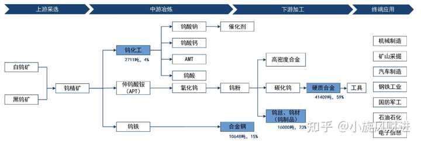
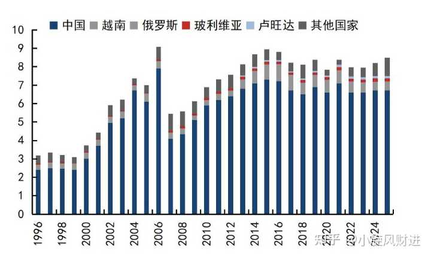

全球陷入「抢钨大战」，两年时间价格上涨了约 9 倍，为啥会疯涨？钨这种稀有金属的战略价值体现在哪里？ \- 小旋风财进 的回答

两年时间， 国际市场钨产业链中间产品价格上涨约9倍。近期，美国、英国、越南、津巴布韦等国相继调整钨相关政策，全球钨资源争夺正在升温。 钨是什么？钨，是…

钨的熔点3422摄氏度，是金属里最高的。密度19\.35克每立方厘米，黄金是19\.32，就是说钨比黄金还重。碳化钨的硬度接近金刚石，常温下几乎不跟酸碱反应。

耐高温、密度大、硬度高，化学性质稳定，耐磨、抗腐蚀，能同时满足这几条的材料非常少。

所以钨主要用来做硬质合金，用碳化钨做骨架，用钴或者镍做粘结相，粉末冶金烧结成型，可以做机床切钢的刀片，矿山凿岩的钻头，拉丝的模具

每年开采出来的钨，六成变成了硬质合金。

alt="Image">钨产业链

钨矿分为黑钨矿和白钨矿两类，中国南方以黑钨为主，江西赣州是核心产区，钨精矿国家标准是三氧化钨含量65%左右。

钨精矿经过碱浸酸化，做出仲钨酸铵，行业里叫APT。这是国内最主流的中间品，APT往下分两条路，一条煅烧成氧化钨再用氢气还原成钨粉，另一条去做钨材。

钨粉掺碳在高温下发生反应，生成碳化钨粉。钨的报价体系里，钨精矿、APT、碳化钨粉，是三个关键路标。

需求端，硬质合金占60%，钨材占21%，钨特钢占14%，钨化工占4%

2025年中国钨需求大约7\.57万吨，同比增长约5%

alt="Image">全球钨矿产量

2025年全球钨矿产量大约8\.5万金属吨，中国约6\.7万吨，占全球79%。中国的APT冶炼产能占全球大约85%，从矿到中间品，话语权集中在中国手里。

中国的矿山有两个约束。一个是总量控制，2025年第一批钨矿开采指标5\.8万标准吨，同比下降约6\.45%。2026年第一批大约6万标准吨，同比只增加约3%，折成实际增量也就两千多标准吨，指标增加不等于产量增加。

另一个约束是资源本身在变差，国内大量在矿山面临品位下降，开采往深部走，采选成本上升。中国占全球钨矿产量的比重从2016年到2025年已经下降了约6个百分点，这个趋势还在延续。

再看增量项目，国内确定性较高而且体量像样的项目也就四五个。博白油麻坡钨矿2027年前后投产，贡献大约1650吨金属钨。柿竹园项目2028年前后贡献约1100吨。新金路在2027到2028年贡献约2000吨三氧化钨，折金属钨约1000吨。大湖塘等一批项目加起来约1\.3万吨三氧化钨，节奏都很靠后。

国内所有增量大约2万吨三氧化钨，大部分要在2028年前后才落地。今年上半年国内钨精矿产量5\.4万吨，同比下降14\.75%，比去年少了约9000吨，超出市场预期。

海外这两年进入了新一轮增产周期，因为海外价格比国内高得多，但海外扩产有两个通病，一是实际产量往往达不到设计产能，二是就算产出来了，贸易流向也被提前锁死。

哈萨克斯坦的巴库塔钨矿确定性最高，一期钨精矿产能约1\.4万吨每年，对应金属量约7000吨，二期计划在2027年一季度把矿石处理能力扩到接近500万吨每年。这个矿的产出全部运回中国加工销售。

韩国的桑东钨矿今年下半年投产，7月开始处理矿石，钨精矿产能约4600吨每年。但它的产能已经被美国经销商包销，产出全部留在美国。

英国的赫莫顿钨矿今年7月调试，预计明年一季度投产，规划约3000多吨三氧化钨，折金属钨约2600吨。澳大利亚的海豚矿设计产能三千多吨，实际年产三氧化钨只有800多吨。

全球能挖的地方挖不动，扩产也很慢，扩出来的量还被国家意志提前分配掉了。海外的缺口比国内更大，2026年约2万吨，到2028年仍有约1\.2万吨三氧化钨的缺口。

alt="Image">钨需求量

钨的需求正在从传统制造业切换到科技和军工

AI服务器要用高多层PCB板，板子层数越多，孔径越小，密度越高，对钻针的要求就越苛刻。钻针的棒材就是钨做的。全球一年AI PCB相关微钻棒材的需求接近3000吨，占到全球大约10万吨原钨需求的3%。龙头企业每月棒材及微钻的盈利已经突破亿元量级。这条线的节奏跟英伟达新一代产品的量产周期挂钩，三季度开始从备货预期变成真实拉货。

六氟化钨是芯片制造里做钨填充的关键气体，存储芯片用得最多。2026年6月中国出口的六氟化钨均价达到158万元每吨，比1月上涨2\.3倍。同期APT涨幅只有五成左右，钨精矿价格甚至比年初还低一点。一个品种能涨两三倍，另一些几乎没动，说明它已经脱离原料价格体系，进入科技需求定价体系。下游能接受这个价格，说明缺口确实大。

2021年以来全球军费开支迎来首次向上，2020年到2025年复合增速4\.6%，高于2015年到2020年的2\.4%。今年7月美国众议院通过国防授权法案，授权国防及相关开支1\.15万亿美元，同比增加14%。钨是穿甲弹芯和装甲防护的基础材料，钨特钢占中国钨需求14%。军费上行，钨特钢补库就是明牌。

还有一个隐性变量是库存，美国的钨金属库存从1995年的3\.7万金属吨，去化到2022年的6000吨。一个把钨列进关键矿产清单的国家，库存只剩高峰期的六分之一。补库不用讨论要不要做，只需要讨论什么时候做。

雅鲁藏布江下游水电工程这类大型项目，会为工程机械形成每年3%到5%的增速托底。矿用工具和耐磨材料合计占中国钨需求约20%，这块是钨的压舱石。

如果可控核聚变能实现，钨的需求会大幅增加，钨是所有金属里最耐高温的，同时耐腐蚀，又能屏蔽辐射，钨铜合金已经被国际原子能机构列为主流技术材料，用来做核聚变装置环形腔室的内壁材料和偏滤器耗材。核聚变如果能起来，对应的钨合金需求有望上万吨。

2025年中国钨产品出口约1\.3万金属吨，同比下降27\.5%。下降是主动的，主要品种就是APT、氧化钨、钨粉这些中上游产品。

与此同时，中国的钨矿进口在大幅增加。2026年1到6月累计进口钨金属量约7900吨，同比增长75%，其中钨精矿约7680吨，同比大增110\.3%，占全部进口钨的96\.3%，来源地包括朝鲜、缅甸、俄罗斯、哈萨克斯坦、卢旺达。截至今年6月，中国已经连续10个月处于钨净进口状态。限制出口，又大量进口原料。

海外APT价格折人民币170万到190万元每吨，国内只有60万元每吨，这么大的价差，说明海外买家愿意为拿到原料支付高溢价。

美国废钨出口去年全年约1700金属吨，上半年约750金属吨，今年上半年约1600金属吨。同时，今年上半年中国对日本的钨出口下降了约700金属吨，而日本的钨原料进口量没有明显下降。

日本的六氟化钨和钻针棒材这些环节依赖中国原料。原料一旦紧张，海外企业只能保核心环节，压缩中低端负荷，订单就会往国内转移。

关注三个信号

第一个信号是长单报价，这是钨行业最重要的价格指标。钨的现货市场很小，真正定价的是龙头企业的长单。龙头企业的长单采购量占国内产量的七成以上，这个价格意味着长期合作的供应商能以它稳定成交，所以它对整个市场的情绪和有效性有直接指引。

2026年8月20日，章源钨业披露8月下半月长单采购价，黑钨精矿41\.5万元每吨，白钨精矿41\.4万元每吨，两者都较8月上半月环比上调3000元。APT报价60万元每吨，环比降了6000元，原因是中游供需相对宽松，但这个价格仍然高于部分现货成交价，对整条链起到提振作用。8月上旬刚刚微弱上调一次，8月下旬又来一次。连续两次向上的意义，比单次幅度大得多。

第二个信号是废钨价格，今年3月钨价过热的时候，废钨因为是尾部成交，率先下探，拖累了整体价格。但从5月和7月开始，废钨相对原钨精矿出现了率先企稳和率先探涨的特征。上上周废钨开始向上探涨，个别品种力度达到1万元每吨。废钨这种最短链路的价格先动，往往意味着产业里的真实需求先动了。

第三个信号是估值的位置，A股四家龙头钨企加上港股一家龙头，五家总市值3月的高点是3960亿元，当前约3150亿元，回落20%。6月22日随着科技叙事强化，五家合计市值一度冲到4949亿元，当前较那个高点回落36%。股价虽然反弹了一波，距离前期高点还差一大截。

盈利端却在往上走。A股四家龙头今年上半年合计净利润同比增长200%到250%，环比在去年高基数上还有微增。价格没创新高，利润先创新高，这种组合通常意味着估值在被动消化。

如果钨价能稳定在60万元每吨的中枢，龙头企业的平均估值有望被消化到2027年20倍附近。海外同行的稳态估值明显高于国内，比如澳大利亚的EQ Resources这类公司，估值高出不少，这里存在估值体系重估的空间。

厦门钨业走的是上游资源加下游深加工双线，上游油麻坡项目2028年前后贡献量增，更远期有大湖塘钨矿的注入预期，公司已公告计划出资5到6亿元注入30%权益，大股东手里的25%权益也有逐步注入的可能，下游的硬质合金刀具和数控刀片是国内第一梯队，市场在追逐科技属性的时候反而容易忽略这块。

中钨高新的短期弹性更大，五矿集团已经明确，在满足条件时优先把钨制品和钨矿山相关公司注入中钨高新，2024年到2025年已经完成柿竹园和远景钨业的注入，后续还有三座在产矿山及权益钨精矿产能约1万吨。下游的AI PCB微钻在国内乃至全球都是头部的两家之一。

港股那家钨矿公司的逻辑最纯粹，就是一个钨矿经营加扩产的标的。今年满产，一期进入正常生产状态，同时推进二期扩产，明年有内生产量增长逻辑的钨矿公司非常少。

钨价如果在40万到50万之间横住不涨，估值消化的逻辑就要往后拖。海外矿山复产和新增项目的实际节奏，也可能快于预期。陶瓷刀具对硬质合金的替代还在发生，速度慢，方向确定。这类小金属流动性有限，股价波动会比基本面剧烈得多。

钨这个品种最特别的地方在于，它不靠需求爆发，需求端有AI和军工接力，供给端有资源约束和总量控制托底，有出口管制和战略备库。
