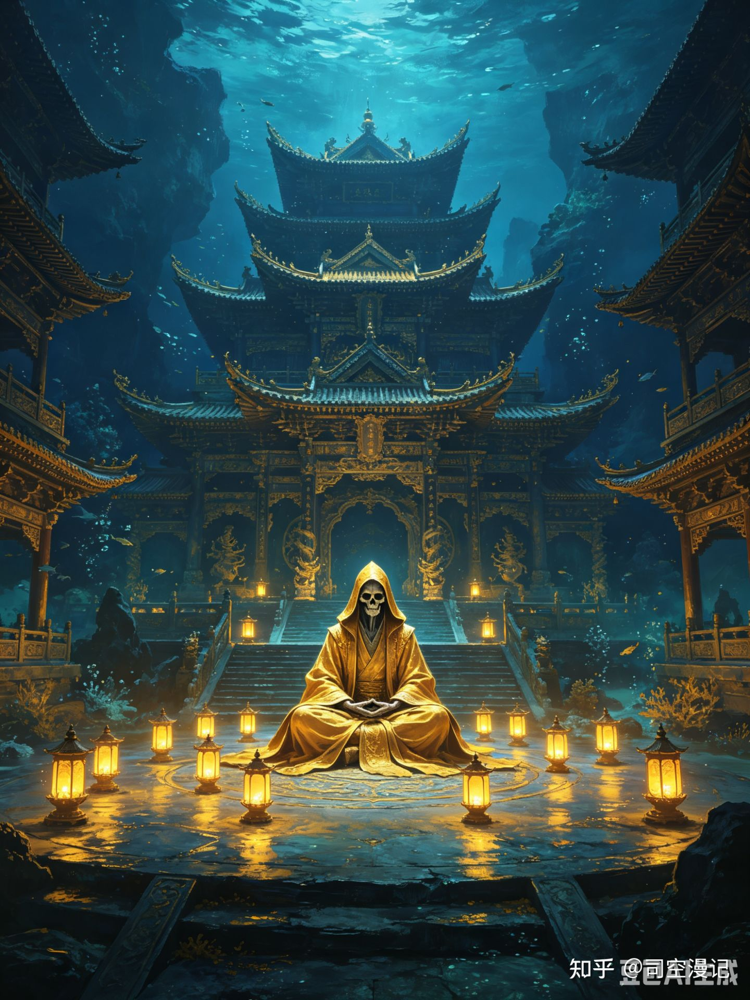

凡人修仙传最悲情的“快递员”：骷髅真仙，用一生倒霉成就了韩立

[源网页](https://zhuanlan.zhihu.com/p/2052806171375973131?share_code=b3jg54Agy7lm&utm_psn=2079970099784594110)

在《凡人修仙传》灵界篇中，有一位连名字都没留下的真仙。他没有宝花的女王气场，没有韩立的主角光环，但他却以一己之力，撑起了广寒界副本、串联了小修罗界与斩杀马良的终局之战，最终用自己的神魂为韩立补全了最后一块拼图。

他就是骷髅真仙——人送外号“骷髅哥”，灵界第一倒霉蛋，韩立最大的贵人。

一、一切的起点：掌天瓶究竟是谁带下来的？

世人皆道，韩立是凡人修仙，只是在人界捡到了掌天瓶。可追根溯源，究竟是谁跨越界面，亲手将这件至宝带下界的？

正是他——九元观的叛徒，当年挟掌天瓶逃亡，却遭遇横祸，身躯崩毁。掌天瓶一分为二，瓶身坠入人界七玄门，静静等待一个叫韩立的青年。而骷髅哥自己，只能在深海的宫殿中以滴血芙蓉花重塑枯骨，陷入长达十几万年的沉睡。

他从不曾知晓，自己早已为命中注定的“债主”付清了最昂贵的第一笔定金。自此，一条无形却坚韧的因果之线，将他的命运与韩立死死捆绑。

二、第一笔账：千幻妖蛾之死

骷髅哥在深海沉睡期间，放养了一只炼虚后期的千幻妖蛾，专门为他从外界搜集灵药。此蛾天赋异禀，实力堪比普通合体修士，生性狡黠，遇上真正的合体对手往往振翅远遁，绝不纠缠。

可它偏偏遇上了韩立。

韩立不仅与它周旋有来有回，甚至能以元磁神山压制，最后用乌罗王族灵玄辟毒下毒，将其斩杀。千幻妖蛾临死前将精魂燃作两枚诡谲的眼珠，将韩立的容貌传回深海宫殿。

骷髅哥看着传回的影像，手指在扶手上轻轻一扣：“有点意思。”他记住了这张脸，却没太当回事。小弟的仇，以后再说。

三、第二笔账：广寒界的阵盘碎了

十二年后，更离谱的事发生了。

韩立进入广寒界，在屏风洞天中接受星图灌体，灵气汹涌几乎要将他撑爆。危急时刻，玄天斩灵剑自行护主，一剑斩断了阵法核心的金色阵盘。

海底深处，骷髅哥正处于重塑肉身的关键时刻，怀中与阵盘配套的银色圆盘突然一震——他掏出一看，碎了。

彻底碎了。

“你用也就罢了，你打碎它作甚？！”无尽的愤怒与憋屈化为对深海墙壁的一通猛锤。他之所以敢将此重宝放在广寒界，是因为那里万无一失：广寒界万年才开一次，屏风洞天位置隐秘，外围有太乙金光山禁制，合体修士都难破。更何况，广寒界只允许炼虚修士进入，在他看来根本无人能进。

可他漏算了一件事：来的人可是轮回殿主安排他的专业帮扶对象呢？

那家伙恰好练成了破灭法目，能看穿屏风洞天入口；恰好修炼了梵圣真魔功的法相；恰好手里有一把玄天残刃。骷髅哥当年布阵时觉得这些条件苛刻得像在说笑话，可命运露出了专业对口的笑容——那个被选中的炼虚修士韩立，抬头看了看条件，心里只剩一个念头：“好家伙，你这不是专门来给我送福利的嘛。”

于是，他理所当然地走了进去，触发了星图灌体，然后玄天斩灵剑干脆利落地斩了阵盘，也斩碎了骷髅哥十几万年的安稳梦。

四、第三笔账：银色莲蓬不翼而飞

822年后，骷髅哥终于把自己肉身重新生成完毕，结束了漫长沉睡。他出关后第一件事，不是仰天长啸，而是心急火燎去查看那株惦记了十几万年的银色莲蓬。

结果药圃空空如也——早在广寒界开启时，就被那位“有缘人”韩立连根带走了。

旧恨妖蛾未消，新仇阵盘又来，如今再加上银色莲蓬之恨，三笔大账笔笔记在韩立头上。骷髅哥的怒火彻底点燃，决定出关第一件事就是去把这小子揪出来，连本带利清算干净。

五、命运捉弄：次次擦肩，次次错过

可他哪知道，自己与这位债主的缘分深得离谱。

他曾与韩立擦肩而过——韩立从雷鸣大陆返回时，途中听说有南离蛟幼女诡异失踪的奇闻，那正是骷髅哥在海底重塑肉身时顺手搞出的动静。他要是晚几年出关，说不定真就路遇韩立当场清账了。

他更曾只差一步抓住韩立——在蛮荒中，宝花无意间插了一手，助韩立和雷云子用双雷阵远遁万里。宝花料理完对手后，若有所感地望了眼那个方向，她感应到的强大气息正是追丢目标、气急败坏的骷髅哥。

命运似乎打定主意，不让他们过早相遇。

六、终极悲剧：被“仙界的老乡”镇压

重整旗鼓后，骷髅哥正式踏上前往风元大陆的寻仇之路。他途经灵族领地，或许是压抑了十几万年，彻底放飞自我，肆意杀伐，公然亮明仙界使者身份，宣称要收几个“灵奴”使唤，甚至动用了专门克制灵族的仙界法宝。

他心想：我一个真仙随便杀几个下界灵奴能咋地？

可他这“社死现场”，好死不死被一位仙界老乡全程围观了——正是灵王本人。而这位灵王的来历，堪称骷髅哥的终极盲区：他并非本土生灵，本体乃是仙界冥寒仙域大战中遗失的至宝——炫光天晶塔修成的器灵。

于是一场针对仙界老乡的精准围猎瞬间展开。灵王亲率麾下合体修士布下困魔阵与镇仙柱，将骷髅哥逼至绝境。当他意图自爆拉垫背时，灵王直接现出炫光天晶塔本体，以压倒性的优势将其镇压，并贴上仙界出品的玄化封灵符，将其神魂彻底封印。

七、余波：引来了更狠的马良

骷髅哥的被镇压，触动了他在仙界的本命魂牌。金瀚仙宫做出了决定：派遣那位刚受完罚、杀气正盛的真仙马良下界清理门户，追回至宝掌天瓶。

换句话说，骷髅哥这位前反派，用自己的憋屈结局，成功为灵界引来了一个破坏力升级数倍的完全体反派。他自己虽已退场，却完美地充当了最终大幕的“导游”。

马良下界后掀起了血雨腥风，但在灵界顶尖战力的大围剿中，他最终倒毙身亡。而韩立从马良的战利品中，得到了骷髅哥的本命魂牌，从而知晓了这位神秘“快递员”被镇压在灵王处。

八、终局：搜魂，最后的“送宝”

此时的韩立已具备令灵王不得不低头的实力。在魂牌与武力的双重说服下，灵王交出了被封印的骷髅哥。

在地底，韩立见到了这位与自己冥冥之中命运交织最深却素未谋面的“贵人”。没有废话，一次彻底的搜魂——湮灭了骷髅真仙最后的神魂。

这位从头到尾连名字都未曾留下的真仙，其漫长的、憋屈的、仿佛只为韩立而存在的灵界之旅，终于画上了句点。

九、总结：史上最悲情的“快递员”

纵观全局，骷髅真仙的故事撑起了广寒界大副本；他的遭遇串联起了小修罗界之行与斩杀真仙马良的终局之战；他的记忆最终揭晓了掌天瓶的来历之谜，并助力其完整合一。

他的一生，堪称韩立的专属“宝藏”：从掌天瓶、水晶盾、银色莲蓬、星图灌体，到真魂丹线索，所有关键机缘背后都有他无私奉献的身影。直到最后，用自己的神魂为韩立补完了最后一块拼图。

那么我们说世间真有这么倒霉的人和这么巧合的事吗，我的判断是骷髅真仙和真仙马良都是轮回殿主的众多谋划的一环而已，都是助力韩立快速成长的经验包。骷髅真仙的故事就是一条荒诞又悲情的“快递员的自我修养”送宝线。他用自己的极致倒霉，成就了韩立的极致仙途。最终默默消散于故事之中，连一个名字都未曾留下。

骷髅哥，一路走好。你送的快递，韩立都签收了。

内容效果不满意？[点此反馈](https://feedback.notebooksyncer.com/feedback/11940f75_1788683554487?u=https%3A%2F%2Fzhuanlan.zhihu.com%2Fp%2F2052806171375973131%3Fshare_code%3Db3jg54Agy7lm%26utm_psn%3D2079970099784594110&s=onenote)
