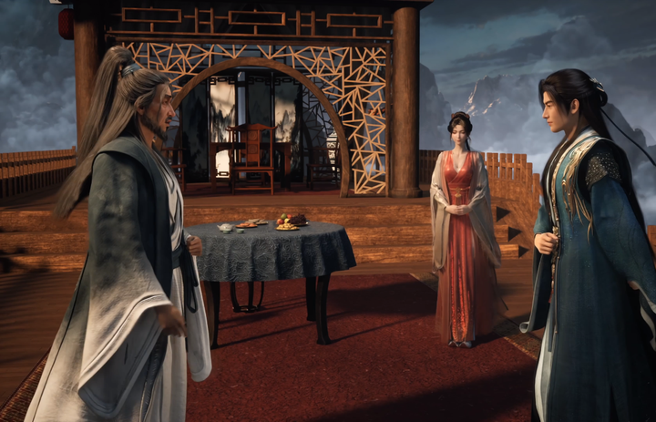
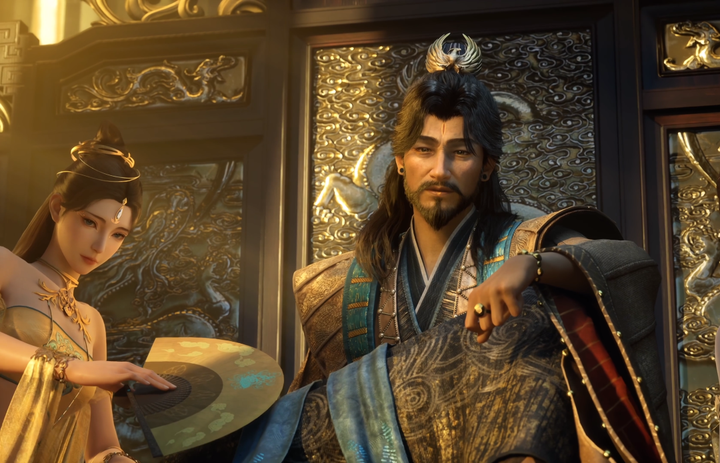

凡人修仙传：慕沛灵的心魔是什么？ \- 孔奔说 的回答

请有理有据推测慕沛灵的心魔。

文/孔奔说

韩立突破化神期后，才知道自己名义上的侍妾慕沛灵已经不在了。

此女因为寿元将尽，急于突破元婴瓶颈，闭关时心境露出了一丝破绽，被那心魔趁虚而入，走火反噬而亡。

韩立听到这消息心中一愣，有些黯然，最终亲自去拜祭了一番。

这就引出一个问题。

__慕沛灵的心魔，究竟是什么？为何过不去？__

先说一下凝结元婴的设定。

"因为凝结元婴和结丹可不太一样，除了需要修为和一定的机缘外，还必须忍受一定的幻象和心魔的骚扰。毕竟化丹为婴的过程，原本就是一种磨炼修士心神和定力的可怕之旅。"

一是修为和机缘，二是心神和定力。

单看修为和机缘，前面的结丹期，可以用丹药堆，对于慕沛灵而言，韩立就是她的机缘，这些都好办。

但是心神和定力，这个只能靠慕沛灵自己。

还有一处细节。韩立在云梦山结婴，外面守着落云宗的两位长老，银发老者和吕洛。

alt="Image">

两人看着山里那道结婴的动静，吕洛说了一段非常关键的话。

"__心魔反噬，几乎是你越害怕什么，越恐惧什么，会越在你心里幻化出何事出来。要不是当初结婴时，我服用了一枚定灵丹，肯定无法熬过那种心神淬炼的折磨。__"

还得是吕师兄啊，讲心魔讲得最透的，就是这一段。

心魔是一面镜子，把你心底最怕的那个东西映射来，幻化在你面前，让修行者独自面对。

怕什么，它就幻化什么。

心魔考验的是内心，跟法力深浅没任何关系。

韩立自己是怎么过心魔这一关的？

"它先让韩立经历了一连串心里最恐惧最害怕之事，许多平常深埋心底深处，连他自己都没有意识到的事情，在幻象中接连发生。"

先是恐惧。小村被洗劫，父母小妹遭难，自己修为全失重新坠为凡人，掌天瓶的秘密暴露被整个修仙界追杀。

"即使韩立平时性再坚毅沉稳，也差点因为怒火和恐惧而沉沦其中。"

韩立这么一个人，在心魔面前也差点沉沦。

恐惧过去了，心魔换了副面孔。它开始给你美梦。

有和父母小妹重聚一堂，再回幼时的幸福生活，也有和南宫婉结拜成亲的场面。

后面还有更厉害的。比如：修为大成，称霸天南，飞升灵界，成为仙界仙人，与天地同寿等。

他在这些幻象中不知沉醉了多少年月，仿若经历过数世地大喜大悲后，猛然自己醒悟过来，最终摆脱心魔迷惑，得以元婴成形。

__其实，韩立自己都说不清他是怎么醒过来的。__

alt="Image">

好在那定灵丹和其它宝物，并非浪得虚名，总算在关键时候，保持了他脑中一点清明。

注意"一点清明"这四个字。丹药和宝物能做的，只是保住那么一点清醒。剩下的路，得他自己走。

而美梦那一波，丹药帮不上忙。美梦不吓人，美梦是甜的。

__这一点我相信诸位道友深有体会，有时候美梦醒了，希望自己赶快睡着，接着做美梦。__

__那个时候明明已经知道是梦，但还是不希望被打断，希望接着做梦。__

__有没有这样的道友？__

现在我们把这个规则放到慕沛灵身上。

最开始，慕沛灵单方面宣布是韩立的侍妾，于是韩立把她叫来问罪，她答得很直接。"晚辈情愿给前辈做一名侍妾。"

她做侍妾，第一动机是逃。她要从婚约里脱身。

她还说了一句。"沛灵自小进入宗内苦修，一心扑在修炼之上，怎会有心上人。"

__诸位道友，你看看，她从小就没在外面走动过。没经历过市井，没经历过人心，感情更是一片空白。__

她的人生轨道是宗门铺好的，她沿着走就是了。但修仙这条路，前一半靠资质和资源，后一半靠心境。

不去外面历练？怎么磨练心境？不经历风雨，怎么见内心？

"此女向道之心颇坚，但又一副心高气傲的样子。"

有坚定的向道之心，是好事。

但心高气傲，又没见过什么世面，就要命了。

alt="Image">

韩立在主峰旁边的子峰给她开了洞府，"并在韩立指点下，开始吞食丹药，闭关苦修"。

那一年韩立从外面回来，发现她已经到了假丹期，"竟只要年许工夫。就可以开始尝试结丹了"。

韩立问她结丹有几成把握，她答："妾身哪有什么把握。结丹几率原本就是十不足一的。能否结丹。也只能看天意了。"

她自己心里是有数的。结丹这件事，十个人里成不了一个。

"没有先前韩立地丹药提供，别说她现在冲击结丹。恐怕还在筑基中期苦苦徘徊呢。"

__她的结丹，从头到尾是韩立的丹药喂出来的。__

"显然这时候的慕沛灵，才真心打算依附于韩立。不再有患得患失地心思了。"

依附？一个结丹修士，真心打算依附另一个人。

从这一刻起，她的修为、她的寿元、她往后能不能更进一步，全都系在韩立身上。

这哪里还是那个"向道之心颇坚"的慕沛灵？她已经把自己交出去了。

韩立其实早就预判了慕沛灵。"即使有大量丹药相助，凝结元婴也看一个机缘问题的。慕沛灵此女，结婴几率实在不太高的。"

后来，慕沛灵修炼了南宫婉传授的掩月宗秘术。

此时的慕沛灵什么状态？"修为也大涨不少，已进阶到了结丹后期境界。她正在日夜闭关，苦修法力，以期早日后期大成，好尝试突破元婴境界。"

日夜闭关，苦修法力。慕沛灵实在是太想进步了！

但一味的只想提升修为，已经成为一种偏执了，她走向了一个极端。

反观韩立。"韩立从修道以来，一切都是靠自己之力飞升灵界，乃至有今天的修为。自然不会将一切生机都寄托他人之身上。"

一切都是靠自己之力飞升灵界。

alt="Image">

__这正是慕沛灵的问题所在。__

她的丹药是韩立给的。洞府是韩立开的。功法是韩立的道侣传授的秘术。

大家想象，南宫婉、紫灵、元瑶这几个人为什么能进阶元婴期？

有一个共同点：她们的路，是自己走的。

退一万步来说，她们有自己复杂的经历甚至生死搏斗，她们在外面历练过很久很久。

慕沛灵不一样。不是闭关，就是在闭关的路上。

"此女突破元婴时，他同样赠送了九曲灵参丹药等辅助灵药，但当初仍然无法凝结元婴，只能说是天意所为了。"

说句题外话，真的是天意所为吗？

__为什么没有任何人提醒慕沛灵，你应该去外面去历练，去实战？__

那么，她的心魔究竟是什么？

因为"你越害怕什么，越恐惧什么，会越在你心里幻化出何事出来。"

再回到韩立经历过的心魔。第一轮是最恐惧的事，第二轮是最想要的美梦。

据此我们可以合理的推断。

韩立给她两条路的时候，她脱口而出的那句话就是答案。

"以公子如今的名声，就算亲自给我正名，还我清白名声，天南又有哪一位修士敢再娶我的。"

__她怕的是被送走！__

她最想要的又是什么？"我想做公子真正的侍妾！"

想跟在韩公子身边，不再分开。

慕沛灵在经历恐惧的那一轮心魔里，大概是韩立把她送走了，甚至是做了南陇侯的侍妾。

alt="Image">

而在美梦那一轮里。大概是她已经如愿成了韩立的侍妾，永不分离。

韩立为什么能扛住美梦？是因为他不信白来的好处！

慕沛灵为什么扛不住？是因为她得到的好处，几乎可以说全是白来的。

丹药是白来的，洞府是白来的，指点是白来的。

__所以美梦在她眼里全是真的。那正是她全部人生经验的延续。__

她自己伸手去要，要的是韩立，结果呢，没要到。

还有一个细节，不知道各位道友看出来了没有。

慕沛灵在韩立与南宫婉大婚的时候，跑来通报，脸上是"神色平静"的。

而书里写韩立的心魔时，有这么一句："许多平常深埋心底深处，连他自己都没有意识到的事情，在幻象中接连发生。"

__连韩立自己都没有意识到，心魔专挖这种东西！__

挖那些你以为自己已经放下、其实一直埋在心底深处的东西。

__慕沛灵以为自己放下了。她表现得太好了，神色平静，微咬贝齿，然后乖乖退下。她一句怨言都没有，继续闭关，继续苦修。__

__她骗过了南宫婉和韩立，大概连她自己都骗过去了。__

直到闭关那一天，寿元将尽，她急着冲元婴，心境露出了一丝破绽。

我觉得，一丝破绽里的一丝，大概率指的是这个。
