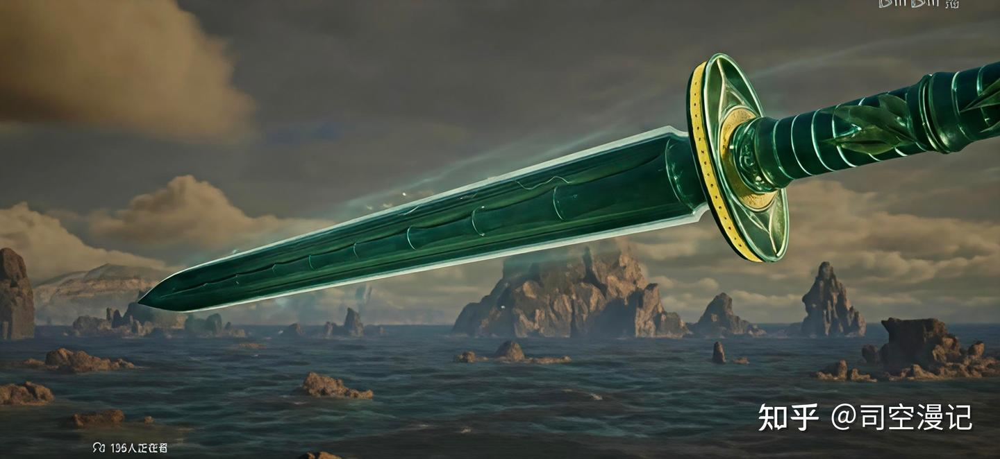
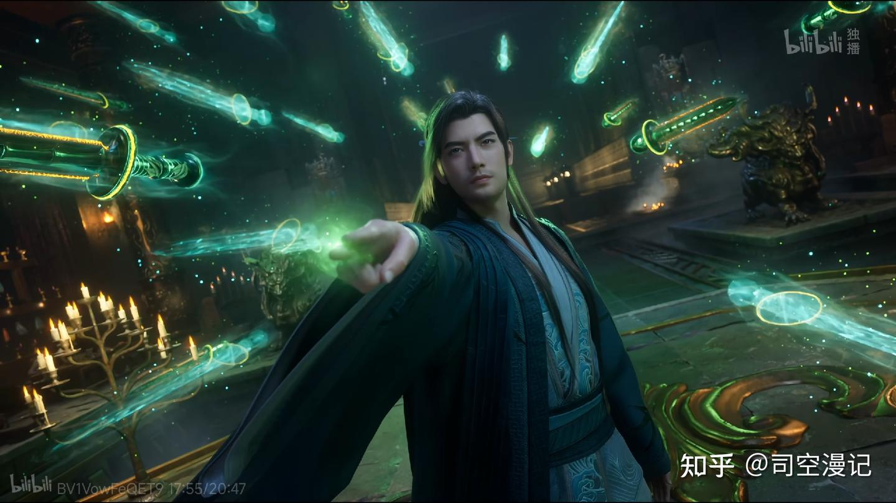

凡人修仙传：青竹蜂云剑，从结丹陪到道祖，72柄三品仙器有多逆天

[源网页](https://zhuanlan.zhihu.com/p/2069142984994699113?share_code=S3sTHkYTRE99&utm_psn=2079703971623593396)

在韩立的全部家当中，掌天瓶是逆天外挂，玄天斩灵剑是巅峰杀器，元合五极山是渡劫护盾，唯有青竹蜂云剑是真正意义上的本命至宝——从结丹期亲手炼制，到人界、灵界、仙界全程温养淬炼，跟着他从底层散修一路走到道祖境界。七十二柄成套飞剑、三套传承剑阵，最终全员晋升三品仙器，是整部作品里成长线最完整、最能代表韩立修仙轨迹的神兵。

一、人界结缘：七十二柄金雷竹飞剑，独步天南的剑道根基

青竹蜂云剑的炼制法门，藏在韩立从师父李化元处得到的一枚金色书页之中。当初他意外解锁完整《青元剑诀》，同步获得了这套本命飞剑的铸造之法，而成套飞剑正是青元剑诀威力的核心载体。

炼制主材天雷竹，是韩立以妙音门客卿长老的身份，从紫灵仙子手中换来的数千年份幼苗。此物位列人界三大神木，自然生长万年才能蜕变为孕育辟邪神雷的金雷竹，整个人界都难寻成品。韩立依靠掌天瓶绿液日夜催熟，仅用二十年便培育出六根品相完美的万年金雷竹，在结丹期耗尽心神，炼出了整整七十二柄成套飞剑。

这在当时的人界堪称独一份：常规修士最多炼十二柄一套，七十二柄不仅耗费海量材料，对修士真元负担更是极大，也只有手握掌天瓶、资源不愁的韩立敢这么做。飞剑天生自带金色辟邪神雷，是阴魔鬼魅、魔修神魂的天然克星，虚天殿、坠魔谷、灵界地渊等险地，韩立多次靠神雷破局、绝境逢生。

为了最大化威力，韩立不断往剑身融入珍稀材料：虚天殿所得炼晶强化锋锐，庚精提升硬度，大晋小极宫所得万年玄玉稳固根基。几番淬炼后，飞剑原本的青绿色意外变成了鎏金色，威力反而比剑诀记载的原版更强，也正是融入庚精的这批飞剑，支撑起了他的成名杀招——大庚剑阵。

这套剑阵是韩立人界阶段的天花板战力：仅用三十六柄布阵，就能瞬间秒杀两名元婴修士；七十二柄齐出布下完整剑阵，即便面对人界巅峰化神期的风老怪也有胜算，若非向之礼中途阻拦，早就能让这位人界大佬见识元婴后辈的剑道实力。

二、灵界提纯：剑心通灵，从“杂料飞剑”到剑道正宗

踏入灵界后，韩立在地渊偶遇《青元剑诀》的开创者青元子。这位剑道祖师见到韩立的飞剑当场大呼可惜——金雷竹本是世间顶级剑材，却因掺入太多异种材料浪费了根基潜力，上限被牢牢锁死。

二人一番交易后，韩立得到了完整的后续剑诀与种剑秘法。他将七十二柄飞剑重新植入金雷竹中温养近百年，洗去所有杂质，让飞剑回归纯粹木属性本源。经此提纯，青竹蜂云剑正式达成剑心通灵、剑灵化虚的境界：剑身可在虚实之间随意切换，即便受损破碎也能自行修复，和韩立神魂绑定更深，催动起来如臂使指 。

伴随境界提升，韩立也解锁了两套全新剑阵，威力远超人界的大庚剑阵：

\- 春黎剑阵（炼虚期可用）：以木系幻术为核心，能将对手拖入层层木灵幻境，困敌惑神、不战自溃，擅长以柔克刚；

\- 青蟠剑阵（合体期可用）：纯杀伐向剑阵，剑气凝练如龙，是灵界阶段韩立的主力攻坚手段。

灵界决战真仙马良时，青蟠剑阵全力展开，浩荡剑势正面硬撼对方的万灵血玺神通丝毫不落下风。也正是这一战，让韩立坐稳了“灵界第一大乘”的名号，青竹蜂云剑功不可没。后来玄天斩灵剑在飞升雷劫中破碎，其蕴含的毁灭法则被玄天葫芦收纳，最终全部融入青竹蜂云剑，为它仙界的终极蜕变埋下了关键伏笔 。

三、仙界封神：七十二柄三品仙器，一剑横断仙域

飞升仙界初期，韩立因失忆遗失了青竹蜂云剑，落入烛龙道副道主熊山手中。直至他修为恢复，才斩杀熊山夺回本命飞剑，开启了仙界篇的极速进化之路。

先是在冥寒仙府的无生剑海中，七十二柄飞剑吸纳海量上古剑元，单柄威力就已堪比灵界时期的玄天斩灵剑；随后在灰界洗煞池融入雷电法则，正式蜕变为法则仙器；又在蛮荒五光雷域融合都天神雷之力，晋升为五品仙剑。

真正的终极蜕变，来自雷电道祖遗留的雷夔之眼。韩立在仙界雷海深处得到此宝，配合玄天葫芦一同祭炼，不仅让七十二柄飞剑全员晋升三品仙器，还在葫芦中孕育出了七十二尊专属玄天剑灵，可自行排布剑阵、引动九天神雷。

三品仙器是什么概念？寻常大罗金仙穷尽一生都未必能求得一柄，韩立一出手就是七十二柄成套布阵，合力攻击堪比七十二名大罗修士联手，普通道祖都不敢正面硬接。

最终与古或今的决战中，韩立将梵圣真魔功、真灵血脉催动到极致，化出身生三十六臂的通天神魔，每只手掌各持一柄青竹蜂云剑。七十二剑高速旋转化作金色龙卷，通天剑阵彻底展开，最终凝聚出的“永恒一剑”破碎虚空，剑光落下处古或今的混沌之躯直接溃散，剑痕在中土仙域留下一道永世不灭的虚空裂缝，成为全书最巅峰的剑道名场面。

结语

和虚天鼎、玄天斩灵剑这些“捡来”的上古秘宝不同，青竹蜂云剑从一截竹苗开始，全程由韩立亲手培育、炼制、强化、升华。它的每一次进阶，都恰好对应韩立修为的一次跨越，是他从“韩跑跑”到“韩天尊”的全程见证者。

它没有最顶级的出身，却靠着韩立步步为营的打磨，最终站在了三界剑道的最顶端，既是本命法宝，也是韩立修仙之道的具象化身。

内容效果不满意？[点此反馈](https://feedback.notebooksyncer.com/feedback/e348866b_1788620429641?u=https%3A%2F%2Fzhuanlan.zhihu.com%2Fp%2F2069142984994699113%3Fshare_code%3DS3sTHkYTRE99%26utm_psn%3D2079703971623593396&s=onenote)
