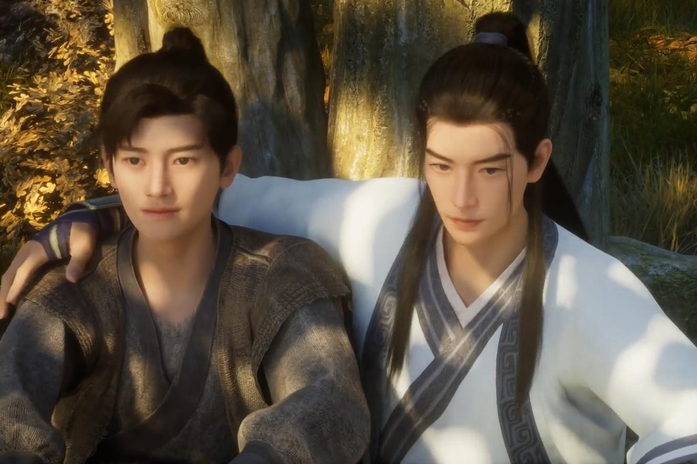
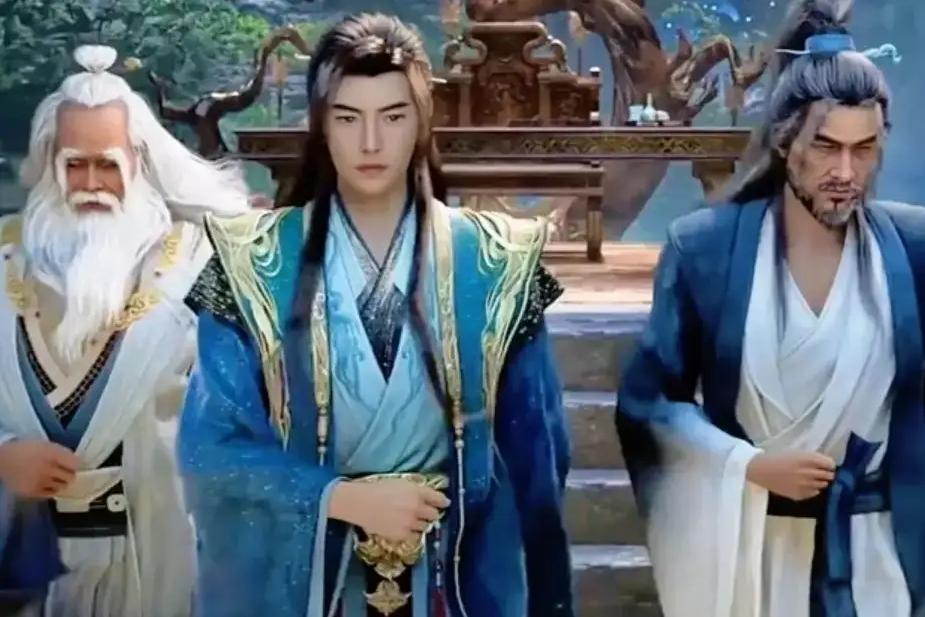
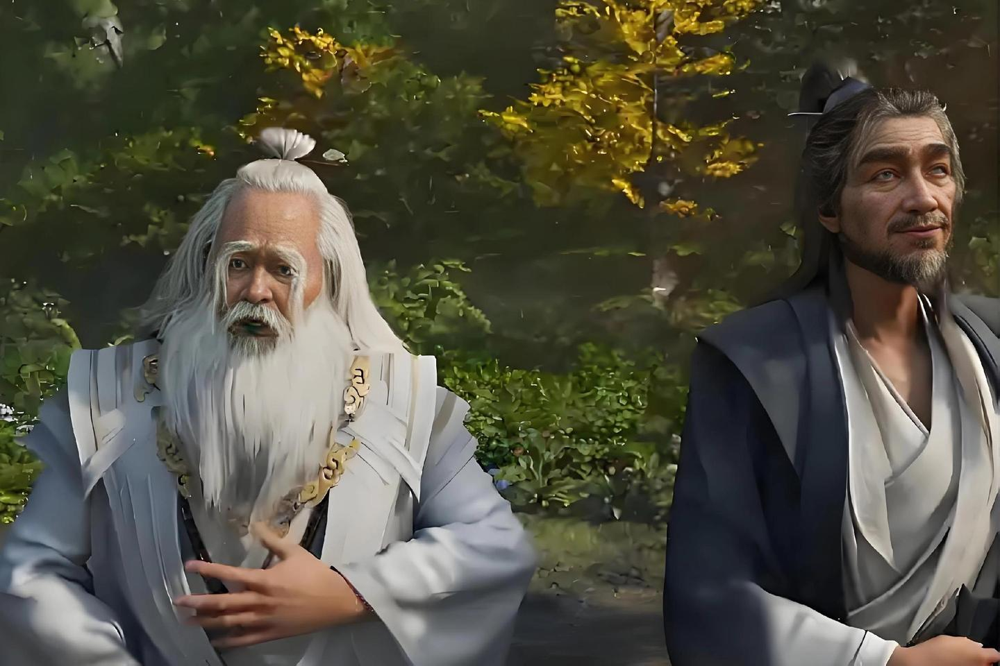
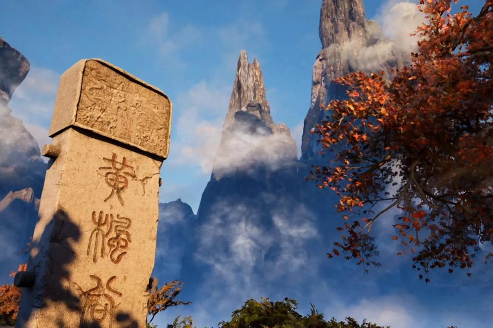
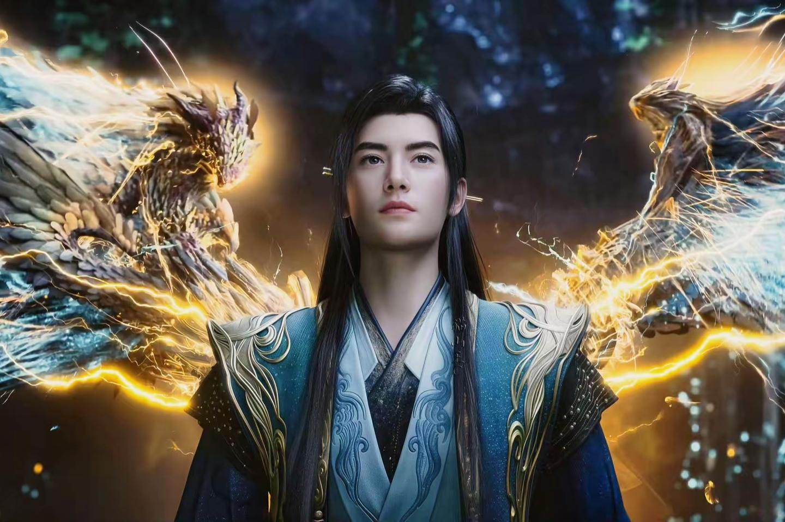
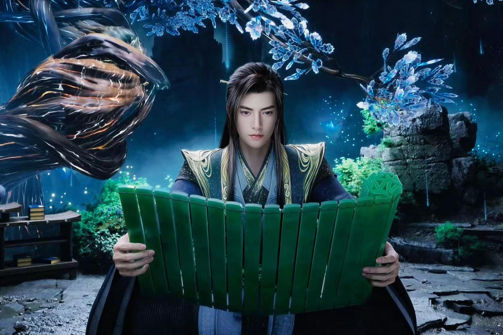
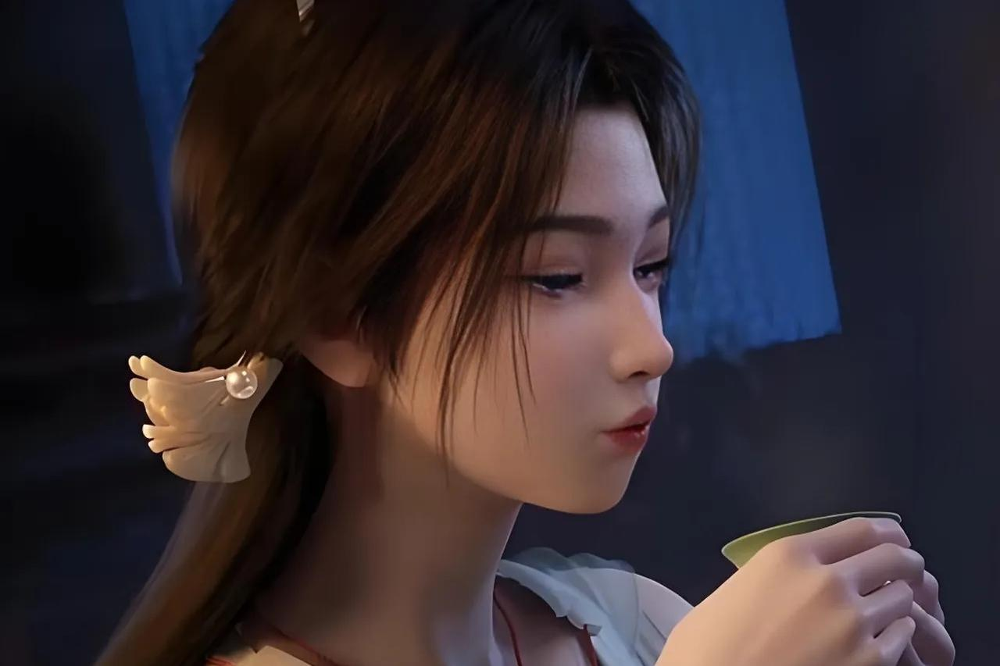

韩立是18岁加入黄枫谷，31岁就被令狐老祖当成弃子离开黄枫谷去了乱星海。

对于黄枫谷，韩立是没有多少感情的。无论是聂盈邀请韩立返回黄枫谷，还是萧翠儿邀请他返回黄枫谷，他都是拒绝返回黄枫谷。就算是令狐老祖以黄枫谷的太上长老相许，以宗门覆灭打感情牌，韩立依然是拒绝回黄枫谷。最终令狐老怪拿了三件重宝，韩立才算是答应援手三次，而且是在他力所能及的范围出手。

相比于黄枫谷，韩立在落云宗待的时间就长了很多。在217岁凝结元婴之后，韩立就被程天坤、吕洛邀请加入落云宗当了长老，直到他1007岁前去灵界时都是挂着落云宗长老的名号。

__那么，韩立对落云宗到底有没有一种归属感呢？__

落云宗与韩立是息息相关的，纯粹是依仗韩立的威名成为了天南第一大宗。

在韩立未加入落云宗前，落云宗就是云梦山三宗垫底的宗门。这个局面不仅无法改变，程天坤甚至都打算自己坐化后让吕洛退出云梦山了。而韩立的加入改变了这个局面，元婴中期时助落云宗成为云梦山第一宗，元婴后期时助落云宗成为天南第一宗，真正让落云宗走向了巅峰，并且昌盛万年。

要是没有韩立，就没有落云宗辉煌的发展，也没有昌盛的未来。

再者，韩立和程天坤、吕洛的交情还是不错的。

在韩立加入落云宗之前，落云宗的局面并不好，但多一个元婴修士就会让局面大好。程天坤和吕洛对韩立这个新长老自然是极尽拉拢，而且两人确实不同于令狐老怪，行事上也是让韩立颇为满意。

这也是韩立愿意留在落云宗的原因，程天坤、吕洛也算他为数不多的好友。

只是韩立与落云宗之间的关系很微妙，缺乏一种真正的归属感。

什么叫归属感呢？就像令狐老怪，他虽然奸诈，但对黄枫谷的感情是很深的，不然也不会临坐化还去邀请韩立返回黄枫谷了；又比如程天坤，他见到落云宗成为云梦山第一宗后，就算是坐化也就无憾了。

韩立就不同了，他虽然是落云宗长老，但一直是个挂名式的长老。在前期之时，韩立当落云宗长老也是方便有弟子为他寻找材料，而且他与落云宗大多弟子都不熟，需要的材料也是吕洛安排弟子给他寻找，他也无心与弟子过多接触。

再到元婴后期时，韩立成为了落云宗大长老。只是韩立依然没有插手落云宗事务，而是正式收下了柳玉为徒弟，让她代替自己处理落云宗事务。后续585岁时，韩立就离开落云宗去冲击化神境了，而且离去时将南宫婉安排到了乱星海。自此，韩立就再也没回过落云宗。

细看下来，落云宗确实是依靠韩立走向了巅峰，但对韩立来说也不是刻意帮助落云宗，就是境界提升了随之提带了落云宗。再者，韩立长期心心念念落云宗，也是因为南宫婉冰封在落云宗，他才经常想着落云宗，但南宫婉醒后，他就去乱星海了。

实际上，此时的韩立主要是一心修炼，落云宗算是个偶尔的落脚之处，却不是个归属之地，他真正为落云宗做的不多。

等到灵界时，韩立一手创建了青元宫基业。这里就能看出韩立的归属感了，他专门研究了一座两仪万引守护大阵守护整片无涯海，还配备了大量傀儡巡视青元宫各处；再者，韩立在青元宫留下了大量的资源，各种功法、丹药、灵药等应有尽有，数之不尽，专门建立了宫殿储藏各种资源；三是韩立不断扩展青元宫的修士数量，拥有数万修士后仍是让器灵子、海大少、白果儿继续扩展。

正是因此，就算韩立飞升仙界后，青元宫依然持续呈上升的发展趋势，修士不断进阶。

在落云宗呢？此时韩立身上的灵药、灵草、妖丹、丹药等也是有着很多，储物袋用不着的法宝、古宝也是有着一大堆，但他确实没有给落云宗留下什么。

细看的话，韩立在落云宗相熟的人，也只有__程天坤、吕洛、宋玉、慕沛灵、柳玉、田琴儿、石坚__。程天坤、吕洛没有得到韩立赠送丹药之类的，吕洛一直没突破，最多就是得过一个元初傀儡；宋玉是得韩立给了两次丹药，却也给韩立祖传秘籍；柳玉是韩立徒弟，拜师时得韩立给了些丹药和法宝，正式拜师时又了一些宝物；慕沛灵、田琴儿、石坚给的丹药不少，但都是被韩立移居乱星海的自己人。

总的来说，韩立虽然在落云宗时间不短，挂名长老更是长达八百年，但关系却不是太深厚，缺乏真正的归属感。
