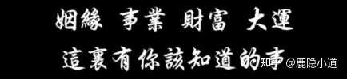

到底怎样才算是真正的大彻大悟？ \- 鹿隐小道 的回答

【1】

千金之子，不坐垂堂

运气好的时候不要去做太刺激的事情，蹦极，跳伞，过山车不要把运气和能量消耗在不该消耗的地方

【2】

腮骨下巴宽、额头宽、颧骨高、眼睛有神、下巴长、人中深长、声音洪亮，三庭匀称，尤其从鼻梁山根开始往下都很好，骨架格外阔，这些体现都会在一个人身上齐全，这就是大器晚成之人。

【3】

不要一味高冷。

因为高冷表面上是高姿态，实际上内核是恐惧，是一种无能为力。

当然，你平时可以高冷，但在一些对自己有意义的人面前，比如你看到一个好看的人，友善更有生产力。

记住，高冷是一种无能为力。

【4】

容易感觉羞耻，是因为把别人看得太重。

在不违法不害人的前提下，你之所以容易羞耻，是因为太在乎别人的看法。太在乎别人的看法，是因为把别人看得太重。

对犯错有羞耻，对需要别人有羞耻，对美好事情的向往有羞耻，对被拒绝有羞耻，对得不到回应有羞耻，对性欲有羞耻，对展现自己有羞耻，对打扮有羞耻，对冷场有羞耻，本质上都是因为把别人看得太重。

把别人看得太重，就是一种原罪，羞耻之链将会缠满全身。

【5】

跟某个人吃饭时感觉很香，那么这个人就旺你；

买完一件东西之后感觉很值，这件商品就旺你；

一件事让你觉得特别有干劲儿，这件事就旺你；

到一个地方之后感觉很舒服，这个地方就旺你。

【6】

最深的慈悲，是你看懂了别人的局限，也看懂了自己的局限。

你明白，他不是不想对你好，是他手里根本没有那个东西。

一个人的能量认知，经历，他内心积攒的温暖，都是有定数的。 他给不出他没有的，就像一口枯井，你往里扔再多的桶，也打不上来水。

你看懂了这些，心里就不会起那么大的火，你不再觉得他是针对你，你只是看见了一个被习气、被认知、被过往绑住的人。

你会生出一丝怜悯，而不是愤怒。这悲悯不是高高在上的可怜，而是“我懂你”的默契，因为你也曾经是这样，或者在某些时刻，你依然是。

当你意识到这些，你就不再高高在上了，大家都一样，都在各自的局限里挣扎，谁也不比谁更容易。

【7】

家中碗碟太多，不利承接福禄

很多家庭，家里也是4口人左右，但是碗有十几个，碟有二十几，且五花八门 碗、碟有艮卦的象，代表着稳定、家庭 刚好够用是最好的，如四口之家，6个碗挺好 碟子可以稍微多点，但如果太多，会把【艮】 的象无限放大，不利发展，也寓意坐吃山空 从另一个角度，碗碟是喂养众生的，多了也有伺候别人之意

【8】

生活玄学： 如果财运比较弱的朋友，不太建议买太多的包包，包多钱少，越背越没。

alt="Image">
