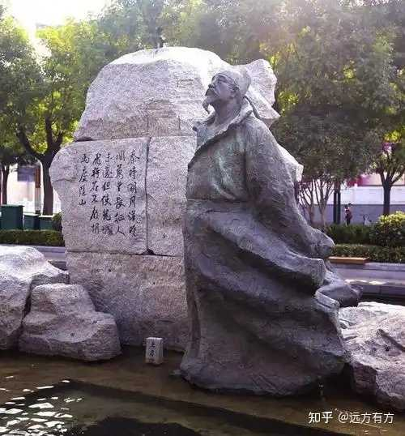
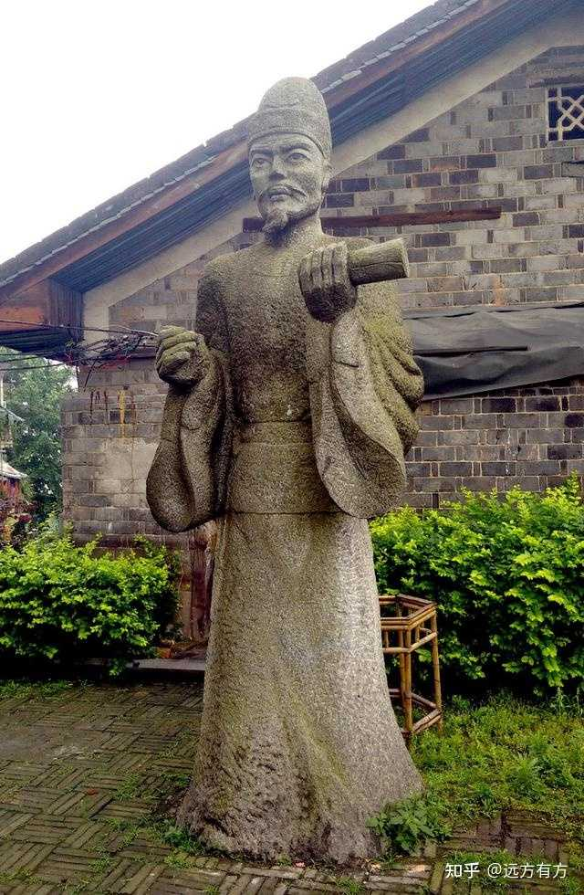

历史上哪些人物的死是最出人意料的？ \- 远方有方 的回答

类似于五条悟那种上一秒还是天上地下唯我独尊下一话就死的莫名其妙的

素称“七绝圣手”的著名边塞诗人王昌龄。

与一般出身农门的苦孩子不同，小王同学打小就“胸无大志”、不求上进，整天惬意地沉浸在养猪放牛、农耕渔樵的清苦生活中不可自拔：

腰镰欲何之，东园刈秋韭。世事不复论，悲歌和樵叟。
开门望长川，薄暮见渔者。借问白头翁，垂纶几年也。

时间一长，越来越佛系，到了22岁时，小伙伴都纷纷去华山考科举，他偏偏跑到嵩山去学道：

中峰青苔壁，一点云生时。岂意石堂里，得逢焦炼师。
炉香净琴案，松影闲瑶墀。拜受长年药，翩翻西海期。

可惜直到26岁也没学出什么名堂，还是凡胎肉体一个，他只好决定换条赛道碰碰运气。

思路一转，出路立宽。

坚信读万卷书不如行万里路的昌龄同志背起行囊，走向远方。

他当时并不知道，自己即将在大唐诗坛开宗立派，成为边塞诗界的泰斗。

穷娃当然是擅长穷游的。

身板硬、脚板更硬的背包客小王一路向西，穿过河西走廊，来到玉门关外，看到了中原文人墨客从未领略过的大漠风光：

__秦时明月汉时关，万里长征人未还。但使龙城飞将在，不教胡马度阴山__。

凭着这首明朝人眼里的“七绝压卷之作”，一诗封神。

再配上“青海长云暗雪山，孤城遥望玉门关。__黄沙百战穿金甲，不破楼兰终不还__”的豪诗加持，28岁的王大诗人携口碑炸裂的超高人气回到长安。

alt="Image">

可能是在西北锻炼了勇气、增长了自信，名噪一时的王昌龄决定也去考个科举试试，便在京兆府蓝田县石门谷置了间茅屋复习功课。

非著名诗人常建曾不无羡慕地来此拜访：

清溪深不测，隐处唯孤云。松际露微月，清光犹为君。
茅亭宿花影，药院滋苔纹。__余亦谢时去，西山鸾鹤群__。

可惜他理解错了，人家王隐士这次真不是隐居，只是备考，并果然在29岁那年进士及第，当上了秘书省校书郎。

然而，当官不是种田，不是学道，更不是穷游，王校书郎可能还是没搞清楚仕途规律，一直校了7年书也没进半步，整日长吁短叹，留下了两首著名的宫怨诗，一首是：

闺中少妇不知愁，春日凝妆上翠楼。
忽见陌头杨柳色，悔教夫婿觅封侯。

第二首是：

西宫夜静百花香，欲卷珠帘春恨长。
斜抱云和深见月，朦胧树色隐昭阳。

36岁时，当了多年“怨妇”的王校书郎又一次参加选拔考试，勉强挪动一小步，改任汜水县尉。

然而，作为小小一个县级公安局长，他却从不懂得见风使舵，明哲保身，老是喜欢给中央挑毛病。

当时正值开元盛世，全民沉浸歌舞升平，舆论热衷歌功颂德，即便有几个愤青往往也只是借古讽今、点到为止。

王局长却直言不讳、直接开怼，特别是张九龄罢相后，他频频给朝廷添堵：

“诸将多失律，庙堂始追悔”、“虽有屠城功，亦有降虏辈”、“明主忧既远，边事亦可大”、“公论日夕阻，朝廷蹉跎会”。

气得新宰相李林甫直接把他贬往张九龄的家乡岭南，从此他又开启了和各路好友的送别模式。

40岁的王昌龄卷起铺盖一路南下，走到湖北襄阳时碰到孟浩然，获赠了名诗：

数年同笔砚，兹夕间衾裯。__意气今何在，相思望斗牛__。

第二年遇赦返京，他在洞庭湖畔遇到李白，赠出一首《巴陵送李十二》：

摇曳巴陵洲渚分，清江传语便风闻。
山长不见秋城色，日暮蒹葭空水云。

他后来又到荆州拜访张九龄，到襄阳再见孟浩然，可能是因为官复原职心情大好，他们喝得酩酊大醉、忘了医嘱，孟浩然旧疾复发、不治身亡，张九龄也在次年驾鹤西去，这顿送行酒便成了几位老友的永别宴。

大概是奸相李林甫故意使坏，王昌龄刚到长安，屁股还没坐热，又被贬去南京当江宁丞，好友岑参伤感相送：

对酒寂不语，怅然悲送君。明时未得用，白首徒攻文。
泽国从一官，沧波几千里。群公满天阙，独去过淮水。

此后8年他一直在江宁丞任上蹉跎，随着年岁日长和一众知交好友逐渐凋零，他也变得郁郁寡欢、落寞沮丧，在芙蓉楼（在今江苏镇江金山天下第一泉的塔影湖滨）送别好友辛渐时，他挥毫写下千古名篇：

__寒雨连江夜入吴，平明送客楚山孤。__
__洛阳亲友如相问，一片冰心在玉壶。__

孤介傲岸之姿，一览无余。

alt="Image">

50岁那年，老是迟到早退、旷工翘班的王昌龄再次被贬为龙标尉（即当时的湖南怀化公安局长）。

身在扬州的李白听到这个消息后义愤地为他写就了名诗《闻王昌龄左迁龙标遥有此寄》相赠：

__杨花落尽子规啼，闻道龙标过五溪。__
__我寄愁心与明月，随风直到夜郎西。__

可能是过了知天命的年纪，王昌龄在龙标的8年反而很淡定。

他时不时在山里搞个野宴:

沅溪夏晚足凉风，春酒相携就竹丛。
莫道弦歌愁远谪，青山明月不曾空。

看到当地酋长的公主、蛮女在荷池采莲唱歌，他欣然创作《采莲曲》：

荷叶罗裙一色裁，芙蓉向脸两边开。
乱入池中看不见，闻歌始觉有人来。

送别好友柴侍御时他也不再悲伤：

沅水通波接武冈，送君不觉有离伤。
青山一道同云雨，明月何曾是两乡。

人生境界冲上了新高度。

王昌龄57岁时“安史之乱”爆发，盛世泡沫终于吹破。

55岁的李白卷入永王叛乱流放夜郎，55岁的王维困在长安被迫当了伪官，43岁的杜甫和37岁的岑参赶往灵武投奔唐肃宗李亨试图建功立业。

而当年那个“不破楼兰终不还”的小伙早已无门报国、乏力回天。

虽然他所在的湘西地区并未受到战火波及，但疲惫不堪的老王还是待不住了，或许是挂念他家乡的几亩薄田，或许只是单纯想回到人生的原点，他决然挂冠而去，踏上了回乡之路。

然而，__故乡往往是回不去的__。

当他走到安徽亳州时，莫名其妙地被亳州刺史闾丘晓所杀。

一个老人、一个壮年，一个诗人、一个武将，素无冤仇、八竿子打不着，但闾丘晓偏偏就冒天下之大不韪下了狠手，留下了千古疑团。

有人说是因为王昌龄犯了闾丘晓的忌讳，也有人说仅仅是闾丘晓嫉妒王昌龄的才华，可惜此时他的老乡狄仁杰早已入土，再没有神探能够挖出这段历史真相了。

唯一稍可告慰的是，天道好轮回，苍天饶过谁。

仅1年后，闾丘晓就因贻误战机，被杜甫眼中“张公一生江海客，身长九尺须眉苍。征起适值风云会，扶颠始知筹策良”的当朝宰相张镐杖杀。

一贯贪婪自私、不可一世的闾丘晓在面对死亡时尿了裤子、怂货本相暴露无遗，他捣蒜般磕头求饶，猛打感情牌：

“我上有80岁老母，下有吃奶的娃娃……”（有亲，乞贷余命）。

然而，这种无赖套路是打动不了见多识广的张宰相的，他怼出一句“王昌龄之亲，欲与谁养？”后，决然处死了这个罪恶的灵魂，堪堪还了王昌龄一点点公道。

[选自【远方有方】作品《河岳沧桑》](https://www.zhihu.com/column/c_1893196107061916903)
