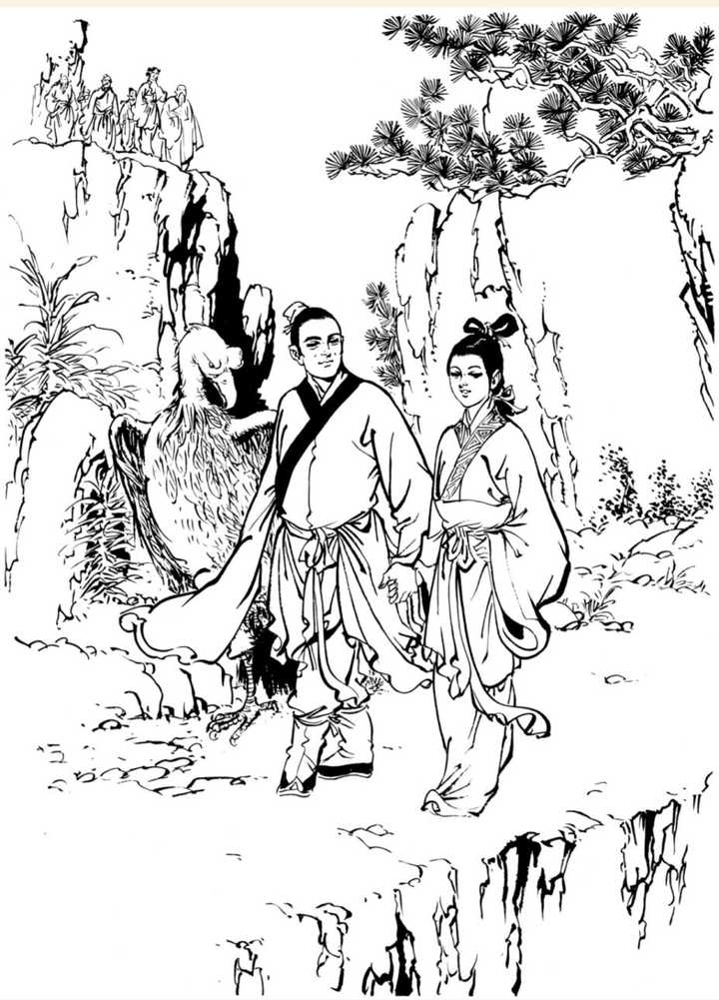
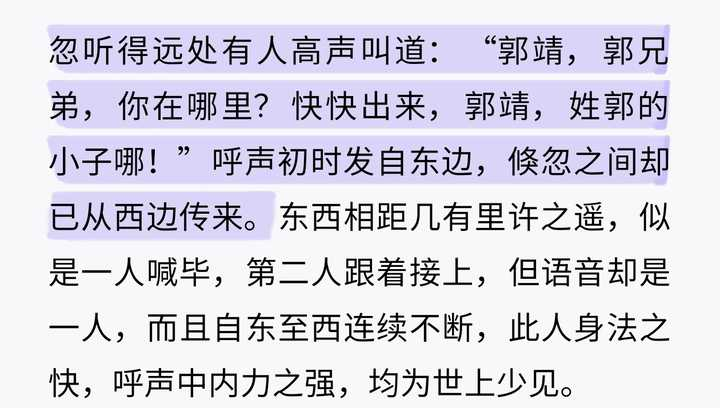
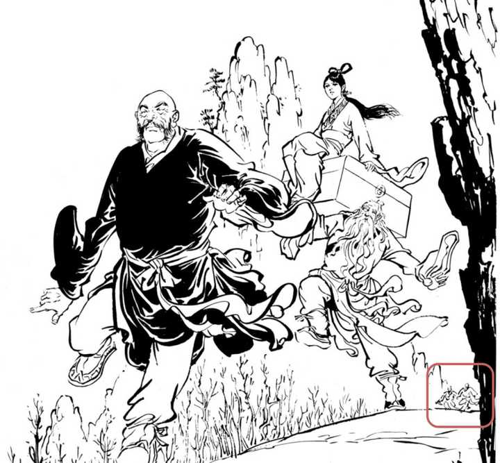

周伯通和小龙女关系怎么那么好？ \- 知乎用户 的回答

刚刚看古天乐版神雕侠侣，周伯通居然能把小龙女从客店拉走，哈哈哈，好萌！

我不知道啊，

- 我只知道杨过如果没被郭芙断臂流血活下来找来重阳宫，那小龙女1v9后救下她的，应该是那个说“不想见小龙女”的周伯通了。

（嘴上说不见，身体却很诚实一直跟着她？）

- 我只知道，周伯通对公孙止恶意大，骂他祖宗又骂他，还骂杨过，说过“__我哪里不如杨过我哪里不如杨过__”；郭襄一个小娃娃说他不如杨过，他脸上笑嘻嘻，突然就出手把郭襄举起来吓了一跳，连边上的雕兄都差点对他动手，被他骂“好畜生”，杨过才反问他“怎么返老还童了”；

（大家都知道杨过把他雕兄当成“半师半友”，老顽童却开口叫“畜生”，金庸这样的大师这样写没点别的意思？你信我不信。

“通灵”的“神雕”却主动对周伯通出手，我看到有个说法是，因为周身上沾染了蛇气，神雕侠侣的蛇除了欧阳锋，李莫愁这两条16年前就死了的“蛇”，还有谁是蛇呢？好难猜哦）

alt="Image">杨过对雕兄的态度1

alt="Image">杨过对雕兄的态度影响郭襄对神雕的态度

alt="Image">旁人对神雕的态度

![神 雕 与 郭 襄 同 来 ， 又 见 她 对 己 有 礼 ， 心 生 好
感 ， 突 见 周 伯 通 将 她 戏 弄 ， 有 意 回 护 郭 襄 ，
唰 的 一 下 ， 展 翅 向 周 伯 通 扫 去 。 周 伯 通 双 掌
运 力 ， 还 击 出 去 。 只 听 得 蓬 的 一 响 ， 双 力 相
交 ， 周 伯 通 凝 立 不 动 ， 雕 翅 的 扫 力 从 他 身 旁
掠 了 过 去 。 神 雕 待 要 追 击 ， 杨 过 喝 道 ： “ 雕
兄 请 勿 无 礼 ！ 眼 前 这 位 乃 前 辈 高 人 ！ ” 神 雕
收 翅 昂 立 ， 神 色 极 为 倨 傲 。 周 伯 通 心 中 佩
服 ， 笑 道 ： “ 好 畜 生 ！ 力 气 倒 真 不 小 ， 怪 不
得 摆 这 么 大 架 子 。
杨 过 道 ： “ 这 位 雕 兄 不 知 已 有 几 百 岁 ， 它 牵
纪 可 比 你 老 得 多 呢 ！ 喂 ， 老 顽 童 ， 你 怎 地
返 老 还 童 ， 雪 白 的 头 发 反 而 变 黑 了 ？ " 周 伯
通 笑 道 ： “ 这 头 发 胡 子 ， 不 由 人 作 主 ， 从 前
它 爱 由 黑 变 白 ， 只 得 让 它 变 ， 现 下 又 由 白 变
黑 ， 我 也 拿 它 没 法 子 。 ” 郭 襄 道 ： “ 将 来 你 ](attachments/834b2b2fec423a55.jpg)

alt="Image">周伯通对神雕的态度→影响杨过对周伯通的态度

alt="Image">关注神雕看某小龙的眼神，也挺有意思的～

- 我只知道，小龙女学会左右互搏之后，__第一个写下的两个名字是“老顽童“小龙女”__，而不是“杨过小龙女”；可能杨过不配吧～

alt="Image">小龙女亲手书“老顽童小龙女”

就和渔网阵一样，

电视剧为什么从来不把这段拍出来给观众看看呢？

好难猜哦～

- 我只知道，周伯通__脱得赤条条__，小龙女是__微微一笑看着他__的；
- 我只知道，__小龙女邀请周伯通一起去终南山__，

我们老顽童周伯通“嗖”一下逃跑了，

![小 龙 女 揭 开 玉 瓶 ， 先 在 周 伯 通 身 上 弹 了 些 蜜
浆 ， 再 召 来 野 蜂 ， 叮 在 周 伯 通 身 上 。 老 顽 童
笑 逐 颜 开 ， 全 身 脱 得 赤 条 条 的 ， 野 蜂 针 刺
全 身 ， 潜 运 神 功 将 蜂 毒 吸 入 丹 田 ， 再 随 真 气
流 遍 全 身 。 不 多 时 ， 遍 体 都 是 野 蜂 尾 针 所 刺
的 小 孔 ， 蛛 毒 尽 解 ， 再 刺 下 去 便 越 来 越 痛 ，
大 声 叫 道 ： “ 够 啦 ， 够 啦 ！ 再 刺 下 去 便 扌 觉 出
人 命 来 啦 ！ ” 扌 合 起 衣 裤 穿 起 。
小 龙 女 微 微 一 笑 ， 寺 野 蜂 驱 走 ， 见 金 铃 软
索 掉 在 一 旁 ， 顺 手 扌 合 起 ， 问 道 ： ： 我 要 上 终
南 山 去 ， 你 去 不 去 ？ ' 周 伯 通 摇 摇 头 ， 道 ：
“ 我 另 有 要 紧 事 情 要 办 ， 你 一 个 人 去 罢 0 "
小 龙 女 道 ： “ 啊 ！ 是 了 ， 你 要 到 襄 阳 城 去 相
助 郭 大 侠 。 ” 她 一 提 到 “ 郭 大 侠 " 三 字 ， 便
想 到 郭 芙 跟 着 想 到 了 杨 过 ， 日 然 道 ： “ 周
伯 通 ， 你 若 见 到 杨 过 ， 别 提 起 曾 遇 见 我 。 ](attachments/6212a80b9ede15d4.jpg)

alt="Image">小龙女邀请周伯通“去终南山”

然后，

周伯通因为__害怕见到小龙女，__

__所以来到了几十年没有回过的终南山__；

为什么要强调几十年没回过呢？

因为甄志丙和赵志敬都不认识他。

alt="Image">周伯通害怕见到小龙女所以“回终南山”

- 周伯通要找赵志敬问为什么害自己，

小龙女在重阳宫追着赵志敬杀，甚至因此和蒙古四杰干了起来；

- 然后提个有意思的，大家可以去原著中阅读：

小龙女的遮羞布是杨过的话，

周伯通的遮羞布就是郭靖——

小龙女每次干了不要脸的事，理由就是“为了过儿”，

周伯通每次出现在小龙女身边，理由都是“我要帮把弟郭靖”；

alt="Image">出场大呼“郭靖郭靖”

alt="Image">给杨过的理由是：郭靖爱和蒙古人玩儿所以来蒙古大营找

在大多数__读者真信了“周伯通天真无邪找郭靖”__的时候，突然笔尖一转，炸出“真相”

alt="Image">郭靖都留信“保卫襄阳抗击蒙古”了，怎么可能出现在蒙古大营？

（大家再思索一下，周伯通出现在蒙古大营后引发的事件是什么？

就能轻易把他行动路线扒拉出来了：

公孙谷主娶柳妹——周伯通捣乱丹房偷灵芝偷绝情丹——引来公孙绿萼带人追踪——周伯通现身蒙古大营，用郭靖引起忽必烈/杨过关注——把蒙古人/杨过引入绝情谷——自己故意装弱被公孙绿萼带入绝情谷……

最后的结果是：

公孙止小龙女婚礼被破坏。

所以，如果把“破坏婚礼”看成案件1的话……大家看到这里，还觉得破坏婚礼的“真凶”是杨过吗？

最后大家可以带着一个问题去看神雕绝情谷剧情——

请问，《神雕侠侣》书中对绝情谷公孙止恶意最大的男人是谁？具体的行为表现是？）

只能说，神雕原著写的很清楚，只看各位看官肯不肯带脑子去阅读了。

杨龙粉说什么“过芙”是索隐……我只能说，但凡有点阅读能力，带脑子看书的读者都能发现问题。

如果平时再爱看点侦探推理小说的读者，阅读神雕时更是如鱼得水……阅读神雕真够不上索隐，别碰瓷我们四大名著了行吗？

再比如山洞这里

小龙女道：“啊！是了，你要到襄阳城去相助郭大侠。”__她一提到“郭大侠”三字，便想到郭芙，跟着想到了杨过__，黯然道：“周伯通，你若见到杨过，别提起曾遇见我。”却见他喃喃自语，不理自己，但完全听不到他在说什么，脸上神色诡异，不知在捣什么鬼。

乍一眼，大家似乎都信了姑姑在想念过儿，

容我提醒一句——龙女追杀甄志丙一个月，我们过儿中情花毒只能活7天，

但凡天气好一点，过儿坟头草都长起来了，

这样还要被姑姑拉出来当遮羞布，过儿纯惨。

- 再看周龙甜蜜互动：__怀中偷瓶__，

多余不说，各位自己品味，只说一点……杨过这个古墓男仆，不会控蜂，

alt="Image">

后面还有周伯通离开之后，

小龙女先是大笑，然后突感寂寞，流下泪来……

情绪波动如此之大的小龙女，

诸位何时见过？

- 我只知道杨过这个智商忽高忽低，对小龙女一会儿关心一会儿敷衍的男主，在小龙女中毒快死时候带着她雪地徒步，一点不怕走死她，让她毒素更快走遍全身；最“天真无邪不谙世事”的周伯通却能想到扛着龙女让她休息。

alt="Image">欧阳锋当年就是这样让杨过认义父的，可能过儿又“健忘”了吧

alt="Image">杨过“心念微转”个啥？看到这段还能磕杨龙的，要不去再去看看《消失的她》？

alt="Image">这张图我愿称之为“老顽童受害者联盟”或者“隔壁顽（lao）童（wang）苦主聚会”也行

- 小龙女“不谙世事不懂礼法”，但是知道“人前周老爷子”“人后周伯通/老顽童”，两次。

（作者这样写到底想，真的是想表达小龙女不谙世事吗？）

alt="Image">第一次：人后周伯通

alt="Image">第一次：人前周老爷子

alt="Image">第二次：人后老顽童

alt="Image">第二次：人前“周老爷子”

补充一个评论区的提醒

alt="Image">

让上面那张图的“__她不懂礼法__”，显得更加可笑了。

（金庸真的好会玩哈哈哈哈，神雕原著真的太好笑了）

- 然后就是，周伯通每次出现的时机都太过巧合了，

比如小龙女不想嫁给公孙止，周伯通__正好__出现绝情谷，捣乱婚礼引来了杨过；

小龙女服食的情花毒解药，是周伯通__正好__放在杨过口袋里的，所以到底真正是谁救了小龙女呢？好难猜哦～

金轮对小龙女起了杀心要弄死她，周伯通__正好__带着王旗出现打乱他注意力让他没工夫杀小龙女；

小龙女追着甄志丙赵志敬去终南山，周伯通__正好__因为不想见她来到终南山；

小龙女重阳宫拜堂需要离开疗伤，周伯通__正好__出现打乱了全真五子阻拦；

小龙女和慈恩比轻功，内力不够了，周伯通__正好__出现扛着她跑；

小龙女为杨过抢药晕倒，周伯通__正好__带着蜜蜂出现拦住李莫愁；

小龙女刺字的蜜蜂，周伯通__正好__发现递给黄蓉看；

16年后小龙女容颜不改，周伯通__正好__返老还童；

小龙女喜欢松叶清香，周伯通百花谷前__正好__三棵松树，还有蜜蜂穿梭；

alt="Image">

小龙女谷底有意味不明的儿童衣衫，周伯通__正好__追着问瑛姑死了几十年的孩子几个璇；

小龙女在台下打蒙古兵，周伯通__正好__出现在她身边一起打，最后杨过救郭襄，金轮救郭襄，老顽童出现在这里的意义是？

小龙女和杨过给欧阳锋磕头，周伯通__正好__凑过来给欧阳锋作揖，你说因为都是五绝……可是真正的圣人一灯大师可连一句“阿弥陀佛”都没有，你周伯通算老几？

丘处机写个小龙女的《无俗念》，因为金庸改的几个字，__正好__对应了《三言二拍》里老夫少妻，且正好“八十老翁娶十八少女”，少女是天上“玉女”……

周龙就和过芙一样，

一个巧合两个巧合三个四个数不清的巧合，

而所有人都知道，巧合多了就不叫巧合了……

不想细扒了，

大家感兴趣的去看原著吧～

最后强调，感兴趣的路人们

请看正版，

请看正版，

请看正版！

不要和杨龙粉一样看豆包新编版，

当我第一次看到对线时，杨龙粉掏出豆包搜索的原著时，天知道我有多震惊，

最震惊的不过杨龙粉发出的那句——

__杨过道：黄蓉黄蓉，我有妻小龙女，绝不会娶你女儿！__
__（以上来自杨龙粉对线时发出的所谓“原著截图”，其实是豆包编的。）__

我：？？？？

杨龙粉牛逼！

望周知，正版小说豆包它没有版权不能发原著，杨龙粉能正常一点吗？

有点无聊，加个二编好了：

容颜不改小龙女，返老还童周伯通。

alt="Image">16年后，40岁，容颜不改小龙女

alt="Image">

alt="Image">将近100周伯通，返老还童

龙女随身携带的《参同契》

alt="Image">

（顺便吐槽一个，大家数数这段话里，“不会撒谎的”小龙女撒了几个谎？）
