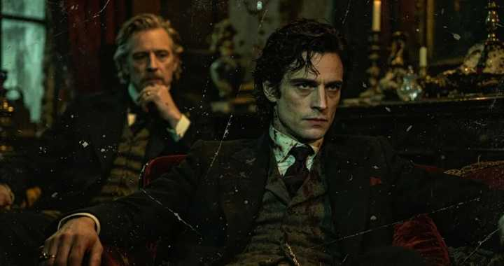

哪些经典的文学名著已经不适合现在的年轻人读了？ \- 青简说史 的回答

alt="Image">

在今天，你随便抓一个现代人。

让他去读雨果的《巴黎圣母院》、巴尔扎克的《高老头》、或者是赫尔曼·麦尔维尔的《白鲸》。

大概率的情况是，不出二十页，他就会感到疲惫、烦躁，甚至昏昏欲睡。

为什么？因为迎面扑来的，是一堵令人窒息的“文字高墙”。

在《高老头》开篇的几十页里，巴尔扎克仿佛得了一种强迫症，他用细碎的笔触，不厌其烦地。

描写着伏盖公寓里，每一块掉漆的墙皮、每一张油腻的餐桌、空气中弥漫的混合着猫尿，和剩菜的腐臭味，甚至连房客衣服上的每一个补丁，都要描写得清清楚楚。

在《巴黎圣母院》里，雨果专门用了一整卷（《鸟瞰巴黎》），来描写巴黎的城市建筑格局，从塞纳河的流向，到每一座钟楼的尖顶，巨细无遗。

在《白鲸》里，麦尔维尔更是丧心病狂，他花了整整几十个章节，像写生物学论文一样。

详细科普了鲸鱼的骨骼构造、提取鲸油的工业流程，以及捕鲸船上每一根绳索的打结方法。

面对这些，动辄几万字的环境描写和“细节铺陈，习惯一分钟看三个反转短视频的现代读者，大脑会本能地发出尖叫：

“这和主线剧情有什么关系？赶紧快进啊！”

于是，现代人陷入了深深的自卑，以为是自己太没文化。

但这根本不是智力问题，而是一种信息冗余，导致的系统排异反应。

这就好比你拿着一台最新款的，预装无数高清图库的顶级游戏主机，却非要塞进一张19世纪全靠纯代码，从零开始渲染图像的老旧软盘。

你痛苦，不是因为这张软盘里的游戏不好玩。

而是因为你现在的系统，已经完全不需要这种，低效的“文字渲染方式”了。

一、低带宽时代的“人肉VR构建师”

在那个属于巴尔扎克、雨果、狄更斯和托尔斯泰的19世纪，文字是什么？

文字，是全人类唯一可以进行跨时空、长距离传输的“高清媒介”。

没有摄影术（哪怕早期有了也无法在报纸书籍上，大规模低成本印刷），没有电影，更没有国家地理频道的纪录片。

那是一个“视觉信息极度匮乏”的时代。

所以作家必须确保，一个可能终生没离开过家乡的人，能够仅凭文字就在脑海里，构建出一个完整的新世界。

这就解释了为什么19世纪的小说家，必须成为啰嗦的“细节狂魔”。

想象一下19世纪的读者群画像。

一个住在俄罗斯西伯利亚，偏远农庄里的小地主，或者一个生活在英国约克郡乡下的小姐。

他们这辈子都没有坐过火车，他们脑海中的“世界”，可能只有方圆五十里大。

你跟他们说“巴黎是一个繁华堕落的大都市”，他们大脑里是一片空白的。

因为他们，连超过三层楼的建筑都没见过，更别提煤气灯、下水道、或者是大剧院里那些，戴着羽毛帽子的贵妇了。

在这个信息绝对闭塞的“认知孤岛”上，作家不能仅仅只做一个“讲故事的人”，必须先充当一个“世界架构师”。

当雨果描写巴黎时，他实际上是在充当一架“文字无人机”。

他必须用繁杂的空间方位词，带着那个没见过世面的乡下读者，从高空俯瞰整个塞纳河畔，否则读者根本无法建立起，对这部宏大史诗的空间想象。

当麦尔维尔描写捕鲸时，他实际上是在拍一部“文字版探索纪录片”。

因为那个时代的内陆美国人，连大海是什么颜色都没见过。

如果不把鲸鱼的每一块骨头拆解清楚，读者就无法感受到，人类在大自然面前那种，恐怖的巨物压迫感。

当巴尔扎克描写伏盖公寓的酸臭味时，他实际上是在进行“气味和触觉的数据传输”。

他要用精准的修辞，把巴黎底层贫民窟的那种阴暗、潮湿、绝望，硬生生塞进外省读者的鼻腔和毛孔里。

在没有影像辅助的时代，文字承载了它本来不该承受的重量。

这些作家必须用词语去替代镜头、替代色彩、替代声音。

他们不是在“水字数”，他们是在用自己的心血，为那些一辈子被困在土地上的人，一砖一瓦地搭建起，一个完全拟真的、拥有极高分辨率的“世界”。

这就是很多名著难读的原因，本质上是因为，它们原本就服务于另一个世界。

二、为什么文字的魔法失效了？

那么，到了今天，为什么这套伟大的“文字VR技术”，突然就失效了呢？甚至变成了让人烦躁的阅读障碍？

因为我们这代人，是在“富媒体环境”里长大的。

什么是富媒体环境？

简单来说，就是我们的现代人类大脑，在成长过程中，早就被电影、电视、互联网、高清图片、3A游戏，“预装了海量的视觉和听觉缓存”。

当我们在今天的小说里，看到“一座哥特式大教堂”这几个字时，我们需要作家再花二十页，去描写飞扶壁、玫瑰窗和滴水嘴兽吗？

完全不需要。

因为我们的大脑，会瞬间调取我们看过的《刺客信条：大革命》游戏画面、看过的欧洲旅游vlog，在0\.01秒内，就在脑海中自动生成了一座，逼真的哥特式大教堂。

当我们在今天的小说里，看到“赛博朋克城市”时，我们脑海里立刻就浮现出《银翼杀手》里，阴雨连绵的街道、闪烁的霓虹灯和巨大的全息投影。

我们拥有了庞大的“视觉预知能力”和“算力过剩”。

现代文学之所以越来越精简，叙事节奏越来越快，像海明威的“冰山理论”，之所以在20世纪大行其道，就是因为作家默认读者大脑里，已经有了这些缓存。

作家只需要抛出一个关键的词汇锚点，读者就能自动完成剩下的渲染工作。

而当我们带着这套，被富媒体“惯坏了”的高速处理器，去逆向读取19世纪的经典名著时，悲剧就发生了。

你想要直接看，冉阿让怎么和沙威斗智斗勇，但雨果却按住了你的头，非要给你详细科普，滑铁卢战役的地形图。

在你的认知系统里，这些地形地貌，你只要看一眼地图就能明白，但雨果却用了几万字去勾勒。

这对于现代读者来说，就像是在玩游戏时，被强行要求观看一段，长达一个小时、画质极低、且不可跳过的过场动画。

这是一种强烈的“认知摩擦力”。

你以为你看不下去，是因为名著枯燥，其实是因为你大脑里预装的视觉缓存，正在和作家几百年前，精心编写的文字渲染代码，发生着严重的“进程冲突”。

作家的详细描写，在你的高速信息处理习惯面前，变成了一种低效的“带宽浪费”。

三、我们失去了什么？

既然名著的文字渲染，在今天看来如此低效。

那是不是意味着，我们就可以心安理得地，把它们扫进历史的垃圾堆，或者只去看那些十分钟讲解名著的短视频了？

绝对不是。

当我们通过富媒体的“快充技术”，迅速获取图像和情节时，我们也悲哀地失去了一种，最古老、最深沉的“感知世界的方式”。

在19世纪，阅读不是一件快消品，而是一场“具有神圣感的沉浸式降神仪式”。

那个一辈子没离开过家乡的读者，在冬夜的火炉旁，借着微弱的烛光，一点一点地啃噬着巴尔扎克，那大段大段的环境描写。

在这个缓慢的阅读过程中，发生了一种今天看来，极其不可思议的“心理化学反应”。

文字的迟缓，逼迫着读者必须慢下来。

他们必须在脑海中，配合着作家的文字，去一寸一寸地雕刻伏盖公寓的墙壁，去一滴一滴地嗅闻那股腐朽的气息。

这种基于文字的“缓慢渲染”，带来的是一种深度的“心理内化”与“情感共振”。

当那个外省读者，终于读完开篇的五十页环境描写时，他已经不再是一个旁观者了。

他已经在精神上彻底“搬进”，那个肮脏的巴黎公寓，他已经和男主角拉斯蒂涅，呼吸着同样的空气，感受到了同样的压抑与野心。

这种通过艰难的文字解码，才建立起来的“沉浸感”，是任何今天的高清电影、VR眼镜都无法替代的。

今天的富媒体，给予了我们极大的便利，它把一切具象的画面，直接“喂”到我们的视网膜上。

你看电影《悲惨世界》，导演给你看什么样的巴黎，你就只能接受什么样的巴黎。

你的想象力被彻底阉割，你变成了一个被动的信息接收容器。

当我们拒绝去阅读那些，看似冗长、夸张的经典名著时，我们其实是拒绝了一种，“主动构建世界”的权力。

我们习惯了短平快的感官刺激，习惯了被算法投喂，高浓度多巴胺的情节反转。

我们的大脑逐渐退化，失去了那种去品味细腻的文字肌理，去感受一种缓慢历史韵律的能力。

我们以为自己拥有了，整个世界的高清图像，但我们的灵魂，却在这个富媒体的狂欢中，变得越来越扁平、越来越失去深度。

四、把名著当作“时光机”，而非“爆米花”

所以，我们不要用今天这套，追求效率、追求爽感的“富媒体操作系统”，去强行读取19世纪的文学数据。

这种跨版本的强行兼容，只会带来无尽的死机和报错。

如果你把《红楼梦》、《安娜·卡列尼娜》、《百年孤独》，当成是和今天的网络爽文、好莱坞大片一样。

仅仅是为了获取一个“剧情主线”的载体，那你必然会感到痛苦和失望。

因为论刺激程度、论反转速度，它们确实打不过今天那些，被算法武装到牙齿的工业化娱乐产品。

那么，我们今天究竟该如何，去读那些厚重的名著？

答案就是，去体会“另一个世界，和另一种感知世界的方式”。

当我们翻开经典名著时，我们应该在心理上，完成一次“媒介降级断食”。

我们要把自己，重新想象成那个19世纪，在火炉旁阅读的外省青年。

不要去抱怨托尔斯泰，描写一场舞会为什么要花一整章，你要跟着他那繁复的从句，去感受19世纪俄罗斯贵族，那种近乎病态的奢华与空虚。

不要去嫌弃狄更斯，描写伦敦的雾有多么啰嗦，你要让那股带着煤烟味的文字，一点点侵蚀你的呼吸道，去体会工业革命初期，底层贫民的窒息感。

这些夸张的环境描写、人物描写和细节铺陈，不是剧情的绊脚石，它们本身就是这场时空旅行的“票价”所在。

去读名著，就是去进行一场硬核的“大脑算力逆向演练”。

它强迫我们，从狂飙的现代信息高速公路上停下来，走进一条布满青苔的古代小径。

它强迫我们重新调动起，那些因为长期看视频，而萎缩的文字想象力神经。

它让我们在这个，一切都可以被“一键生成”、一切都被视觉化、浅薄化的时代里。

保留下最后一点珍贵、深邃的“古典感官体验”。
