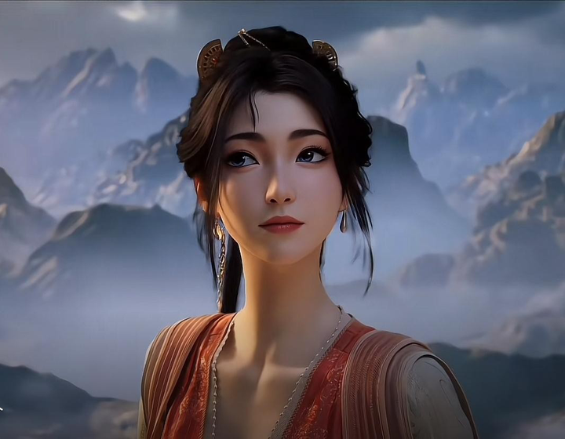
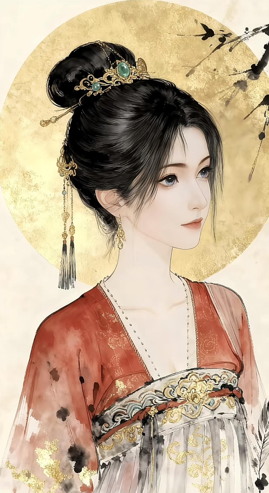
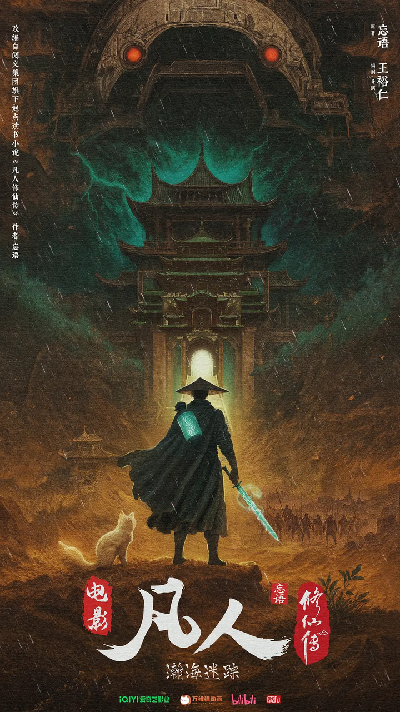

穿橘裙的慕沛灵，应该是动漫中女性角色建模和设定最为出彩的一个位。

alt="Image">

动漫中的穿橘裙的慕沛灵无疑是对原著的重塑，

在动漫中，慕沛灵有两种角色，前期在落云宗时，她穿着青黛松石绿的门派时装，英姿飒爽，拿着葫芦喝酒更是呈现出一种修道者特有的孤高与自持。

在成为侍妾后，她换上了橘红色的长裙，发型从束发变为盘发留垂落的马尾，气质的重心从凌厉转向柔顺，腰臀线条被服装勾勒出女人味十足的待妾身段，橘红色本身是一种温暖却脆弱的颜色，这套衣服有点不是女主更胜女主的感觉，再加上神态表情，把一个在原著中可有可无的配角演活了。

要理解慕沛灵为何出彩，对比原著与动画的差异。

在原著中，慕沛灵是一个__功利底色极其鲜明的角色__。她主动攀附元婴期的韩立，以侍妾之名寻求庇护，不追求道心，而是想攀附强者作为靠山，两人的交易也写清清楚楚，一个把对方当成庇护依仗，一个把对方当成突破瓶颈的工具，她对韩立的感情起初并无多少真心，更多是弱者对强者的依附。

但动画做出了改编，几乎褪去了她所有的功利底色，把她塑造成了一个清冷克制、小鸟依人侍女。特别是在阗天城，我见犹怜，起初他们并没有多少交集，但银月幻化成韩立的模样在药园打理琐事，二十年间与慕沛灵多有接触，让她误以为韩立对自己有着某种特殊的情谊。于是在韩立结婴后，她看到了寻求摆脱家族的联姻希望。

韩立对她的态度，从始至终利益互换的模式。收她为侍妾，让她《颠凤培元功》的目的就是以突破瓶颈，而非情感上的接纳。在去阗天城的路上，南陇侯试图强夺慕沛灵时，韩立接受南陇侯神识比拼的条件，让慕沛灵深受震撼并真正动情。

慕沛灵的悲剧，不在于韩立不爱她，而在于她误以为自己可以通过情感去融化一个将长生置于一切之上的人。 她在冲击元婴期时因心魔反噬而死，心魔的根源正是韩立。韩立得知后只去坟前上了一炷香。这炷香，是他作为“名义丈夫”唯一的情感回应。

alt="Image">

更为期待的是年底《凡人修仙传》首部电影《瀚海迷踪》将正式上映，以原著未尽的“极西之地”为主题，揭开一段尘封万载的修仙秘史。这部由动画年番原班人马打造时长150分钟左右！

而此次极西之行的男主是韩立，女主正是慕沛灵。

第二日一早，休息了一晚的韩立，带着银月刚走出洞府大门，却发现一名身材婀娜的貌美女子，正静静地站在洞府外，默默的看着韩立。
“你怎么来了。我不是给你留下足够数年修炼的丹药，让你留下来安心修炼的吗？”韩立目中闪过一丝意外的神情，平静的问道。
“公子！我考虑过了。我现在修炼似乎又到了瓶颈，还是跟公子一齐上路的好。况且我身为公子的侍妾，随行贴身侍候公子，也是应该做得事情。公子能否带上妾身一齐去。”慕沛灵螓首微低，香腮微红的低声道。
艳美动人的玉容，配合丰满高挑的身材，让其显得格外妩媚动人。
听了此女的言语，韩立怔了一怔，打量了慕沛灵一眼，沉吟了起来。
而银月在韩立身后，明眸流转，脸上露出了似笑非笑的面容。
“既然想去，就一齐跟来吧。在路上，我也可以顺便指点下你的修炼。若能早日进入结丹期，对我也大有好处的。”韩立没有思量多久，就点了点头，同意了。
“多谢公子！”
慕沛灵闻言大喜，满脸的兴奋之色。
韩立见此，淡淡一笑，随即袖袍一甩，一道白光从袖中飞射而出。化为一只四方的带翅飞车，正是御风车。

电影聚焦原著中笔墨较少的“极西之地千竹教”篇章，讲述韩立为探寻突破瓶颈的机缘，踏入这片被修仙界视为禁忌的凶险地域。

alt="Image">
