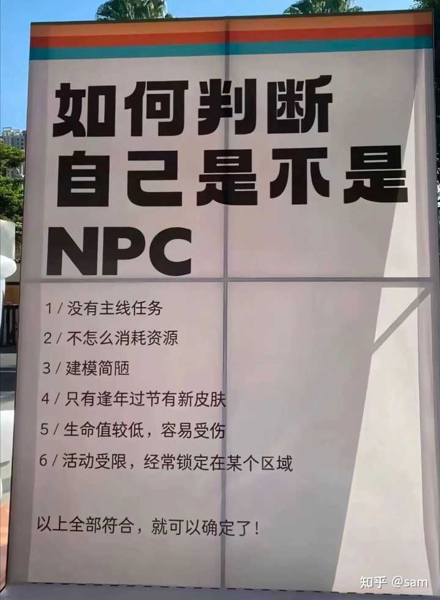

如何判断自己是不是npc？ \- sam 的回答

如果世界是一个游戏，那自然有玩家也会有npc，如何判断自己是不是npc呢？

1，除了停机维护，大部分时间都在固定地方刷新自己，行为高度重复。
2，辛勤劳作生产大量基础物资，只能从主角那里换来仨瓜俩枣。
3，不能保存进度，听过地图上其他地方，但是没去过。
4，即使被主角打了，也就是躲躲，不会还手。
5，主角可以休息玩乐，自己随叫随到，哪怕晚上了还得在线。
6，玩了30年了，还停留在新手村。
7，建模拉胯，大众化的灰模是常态。主角不观察，生活就是一团马赛克。
8，没有存款，攒下的家底基本都会被主角“开宝箱”拿走。
9，没有情侣，没有后代，有也是别的npc扮演的
10，在某一次更新后被删除掉也不会有人在意，甚至有的NPC从诞生起到被删除，都没有被人发现过

11，始终不知道主线任务是什么，但带你入坑的两个老玩家总给你压力。

alt="Image">
