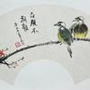

如何毁掉一个孩子

不要管孩子，要顺着孩子的天性发展！

时间长了，

你就会发现孩子的天性是又馋又懒，还不爱学习

02\-23 · 陕西 · 热评

我几乎全占了

![[捂脸]](attachments/1889e9e482f259c1.png)

02\-23 · 新疆

毁掉一个孩子的方法还真不少。有些家长爱灌输“努力必然论”，总说“只要拼命学，哪有学不好的”，不考虑孩子实际情况，不教学习方法、不培养兴趣。这会让孩子要么多次努力失败后否定自己，要么盲目勤奋却没效果。
还有“愧疚式教育”，像说“我为你吃了这么多苦，你不好好学对得起谁”，把付出变成孩子情感负担，让孩子为偿还父母痛苦学习。
另外，放任孩子也很要命。不少家长把手机当哄娃工具，2025年数据显示放任型家庭孩子沉迷网游率达11\.7%，而民主型家庭仅2\.7%。持续刷短视频会让孩子注意力和自控力下降，家长图省事换来的是孩子被毁掉的可能。

02\-23 · 江苏

最烦看到这些育儿专家散播焦虑的言论，很多甚至自己都没养过娃各种想当然，真的养过娃就会知道娃的很多性格乃至学习都是天生的，后天只能起到很小的影响。

02\-26 · 重庆

什么都不管也不行，主要是把握好度，但是最难的就是度的把握

02\-23 · 河南

自己就是一个被毁够了的孔乙己 然后一脚踹到社会上被到处嫌弃霸凌，然后再继续遭受二次伤害精神霸凌

02\-23 · 北京

哦～ 我的海，这是真的吗？

02\-23 · 浙江

心疼你一秒钟

02\-23 · 江苏

什么时候的话术，教育是这样有程序性的么，做到1234567就能变成什么样？

![[大哭]](attachments/af2eaffad511ca41.png)

02\-23 · 浙江

就能变成一个高尚的人，一个纯粹的人，一个有道德的人，一个脱离了低级趣味的人，一个有益于人民的人。

![[doge]](attachments/9a6cbd219013a32f.png)

08\-17 · 河南

我几乎全占…再叠加一个小镇做题家buff。现在我做着四平八稳的工作，家里有房有车，外表看起来我跟普通人一样。但只有自己知道经历了怎样黑暗又绝望的童年和青年期。内心感到无助和绝望也就算了，最割裂的是在外边还要装成健康外向成熟稳重全面优秀的样子，去满足父母的虚荣心。早期直接耗干所有心力，导致工作以后直接躺平了。不是不想上进，是真的无力了

![[知乎益蜂]](attachments/777b21b277512b67.png)

04\-01 · 云南

人是没有办法克制自己的本性的！我都亲眼见过，不把作业写完，碰其他的就把手剁了
她们太希望孩子成龙了！太想了！
最可怕的是自己瞧不起自己

02\-23 · 江苏

是在店里说的，我没有跟踪她去家里！不过她面目狰狞，她孩子脸色发白！我以后再也没有去过她店里！太吓人了

02\-26 · 江苏

剁了吗？

![[惊讶]](attachments/fa7cb82ae6e9fc94.png)

02\-25 · 山东

天天吼他、骂他、打他也会让他自卑，还会极端

02\-24 · 浙江
