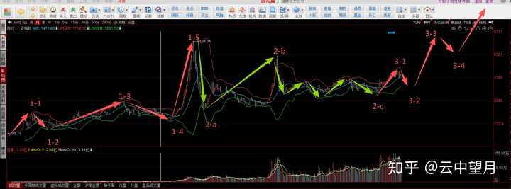
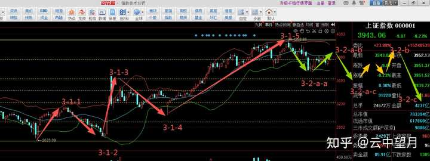
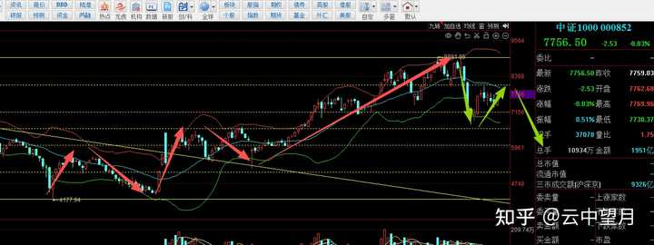
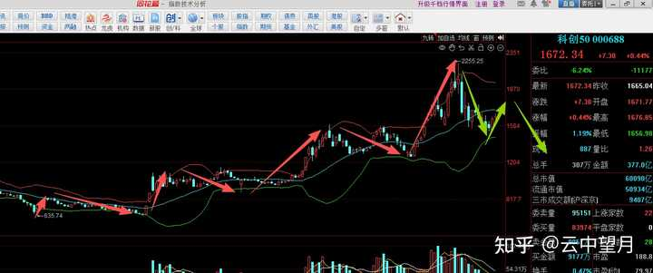
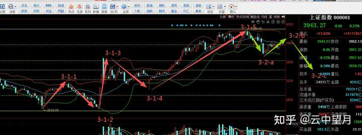

如何看待 2026 年 9 月 23 日 A 股市场行情？

9月23日，市场全天震荡调整，创业板指、深成指高开低走。截至收盘，沪指跌0\.39%，深成指跌0\.64%，创业板指跌0\.6%。 盘面上，PCB概念走强，…

昨天几个朋友在评论区里面讨论未来几个月aa的走势，感觉和高手交流，还是很有心得。今天上午有空，顺便复盘了一下aa这俩年的走势，特意写出来和大家做一个交流。

我还是坚持我之前大的趋势浪型的划分，90\-07年是1大浪拉升，走了17年5波拉升，07年6000多点金融危机开始，07\-24年初，2大浪回调，也是走了17年的熊市，只是里面有一个14\-15年的2\-b\-c浪的小牛市，不过那波杠杆牛市，很多散户最终结果就不说了。从24年2月的2635点开始，我判断是2大浪回调结束，开始了新的3大浪的拉升阶段，人生发财靠康波，真的需要机遇才能实现自己的抱负。在对的时间遇到对的机会，才可能站在光里。

alt="Image">sz月线图

我还是认为下一个对的时间是在28\-32年的5年里，会是3\-3浪主升浪机遇，也许是很多普通人改命的机会。

今天主要是想和大家探讨一下，这个3\-2浪未来到底怎么走，我觉得有二中可能，首先看下几个板块，从24年2月开始，上证，中证和创业板都是走了一个5波拉升，科创是走了一个7波拉升，3\-1浪的5波上涨结构，是非常完整的了，我还是趋于判断五月份的4258点就是未来二年的高点了，3\-1已经over，现在已经处于3\-2里面，几个板块的周线图，我做了波浪划分，供大家研判。

alt="Image">

alt="Image">

alt="Image">

现在对于未来一年多的研判有分歧的是，3\-2的abc三波回调可能存在二种可能：1是现在已经处于3\-2\-b浪反弹里面，十月份出个高点结束b浪反弹，一路单边5波南下走3\-2\-c浪，走个一年多时间结束。2是现在还处于3\-2\-a里面，这个a浪下跌走abc 三波回调，也是到十月份出个反弹高点开始c浪下跌，年底跌到3600左右然后才开始3\-2\-b浪反弹，5\-12月跌7个月才是a浪南下结束，开始b浪反弹，大概5\-7个月机构拉高继续出货，才是3\-2\-c浪南下到28年出低点。

alt="Image">

alt="Image">

拿sz举例，二种可能，供大家参考。

至于说十月b浪反弹结束，c浪回调不会破3741，然后还要拉升出新高，这个我觉得可能性很小，1个是浪型前面已经非常完整，2是外围局势已经完全改变，3是内部经济消费力也已经和去年完全不同。科创非常弱，可能十月很快就会出新低，沪深300也很弱，一旦二个板块出新低，其他几个板块都会跟上。至于说几个大的ipo还没上，这个据我得到的消息，前面几个吃相很难看，而且大模，型最近蒸，馏事件，听说影响比较大，这里不深入。个人分析，供大家参考。

而且看aa，还需要看美元，原油走势的影响，看黄白，纳指，日韩股市的趋同效应，并不是单纯的内部机构就能拉出牛市来的。而且私募其实也就那么回事，我也和一些人吃饭聊过，公募本来就是接盘的，私募其实很多都跑不赢指数。

然后再具体到最近的操作：

a的这个b浪反弹，我个人认为已经接近尾声，这俩天会有访美的利好出来，国庆前主力拉上去，最近几天拉升估计散户也不会进太多，国庆后拉高点找散户接盘，黄白的b\-c浪反弹也还没结束，我还是计划十月份im找高点南下，白银等b\-c浪反弹出高点南下，手里有票的个人认为未来一年多拿着现金耐心等待比较好。个人分析，仅供参考，不作为进场依据。后面930新，政，估计很多都不能说了，祝顺利！
