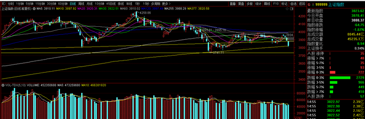

如何看待 2026 年 9 月 28 日 A 股市场行情？ \- 橙时 的回答

__问题描述：__

9月28日，市场全天调整，主要指数集体低开低走。全市场超4500只个股下跌。 盘面上，汽车整车板块异动拉升，江淮汽车4天3板，众泰汽车涨停；玻璃基板金…

再次劝可怜的散户，要么你去加入美股，要么你就把钱拿去红利ETF当存钱。

其他情况下进入A股，那很容易死。

呐，朋友们不是我没有提醒，我上星期三晚上复盘的时候写过了。

alt="Image">

当时写的理由是，大A没有成交量，又涨不动，更没有主线，短线还玩2个月了，还能玩多久？

星期三已经连续跌2天了，没有特殊意外就是要往下跌的【你涨不上去就只能下去】

但是，这文章在昨天星期⑤的时候被封了。

不可控的力量不让我这么说。

alt="Image">

别问，问就是违法国家相关法律法规，所以以后我要提醒的话就发这个图。

alt="Image">

回看盘面，节前就剩2个交易日，看图说话。

alt="Image">

跌到3741附近狗队肯定要开始鬼鬼祟祟捡尸体。

无他，过去1年的时间横盘震荡，狗队都在这个地方3750～3800的时候做动作。

不是每一次狗队都有可能出手，但至少这个地方是部分资金的共识，有抵抗【没抵抗的话，那牛市直接死吧，最后一轮反弹也别等了】

所以大概率还要往下摸一把，摸完就震荡。

每次暴跌之后都是人心惶惶，然后一根两根大阳线又把人诱回来，每次都是这样，把人调成什么样了都。

盘面的分析倒是好解决，毕竟就是这么点把戏，复盘多了多少都能看出点端倪。

但真要吐槽的是A股那狗屎一般的生态环境。

A股两大问题：__做空机制__和__汇率问题__。

做空成本50万起步，还是期货，这就相当于是逼着大多数散户无法做空【融券老路已经被堵死了，现在散户基本拿不到】，你非要做空，做反了方向很容易就从期货入门到入土了。

行，不给做空，只要流动性充足，A股也能蒸蒸日上。

但好死不死的，rmb汇率机制是双轨制，外资要进来难度又大，内资金额就那么点。

这就形成了A股独特的生态环境，跌4年涨2年，α的爆发是高啊，但只有2年，对于大多数人来说，能中途上车赚到1年的钱就不错了。

但随后赚到的钱又会在后续的4年估值出清过程陆陆续续赔回去。

因为没有做空机制嘛，总有人会抱着不切实际的妄想又买回去，结果被套牢，每一次反弹就是更猛烈的暴跌。

所以A股熊长牛短。

过去如此，现在如此，未来机制不改变，一样如此。

狗改不了\_\_\_\_\_\_
