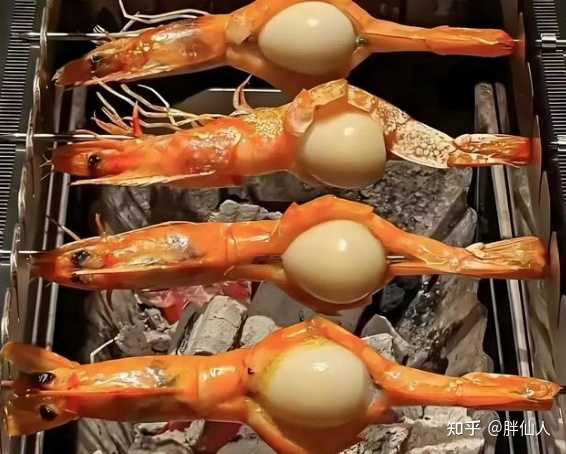
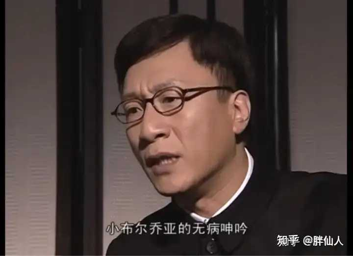
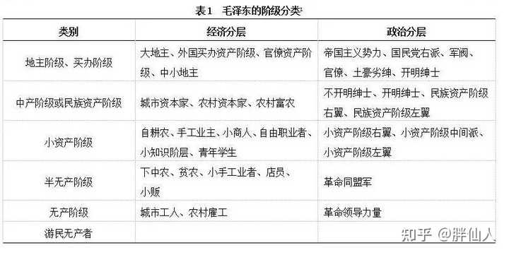

如何看待《健康报》近日发文《把关心关爱医务工作者摆在重要位置》? \- 胖仙人 的回答

近日，国家卫健委主管的权威报刊《健康报》发文：推进公立医院高质量发展，要把关心关爱医务工作者摆在管理工作的重要位置，将暖心关怀转化为守护人民健康的实际…

貌似我们医院订的报刊里都没有这个《健康报》。

有句话叫：

“参谋不带长，放屁都不响。”

卫健一管不了资金，二管不了帽子，还别说真有点那个不带“长”的参谋的味道。

之前打过一个比方：

临床一线是嗷嗷待哺的孩子。

卫健是总在小事上斤斤计较（比如冲奶粉的水温低了两度之类的），但是一到了要买奶粉的时就吹着口哨溜边的继父。

保子哥才是是真正能拿出奶粉钱的亲爹。

但是因为最近大环境的问题，收入缩水，只能把之前喝的进口高端奶粉换成国产低端奶粉。

但是有过孩子的都知道，换奶粉一般孩子都得折腾一阵子。

现在继父让孩子一条腿往左走，亲爹让孩子一条腿往右走，最后的结果是啥？

alt="Image">

卫健这回算是又在这里搞没有任何实际意义的行为艺术了。

聊一聊现在医疗系统里各个方面的想法吧。

主打一个想法南辕北辙，被强行的搅和到一起，只能是煮成一锅东北大烂炖。

WJW：提高地位，改指导为管理。

发改委：控制立项！控制立项！控制立项！

医保：保住我的小钱钱！保住我的小钱钱！保住我的小钱钱！

财政：没钱！没钱！没钱！

各地方政府：立项！立项！立项！没钱！没钱！没钱！

割谁的肉，谁都疼。

正在大家要发力博弈的时候，忽然转过头一看，咦，好啊，这有一帮子小布尔乔亚。

这小布尔乔亚好就好在阶级属性里自带软弱性，正是用来充当社会缓冲器减震垫的好材料。

alt="Image">

来来来，再把小布尔乔亚的属性学一学：

alt="Image">

“当小布尔乔亚的利益没有受到损失前，所有反抗压迫的活动在他们眼里都是不必要的，待到他们的利益切实受损后，又会开始高声抱怨没有人引领自己反抗。”——列宁
