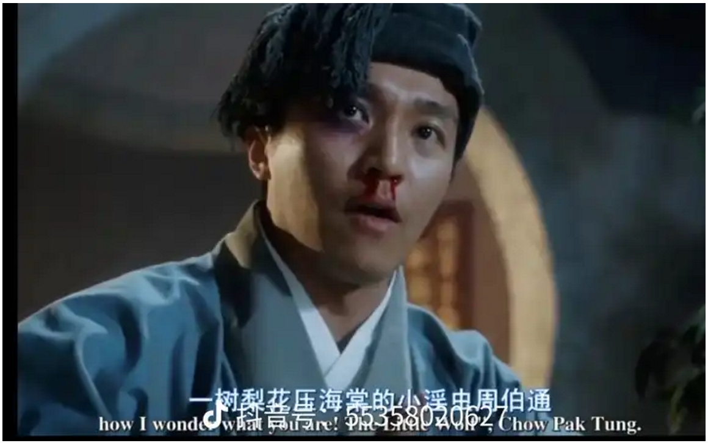

如何评价周伯通和小龙女之间的互动？ \- 涉弋 的回答

周伯通对小龙女是怎样的一种感情？

一个华点：

新修版中，黄蓉程英寻找郭襄路过了周伯通的百花谷，看到了秋海棠，程英突然讲起了断肠花的典故。

断肠花在历史上有一个著名的典故，北宋有个婉约派词人叫张先，他与王安石欧阳修都是好友，晚年游历杭州，与苏轼成为忘年之交。

张先年轻时就很风流，十八岁就和小尼姑纠缠不清，到八十岁还纳了一个十八岁的小妾，并怡然自得。

在婚宴上写道：

我年八十卿十八，卿是红颜我白发。

与卿颠倒本同庚，只隔中间一花甲。

苏轼写诗调侃：

十八新娘八十郎，苍苍白发对红妆。

鸳鸯被里成双夜，一树梨花压海棠。

另写词一首：

《天仙子·走马探花花发未》宋 · 苏轼

走马探花花发未。人与化工俱不易。千回来绕百回看，蜂作婢，莺为使。谷雨清明空屈指。

白发卢郎情未已。一夜翦刀收玉蕊。尊前还对断肠红。人有泪，花无意。明日酒醒应满地。

这里的卢郎是一个唐朝校书尉，也是暮年娶妻。

文人墨客中经常用“一树梨花压海棠”，“断肠红”来指代老夫少妻。

非常巧合的是，周伯通与小龙女亦是“玉蜂”做媒。

周星驰在《唐伯虎戏秋香》中写道，一树梨花压海棠，小淫虫周伯通。

alt="Image">

ps：周伯通和瑛姑的时候差不多35左右，瑛姑15左右，差20岁。

小龙女和公孙止：23和45，差21岁

周伯通骂公孙止糟老头子，没有自知之明。

此时周伯通80出头。

确实是“一树梨花压海棠，小淫虫周伯通。”

😊😊😊
