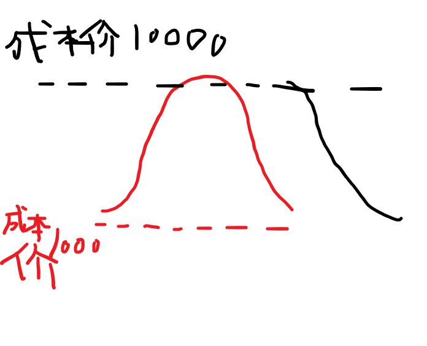
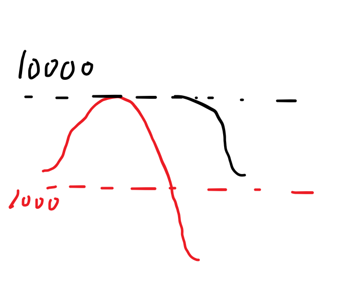
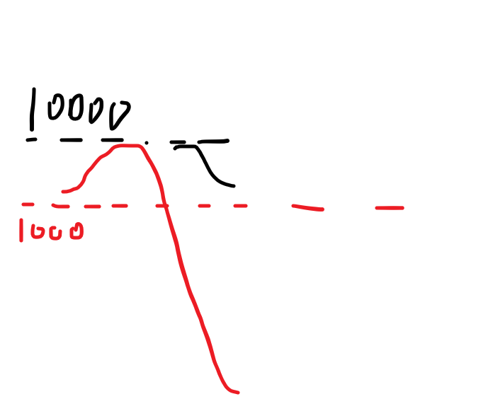
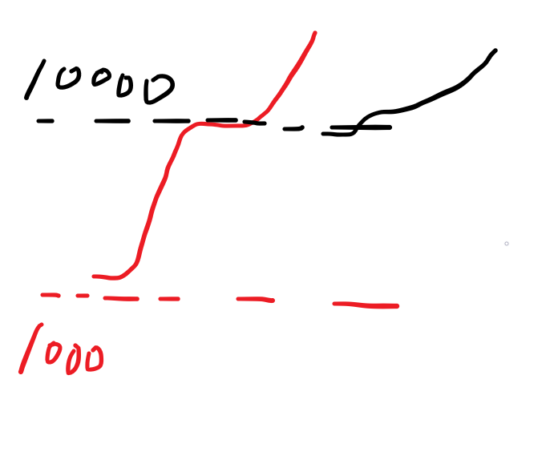
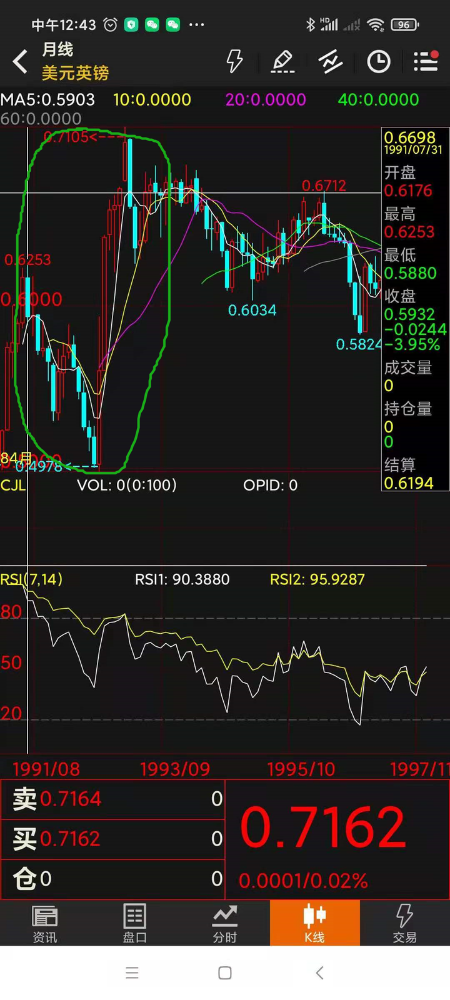

如何评价索罗斯？ \- 干货逻辑 的回答

我的导师恰好是索罗斯的学生，之前就一直想专门写一篇文章来谈谈庄家的套路，因为并没有什么多深奥的东西，简单到一篇文章就能讲完，后面顺便讲讲索罗斯的收割手法。

市面上大多数谈庄家的书都是错的，它们把庄家的手法就简单的看成就是拉高让跟风盘接盘达到出货目的，这样的“傻庄”其实是不存在的。

也没多少人能把索罗斯狙击英镑泰铢的过程讲清楚，很多人就简单的看成索罗斯就是通过庞大的资金一味的做空，硬是把盘砸下去，于是空单就盈利了——要是真那么简单谁都可以做索罗斯了，大部分人都还没理解对冲基金对冲的底层逻辑，本篇文章就是从底层逻辑出发，带大家理解索罗斯是如何通过对冲让自己在任何情况下都能处于不败的地位。

可以这么说，所有的庄家都是通过在即期与远期市场的对冲来实现盈利的。

然而同样是对冲，在外汇、大宗商品、贵金属市场的玩法与逻辑，跟股票市场的玩法与逻辑是完全不一样的。因为前者是分为现货与期货市场的对冲，是分别两个独立的市场，两个不同的盘面，资金规模也完全不一样；而后者股票市场的对冲是买入股票与融券做空，是在同个盘子里，共享同个盘面，这样的差异具体表现后面会详细解释。

这里我们先探讨前者外汇、大宗商品、贵金属的庄家对冲手法，因为它更容易理解。理解了之后，然后谈索罗斯狙击英镑、泰铢、港币的过程就轻松多了。

为了方便理解，我就拿比特币来说吧。如果你想做庄家，你想要实现控盘很简单，你只要资金足够雄厚，买下现货市场上99%的比特币，这时候99%的比特币就相当于“冻结”在你手里了，只剩下1%的流通盘，那你想拉多高价格都没问题啊，因为在现货市场上绝大多数的卖盘都只能出于你的手，因为现货市场的总盘子是有限的，你手握这99%的比特币，你只要不卖，基本上市场上就没卖盘，而你只要稍微用一点资金，想把成交价打多高都行。

因为资本市场价格分时走势的形成原理，就是每一分钟发生的平均成交价连成的线，而且跟成交量是无关的。假如原先比特币价格是1000元，而现货市场所有的比特币都在你手中，你挂一个卖单在10000块，然后自己再拿出10000块去买，那你就能看见分时走势上比特币的价格从1000元涨到10000块，瞬间翻了10倍。

这样看的话似乎你只用了10000块钱，就让自己的总资产翻了10倍——然并卵，你就算在现货市场分时走势上把成交价拉的再高，拉到1亿元也好，那都只是盘面上的浮盈，你要实现真正的盈利，就必须把手上所有的比特币卖出套现了，才算是真正的盈利。

那问题来了，你正想在10000元的价位清出所有的比特币套现的时候，发现没人接盘，没人愿意去买，那怎么办，你一味的卖出只会疯狂的砸盘，到头来还没赚多少。

所以正确的做法是这样：在拉升的过程中，在期货市场的价格高位建空单，实现对冲式建仓。

首先期货市场的价格涨跌是一个独立开来的市场与盘面，并且它不同于现货市场的有限盘，它的流通盘是可以无限的，只要有人在建多单或建空单的时候，有另外一个资金跟他做对手盘，那它的流通盘可以无限的扩张下去。而且期货市场的价格走势是可以跟现货不一样，甚至是局部时间内反着走，但最终它还是会回归到现货价格，它的涨跌完全是多空双方角力的结果。

（更多期货的基础知识，我建议大家去找教材看一下，这里不展开讲了，但这是相当重要的，你不去了解期货就冲进金融市场，就是给人做炮灰）

而期货市场是带杠杆的，如果是10倍杠杆，那么你建空单的资金量只需要是前面在现货市场买入比特币的总资金的1/10就够了。在建空单的同时，在现货市场上继续拉高比特币价格——为什么要这样做呢，就是为了尽可能的保证你空单的成本价在高位，当这么做的时候其他散户没人敢做空，只敢做多，这样你的空单不怕在这价位上没对手盘。如果有人敢做空跟你抢对手盘，你大可以继续拉涨现货价格，拉到他们的空单爆仓。

一旦在期货市场建空单完成，就是布局完成了，这时候你可以大胆的在现货市场上卖出比特币套现。这时候如果没人接盘，那么比特币价格会从10000块那里往下暴跌，而这时候期货市场一般都会跟跌——因为现货价格开始跌，拉开了与期货价格的距离，必然有人选择做空，又或者原先的做多盘选择止损平仓（而多单平仓就是在做空），就算退一万步真的没人做空，那么也不会有人敢做多，这时候你在期货市场可以用少量资金做空就可以把价格打到低位。

这样子你作为庄家，基本上是稳赚的，因为就算现货市场套现过程因为成交价不断拉低导致没赚到钱，但在期货市场上你因为做空了，所以期货市场大赚特赚，你在期货市场价格不断下跌的过程中逐步清仓获利了结。

——而在期货市场空单平仓就是在做多，与在现货市场卖出做空行为形成对冲，我们可以称之为对冲式清仓。

这个过程不外乎以下几种：（红线是现货市场价格，黑线是期货市场价格）

alt="Image">

以上第一种，这个很好理解，期货价格下跌幅度跟现货价格同步，只要现货价格在你抛售的过程中没跌破1000元的成本价，你现货市场还是有赚的，而期货市场大赚。即使这个清仓过程中现货价格跌到1000，期货价格只跌了一点点，你还是有盈利的。

第二种情况：

alt="Image">

这种情况就是你抛售的过程中，现货市场的价格跌破了1000元的成本价，但如果你在1000元以下抛售的仓位小于1000元以上抛售的仓位，你在现货市场上还是有赚的，但即使不是，只要整个过程中你在1000元以下的下跌幅度，小于在期货市场上从10000元开始的下跌幅度，那么你在期货市场的盈利是大于现货市场的亏损的，你依然是整体盈利的。

第三种情况，也是最最最完美的情况，就是你在现货市场的抛售过程中，价格居然不见下跌，同时期货市场却下跌了，那么就说明有人给你接盘，你两边都赚大了。

那么什么情况下你会亏损？

就是现货市场价格在1000元以下的下跌幅度，甚至大于期货市场上从10000元开始下跌的总幅度，就像这样：

alt="Image">

这种就属于极端情况，几乎不可能发生，因为要实现这个，等于是有资金在现货市场疯狂卖出的同时，又有资金在期货市场疯狂做多——一方面期货市场那里看到现货价格跌成那样，不太可能有人敢做多，同时你作为现货市场的做空主力，你也不会那么傻砸成这样。

但有一种情况有可能发生，就是你在现货市场抛售清仓的整个过程现货市场不跌甚至大涨，期货市场价格也跟着涨——这样虽然你现货市场赚钱了，但有可能期货市场的拉升幅度太大，导致你期货市场的亏损大于在现货市场的盈利。就像这样：

alt="Image">

——这种情况的发生，说明你被更大的庄家盯上了，他有意要整你。当年索罗斯尝试做空港股的时候，就是这样被我们国家队来反制。

其实索罗斯的量子对冲基金，就是经常用以上手法来收割。

在探讨索罗斯的手法前，先给没接触过外汇市场的人简单科普下，一个货币的汇率是如何决定的？是由这个货币兑外币的即期与远期市场决定的，就跟股票与其他大多数资本市场一样，由买卖双方撮合成交决定的，你看到的汇率分时走势，就是最新的成交价。如果美元兑港币的汇率在涨，说明这时候有人不断的用港币兑换美元，推高了美元兑港币的市场价。

索罗斯如何狙击英镑的？

索罗斯做空英镑前，他必须先做多，就是先大量买入英镑，其方法是除了在外汇现货市场上用美元或其他外币大量兑换英镑，同时会在它们本土银行那里大量借入（申请贷款）英镑——因为索罗斯会专门选择那个国家在量化宽松的时候做这事，因为利率很低。这两种行为都属于做多行为，因为他为了达到控盘目的而要把盘子里大量筹码囊入手里。

其实上面我是为了方便大家理解，才把成本价定在一个固定的价位，但现实中，当有人为了达到控盘目的而大量买入某个品种现货的时候，在这过程中价格必然已经开始涨了，所以现实情况是庄家在吸收筹码导致涨的时候，这过程就已经在期货市场建立空单，所以做多跟做空是同时进行的，这就是一个对冲的过程，其价位与仓位设置是门很大的学问，就不展开讲了。

而在这过程中，因为实体市场上大部分的英镑被索罗斯借走，或者被外币兑换走，于是导致市场本币流动性紧缺，这个时候本币的汇率已经开始升值了，加之本地因为本身过度杠杆导致债务规模过大，流动性一旦紧缺就会导致债务违约激增，于是会影响股票市场。

因为英镑的流动性紧缺，使得汇率市场上英镑价格大涨，而索罗斯在期货市场上布局空单建仓完毕，就开始在现货市场上卖出本币做空，他除了拿之前外币兑换的英镑兑换回外币，还拿之前大量借入的英镑去兑换外币，因为先有英镑升值，这时候他在高位兑换外币，等于赚了一波套汇差价，同时因为现货市场的大量做空，使得期货市场本币汇率大跌，于是他的空单也大赚一笔，而在这个过程中期货市场不断平仓了结获利，相当于做多，形成对冲式清仓。

以上这个过程对应的就是上面第二张图，整个过程英镑即期跟远期汇率都在暴跌，其幅度远高于之前的上涨幅度，所以整个过程虽然现货市场亏损，但期货市场大赚，远高于现货市场的亏损。其中他最高明的一点就是他利用了本地的借贷市场，以低利率大量借入英镑，在英镑汇率高位兑换成外币，又在后来被打到低位的时候用外币兑换回本币来偿还债务。

整个走势如下图：

alt="Image">

这图是美元兑英镑的汇率走势图，所以下跌的话就是英镑升值，上升就是英镑贬值。我们可以看到绿圈圈内，是先有英镑大幅升值，然后开始贬值，贬值幅度要大于之前的升值幅度。

接下来是做空泰铢。

狙击泰铢的时候，情况有点不一样，因为泰铢汇率虽然跟英镑一样也是开放市场，但是泰国政府因为某些因素的考量，有意让泰铢在开放市场上维持兑美元稳定的汇率，这意味着当有人想在外汇市场上大量用泰铢兑换美元的时候，泰国政府要用美元储备来买入泰铢来维持汇率稳定。

所以索罗斯就换了思路，他的做法其实是做多美元兑泰铢汇率，其实就是做空泰铢，但却是围绕着美元来实行对冲。

先是跟做空英镑前一样大量在泰国本土市场借入泰铢，然后用泰铢买入美元，但因为泰国的紧盯美元汇率的货币政策，不管用多少泰铢买入美元，汇率依然保持不变，这给索罗斯带来极大的成本优势。因为那时候泰国处于降息周期，而美国则处于[加息周期](https://www.zhihu.com/search?q=%E5%8A%A0%E6%81%AF%E5%91%A8%E6%9C%9F&search_source=Entity&hybrid_search_source=Entity&hybrid_search_extra=%7B%22sourceType%22%3A%22answer%22%2C%22sourceId%22%3A1954737082%7D)，索罗斯用贷来的泰铢兑换美元后，用美元购买美元债券，因为美联储在加息周期内会通过在公开市场售出债券来缩进美元，债券价格会降低，债券价格降低就意味着利率收益提高，这样索罗斯就可以赚取利差。

然后因为泰国政府顶不住压力，美元储备不足，最终无法维持泰铢兑美元汇率，于是泰铢贬值——也就是美元升值，索罗斯采取跟之前一样的手法，当美元兑泰铢汇率逐步攀升的过程中，在泰铢兑美元的远期市场建美元空单，实现对冲式建仓。最后跟之前一样，又恰逢美联储进入降息周期，，美元债券价格上涨，索罗斯卖出之前低价买入的美元债券换回美元，又拿着美元在汇率高位兑换泰铢（相当于做多泰铢），用以偿还泰铢贷款，这样子泰铢汇率回升，而因为已经在远期市场布局美元空单，于是远期市场上美元空单获利，但同时又在期货市场平仓美元空单（相当于做多美元，也等于做空泰铢），实现对冲式清仓。

接下来就是狙击港股。

与前面不同的是，索罗斯这次直接盯上的就是香港股市。他先早期从香港本土银行大量借入港币买入股票，当然也通过自有资金兑换港元买入港股，在97之前港股都是处于上升周期。

如上面演示的那样，索罗斯在做多港股的时候也逐渐在恒指期货里建空单，在97年恒指处于高位的时候开始在现货市场抛盘，意图通过这样是恒指期货指数大跌，实现期货空单的大赚。

但这时中国国家队全面支持港府，大量做多港股与恒指期货，以至于保住了期指指数，索罗斯在期货市场失利。

有人问虽然保住了港股，那索罗斯有没亏损呢？亏损多少呢？显然他是没有亏损的，甚至获利不少，只是没有预期得多，因为他先有早期买入做多港股，当国家队在他砸盘时接盘，就决定了他在港股现货市场是完美套现离场的，虽然他在期货市场亏损了，但想要这个亏损值大于他在现货市场的盈利，就要把恒指从那个已经是高位的基础上继续拉高，其幅度必须要大于之前他做多港股时候的幅度，显然并没有做到。

——这就是对冲的强大，只要资金足够雄厚且先手控盘，那他就可以处于不败的地位。

有人要问了，如果庄家存在，那么技术分析还有意义吗？其实庄家的存在反而让技术分析更加有用，说没用的只是那些水平不到家错了就归咎与庄家，推荐大家看以下这篇：

什么是股价的支撑与压力，它为什么存在？底层逻辑是什么？理解它才算是通过交易走向财务自由的第一步 \- 干货逻辑的文章 \- 知乎 [https://zhuanlan\.zhihu\.com/p/600034455](https://zhuanlan.zhihu.com/p/600034455)
